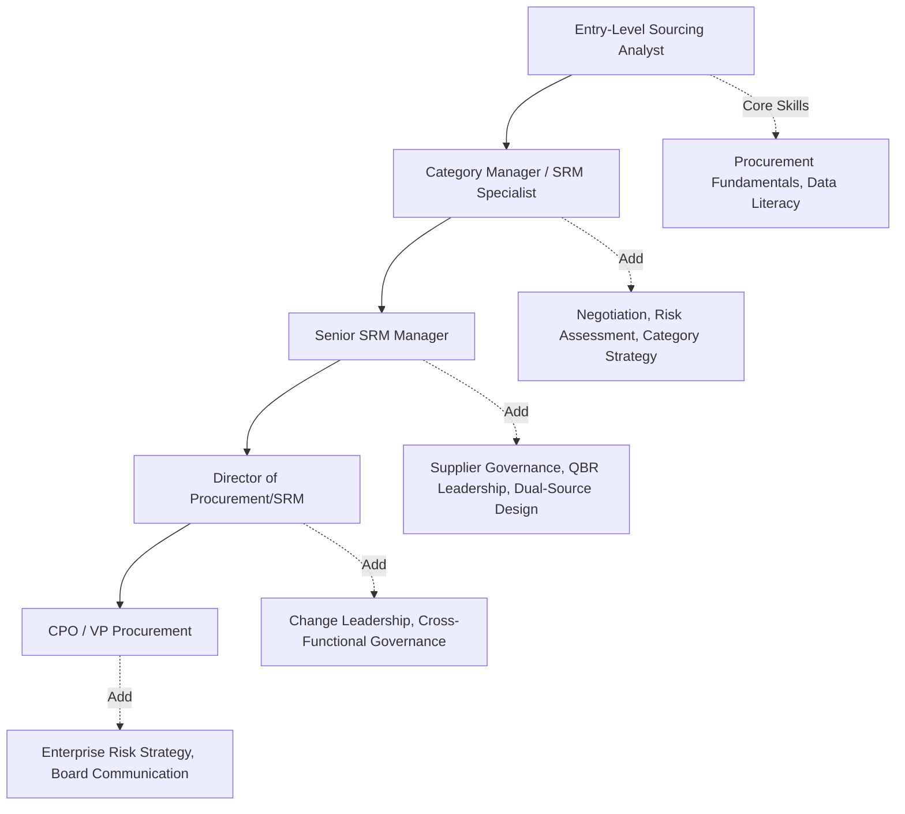

## Skills and Competency Frameworks for SRM Professionals

### Overview

Competency frameworks provide a structured way to define, assess, and develop the capabilities required for effective Supplier Relationship Management. As SRM has evolved from a transactional purchasing function into a strategic discipline, the required skill set has broadened significantly — spanning technical procurement knowledge, financial acumen, relationship management, risk analysis, and increasingly, digital/data literacy. A well-designed competency framework anchors hiring, performance evaluation, training investment, and succession planning for SRM roles.

### Competency Framework Structure

Competency frameworks are typically organized into tiers:

- **Foundational Competencies**: Baseline skills required for any SRM role regardless of seniority.
- **Functional/Technical Competencies**: Domain-specific procurement and supply chain knowledge.
- **Behavioral/Interpersonal Competencies**: Soft skills critical for relationship management.
- **Strategic/Leadership Competencies**: Higher-order skills required at senior SRM and CPO levels.

### Foundational Competencies

**Key Points**

- **Procurement fundamentals**: Understanding of sourcing cycles, contract lifecycle management, and purchase order processes.
- **Financial literacy**: Ability to read supplier financial statements, understand Total Cost of Ownership (TCO), and interpret cost-breakdown models.
- **Business communication**: Written and verbal communication for internal stakeholder alignment and supplier negotiation.
- **Data literacy**: Comfort working with spreadsheets, dashboards, and basic statistical concepts (e.g., interpreting a supplier scorecard trend line).

### Functional/Technical Competencies

**Category and Market Knowledge**

- Deep understanding of supply market dynamics for owned categories.
- Ability to conduct supplier landscape analysis and identify qualified alternate/secondary sources — directly relevant to Dual Sourcing strategy execution.

**Contract and Legal Acumen**

- Working knowledge of contract structures, SLAs, indemnification clauses, and termination provisions.
- Understanding of how volume-flexibility clauses enable dynamic allocation shifts between dual-sourced suppliers without contract breach.

**Risk Assessment**

- Ability to evaluate financial risk (credit ratings, liquidity ratios), operational risk (single points of failure, geographic concentration), and geopolitical/ESG risk.
- Skill in quantifying risk thresholds that justify a single- vs. dual-source decision for a given commodity.

**Negotiation**

- Structured negotiation planning (BATNA — Best Alternative to a Negotiated Agreement — development, concession strategy).
- Skill in negotiating *simultaneously* with two suppliers in a dual-source arrangement without disclosing competitive-sensitive information inappropriately between them.

**Supplier Performance Management**

- Ability to design and interpret KPI scorecards (on-time delivery, quality PPM, responsiveness).
- Skill in running structured Quarterly Business Reviews (QBRs) and translating scorecard data into actionable supplier development plans.

**Digital/Data Tools Proficiency**

- Proficiency with SRM/procurement platforms (e.g., SAP Ariba, Coupa, Jaggaer, Ivalua).
- Working knowledge of spend analytics tools and, increasingly, exposure to AI-assisted sourcing and risk-monitoring tools.
- Basic data analysis skills (Excel/SQL-level) for interrogating supplier performance datasets.

### Behavioral/Interpersonal Competencies

**Key Points**

- **Relationship building**: Establishing trust-based, long-term supplier partnerships rather than purely transactional interactions.
- **Cross-functional collaboration**: Working effectively with legal, quality, finance, and operational stakeholders who each hold partial authority over supplier decisions.
- **Conflict resolution**: Managing disputes constructively, particularly important when reallocating volume away from an underperforming supplier in a dual-source setup — a scenario prone to supplier relationship friction.
- **Cultural competence**: Navigating cross-border supplier relationships with awareness of cultural negotiation norms, particularly relevant for global Dual Sourcing strategies spanning multiple geographies.
- **Adaptability**: Responding to supply disruptions, demand shifts, and market volatility with structured contingency thinking.

### Strategic/Leadership Competencies

**Key Points**

- **Strategic sourcing design**: Ability to architect category strategies, including when and how to structure Dual or Multi-Sourcing programs based on risk/cost trade-offs.
- **Change leadership**: Guiding organizational transitions (e.g., centralized-to-hybrid procurement model shifts) with stakeholder buy-in.
- **Business case development**: Building financially rigorous cases for supplier diversification investments, factoring in switching costs, dual-source premium costs, and risk-mitigation value.
- **Governance design**: Establishing RACI structures, escalation protocols, and policy thresholds (e.g., maximum single-supplier spend concentration).
- **Executive communication**: Translating supplier risk and performance data into board-level or C-suite narratives.

### Sample Competency Framework Matrix

| Competency Domain | Entry-Level Analyst | Category Manager | Senior SRM Manager | CPO/VP |
| --- | --- | --- | --- | --- |
| Procurement fundamentals | Core | Advanced | Expert | Expert |
| Negotiation | Developing | Advanced | Expert | Expert |
| Risk assessment | Core | Advanced | Expert | Strategic oversight |
| Contract/legal acumen | Developing | Advanced | Advanced | Strategic oversight |
| Data/digital literacy | Core | Advanced | Advanced | Strategic oversight |
| Relationship management | Developing | Advanced | Expert | Expert |
| Change leadership | Not required | Developing | Advanced | Expert |
| Strategic sourcing design | Not required | Developing | Advanced | Expert |

*Rating scale: Not required → Developing → Core → Advanced → Expert*

### Competency Assessment Approaches

- **360-degree feedback**: Gathering input from internal stakeholders, peers, and (where appropriate) suppliers on relationship management effectiveness.
- **Scenario-based assessment**: Testing negotiation and risk-analysis skills through simulated supplier disruption scenarios (e.g., "your primary supplier just announced a plant closure — walk through your dual-source reallocation decision").
- **Certification alignment**: Mapping internal competency levels to recognized external certifications such as CIPS (Chartered Institute of Procurement & Supply), ISM (Institute for Supply Management) CPSM, or APICS/ASCM credentials.
- **Skills gap analysis**: Comparing current team competency ratings against the framework to identify targeted training investment areas.

### Competency Development Pathway

### Linking Competencies to Dual Sourcing Maturity

Organizations with mature Dual Sourcing programs typically require SRM professionals to demonstrate competency in:

- Quantitative risk-scoring methodologies used to trigger dual-source requirements.
- Supplier qualification and PPAP-equivalent processes for onboarding secondary suppliers efficiently.
- Dynamic allocation modeling (adjusting volume splits in response to real-time performance or disruption signals).
- Negotiating "flexible capacity" or "option to scale" clauses that allow rapid volume shift between dual-sourced suppliers.

Gaps in these specific competencies are a common root cause of Dual Sourcing programs that exist on paper (contracts signed with two suppliers) but fail operationally (all volume still defaults to one supplier due to lack of skill/confidence in managing the split). [Inference — based on general practitioner observations about strategy-execution gaps in procurement transformation rather than a specific cited study]

**Related Topics**

- CIPS and CPSM Certification Pathways
- Supplier Negotiation Strategy and BATNA Development
- Talent Development and Succession Planning in Procurement
- Digital Procurement Tools and Platform Proficiency (SAP Ariba, Coupa, Jaggaer)
- Scenario Planning for Supply Disruption Response
- Cross-Functional Team Effectiveness in Sourcing