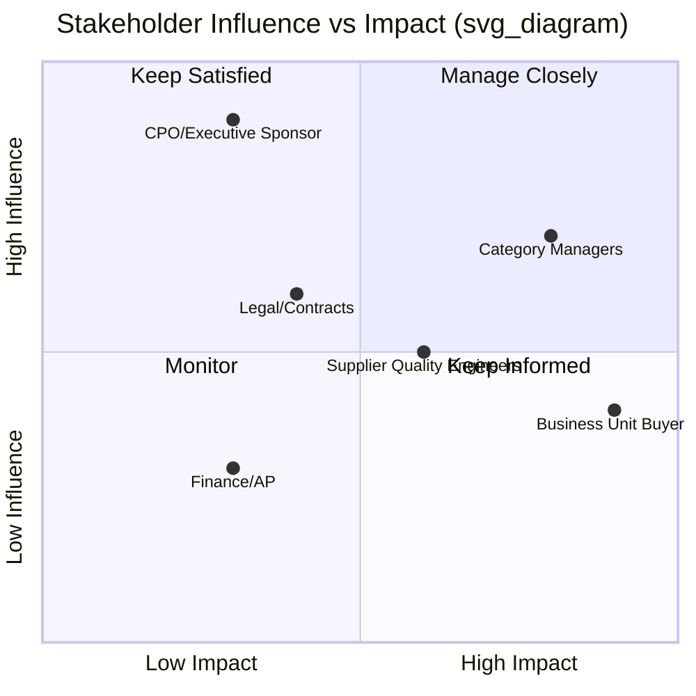

## Change Management for SRM Program Adoption

### Overview

Implementing or maturing a Supplier Relationship Management program is fundamentally an organizational change initiative, not merely a process or technology rollout. SRM programs frequently fail not because the sourcing strategy is flawed, but because internal stakeholders resist new governance structures, supplier-facing behaviors don't shift, or cross-functional teams revert to old habits once initial momentum fades. This is especially acute for Dual Sourcing initiatives, which require business units, engineering, and operations teams to break established single-supplier habits and actively manage a more complex two-supplier relationship.

### Why SRM Change Initiatives Fail

**Key Points**

- **Lack of executive sponsorship**: Without visible, sustained leadership backing, SRM policy (e.g., mandatory dual-source thresholds) is deprioritized under operational pressure.
- **Stakeholder resistance from business units**: Engineering and operations teams often prefer the simplicity of a single known supplier and resist the added complexity of qualifying and managing a second source.
- **Incomplete process redesign**: New SRM governance is layered onto old workflows without removing legacy approval steps, creating friction and duplicate work.
- **Insufficient training**: Teams are expected to use new scorecards, RACI structures, or SRM software without adequate onboarding.
- **No reinforcement mechanism**: Initial adoption occurs during rollout, but without ongoing measurement and incentive alignment, teams drift back to prior behavior within months.

### Change Management Frameworks Applicable to SRM

**Kotter's 8-Step Model**

| Step | Application to SRM/Dual Sourcing Rollout |
| --- | --- |
| 1. Create urgency | Present supply disruption case studies or single-source risk exposure data to justify Dual Sourcing investment |
| 2. Build a guiding coalition | Assemble cross-functional sponsors: CPO, Category Manager, Risk Manager, key Business Unit leaders |
| 3. Form a strategic vision | Define target state: e.g., "no strategic commodity exceeds 70% single-supplier concentration by Q4" |
| 4. Enlist volunteer army | Identify early-adopter business units willing to pilot dual-source qualification first |
| 5. Enable action by removing barriers | Simplify supplier qualification (PPAP) processes that currently make onboarding a second supplier too slow |
| 6. Generate short-term wins | Publicize an early success (e.g., a mitigated disruption because a secondary supplier existed) |
| 7. Sustain acceleration | Expand Dual Sourcing policy to additional categories based on pilot learnings |
| 8. Institute change | Embed dual-source thresholds into standard category strategy templates and annual sourcing reviews |

**ADKAR Model**

The ADKAR framework (Prosci) is particularly useful for SRM adoption because it focuses on individual-level change, which is where SRM behavioral shifts (e.g., a buyer actually splitting volume rather than defaulting to the familiar supplier) succeed or fail.

- **Awareness**: Communicate *why* the SRM/Dual Sourcing change is happening (risk exposure, cost volatility, past disruption incidents).
- **Desire**: Build motivation through incentive alignment — e.g., tying category manager performance reviews to supplier diversification metrics, not just unit cost.
- **Knowledge**: Provide training on new tools (SRM platform, scorecards), new processes (dual-source allocation calculation), and new policies.
- **Ability**: Provide hands-on practice environments, job aids, and coaching during the initial rollout period.
- **Reinforcement**: Sustain the change through recurring governance reviews, recognition of compliant behavior, and correction of drift.

### Stakeholder Analysis for SRM Rollout

**Key Points**

- Map stakeholders by **influence** (ability to affect the initiative's success) and **impact** (degree to which the change affects their daily work).
- Business units directly executing purchase orders against dual-source ratios are high-impact and require the most intensive change support.
- Executive sponsors are high-influence, low-impact, and require concise, outcome-focused communication (risk reduction, cost stability) rather than process detail.

*Note: This is a structural placeholder diagram intended to illustrate quadrant logic; actual stakeholder placement should be calibrated to the specific organization.*

### Communication Plan Design

| Audience | Message Focus | Channel | Frequency |
| --- | --- | --- | --- |
| Executive sponsors | Strategic risk reduction, ROI of diversification | Steering committee briefing | Monthly |
| Category managers | Policy details, target thresholds, tools training | Workshop + documentation | At rollout, then quarterly refreshers |
| Business unit buyers | "What changes in my daily workflow" | Hands-on training session | At rollout, with follow-up office hours |
| Suppliers (primary) | Transparent rationale for diversification (framed as risk mitigation, not distrust) | Direct relationship conversation | At initiation of dual-source qualification |
| Suppliers (secondary/new) | Qualification requirements and onboarding roadmap | Formal onboarding kit | At qualification kickoff |

### Managing Supplier-Facing Change

Dual Sourcing change management has an external dimension often overlooked in internal-focused frameworks: managing the **incumbent supplier relationship** during diversification.

**Key Points**

- **Transparent framing**: Position dual-sourcing to the incumbent supplier as risk mitigation and business continuity planning rather than dissatisfaction, to preserve the relationship and avoid retaliatory pricing or service degradation.
- **Volume commitment clarity**: Clearly communicate the incumbent's guaranteed minimum volume under the new split to reduce anxiety-driven relationship deterioration.
- **Performance-based narrative**: Where possible, frame the retained majority allocation as contingent on continued strong performance, reinforcing that the incumbent still holds a privileged position.

### Change Readiness Assessment Approach

Before rollout, assess organizational readiness across:

- **Leadership alignment**: Do all executive sponsors agree on the Dual Sourcing policy thresholds and enforcement mechanism?
- **Process maturity**: Does the organization have a functioning supplier qualification (PPAP-equivalent) process capable of onboarding a second supplier within a reasonable timeframe?
- **System readiness**: Can the SRM/ERP platform actually support split-allocation purchase order generation, or will this require manual workarounds that undermine adoption?
- **Cultural factors**: Is the organization generally risk-averse toward supplier change, which would require heavier change management investment?

### Reinforcement and Sustainment Mechanisms

- **Governance cadence**: Embed dual-source compliance review into existing QBR (Quarterly Business Review) and category strategy review cycles rather than creating a standalone check-in that competes for attention.
- **KPI/incentive alignment**: Include supplier concentration risk metrics in category manager performance scorecards to reinforce the desired behavior beyond the initial rollout period.
- **Feedback loops**: Establish a mechanism (e.g., post-implementation survey, retrospective sessions) to surface friction points from business units actually executing the dual-source allocation, and iterate policy accordingly.
- **Champions network**: Maintain the early-adopter "volunteer army" (from Kotter's model) as ongoing peer coaches for teams still transitioning.

### Common Failure Pattern: "Paper Compliance"

A frequently observed failure mode is Dual Sourcing programs achieving contractual compliance (two suppliers under signed agreements) without operational compliance (purchase orders still defaulting near-exclusively to the incumbent). This typically stems from insufficient change management at the individual buyer level — the ADKAR "Ability" and "Reinforcement" stages are skipped in favor of policy announcement alone. [Inference — based on general change management failure patterns documented in procurement transformation literature rather than a single specific benchmark study]

**Related Topics**

- Kotter's 8-Step Change Model and ADKAR Framework Deep Dive
- Stakeholder Mapping and Communication Planning
- Incentive Design and KPI Alignment for Procurement Teams
- Supplier Qualification (PPAP) Process Acceleration
- Governance Cadence Design (QBR, Steering Committees)
- Managing Incumbent Supplier Relationships During Diversification