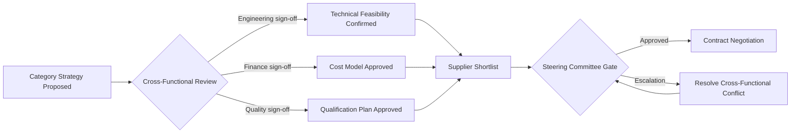

## Cross-Functional Stakeholder Alignment and Buy-In

### Overview

Cross-functional stakeholder alignment is the practice of ensuring that all internal functions with a stake in supplier decisions — procurement, engineering, quality, finance, legal, and operations — share a common understanding of, and commitment to, sourcing strategy. In Supplier Relationship Management, misalignment is one of the most common causes of strategy failure: a Category Manager may sign a Dual Sourcing agreement while Engineering continues to specify components that only the incumbent supplier can produce, silently nullifying the diversification effort. Achieving genuine buy-in — not mere sign-off — requires deliberate structural and communication mechanisms distinct from general organizational change management.

### Why Cross-Functional Alignment Is Distinct from General Change Management

**Key Points**

- **Change management** (see related topic) addresses how individuals adapt to a new process or structure over time.
- **Cross-functional alignment** addresses a narrower, often prior problem: getting functions with genuinely different incentives and success metrics to agree on the sourcing strategy itself, before rollout begins.
- Engineering is measured on product performance and technical risk; Finance on cost and working capital; Operations on delivery reliability; Procurement on cost savings and supply risk. A Dual Sourcing decision can look optimal to Procurement while appearing costly or risky to Engineering (qualification effort) or Finance (dual-source premium pricing).

### Key Stakeholder Functions and Their Sourcing Concerns

| Function | Primary Concern with Dual Sourcing | Typical Objection |
| --- | --- | --- |
| Engineering | Technical equivalence of secondary supplier's output | "Only Supplier A can meet our tolerance spec" |
| Quality | Consistency of quality across two production sources | "We'll have two different failure-mode profiles to manage" |
| Finance | Cost impact of splitting volume (loss of volume discounts) | "Dual sourcing increases unit cost by X%" |
| Operations | Logistics/scheduling complexity of managing two supply chains | "This doubles our inbound logistics coordination effort" |
| Legal | Contractual exposure across two agreements | "Two contracts means twice the liability surface to review" |
| Procurement/Category Mgmt | Supply risk reduction, negotiating leverage | Generally the initiating advocate |

### Structural Mechanisms for Alignment

**Cross-Functional Sourcing Teams (CFTs)**

- Formal teams assembled per strategic category, with standing representation from each affected function.
- Convened at key sourcing decision points: category strategy definition, supplier shortlisting, final selection, and periodic strategy review.
- Distinct from a RACI matrix (see related topic) in that a CFT is a standing *forum*, while RACI defines the *decision rights* exercised within that forum.

**Steering Committees**

- Senior-level (director/VP) body that resolves escalated cross-functional disagreements — e.g., when Engineering blocks a candidate secondary supplier that Procurement has otherwise qualified.
- Typically meets quarterly or at major decision gates rather than operationally.

**Gate-Based Sourcing Governance**

- Sourcing decisions pass through defined approval gates (e.g., "Category Strategy Approved," "Supplier Shortlist Approved," "Contract Award Approved"), each requiring documented sign-off from all relevant functions.
- Ensures Engineering technical validation and Quality qualification are structurally required *before* a Dual Sourcing contract is signed, rather than discovered as a blocker afterward.

### Techniques for Building Genuine Buy-In (Beyond Sign-Off)

**Key Points**

- **Early involvement, not late-stage approval**: Engaging Engineering and Quality during category strategy formation — not just at final contract review — surfaces technical objections early enough to address them (e.g., building qualification timelines into the project plan) rather than encountering them as last-minute blockers.
- **Shared metrics framing**: Reframing Dual Sourcing success metrics to include functions beyond Procurement — e.g., tracking "supply continuity incidents avoided" (relevant to Operations) alongside "cost savings" (relevant to Finance).
- **Co-created business case**: Involving stakeholder functions in building the business case (rather than presenting a Procurement-authored case for their approval) increases ownership and reduces passive resistance.
- **Pilot-based de-risking**: Proposing a limited pilot (e.g., dual-sourcing one component family) to generate concrete data addressing stakeholder concerns before requesting full-scale commitment.
- **Addressing objections with data, not authority**: Countering the "dual sourcing costs more" objection with TCO (Total Cost of Ownership) analysis that quantifies the *cost of not diversifying* (disruption risk exposure) tends to be more persuasive than a top-down mandate.

### Common Alignment Failure Patterns

- **Sign-off without ownership**: A stakeholder formally approves a sourcing decision at a gate review but does not adjust their own downstream behavior (e.g., Engineering approves a secondary supplier on paper but continues issuing engineering change orders only compatible with the incumbent's process).
- **Silent Engineering veto**: Technical specifications are written narrowly enough (intentionally or not) that only the incumbent supplier can realistically qualify, undermining a nominally approved Dual Sourcing strategy before it starts.
- **Finance short-termism**: Evaluating Dual Sourcing purely on near-term unit cost impact without incorporating risk-adjusted TCO, leading to under-resourced or reversed diversification initiatives after the first budget cycle.
- **Decision fatigue from over-consultation**: Involving too many stakeholders as "Consulted" (see RACI, related topic) on every minor sourcing decision slows the process enough that functions disengage rather than align.

### Alignment Assessment Techniques

| Technique | Purpose |
| --- | --- |
| Stakeholder interviews | Surface function-specific concerns before formal proposal |
| RACI validation workshop | Confirm each function agrees with its assigned decision rights |
| Objection-mapping exercise | Catalog anticipated objections per function and pre-build responses |
| Post-decision pulse survey | Measure whether stakeholders feel genuine ownership vs. passive compliance after a sourcing decision is finalized |

### Alignment Across the Sourcing Lifecycle

| Lifecycle Stage | Primary Alignment Activity |
| --- | --- |
| Category strategy definition | CFT workshop to agree on single- vs. dual-source rationale |
| Supplier identification | Engineering/Quality input on technical qualification criteria |
| Supplier evaluation | Joint scoring using weighted criteria reflecting all function priorities |
| Contract negotiation | Legal/Finance alignment on risk allocation and cost terms |
| Onboarding | Operations alignment on logistics and scheduling integration |
| Ongoing governance (QBR) | Continued cross-functional presence to sustain alignment, not just at initial rollout |

Sustained alignment, not just initial buy-in at contract signature, is what determines whether a Dual Sourcing strategy survives beyond its first year — misalignment that resurfaces during ongoing operations (e.g., a new Engineering change order that inadvertently disqualifies the secondary supplier) is a common cause of strategies quietly reverting to single-source dependency. [Inference — based on general patterns in cross-functional sourcing governance literature rather than a specific cited study]

**Related Topics**

- Cross-Functional Sourcing Team (CFT) Design and Facilitation
- RACI Design for Sourcing Decisions
- Gate-Based Sourcing Governance Models
- Total Cost of Ownership (TCO) Modeling for Stakeholder Buy-In
- Steering Committee Structure and Escalation Protocols
- Change Management for SRM Program Adoption