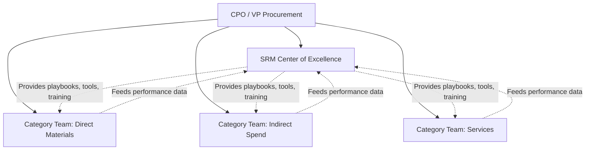

## Building an SRM Center of Excellence

### Overview

A Center of Excellence (CoE) is a dedicated organizational unit that centralizes best practices, methodologies, tools, and expertise for a discipline — in this case, Supplier Relationship Management — and makes that expertise available across the enterprise regardless of which business unit or category team is executing sourcing activity. An SRM CoE differs from simply having a strong central procurement function: it is explicitly focused on *capability building and standardization* (playbooks, training, tooling, governance templates) rather than *transactional execution* of sourcing itself, which typically remains distributed across category teams under a hybrid procurement model (see related topic).

### Purpose and Value Proposition

**Key Points**

- **Standardization**: Establishes consistent SRM methodologies (scorecard design, QBR templates, risk-scoring models) across all categories and business units, preventing each category team from reinventing supplier governance independently.
- **Knowledge retention**: Captures institutional knowledge about supplier management best practices that would otherwise be siloed within individual category managers, reducing risk when key personnel leave.
- **Tool and technology stewardship**: Owns selection, configuration, and continuous improvement of SRM/procurement platforms (e.g., SAP Ariba, Coupa, Jaggaer) so category teams don't independently procure overlapping or incompatible tools.
- **Dual Sourcing methodology ownership**: Develops and maintains the enterprise's standard playbook for when and how to implement Dual Sourcing — risk-scoring thresholds, qualification process templates, allocation-ratio governance models — that category teams apply consistently rather than improvising per category.
- **Training and capability development**: Delivers the competency-building programs described in SRM skills frameworks (see related topic), ensuring consistent skill levels across a distributed procurement organization.

### CoE vs. Center-Led Procurement: Key Distinction

| Aspect | SRM Center of Excellence | Center-Led Procurement (Hybrid Model) |
| --- | --- | --- |
| Primary function | Methodology, tools, training, best-practice governance | Category strategy ownership and contract negotiation |
| Executes purchase transactions? | No | Sometimes (for strategic/leverage categories) |
| Relationship to category teams | Advisory/enabling | Directive (sets policy category teams must follow) |
| Typical staffing | SRM process experts, data/analytics specialists, tool administrators | Category managers, sourcing leads |
| Success metric | Adoption rate of standardized practices, tool utilization, training completion | Cost savings, contract compliance, supplier performance |

*Note: Many organizations combine these functions into a single group; the distinction above is conceptual, not necessarily a mandated separate org chart entry.*

### Core CoE Functions

**Methodology and Playbook Development**

- Standard templates for supplier segmentation, risk assessment, and — critically for this domain — a formal **Dual Sourcing decision framework**: a documented, repeatable methodology for determining which commodities require dual/multi-sourcing based on spend, criticality, and supply-market risk scoring.
- QBR (Quarterly Business Review) templates and facilitation guides.
- Supplier onboarding and qualification process templates (e.g., standardized PPAP-equivalent workflows).

**Technology and Data Governance**

- Ownership of the SRM platform's data model, ensuring supplier performance data is captured consistently across all categories to enable enterprise-wide reporting.
- Maintains master supplier data governance (avoiding duplicate supplier records, ensuring risk data feeds are current).
- Evaluates and pilots emerging tools (e.g., AI-assisted supplier risk monitoring) before enterprise-wide rollout.

**Training and Enablement**

- Delivers onboarding training for new category managers and SRM owners.
- Maintains a competency framework (see related topic) and certifies staff against it.
- Runs internal communities of practice for peer knowledge-sharing across category teams.

**Governance and Compliance Monitoring**

- Monitors adherence to enterprise sourcing policy, including Dual Sourcing thresholds (e.g., flagging categories where single-supplier concentration exceeds policy limits).
- Produces enterprise-wide supplier risk dashboards aggregating data across all category teams.
- Supports internal audit and compliance reviews related to supplier management.

### CoE Organizational Placement

The CoE typically reports directly to the CPO as a peer function to category teams, with an *advisory and enabling* relationship rather than direct authority over category-level sourcing decisions — preserving category managers' domain expertise while ensuring consistent methodology.

### Building the CoE: Implementation Phases

**Phase 1: Assessment and Charter**

- Conduct a maturity assessment of current SRM practices across business units (identify inconsistencies in scorecard design, QBR cadence, risk assessment rigor).
- Define the CoE's charter: scope of authority, which processes it standardizes vs. mandates, and its relationship to existing category teams.
- Secure executive sponsorship — critical, since a CoE without genuine authority to influence category team practices becomes a documentation repository nobody uses.

**Phase 2: Core Team Formation**

- Recruit or designate a small core team (often 3–8 people initially): a CoE lead, one or two SRM methodology/process experts, and a data/analytics specialist for tooling and dashboard ownership.
- Identify "champion" category managers willing to pilot standardized methodologies before enterprise rollout.

**Phase 3: Playbook and Tool Development**

- Develop the initial set of standardized templates: supplier scorecard, QBR agenda, risk-assessment framework, and Dual Sourcing decision-tree methodology.
- Configure or select the SRM technology platform to support standardized data capture.

**Phase 4: Pilot Deployment**

- Deploy standardized methodology within one or two category teams (often the champion teams identified in Phase 2).
- Gather feedback and refine templates/tools based on real-world friction points before broader rollout.

**Phase 5: Enterprise Rollout and Sustainment**

- Roll out standardized SRM methodology across all category teams, supported by structured training (see change management, related topic).
- Establish ongoing governance cadence: CoE reviews compliance dashboards, category teams report performance data, and the CoE periodically refreshes methodology based on emerging best practices or lessons learned.

### CoE Success Metrics

| Metric Category | Example KPI |
| --- | --- |
| Adoption | % of category teams using standardized scorecard templates |
| Consistency | Variance in QBR cadence/quality across categories (lower = better standardization) |
| Risk governance | % of strategic categories with a documented, CoE-reviewed Dual Sourcing decision rationale |
| Tool utilization | % of supplier performance data captured in the central SRM platform vs. offline spreadsheets |
| Capability | % of category managers certified against the SRM competency framework |
| Business impact | Reduction in supply disruption incidents attributable to improved risk governance (directional, not solely attributable) |

### Common Pitfalls in CoE Design

- **Authority without accountability, or vice versa**: A CoE mandated to enforce standardized Dual Sourcing methodology but given no escalation path when category teams ignore it becomes ineffective; conversely, a CoE with directive authority but no domain credibility with category teams generates resentment and passive resistance.
- **Over-standardization**: Applying identical Dual Sourcing thresholds or qualification timelines across fundamentally different categories (e.g., commodity raw materials vs. highly engineered components) without allowing methodology flexibility.
- **Becoming a bottleneck**: If the CoE is staffed too thin relative to the number of category teams it supports, it risks becoming a queue that slows sourcing decisions rather than accelerating them.
- **Insufficient category team involvement in playbook design**: Playbooks developed in isolation by the CoE without category team input often fail adoption — this mirrors the cross-functional buy-in challenges discussed elsewhere (see related topic).

**Related Topics**

- Centralized, Decentralized, and Hybrid Procurement Models
- SRM Roles, Responsibilities, and RACI Design
- Skills and Competency Frameworks for SRM Professionals
- Dual Sourcing Decision Framework and Risk-Scoring Methodology
- SRM Technology Platform Selection (SAP Ariba, Coupa, Jaggaer, Ivalua)
- Change Management for SRM Program Adoption