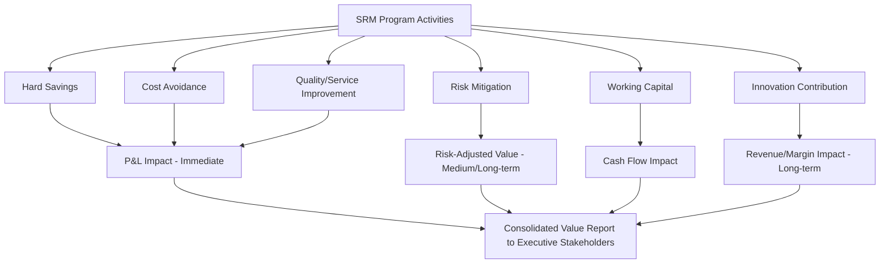

## Value Creation Frameworks for SRM Programs

### Overview

Value creation frameworks provide structured methodologies for identifying, categorizing, and quantifying the benefits a Supplier Relationship Management program delivers beyond simple unit-price reduction. As SRM has matured from a cost-focused purchasing function into a strategic discipline, value creation frameworks have expanded to capture cost avoidance, risk mitigation, innovation contribution, and working-capital improvement — dimensions that are often *more* significant than direct price savings but historically harder to communicate to executive stakeholders. These frameworks are foundational to demonstrating SRM's business case, including the ROI of strategies like Dual Sourcing.

### Why Value Creation Frameworks Matter

**Key Points**

- **Beyond price savings**: A pure cost-reduction lens undervalues SRM activities like Dual Sourcing, which often carry a near-term cost premium (loss of single-supplier volume discounts) in exchange for risk mitigation value that doesn't show up in a simple price variance report.
- **Executive credibility**: A structured framework allows procurement to communicate value in financial and strategic terms executives recognize (EBITDA impact, risk-adjusted return) rather than procurement-specific jargon.
- **Resource justification**: Demonstrating multi-dimensional value supports continued investment in SRM capability (CoE staffing, technology, training) that might otherwise be viewed as a pure cost center.

### Core Value Dimensions

**Hard Savings (Cost Reduction)**

- Directly measurable reductions in unit price, achieved through negotiation, competitive bidding, or volume consolidation.
- Typically the easiest value category to quantify and the one traditionally emphasized in procurement reporting.

**Cost Avoidance**

- Costs that would have been incurred absent SRM intervention but were prevented — e.g., avoiding a price increase the supplier had planned to pass through, or avoiding expedited freight costs by proactively managing supplier capacity.
- Harder to prove definitively (requires a credible counterfactual) but often larger in magnitude than hard savings.

**Risk Mitigation Value**

- The financial value of reduced exposure to supply disruption, quality failure, or supplier financial distress.
- Central to justifying Dual Sourcing investments: the value is expressed as *expected loss avoided*, calculated as (probability of disruption) × (financial impact of disruption) × (risk reduction achieved through diversification).
- Often the primary value driver for Dual Sourcing decisions, since the direct cost impact of splitting volume between two suppliers is frequently negative (higher blended unit cost) in the near term.

**Working Capital Improvement**

- Value generated through improved payment terms, inventory reduction (via better supplier delivery reliability), or consignment stock arrangements.
- Measured in terms of cash conversion cycle impact rather than P&L savings.

**Innovation and Revenue Contribution**

- Value generated when supplier collaboration produces new product features, faster time-to-market, or joint innovation that contributes to top-line revenue rather than cost reduction.
- Requires close SRM relationship management (see related topics) since innovation contribution typically flows from trust-based strategic supplier partnerships rather than transactional/competitive relationships.

**Quality and Service Improvement**

- Value from reduced defect rates, improved on-time delivery, and reduced internal rework/scrap costs attributable to supplier performance improvement.

### Value Creation Framework Structure

| Value Category | Measurement Approach | Typical Time Horizon |
| --- | --- | --- |
| Hard savings | Price variance vs. baseline/benchmark | Immediate (within contract period) |
| Cost avoidance | Modeled counterfactual vs. actual outcome | Immediate to short-term |
| Risk mitigation | Expected value of avoided disruption (probability × impact) | Medium to long-term |
| Working capital | Cash conversion cycle days improved | Short to medium-term |
| Innovation contribution | Revenue/margin impact of supplier-enabled product improvements | Long-term |
| Quality/service | Defect rate reduction, on-time delivery improvement, translated to cost of poor quality avoided | Short to medium-term |

### Total Value of Ownership (TVO) — Extending TCO

**Key Points**

- Total Cost of Ownership (TCO) captures the full cost of a supplier relationship (price, logistics, quality costs, administrative overhead) beyond unit price.
- Total Value of Ownership (TVO) extends TCO by also incorporating positive value contributions — innovation, risk-adjusted continuity, flexibility — not just costs.
- TVO is particularly relevant for evaluating Dual Sourcing decisions holistically: a pure TCO comparison might favor single-sourcing (lower blended cost), while TVO analysis incorporates the risk-mitigation and negotiating-leverage value of maintaining a qualified second source.

$$TVO = \text{Base Price} + \text{Logistics Cost} + \text{Quality Cost} + \text{Administrative Cost} - \text{Risk Mitigation Value} - \text{Innovation Value}$$

*Note: Some organizations express TVO as a single monetized figure; others use a weighted scorecard combining quantitative and qualitative factors where full monetization isn't feasible (e.g., innovation contribution is often difficult to monetize with precision).*

### Quantifying Dual Sourcing Value Specifically

A common structured approach for building the business case for Dual Sourcing combines direct cost impact with risk-adjusted value:

$$\text{Net Value} = \text{Risk Mitigation Value} - \text{Dual-Source Cost Premium} - \text{Qualification/Onboarding Cost}$$

Where:

- **Risk Mitigation Value** = (Probability of primary supplier disruption) × (Financial impact of disruption if it occurs, e.g., lost production, expedited freight, customer penalty costs) × (Reduction in that probability achieved by having a qualified secondary source)
- **Dual-Source Cost Premium** = Increase in blended unit cost from splitting volume away from the highest-discount single-source scenario
- **Qualification/Onboarding Cost** = One-time cost of qualifying and onboarding the secondary supplier (PPAP-equivalent activities, initial audits)

**Example**

A manufacturer sources a critical component worth $10M annually from a single supplier. Historical data suggests a 5% annual probability of a disruption causing $3M in impact (expedited freight, lost production). Risk mitigation value from dual-sourcing (assuming 80% risk reduction) = $0.05 \times \$3M \times 0.80 = \$120{,}000$ expected value per year. If the dual-source cost premium (higher blended unit cost from splitting volume) is $60,000/year and one-time qualification cost is $150,000, the initiative has positive net value beginning in year 2, with continued annual value of approximately $60,000/year thereafter — though this depends heavily on the accuracy of the disruption probability and impact estimates. [Inference — illustrative calculation methodology; actual disruption probabilities and impacts require organization-specific historical data and risk modeling]

### Value Creation Framework Visualization

### Common Frameworks Referenced in Practice

- **Kraljic-informed value segmentation**: Aligning value creation focus to supplier segment — leverage/strategic suppliers emphasized for risk mitigation and innovation value; non-critical/routine suppliers emphasized for hard savings and transactional efficiency.
- **Balanced Scorecard approach**: Applying financial, customer/internal-stakeholder, process, and learning/growth perspectives to SRM value reporting, ensuring value isn't reported purely in financial terms.
- **ISM/CIPS value reporting guidance**: Professional procurement bodies provide structured guidance on categorizing and reporting procurement value; organizations often adapt these external frameworks to internal reporting templates rather than adopting them verbatim. [Unverified — specific current guidance should be confirmed against the latest ISM/CIPS published materials, as these are periodically updated]

### Challenges in Value Creation Measurement

- **Attribution difficulty**: Isolating SRM program impact from other simultaneous factors (market price fluctuations, currency movements, demand changes) requires disciplined baseline methodology.
- **Counterfactual dependency for cost avoidance and risk mitigation**: Both require modeling "what would have happened" — a figure inherently uncertain and vulnerable to credibility challenges from finance stakeholders.
- **Innovation value monetization**: Quantifying the revenue/margin impact of supplier-enabled innovation often requires cross-functional collaboration with product/engineering teams and may only be measurable well after the SRM activity that enabled it.
- **Timing mismatches**: Risk mitigation value often accrues over years (avoided disruption may not occur for a long period), which can undervalue Dual Sourcing investments in annual budget-cycle reporting that emphasizes near-term financial impact.

**Related Topics**

- Total Cost of Ownership (TCO) vs. Total Value of Ownership (TVO) Modeling
- Risk-Adjusted ROI Calculation for Dual Sourcing Investments
- Supplier Innovation Programs and Co-Development Value
- Balanced Scorecard Design for Procurement Reporting
- Executive Communication of Procurement Value
- Baseline and Counterfactual Methodology for Savings Attribution