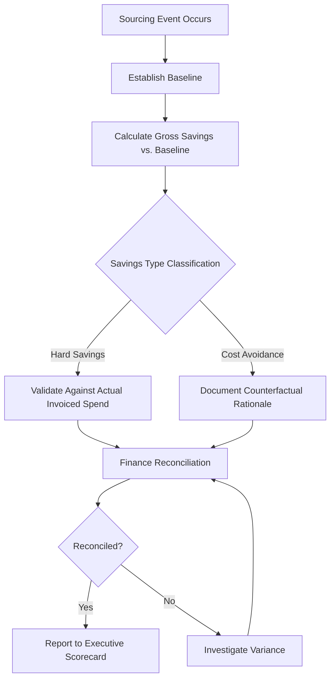

## ROI Measurement and Savings Tracking Methodologies

### Overview

ROI measurement and savings tracking methodologies provide the disciplined, auditable processes by which procurement organizations calculate, validate, and report the financial return generated by sourcing activities. Unlike the broader value creation frameworks (see related topic) that categorize *types* of value, this discipline focuses on the *mechanics* of measurement: establishing credible baselines, defining savings categories precisely, avoiding double-counting, and reconciling procurement-reported savings against finance-validated P&L impact. Rigorous savings tracking is what gives procurement — and Dual Sourcing initiatives specifically — credibility with CFOs and finance stakeholders who are often skeptical of self-reported procurement claims.

### Foundational Concept: The Baseline

**Key Points**

- Every savings calculation requires a **baseline** — the price, cost, or condition that would have existed absent the procurement intervention.
- Baseline methodology is the single most contested element of savings tracking, since the baseline choice can dramatically change the reported savings figure.
- Common baseline types:
  - **Prior contract price**: Previous negotiated price for the same or comparable item.
  - **Market/index-based baseline**: Reference to a commodity index (e.g., LME metals pricing) to isolate procurement-driven savings from market price movement.
  - **Budget baseline**: The price assumed in the annual budget/forecast.
  - **First-offer baseline**: The supplier's initial quoted price before negotiation, used to measure negotiation-specific savings.

### Core Savings Categories

**Hard/Realized Savings**

- Savings that flow directly to the P&L as reduced cost, verifiable in actual invoiced spend.
- Typically require finance validation because they affect reported financial results.

**Cost Avoidance**

- Prevented cost increases or costs that did not materialize due to procurement action (e.g., negotiating a price freeze against a planned increase).
- Does not appear in year-over-year spend reduction (spend may stay flat rather than decrease) — a frequent source of confusion when reconciling procurement-reported vs. finance-visible savings.

**Cost Reduction vs. Cost Containment**

- **Cost reduction**: Absolute decrease in spend for a comparable scope of goods/services.
- **Cost containment**: Spend increase held below what it otherwise would have been (e.g., inflation-driven price increases limited to 2% when the market moved 6%) — a form of cost avoidance often tracked separately for transparency.

### Savings Tracking Methodology Framework

### The Finance Reconciliation Problem

**Key Points**

- Procurement-reported savings frequently diverge from what Finance observes in actual P&L movement, due to:
  - **Volume changes**: Price savings can be offset by volume increases, so total spend rises even though unit price fell.
  - **Scope changes**: Specification changes between the baseline period and current period make "like-for-like" comparison invalid without adjustment.
  - **Timing differences**: Savings negotiated in Q1 may not be realized in invoiced spend until Q3 due to existing inventory or contract transition periods.
  - **Category mix shifts**: Aggregate spend can move due to changing product mix rather than pricing changes.
- Best-practice organizations establish a **joint procurement-finance savings governance process**, where Finance formally validates and signs off on reported savings figures before they appear in executive reporting, which substantially increases credibility.

### Savings Tracking for Dual Sourcing Initiatives

Dual Sourcing presents a distinct measurement challenge: the *direct* cost impact is frequently negative (higher blended unit cost from losing single-source volume discounts), while the *value* is realized through avoided disruption cost — a form of cost avoidance requiring probabilistic modeling rather than direct observation.

**Recommended tracking approach**:

- Track the **dual-source cost premium** explicitly as a negative line item (transparency builds credibility rather than hiding this cost).
- Track **realized risk mitigation events** separately — instances where the secondary supplier was actually called upon due to a primary supplier issue, with the avoided cost/disruption quantified after the fact.
- Maintain a **running risk-adjusted ROI** that combines the known cost premium against the expected (and, over time, realized) value of avoided disruptions, updated as actual disruption events occur or don't occur.

$$\text{Dual Sourcing ROI} = \frac{\text{Realized Avoided Disruption Cost} - \text{Cumulative Cost Premium Paid}}{\text{Cumulative Cost Premium Paid}}$$

*Note: This realized-ROI formula is retrospective and only shows positive return after a disruption event actually occurs and is avoided; the prospective business case (see value creation frameworks, related topic) uses expected value rather than realized outcomes, since the entire premise of risk mitigation investment is that the majority of periods will show no disruption event.*

### Standard Savings Reporting Metrics

| Metric | Definition | Typical Use |
| --- | --- | --- |
| Savings rate | Total savings ÷ addressable spend | Overall procurement effectiveness |
| Savings realization rate | Realized (validated) savings ÷ reported (initial) savings | Measures forecast accuracy/credibility |
| Cost avoidance ratio | Cost avoidance ÷ total value delivered | Shows reliance on avoidance vs. hard savings |
| PO price compliance | % of purchase orders matching negotiated contract price | Contract execution discipline |
| Savings pipeline value | Forecasted savings from in-progress sourcing events | Forward-looking planning metric |

### Common Methodological Pitfalls

- **Double-counting**: Savings claimed in multiple reporting periods or by multiple teams for the same negotiated outcome (e.g., a category manager and a CoE both claiming credit for the same contract renegotiation).
- **Phantom baselines**: Using an artificially inflated or stale baseline (e.g., comparing against a list price no supplier actually charges) to inflate reported savings.
- **Ignoring implementation lag**: Reporting savings at the point of contract signature rather than at the point spend actually reflects the new pricing, overstating near-term impact.
- **Conflating cost avoidance with hard savings** in headline reporting without clear labeling, which erodes finance stakeholder trust once the distinction is discovered during reconciliation.
- **Under-tracking dual-source premium costs**: Failing to transparently report the cost premium of maintaining a secondary supplier undermines credibility when finance eventually identifies the cost through independent spend analysis.

### Governance Cadence for Savings Tracking

| Cadence | Activity | Owner |
| --- | --- | --- |
| Per sourcing event | Baseline documentation and gross savings calculation | Category Manager / Sourcing Analyst |
| Monthly | Savings pipeline update | Category Manager |
| Quarterly | Finance reconciliation review | Procurement + Finance joint review |
| Quarterly | Realized dual-source premium and risk-event tracking | SRM Owner / Risk Manager |
| Annually | Savings methodology audit and baseline policy review | CoE / Procurement Leadership |

### Audit-Readiness Considerations

- Maintain documented evidence for every claimed baseline (quotes, prior contracts, index data) to support internal or external audit review.
- Use a consistent, enterprise-wide savings taxonomy (hard savings, cost avoidance, cost containment) rather than allowing category teams to define these terms independently.
- Where possible, tie savings tracking methodology to recognized external references (e.g., CIPS or ISM savings measurement guidance) to strengthen defensibility of the internal methodology. [Unverified — organizations should confirm current guidance against the latest published standards from these bodies, as specific frameworks are periodically revised]

**Related Topics**

- Value Creation Frameworks for SRM Programs
- Baseline Methodology and Counterfactual Analysis
- Procurement-Finance Savings Governance Processes
- Risk-Adjusted ROI Modeling for Dual Sourcing
- Executive Scorecard and Dashboard Design
- Contract Compliance and PO Price Variance Monitoring