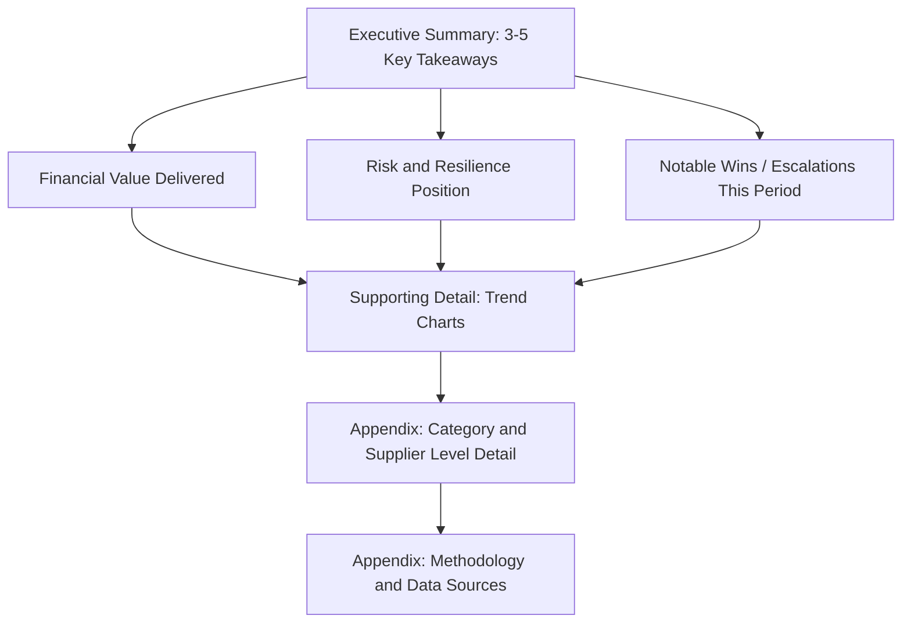

## Reporting SRM Performance to Executive Leadership

### Definition and Purpose

Reporting SRM performance to executive leadership is the practice of translating operational supplier relationship management data — cost savings, risk mitigation, supplier performance scores, dual-sourcing resilience metrics — into concise, decision-relevant communication for C-suite and board-level audiences. The core challenge is transforming procurement's typically granular, transaction-level data into strategic narratives that connect supplier management activity to enterprise outcomes: cost, risk, continuity, and competitive advantage.

This differs fundamentally from operational SRM reporting (used by category managers and sourcing teams) in audience, cadence, level of abstraction, and the decisions the report is meant to inform.

### Why Executive Reporting Requires a Different Approach

- **Time constraints**: Executives typically engage with procurement reporting for minutes, not hours — reports must lead with conclusions, not methodology
- **Decision orientation**: Executive leadership needs information framed around decisions they must make (approve dual-sourcing investment, accept residual risk, authorize supplier diversification) rather than descriptive statistics
- **Cross-functional relevance**: Board and C-suite audiences care about supplier risk in terms of business continuity, regulatory exposure, and shareholder value — not procurement KPIs in isolation
- **Trust and credibility**: Inconsistent or overly promotional reporting erodes executive confidence in procurement's data; credibility compounds over multiple reporting cycles

### Core Principles of Executive-Level SRM Reporting

#### 1. Lead with Business Impact, Not Process

Structure reports around business outcomes (cost avoided, risk reduced, continuity ensured) rather than procurement activity (contracts negotiated, suppliers onboarded). Activity metrics belong in appendices or supporting detail, not the headline narrative.

#### 2. The "So What" Test

Every metric included should pass the test: *if the executive sees this number, what decision or understanding changes?* Metrics that fail this test should be cut or relegated to backup material.

#### 3. Consistency Across Reporting Cycles

Use a stable core metric set quarter-over-quarter so executives can track trends rather than being presented with a redesigned scorecard each cycle. Introduce new metrics deliberately and explain why.

#### 4. Appropriate Level of Aggregation

Executive reports should typically aggregate at the enterprise or business-unit level, with drill-down detail available but not front-loaded. Category-level or supplier-level detail belongs in supporting appendices.

### Core Metrics for Executive SRM Reporting

| Metric Category | Example Metrics | Executive Relevance |
| --- | --- | --- |
| Financial Value | Realized cost savings, cost avoidance, should-cost negotiation gains | Direct P&L and margin impact |
| Risk & Resilience | % spend dual/multi-sourced, single-source exposure by criticality tier, supplier financial health index | Business continuity, board risk oversight |
| Supplier Performance | On-time delivery %, quality defect rate, SLA compliance | Operational reliability |
| Innovation & Strategic Value | Supplier-driven innovation initiatives, joint value engineering savings | Competitive differentiation |
| Compliance & Sustainability | ESG audit pass rate, supplier diversity spend %, regulatory compliance status | Regulatory and reputational risk |
| Relationship Health | Supplier satisfaction/NPS, escalation volume and resolution time | Long-term partnership viability |

### Dual-Sourcing-Specific Executive Metrics

Because dual sourcing is fundamentally a risk-mitigation and resilience strategy, executive reporting should isolate metrics that demonstrate its value distinctly from general procurement savings:

- **Single-Source Risk Exposure**: percentage of critical-category spend still dependent on a sole supplier, ideally trended downward over time
- **Second-Source Qualification Velocity**: average time to qualify and activate a second source for newly identified single-source risks
- **Cost of Resilience**: the price premium (if any) paid to maintain a qualified second source, framed as an insurance-equivalent cost against disruption
- **Disruption Avoidance Value**: [Inference] estimated cost avoided in specific incidents where a second source was activated in response to a primary supplier failure — this figure is inherently a modeled estimate (comparing actual outcome to a counterfactual single-source disruption scenario) rather than a directly observed number, and should be presented with its underlying assumptions disclosed
- **Dual-Source Coverage Ratio**: $\frac{\text{Spend in categories with 2+ qualified sources}}{\text{Total addressable spend in critical categories}} \times 100\%$

### Report Structure Template

A common effective structure, front to back:

1. **Executive Summary** — 3–5 bullet takeaways, no more than half a page
2. **Value Delivered** — financial and risk-adjusted value, trended over 4–8 quarters
3. **Resilience Position** — dual-sourcing coverage, single-source exposure heatmap by category criticality
4. **Notable Events** — significant wins, disruptions handled, escalations requiring executive awareness
5. **Forward Look** — key risks and initiatives requiring executive support or decision in the coming period
6. **Appendix** — category detail, methodology notes, data source disclosure

### Visualization Approaches

#### Single-Source Risk Heatmap (conceptual layout)

<svg xmlns="http://www.w3.org/2000/svg" viewBox="0 0 760 380">
<text x="380" y="26" text-anchor="middle" font-size="16" font-weight="bold" fill="#1a1a1a">Single-Source Risk Exposure by Category (svg_diagram)</text>

<text x="30" y="60" font-size="12" fill="#333">Business Criticality</text>

<text x="20" y="90" font-size="11" fill="#333">High</text>

<text x="20" y="180" font-size="11" fill="#333">Medium</text>

<text x="20" y="270" font-size="11" fill="#333">Low</text>

<text x="400" y="345" text-anchor="middle" font-size="12" fill="#333">Single-Source Dependency</text>

<text x="130" y="325" text-anchor="middle" font-size="11" fill="#333">Dual/Multi-Sourced</text>

<text x="400" y="325" text-anchor="middle" font-size="11" fill="#333">Partially Mitigated</text>

<text x="650" y="325" text-anchor="middle" font-size="11" fill="#333">Single-Source</text>

<rect x="70" y="60" width="180" height="70" fill="#a8d5a8" stroke="#4a7a4a" />
<text x="160" y="100" text-anchor="middle" font-size="11" fill="#1a1a1a">Electronic Components</text>
<rect x="260" y="60" width="180" height="70" fill="#f4d35e" stroke="#b8952e" />
<text x="350" y="100" text-anchor="middle" font-size="11" fill="#1a1a1a">Precision Castings</text>
<rect x="450" y="60" width="220" height="70" fill="#e07a5f" stroke="#a8442e" />
<text x="560" y="95" text-anchor="middle" font-size="11" fill="#1a1a1a">Rare-Earth Materials</text>
<text x="560" y="112" text-anchor="middle" font-size="10" fill="#1a1a1a">(Executive Attention Required)</text>
<rect x="70" y="150" width="180" height="70" fill="#a8d5a8" stroke="#4a7a4a" />
<text x="160" y="190" text-anchor="middle" font-size="11" fill="#1a1a1a">Packaging</text>
<rect x="260" y="150" width="180" height="70" fill="#f4d35e" stroke="#b8952e" />
<text x="350" y="190" text-anchor="middle" font-size="11" fill="#1a1a1a">Custom Tooling</text>
<rect x="450" y="150" width="220" height="70" fill="#f4d35e" stroke="#b8952e" />
<text x="560" y="190" text-anchor="middle" font-size="11" fill="#1a1a1a">Specialty Coatings</text>
<rect x="70" y="240" width="180" height="70" fill="#a8d5a8" stroke="#4a7a4a" />
<text x="160" y="280" text-anchor="middle" font-size="11" fill="#1a1a1a">Office Supplies</text>
<rect x="260" y="240" width="180" height="70" fill="#a8d5a8" stroke="#4a7a4a" />
<text x="350" y="280" text-anchor="middle" font-size="11" fill="#1a1a1a">Facilities Services</text>
<rect x="450" y="240" width="220" height="70" fill="#f4d35e" stroke="#b8952e" />
<text x="560" y="280" text-anchor="middle" font-size="11" fill="#1a1a1a">Regional Logistics</text>
</svg>

This format lets an executive scan for red cells (high criticality + single-source) in seconds, which is the specific decision-relevant signal — rather than requiring them to parse a data table.

### Financial Value Calculation Transparency

Executive audiences, particularly CFOs, frequently scrutinize procurement savings claims. Best practice is to categorize value delivered with clear, auditable definitions:

$$V_{total} = S_{realized} + S_{avoidance} + V_{risk-adjusted}$$

- **Realized savings** ($S_{realized}$): hard reductions versus prior contracted price, verifiable in AP/invoice data
- **Cost avoidance** ($S_{avoidance}$): prevented cost increases (e.g., negotiated flat renewal against a market that rose 8%) — should be footnoted with the baseline assumption used
- **Risk-adjusted value** ($V_{risk-adjusted}$): modeled value of resilience investments (e.g., dual sourcing premium justified against disruption probability) — must be clearly labeled as modeled/estimated, not realized

[Inference] CFOs and finance functions generally apply higher scrutiny to cost avoidance and risk-adjusted figures than to realized savings, since the former rely on counterfactual assumptions rather than observable transaction data — procurement functions that clearly separate these categories tend to retain more credibility over successive reporting cycles than those that blend them into a single headline number.

### Cadence and Format by Audience Level

| Audience | Typical Cadence | Format | Focus |
| --- | --- | --- | --- |
| Board of Directors | Quarterly or semi-annual | 1–2 page summary + appendix | Enterprise risk, major disruptions, strategic resilience posture |
| C-Suite (CPO/CFO/COO) | Monthly or quarterly | Dashboard + narrative summary | Value delivered, risk trends, decisions needed |
| Business Unit Leaders | Monthly | Category-level dashboard | Category performance, supplier issues affecting their unit |
| Procurement Leadership (internal) | Weekly/Bi-weekly | Operational dashboard | Full metric detail, action tracking |

### Common Pitfalls

- **Metric overload**: Presenting 20+ KPIs on a single slide, forcing the executive to do the prioritization work that the reporting function should have done
- **Vanity metrics**: Including activity counts (number of RFPs run, meetings held) that don't connect to business outcomes
- **Inconsistent savings methodology**: Changing how savings are calculated between reporting periods without disclosure, which undermines trend credibility
- **Burying risk**: Leading with positive financial metrics while relegating critical single-source exposure to an appendix — this can create a false impression of resilience posture
- **No forward-look**: Reporting only on past performance without connecting to risks or decisions the executive needs to weigh in on next
- **Jargon-heavy language**: Using procurement-specific terminology (e.g., "should-cost variance," "SLA breach velocity") without translation into business language

### Example Executive Summary (Illustrative)

> **Q3 SRM Performance Summary**
>
> - Realized savings of $4.2M against a $3.5M target (120% of goal), driven primarily by should-cost-informed renegotiation in electronics and packaging categories.
> - Single-source exposure in critical categories reduced from 34% to 27% following successful second-source qualification in precision castings.
> - One supplier disruption (Tier 1 logistics partner, regional flooding) was absorbed without production impact due to active dual-sourcing arrangement — estimated avoided cost of $1.1M based on prior single-source disruption benchmark.
> - Rare-earth materials category remains single-sourced with no qualified alternative; recommend approving budget for second-source qualification in Q4.

### Next Steps

- Audit current SRM reporting metric set against the "so what" test and remove or relegate low-relevance metrics
- Build a standardized quarterly report template with a stable core metric set for trend continuity
- Develop a single-source risk heatmap by business criticality tier, updated each reporting cycle
- Establish clear, disclosed methodology for savings vs. cost avoidance vs. risk-adjusted value categorization
- Align reporting cadence and depth to each audience tier (board vs. C-suite vs. business unit)

### Related Topics

- SRM Scorecards and Balanced Scorecard Design for Procurement
- Cost Savings vs. Cost Avoidance Methodology and Governance
- Supplier Risk Heatmapping and Criticality Tiering
- Dual-Sourcing ROI and Business Case Development
- Procurement Dashboard Design and Data Visualization Best Practices
- Board-Level Enterprise Risk Reporting Frameworks
- Stakeholder Communication Strategy for Procurement Functions