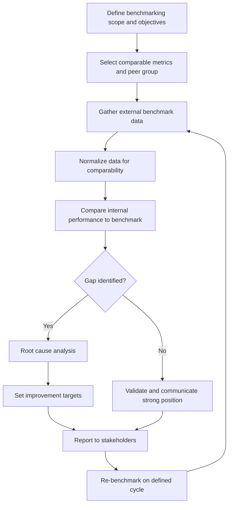
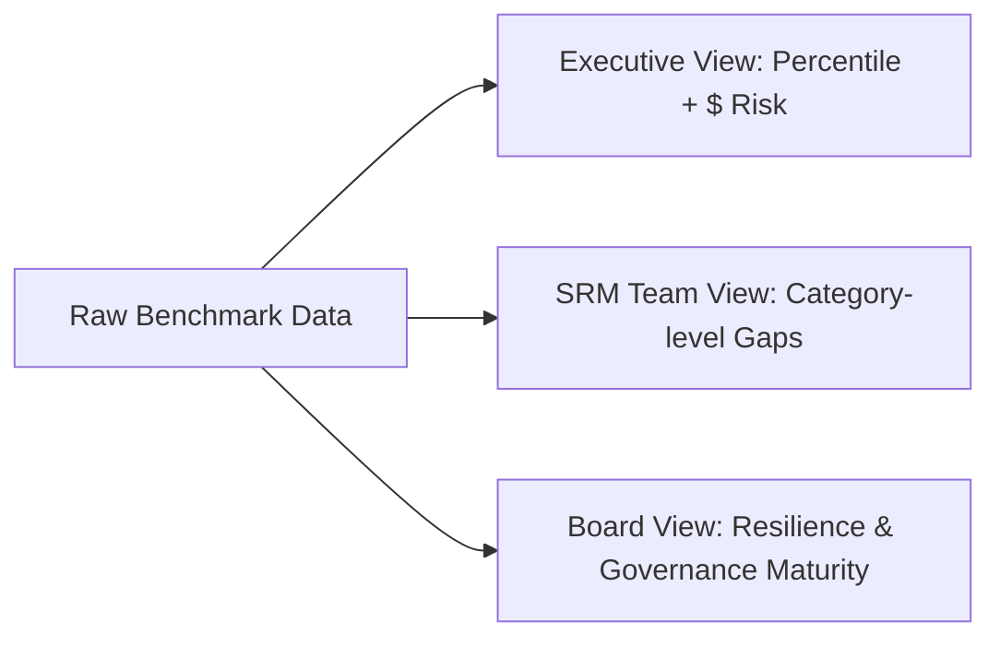

## Benchmarking Against Industry Standards

### Definition and Purpose

Benchmarking against industry standards is the systematic process of comparing an organization's supplier relationship management (SRM) performance, processes, and outcomes against external reference points — competitors, industry averages, best-in-class performers, or published standards bodies — to identify performance gaps, validate program value, and set improvement targets.

In the context of measuring and communicating SRM value, benchmarking serves three distinct functions:

- **Diagnostic**: revealing where current SRM and dual sourcing practices underperform relative to peers
- **Normative**: establishing what "good" looks like so internal metrics have external meaning
- **Persuasive**: providing credible, third-party-anchored evidence to justify SRM investment to executive stakeholders

### Why Internal Metrics Alone Are Insufficient

An SRM function can report that on-time delivery improved from 85% to 91% year-over-year and appear successful in isolation. Without external context, stakeholders cannot judge whether 91% is competitive, lagging, or already best-in-class. Benchmarking converts an internal trend line into a comparative statement of market position.

**Key Points**

- Internal trends show direction (improving/declining) but not competitive position
- Benchmarks convert absolute numbers into relative performance statements
- Executives and boards generally respond more strongly to "we rank in the bottom quartile" than to raw percentages
- Benchmarking data supports both defensive reporting (justifying current spend) and offensive reporting (building a case for new investment, e.g., in dual sourcing infrastructure)

### Categories of Benchmarks Relevant to SRM

#### 1. Financial/Cost Benchmarks

- Cost savings/avoidance as a percentage of addressable spend
- Total cost of ownership (TCO) trends versus category peers
- Payment terms (DPO) versus industry norms
- Supplier-driven cost reduction contribution rate

#### 2. Operational/Performance Benchmarks

- On-time, in-full (OTIF) delivery rates
- Supplier quality metrics (PPM defect rates, first-pass yield)
- Lead time and cycle time versus category standards
- Supplier responsiveness/issue resolution time

#### 3. Risk and Resilience Benchmarks

- Single-source dependency ratio versus dual/multi-source ratio
- Supply continuity incident frequency
- Average time-to-qualify a secondary/backup supplier
- Geographic/geopolitical concentration risk scores

#### 4. Relationship Maturity Benchmarks

- Supplier satisfaction / Net Promoter Score (supplier-facing)
- Percentage of spend under strategic/collaborative relationship models versus transactional
- Joint innovation project count or co-developed IP value
- Supplier segmentation sophistication (e.g., Kraljic matrix maturity)

#### 5. Process/Governance Benchmarks

- SRM technology adoption maturity (manual vs. platform-enabled)
- Frequency and structure of Quarterly/Annual Business Reviews (QBRs/ABRs)
- Existence and coverage of formalized supplier scorecards
- Procurement-to-pay cycle efficiency

### Common External Sources for Benchmarking Data

- **Industry associations and standards bodies**: ISM (Institute for Supply Management), CIPS (Chartered Institute of Procurement & Supply), APQC Open Standards Benchmarking
- **Analyst and advisory firms**: Gartner, Forrester, The Hackett Group — publish procurement/SRM maturity benchmarks and peer comparisons
- **Consulting firm surveys**: Deloitte's Global CPO Survey, McKinsey procurement research, KPMG supply chain resilience reports
- **Consortium/peer benchmarking networks**: Closed-group data-sharing arrangements where participating companies exchange anonymized performance data
- **Public financial disclosures**: SEC filings, annual reports, and ESG disclosures of competitors (for high-level cost and supplier risk indicators)
- **ISO and formal standards**: ISO 44001 (Collaborative Business Relationship Management) provides a maturity framework rather than raw benchmark numbers, but is often used as a structural reference point

[Unverified] Specific numeric benchmark values (e.g., "best-in-class OTIF is 98.5%") vary significantly by industry, region, and reporting year, and should always be sourced from a current, industry-specific report rather than treated as universal constants.

### The Benchmarking Process

#### Step Detail

1. **Define scope and objectives**: Decide whether the benchmark exercise targets cost, risk, quality, or relationship maturity. Overly broad scope dilutes actionable insight.
2. **Select peer group**: Peers should be comparable in industry, spend scale, and geographic footprint. Comparing a mid-size regional manufacturer's dual sourcing ratio to a global electronics OEM's ratio produces misleading conclusions.
3. **Gather data**: Combine paid analyst reports, association surveys, and where available, direct peer-to-peer data-sharing consortiums.
4. **Normalize**: Adjust for differences in accounting treatment, currency, fiscal year alignment, and metric definitions (e.g., "on-time" may be defined with different tolerance windows across organizations).
5. **Compare and identify gaps**: Express results as percentile rank, quartile position, or delta-from-median rather than raw numbers alone.
6. **Root cause and target-setting**: Translate gaps into specific, addressable process or relationship changes.
7. **Communicate**: Package findings for the intended audience (see Communication Formats below).
8. **Re-benchmark on a cycle**: Annual or semi-annual cadence is typical; more frequent cycles are rarely justified given the lag in external data publication.

### Benchmarking Metrics Applied to Dual Sourcing

Dual sourcing benchmarks deserve particular attention because they sit at the intersection of cost efficiency and risk mitigation — two objectives that can be in tension.

| Metric | Description | Typical Comparison Basis |
| --- | --- | --- |
| Dual/multi-source coverage ratio | % of critical spend categories with 2+ qualified suppliers | Industry peer group, category-specific |
| Secondary supplier activation time | Time to shift volume to backup supplier during disruption | Best-in-class vs. median |
| Cost premium of dual sourcing | Incremental cost of maintaining a second source vs. single-source pricing | Category benchmark |
| Single-source risk exposure ($) | Total spend concentrated in single-source relationships | Internal trend + peer comparison |
| Qualification cycle time | Time to fully qualify and onboard a secondary supplier | Industry/process benchmark |

**Example**

A manufacturing company benchmarks its dual sourcing coverage ratio for critical electronic components at 62%, against an industry benchmark (sourced from an analyst report) of 78% for best-in-class peers in the same sector. This 16-percentage-point gap becomes the basis for a business case requesting budget to qualify additional secondary suppliers in the highest-risk component families, with the benchmark cited directly to justify the investment to the CFO.

### Normalization Challenges

Raw benchmark comparison is frequently misleading without adjustment. Common normalization issues:

- **Definitional mismatch**: "On-time delivery" may mean different tolerance windows (e.g., ±1 day vs. ±3 days) across data sources
- **Spend base differences**: Comparing total spend versus addressable/influenceable spend produces different savings percentages
- **Industry-specific baselines**: A 95% OTIF rate may be mediocre in consumer electronics but exceptional in heavy industrial equipment
- **Reporting period misalignment**: Fiscal year differences and macroeconomic conditions (e.g., pandemic-era disruption) can distort year-over-year peer comparisons
- **Currency and inflation effects**: Multi-year or multi-region benchmarks require deflating/normalizing figures to a common basis

[Inference] Organizations that skip normalization steps are more likely to draw incorrect conclusions from benchmark comparisons, though the magnitude of this effect is not something that can be generalized numerically across contexts.

### Communicating Benchmark Results to Stakeholders

Different audiences require different framing of the same underlying benchmark data.

#### For Executive Leadership

- Lead with relative position (percentile, quartile) rather than raw metrics
- Connect gaps directly to financial or risk exposure ($ value, not just percentages)
- Limit to 3–5 headline benchmarks; avoid data-dense dashboards in exec-level communication

#### For Procurement/SRM Teams

- Provide granular, category-level benchmark breakdowns
- Include root-cause context and improvement levers, not just the gap
- Use benchmarks to prioritize supplier development initiatives

#### For the Board / Audit Committee

- Focus on risk-oriented benchmarks (supply continuity, single-source exposure)
- Frame in terms of resilience and governance maturity (e.g., ISO 44001 alignment)

**Example**

### Visualizing Competitive Position

A simple quartile positioning chart is one of the most effective communication tools for benchmarking results.

<svg xmlns="http://www.w3.org/2000/svg" viewBox="0 0 640 260" font-family="Arial, sans-serif">
<text x="320" y="20" text-anchor="middle" font-size="14" font-weight="bold">SRM Performance vs. Industry Quartiles (svg_diagram)</text>
<line x1="60" y1="220" x2="600" y2="220" stroke="#333" stroke-width="2" />
<line x1="60" y1="220" x2="60" y2="40" stroke="#333" stroke-width="2" />
<text x="30" y="225" font-size="11">0%</text>
<text x="20" y="45" font-size="11">100%</text>
<rect x="80" y="40" width="120" height="180" fill="#e8e8e8" />
<text x="140" y="235" text-anchor="middle" font-size="11">Q4 (Bottom)</text>
<rect x="220" y="40" width="120" height="180" fill="#d0d0d0" />
<text x="280" y="235" text-anchor="middle" font-size="11">Q3</text>
<rect x="360" y="40" width="120" height="180" fill="#b8b8b8" />
<text x="420" y="235" text-anchor="middle" font-size="11">Q2</text>
<rect x="500" y="40" width="120" height="180" fill="#a0a0a0" />
<text x="560" y="235" text-anchor="middle" font-size="11">Q1 (Top)</text>
<circle cx="300" cy="130" r="8" fill="#c0392b" />
<text x="300" y="115" text-anchor="middle" font-size="11" fill="#c0392b" font-weight="bold">Current (62%)</text>
<circle cx="540" cy="70" r="8" fill="#27ae60" />
<text x="540" y="55" text-anchor="middle" font-size="11" fill="#27ae60" font-weight="bold">Target (78%)</text>
</svg>

### Pitfalls in Benchmarking Practice

- **Cherry-picking favorable benchmarks** while ignoring metrics where performance lags, undermining credibility when discovered
- **Over-reliance on a single data source**, which may have sampling bias or a narrow respondent base
- **Treating benchmarks as fixed targets** rather than moving reference points — best-in-class performance shifts year over year
- **Ignoring context asymmetry**: a supplier base concentrated in a high-risk geography cannot be fairly benchmarked against a peer with a diversified footprint without adjustment
- **Benchmarking too infrequently**, causing strategic decisions to be based on stale competitive positioning

### Conclusion

Benchmarking against industry standards transforms SRM performance measurement from an internally-referential exercise into an externally validated, decision-grade input. Effective benchmarking requires careful peer group selection, rigorous data normalization, and audience-appropriate communication — particularly for dual sourcing metrics, where the benchmark must balance both cost efficiency and risk resilience framing. [Inference] Organizations that institutionalize a regular benchmarking cadence, rather than treating it as an ad hoc exercise, tend to build stronger, more defensible business cases for SRM investment over time, though this is a directional observation rather than a guaranteed outcome.

**Related Topics**

- Building Supplier Scorecards and KPI Dashboards
- Total Cost of Ownership (TCO) Analysis in Supplier Relationships
- ISO 44001 Collaborative Business Relationship Management
- Quarterly Business Reviews (QBRs) with Strategic Suppliers
- Calculating and Reporting Supply Chain Risk Exposure
- ROI Modeling for Dual Sourcing Investments
- Supplier Segmentation Using the Kraljic Matrix
- Building the SRM Business Case for Executive Stakeholders