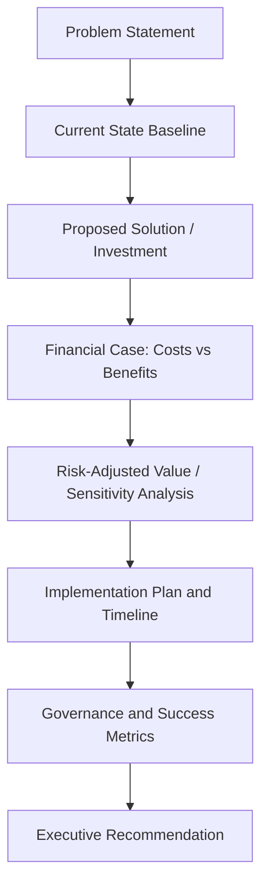

## Building the Business Case for SRM Investment

### Definition and Purpose

Building the business case for SRM investment is the structured process of translating supplier relationship management and dual sourcing initiatives into a quantified, risk-adjusted financial and strategic argument that secures executive and budgetary approval. Unlike routine procurement reporting, a business case must stand on its own as a decision document — it competes for capital against other corporate priorities and must be persuasive to audiences who may have limited procurement domain expertise.

### Why SRM Investment Requires a Distinct Business Case

SRM initiatives (dedicated headcount, technology platforms, dual sourcing programs, supplier development funding) often carry costs that are visible and immediate, while benefits are distributed, delayed, or partly defensive (risk avoided rather than cost saved). This asymmetry means SRM investment cannot rely on the same simple ROI framing used for revenue-generating projects.

**Key Points**

- SRM value is a mix of hard savings, cost avoidance, and risk mitigation — each requires different evidentiary standards
- Dual sourcing investment in particular is often risk-justified rather than savings-justified, which changes how the case must be built
- Business cases compete for capital against other functions; SRM must translate procurement language into CFO/board language
- A business case that omits counterfactual/downside scenarios is inherently weaker and more easily challenged

### Core Components of an SRM Business Case

#### 1. Problem Statement

Clearly articulate the pain point in business terms, not procurement jargon. "We have 73% single-source dependency in critical components, exposing $40M in annual revenue to supply disruption" is more persuasive than "Our supplier base lacks diversification."

#### 2. Current State Baseline

Establish quantified current performance — cost of the status quo, frequency of past disruptions, current spend under managed SRM programs, and existing dual sourcing coverage ratio. This baseline is what all projected benefits will be measured against.

#### 3. Proposed Solution / Investment

Define specifically what is being requested: headcount, SRM technology platform, budget for qualifying secondary suppliers, supplier development program funding, etc. Vague asks ("more investment in SRM") rarely survive budget review.

#### 4. Financial Case

Quantify costs and benefits over a defined time horizon (typically 3–5 years for SRM/dual sourcing programs given qualification lead times).

#### 5. Risk-Adjusted Value

Because dual sourcing benefits are partly contingent (a disruption may or may not occur), the case should include expected-value framing alongside a straightforward savings case.

#### 6. Implementation Plan

Phased timeline with milestones, particularly important for dual sourcing where supplier qualification itself can take 6–18 months depending on category complexity.

#### 7. Governance and Success Metrics

Define how success will be measured and reported post-investment — this connects the business case forward to benchmarking and KPI tracking activities.

### Financial Justification Models

#### Direct Cost Savings / Avoidance

Straightforward reduction in unit cost, payment terms improvement, or avoided cost increases through competitive tension created by dual sourcing.

#### Cost Avoidance vs. Hard Savings

A critical distinction that finance stakeholders will scrutinize closely:

| Type | Definition | Example |
| --- | --- | --- |
| Hard savings | Realized reduction in actual spend, reflected in budget | Negotiated 8% unit price reduction |
| Cost avoidance | Prevented cost increase that would otherwise have occurred | Avoided a 12% price hike by activating a second qualified source |
| Risk-adjusted value | Expected value of avoided disruption cost | Probability-weighted cost of a potential single-source outage |

#### Risk-Adjusted / Expected Value Calculation for Dual Sourcing

A standard approach to quantifying the risk mitigation value of dual sourcing uses expected value:

$$EV_{risk} = P(disruption) \times C_{disruption} - C_{dual\_sourcing}$$

Where $P(disruption)$ is the estimated annual probability of a supply disruption in the single-source scenario, $C_{disruption}$ is the estimated total cost of that disruption (lost revenue, expedited freight, production downtime, contractual penalties), and $C_{dual\_sourcing}$ is the incremental annual cost of maintaining a qualified second source.

**Example**

A company estimates a 15% annual probability of a significant disruption event for a single-sourced critical component, with an estimated disruption cost of $5,000,000 (lost production, expedite fees, customer penalties). Maintaining a qualified secondary supplier costs $300,000 per year in incremental premium and qualification maintenance.

$$EV_{risk} = (0.15 \times \$5{,}000{,}000) - \$300{,}000 = \$750{,}000 - \$300{,}000 = \$450{,}000$$

This produces a positive expected annual value of $450,000 for the dual sourcing investment, which becomes a central figure in the business case even though no disruption may occur in any given year. [Inference] Executive audiences generally find this framing more persuasive than a qualitative risk statement alone, though its persuasiveness depends on the credibility of the underlying probability and cost estimates, which should be sourced from historical incident data or actuarial-style risk assessment wherever possible.

#### Return on Investment (ROI) and Payback Period

$$ROI = \frac{(Total\ Benefit - Total\ Cost)}{Total\ Cost} \times 100$$

$$Payback\ Period = \frac{Initial\ Investment}{Annual\ Net\ Benefit}$$

**Example**

An SRM technology platform investment costs $600,000 to implement plus $150,000 annually in licensing/maintenance. It is projected to generate $400,000 annually in savings through improved supplier performance management and reduced maverick spend.

- Total 3-year cost: $600,000 + (3 × $150,000) = $1,050,000
- Total 3-year benefit: 3 × $400,000 = $1,200,000
- 3-year ROI: $(\$1{,}200{,}000 - \$1{,}050{,}000) / \$1{,}050{,}000 \times 100 \approx 14.3\%$
- Payback period: $600,000 / ($400,000 − $150,000) = 2.4 years

### Sensitivity Analysis

Because SRM business cases often rest on estimated probabilities and projected savings, presenting a range rather than a single point estimate strengthens credibility.

| Scenario | Disruption Probability | Expected Annual Value |
| --- | --- | --- |
| Conservative | 8% | $100,000 |
| Base case | 15% | $450,000 |
| Aggressive | 25% | $950,000 |

Presenting all three scenarios, rather than only the most favorable, signals analytical rigor and reduces the risk of the case being dismissed as overly optimistic during executive review.

### Non-Financial / Strategic Justifications

Not all SRM value is reducible to a dollar figure in the short term. These arguments should supplement, not replace, financial justification:

- **Resilience and business continuity**: alignment with enterprise risk management and business continuity planning objectives
- **ESG and compliance**: dual sourcing can reduce reliance on suppliers with weaker labor, environmental, or governance practices
- **Innovation access**: broader supplier relationships increase access to supplier-driven innovation and IP
- **Negotiating leverage**: competitive tension from a qualified second source frequently improves commercial terms even without switching volume
- **Regulatory and geopolitical exposure reduction**: particularly relevant for cross-border sourcing subject to tariffs, export controls, or sanctions risk

### Structuring the Business Case Document

A typical SRM investment business case follows this sequence:

1. Executive summary (one page, leads with the ask and the headline number)
2. Problem/opportunity statement with quantified baseline
3. Proposed solution and scope
4. Financial analysis (costs, benefits, ROI, payback, sensitivity)
5. Risk analysis (both the risk being mitigated and the risk of inaction)
6. Implementation roadmap and resource requirements
7. Success metrics and governance model
8. Recommendation and requested approval/decision

**Key Points**

- Executive summary should be readable and persuasive independent of the rest of the document — many approvers will only read this section
- Lead with the business problem, not the procurement solution
- Always include a "cost of inaction" scenario alongside the investment case
- Align requested metrics with what the organization will actually be able to track post-approval, to avoid credibility gaps later during benchmarking and reporting

### Common Pitfalls

- **Overstating certainty** in projected savings, which undermines credibility when actuals diverge from projections
- **Omitting implementation and change management costs**, leading to underestimated total cost of investment
- **Failing to address the "cost of inaction"** — the case should make clear what happens if the investment is not made
- **Using procurement-specific terminology** without translating to financial/strategic language executives use
- **Treating dual sourcing purely as a cost item** rather than integrating the risk-adjusted value calculation, which often makes or breaks approval

### Stakeholder Alignment Before Submission

**Next Steps**

- Pressure-test financial assumptions with Finance/FP&A before formal submission to preempt challenges during review
- Socialize the problem statement informally with key approvers ahead of the formal presentation
- Validate disruption probability and cost estimates against historical incident data or enterprise risk management records where available
- Align proposed success metrics with existing SRM benchmarking and scorecard frameworks so post-investment reporting is consistent
- Prepare a condensed one-page executive summary as a standalone leave-behind document

**Related Topics**

- Benchmarking Against Industry Standards
- Total Cost of Ownership (TCO) Analysis in Supplier Relationships
- Calculating and Reporting Supply Chain Risk Exposure
- ROI Modeling for Dual Sourcing Investments
- Supplier Scorecards and KPI Dashboards
- Enterprise Risk Management Integration with Procurement
- Presenting SRM Performance to the Board and C-Suite
- Change Management for SRM Technology Implementation