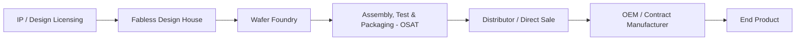
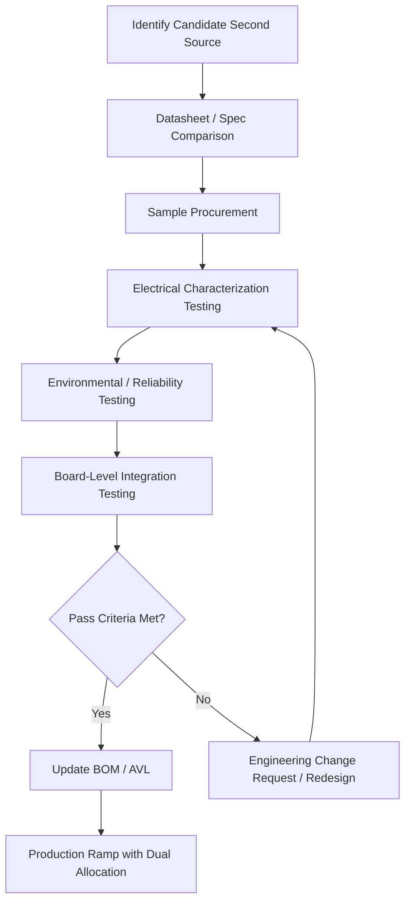

## Dual Sourcing in Electronics and Semiconductors

### Definition and Industry Context

Dual sourcing in electronics and semiconductors refers to the deliberate qualification and maintenance of two or more independent suppliers for a given component, die, package, or manufacturing process step, specifically to mitigate the unique supply risks that characterize the semiconductor and electronics value chain: extreme fabrication concentration, long lead times, high capital intensity, and geopolitical exposure.

This industry presents some of the most technically demanding dual sourcing scenarios of any sector because component substitution is rarely a drop-in commercial decision — it typically requires engineering validation, and in many cases, requalification of the entire end product.

### Why Electronics/Semiconductor Dual Sourcing Is Distinct

**Key Points**

- Wafer fabrication capacity is highly concentrated: a small number of foundries (e.g., leading-edge logic, advanced packaging) account for the majority of global advanced-node capacity, creating structural single-source risk at the industry level
- Component lead times can range from weeks (commodity passives) to 52+ weeks (specialized ASICs, advanced-node logic) during constrained periods
- Form-fit-function (FFF) equivalence between two manufacturers' parts is not guaranteed even for nominally identical part numbers due to process, die revision, or packaging differences
- Long product lifecycles in industrial, automotive, and aerospace electronics (10–20+ years) create sustained second-source requirements well beyond typical commercial electronics lifecycles
- Export control and geopolitical regulation (e.g., entity lists, tariffs) can eliminate a previously qualified source with little warning, distinct from ordinary commercial disruption risk

### The Semiconductor Supply Chain Structure

Dual sourcing can theoretically be applied at multiple points in this chain: the design/IP layer, the foundry layer, the OSAT (Outsourced Semiconductor Assembly and Test) layer, or the distribution layer. In practice, most electronics OEMs focus dual sourcing efforts at the component/part-number level (choosing between two manufacturers' equivalent parts) rather than attempting to dual-source a single manufacturer's foundry relationship, which is typically outside the OEM's direct control.

### Levels of Dual Sourcing in Electronics

#### 1. Form-Fit-Function (FFF) Equivalent Parts

Two different manufacturers produce parts that are electrically and mechanically interchangeable, allowing substitution with minimal or no redesign. Common for passive components (resistors, capacitors), standard logic, and commodity memory.

#### 2. Second Source Licensed/Cross-Licensed Parts

Historically common in early semiconductor industry practice (e.g., cross-licensing agreements between manufacturers to produce identical parts). Less common today outside specific defense/aerospace and automotive contexts, but still used for critical long-lifecycle programs.

#### 3. Pin-Compatible Alternatives

Parts from different manufacturers share a physical footprint and pinout but may differ in internal architecture, requiring firmware or driver-level validation even though no board redesign is needed.

#### 4. Functionally Equivalent, Non-Compatible Parts

Parts that perform the same function but require board redesign, firmware changes, or full requalification — the most resource-intensive dual sourcing category, typically reserved for the highest-risk single-source components.

#### 5. Foundry/OSAT Dual Sourcing

For fabless design companies, qualifying two independent foundries (or two process nodes at different foundries) to produce the same die design. This is the most technically complex and costly form of dual sourcing due to process-specific design rules, and is generally reserved for high-volume, high-criticality designs.

### Technical Qualification Process for a Second Source

#### Key Qualification Steps

1. **Datasheet and specification comparison**: Compare electrical parameters (voltage, current, timing, tolerances), package dimensions, and thermal characteristics against the incumbent part
2. **Sample procurement and initial bring-up**: Obtain engineering samples and verify basic functionality on a test board
3. **Electrical characterization**: Validate parametric performance across the full operating range (voltage, temperature, frequency) using bench and automated test equipment (ATE)
4. **Environmental and reliability testing**: Temperature cycling, humidity, vibration, and accelerated life testing (particularly critical for automotive/aerospace-grade qualification under standards such as AEC-Q100 for automotive ICs)
5. **Board-level integration testing**: Validate the part in situ on the actual end product, checking for signal integrity, EMI/EMC compliance, and interaction with adjacent components
6. **Approved Vendor List (AVL) update**: Formal addition to the bill of materials (BOM) as an approved alternate, often with allocation percentages defined (e.g., 70/30 primary/secondary split)

[Unverified] Specific qualification timelines vary substantially by component complexity and industry vertical; commodity passive components may qualify in weeks, while automotive-grade ASICs can require 12+ months of qualification testing, and these figures should be validated against current internal engineering data rather than treated as fixed industry constants.

### Industry Standards Relevant to Qualification

| Standard | Scope | Relevance to Dual Sourcing |
| --- | --- | --- |
| AEC-Q100/Q200 | Automotive-grade IC/passive component stress testing | Defines qualification rigor required before a second source can be approved for automotive BOMs |
| IPC-2221/IPC-6012 | PCB design and fabrication standards | Ensures board-level compatibility across component substitutions |
| JEDEC standards | Semiconductor device standards (package, electrical) | Provides baseline interoperability reference for FFF equivalence claims |
| MIL-STD-883 | Military/aerospace microelectronics test methods | Governs second-source qualification rigor for defense-grade components |
| ISO/TS 16949 (now IATF 16949) | Automotive quality management | Governs supplier qualification process documentation for automotive electronics |

### Strategic Considerations Specific to This Industry

#### Allocation Splitting

Rather than a binary primary/backup relationship, mature electronics dual sourcing programs often maintain an active volume split (e.g., 60/40 or 70/30) between two qualified suppliers. This keeps both relationships commercially active and the secondary supplier's tooling/process current, avoiding the risk of a "paper-qualified" backup that has not produced volume in years and may have drifted from its qualified state.

#### Die Revision and Process Node Risk

Even a single foundry's own product can present internal single-source risk if a design is tied to a specific process node facing end-of-life. Some dual sourcing strategies address this through **design portability** — architecting a chip design to be re-targetable to a second process node or foundry, distinct from simply qualifying an alternate manufacturer's existing part.

#### Distributor-Level Dual Sourcing

For OEMs without direct foundry relationships, an intermediate risk mitigation layer involves dual-sourcing through independent distributors in addition to authorized channels — though this introduces counterfeit risk and typically requires additional incoming inspection/authentication procedures.

#### Lifecycle and End-of-Life (EOL) Management

Given long product lifecycles in industrial and automotive electronics, dual sourcing strategy must account for component End-of-Life notices. A robust program tracks EOL/PCN (Product Change Notification) alerts across both primary and secondary sources and maintains a "last time buy" and requalification pipeline ahead of obsolescence.

### Example Scenario

**Example**

An industrial controls manufacturer relies on a microcontroller (MCU) family single-sourced from one semiconductor vendor. During a global chip shortage, lead times extend from 12 weeks to 52+ weeks, threatening production.

The company initiates second-source qualification for a pin-compatible MCU from an alternate vendor with a similar core architecture. The qualification process includes:

- Datasheet comparison confirming electrical and pinout compatibility
- Firmware porting and validation, since the alternate MCU uses a different peripheral register map despite pin compatibility
- Six weeks of environmental and EMC testing to confirm compliance with the product's existing certifications
- A limited production pilot run (5% of volume) before scaling to a 70/30 allocation split between the original and new vendor

Post-qualification, the company also updates its BOM documentation and AVL, and begins tracking EOL/PCN notices for both suppliers going forward. [Inference] Maintaining an active, even if minority, volume allocation with the secondary vendor rather than treating it as a pure paper-qualified backup reduces the risk of requalification drift, consistent with common practice in the industry, though outcomes depend on the specific components and vendors involved.

### Geopolitical and Export Control Considerations

Electronics and semiconductor dual sourcing increasingly incorporates geopolitical risk as a distinct qualification criterion, separate from ordinary commercial/technical risk:

- Diversifying suppliers across different jurisdictions to reduce exposure to a single country's export control regime or trade policy shifts
- Screening candidate second sources against restricted party/entity lists before initiating qualification investment
- Considering "friend-shoring" or "near-shoring" factors when the same design is available from foundries or OSATs in different regions
- Building contractual flexibility (e.g., alternate sourcing clauses) into long-term supply agreements to account for the possibility of future export control changes affecting either the primary or secondary source

### Common Pitfalls in Electronics Dual Sourcing

- **Assuming datasheet FFF equivalence guarantees board-level compatibility** without full electrical and thermal validation
- **Paper-qualifying a second source without active volume**, leading to process drift and de facto single-source risk despite formal AVL listing
- **Underestimating firmware/software validation effort** for pin-compatible but architecturally different components
- **Failing to track EOL/PCN notices** for the secondary source with the same rigor applied to the primary
- **Overlooking package-level differences** (e.g., moisture sensitivity level, thermal resistance) that affect reliability even when electrical specs match
- **Ignoring counterfeit risk** when sourcing through non-authorized distribution channels to achieve diversification

### Conclusion

Dual sourcing in electronics and semiconductors requires engineering-level qualification rigor that distinguishes it from dual sourcing in less technically constrained categories. Success depends on treating second-source qualification as an ongoing, actively maintained engineering and supply chain discipline — encompassing electrical/environmental validation, active allocation splitting, lifecycle/EOL monitoring, and geopolitical risk screening — rather than a one-time procurement exercise.

**Related Topics**

- Semiconductor Foundry Risk and Capacity Concentration
- Bill of Materials (BOM) and Approved Vendor List (AVL) Management
- Component Obsolescence and End-of-Life (EOL) Management
- Export Control Compliance in Global Supply Chains
- Automotive-Grade Component Qualification (AEC-Q100)
- Calculating and Reporting Supply Chain Risk Exposure
- Counterfeit Component Risk in Electronic Component Sourcing
- Supplier Segmentation Using the Kraljic Matrix