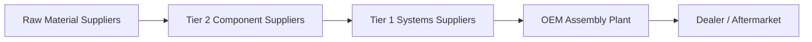
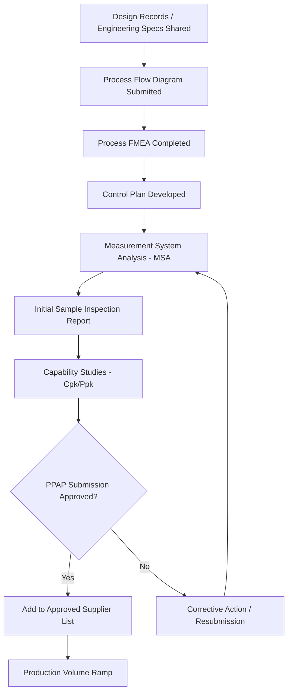

## Dual Sourcing in Automotive and Manufacturing

### Definition and Industry Context

Dual sourcing in automotive and manufacturing refers to the deliberate qualification and maintenance of two or more suppliers for critical parts, subassemblies, or raw materials within highly regulated, high-volume, safety-critical production environments. This industry combines the technical qualification rigor seen in electronics with additional layers of regulatory compliance, tooling investment, and just-in-time (JIT) production dependency that distinguish it from other sourcing contexts.

### Why Automotive/Manufacturing Dual Sourcing Is Distinct

**Key Points**

- Automotive production runs on just-in-time (JIT) and just-in-sequence (JIS) delivery models, meaning even short supply interruptions can halt assembly lines within hours
- Tooling and die investment for stamped, cast, or molded automotive parts is capital-intensive and supplier-specific, making second-source qualification more expensive than in most other industries
- Safety-critical components (braking, steering, airbags, powertrain) are subject to functional safety standards (e.g., ISO 26262) that impose significant qualification and documentation burden on any new source
- Long program lifecycles (typically 5–8 years of production plus post-production service parts support spanning a decade or more) require sustained second-source viability
- Production Part Approval Process (PPAP) requirements formalize and standardize the qualification evidence required before a new source can supply production volume

### The Automotive Supply Chain Structure

Dual sourcing decisions in this industry occur at multiple tiers: OEMs dual-source Tier 1 systems suppliers, Tier 1s dual-source Tier 2 component suppliers, and increasingly, OEMs perform "should-cost" visibility deeper into the chain (Tier 2/3) to identify hidden single-source dependencies that are not visible at the Tier 1 contract level alone.

### Categories of Dual Sourcing in This Industry

#### 1. Tooling-Duplicated Dual Sourcing

Identical tooling (dies, molds, fixtures) is built and maintained at two supplier locations (which may be two different suppliers, or two plants of the same supplier) to produce physically identical parts. This is the highest-assurance but also highest-cost form of dual sourcing due to duplicate capital investment.

#### 2. Form-Fit-Function Equivalent Parts

Two suppliers produce parts to the same engineering specification using their own tooling design, meeting the same fit and performance requirements without physically identical tooling. More common for non-safety-critical or lower-complexity parts.

#### 3. Raw Material / Commodity Dual Sourcing

Diversifying sources of raw inputs (steel, aluminum, semiconductors, battery-grade lithium/cobalt/nickel) across multiple suppliers or geographies, primarily to manage price volatility and geopolitical/geographic concentration risk rather than part-specific engineering risk.

#### 4. Capacity-Based Dual Sourcing (Split Award)

A single qualified part design is awarded to two suppliers from the outset of the program, with volume split by percentage (e.g., 60/40), rather than one supplier being qualified later as a backup to an existing incumbent.

#### 5. Geographic Dual Sourcing

Maintaining the same or equivalent part from suppliers in different regions/plants to mitigate against regional disruptions (natural disasters, labor actions, trade policy, energy disruptions) rather than supplier-specific business risk.

### Production Part Approval Process (PPAP) and Qualification

#### PPAP Elements Relevant to Second-Source Qualification

- **Design records and engineering change documentation**: The second source must produce parts against the identical current engineering revision level as the incumbent
- **Process Failure Mode and Effects Analysis (PFMEA)**: Identifies and documents potential failure modes in the second source's specific manufacturing process, which may differ from the incumbent's even for a "form-fit-function" equivalent part
- **Control plans**: Document the in-process quality controls the second source will use, which must meet or exceed the incumbent's control plan rigor
- **Measurement System Analysis (MSA)**: Confirms the second source's measurement/gauging systems produce statistically reliable data (Gage R&R studies)
- **Process capability studies (Cpk/Ppk)**: Statistical evidence that the second source's process consistently produces parts within specification

$$C_{pk} = \min\left(\frac{USL - \mu}{3\sigma}, \frac{\mu - LSL}{3\sigma}\right)$$

Where $USL$ and $LSL$ are the upper and lower specification limits, $\mu$ is the process mean, and $\sigma$ is the process standard deviation. Automotive OEMs typically require a minimum $C_{pk}$ threshold (commonly 1.33 or higher for critical characteristics) [Unverified] as this threshold varies by OEM-specific quality requirements and part criticality classification, and should be confirmed against the specific customer-specific requirements (CSRs) applicable to the program.

### Functional Safety Standards Relevant to Qualification

| Standard | Scope | Relevance to Dual Sourcing |
| --- | --- | --- |
| ISO 26262 | Functional safety for road vehicle electrical/electronic systems | Governs qualification burden for safety-critical electronic/software components; second sources for ASIL-rated parts require equivalent safety case documentation |
| IATF 16949 | Automotive quality management system standard | Baseline quality system certification typically required of any approved automotive supplier, incumbent or second source |
| AIAG PPAP Manual | Defines PPAP submission levels and requirements | Standardizes the qualification evidence package required across the industry |
| AIAG FMEA Handbook | Failure mode and effects analysis methodology | Referenced in second-source PFMEA development |
| ISO/SAE 21434 | Cybersecurity engineering for road vehicles | Increasingly relevant for dual-sourcing electronic control units (ECUs) and connected components |

### Strategic Considerations Specific to This Industry

#### Tooling Ownership and Portability

A central strategic decision in automotive dual sourcing is tooling ownership. When the OEM or Tier 1 owns the tooling (rather than the supplier), tooling can be physically relocated to a second-source facility during a disruption, substantially reducing switchover time. Supplier-owned tooling arrangements are cheaper upfront but constrain the speed and feasibility of activating a second source.

#### Split Award vs. Backup Qualification

Split award (dual sourcing from program launch) provides continuously validated production-scale capability at both suppliers but sacrifices the volume-based pricing leverage of single-source consolidation. Backup qualification (qualifying a second source without ongoing volume) is cheaper to maintain but carries the "paper qualification drift" risk common across industries — a backup source that has not run production volume may fail to perform when activated under pressure.

#### JIT/JIS Risk Amplification

Because automotive assembly typically holds minimal buffer inventory, the financial and operational impact of a single-source disruption is amplified relative to industries with larger safety stock buffers. This changes the risk-adjusted value calculation used in dual sourcing business cases (see Building the Business Case for SRM Investment), often justifying dual sourcing investment even for components with comparatively low disruption probability.

#### Battery and EV Supply Chain Considerations

The shift to electric vehicles has introduced new dual sourcing complexity around battery cells, battery-grade raw materials, and power electronics — categories with concentrated global supply, long qualification cycles (cell chemistry and format changes require extensive validation), and significant geopolitical exposure tied to critical mineral sourcing regions.

### Example Scenario

**Example**

A Tier 1 automotive supplier produces a stamped steel bracket for an OEM's vehicle platform, single-sourced from one stamping facility. Following a regional flooding event that halted production at a competitor's nearby facility, the OEM mandates a dual sourcing review across its supply base.

The Tier 1 initiates second-source qualification at an alternate stamping facility (a second plant within its own network in a different region):

- Duplicate stamping dies are fabricated using the OEM-owned tooling design, ensuring dimensional identicality
- A full PPAP Level 3 submission is completed, including PFMEA, control plan, MSA, and capability studies demonstrating $C_{pk} \geq 1.33$ on all critical dimensions
- An initial pilot run of 500 units undergoes full dimensional and material certification review before approval
- Following approval, the OEM mandates an active 80/20 volume split between the original and new facility to maintain ongoing process validation at both sites, rather than treating the second facility as a dormant backup

[Inference] Requiring an active minority volume allocation, rather than a purely dormant backup qualification, is a common mitigation against the process drift risk associated with infrequently-run tooling, consistent with practices described across automotive quality management literature, though the specific volume split threshold varies by OEM and component criticality.

### Common Pitfalls in Automotive/Manufacturing Dual Sourcing

- **Assuming FFF equivalence eliminates PPAP requirements** — automotive OEMs generally require full or partial PPAP resubmission for any new source regardless of design similarity to the incumbent
- **Underestimating tooling lead time** for duplicate die/mold fabrication, which can take many months and delay dual sourcing activation when needed most
- **Overlooking Tier 2/3 single-source dependencies** hidden beneath an apparently diversified Tier 1 supply base
- **Treating a backup source as production-ready without periodic revalidation**, risking process or material drift from the originally qualified state
- **Ignoring service parts/aftermarket lifecycle requirements**, which extend second-source support obligations years beyond the end of vehicle production
- **Underinvesting in raw material traceability**, particularly relevant for battery-grade materials subject to responsible sourcing and conflict minerals regulations

### Conclusion

Dual sourcing in automotive and manufacturing sits at the intersection of capital-intensive tooling decisions, formalized quality qualification (PPAP), and functional safety compliance, layered on top of the JIT/JIS production risk that amplifies the cost of any single-source disruption. Effective programs treat second-source qualification as a continuously maintained capability — supported by active volume allocation, tooling portability planning, and multi-tier supply chain visibility — rather than a static, one-time approval exercise.

**Related Topics**

- Building the Business Case for SRM Investment
- Production Part Approval Process (PPAP) Deep Dive
- Functional Safety Standards (ISO 26262) and Supplier Qualification
- Tooling Ownership Strategies in Automotive Sourcing
- Battery and EV Critical Mineral Supply Chain Risk
- Multi-Tier Supply Chain Visibility (Tier 2/3 Mapping)
- Calculating and Reporting Supply Chain Risk Exposure
- Supplier Segmentation Using the Kraljic Matrix