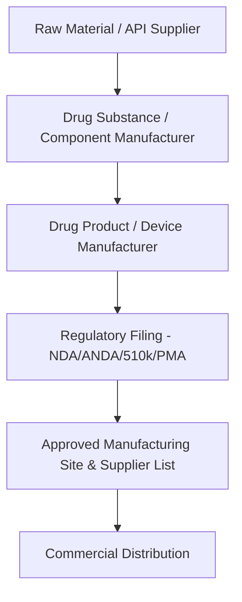
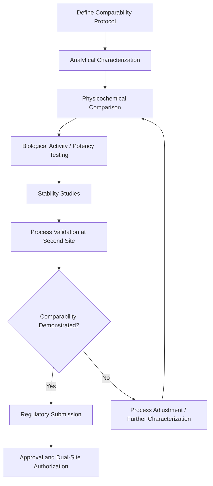

## Supply Resilience in Pharma and Medical Devices

### Definition and Industry Context

Supply resilience in pharmaceuticals and medical devices refers to the strategies and controls — including but not limited to dual sourcing — that ensure continuity of supply for products where interruption carries direct patient safety consequences, is subject to intense regulatory oversight, and often involves highly specialized, difficult-to-replicate manufacturing processes. This industry presents distinct resilience challenges compared to electronics or automotive because component/material substitution frequently requires regulatory re-approval, not just engineering revalidation.

### Why Pharma/Medical Device Resilience Is Distinct

**Key Points**

- Any change to an approved drug's manufacturing site, process, or raw material source may require regulatory filing and approval (e.g., FDA Prior Approval Supplement) before implementation — a fundamentally different qualification burden than commercial engineering revalidation
- Active Pharmaceutical Ingredient (API) manufacturing is highly geographically concentrated in specific regions, creating structural single-source risk at the industry level for many therapeutic categories
- Biologics and complex formulations can be process-dependent such that even an ostensibly "identical" second manufacturing site produces a product requiring comparability studies to demonstrate equivalence
- Medical device components (particularly implantables and Class III devices) carry design control and traceability requirements under quality system regulations that extend qualification burden to component-level sourcing
- Shortage of certain drugs or device components can have direct, immediate patient harm consequences, distinguishing the cost-of-disruption calculus from most other industries

### Regulatory Framework Overview

Once a manufacturing site, process, or key material source is named in an approved regulatory filing, changing or adding a second source is not purely a commercial/engineering decision — it requires navigating the applicable regulatory change control pathway, which varies by jurisdiction, product classification, and the significance of the proposed change.

### Regulatory Pathways Relevant to Second-Source Qualification

| Region/Body | Mechanism | Relevance to Dual Sourcing |
| --- | --- | --- |
| FDA (US) | Prior Approval Supplement (PAS), Changes Being Effected (CBE-30), Annual Report | Classifies manufacturing/site/material changes by risk level, determining pre-approval requirements before a second source can supply commercial product |
| EMA (EU) | Type IA/IB/II Variations | Similarly tiers changes by significance; Type II variations require full regulatory review before implementation |
| ICH Q7 | Good Manufacturing Practice for APIs | Establishes GMP expectations that any second-source API manufacturer must demonstrably meet |
| ICH Q12 | Lifecycle management / established conditions | Provides a more flexible framework for pre-approved change management, potentially easing multi-source qualification under specific conditions |
| FDA QSR / ISO 13485 | Medical device quality system regulation | Governs supplier qualification, design control, and traceability requirements for device component sourcing |

[Unverified] The specific classification of a given manufacturing or sourcing change (e.g., whether it requires prior approval versus a lower-tier notification) depends on product-specific regulatory history and jurisdiction-specific guidance current at the time of filing, and should always be confirmed with regulatory affairs specialists rather than assumed from general category descriptions.

### Categories of Supply Resilience Strategy in This Industry

#### 1. Dual/Multi-Source API or Raw Material Qualification

Qualifying and regulatory-filing two approved sources for a critical API or excipient, allowing the manufacturer to shift volume between sources in the event of a disruption at either.

#### 2. Dual Manufacturing Site Qualification (Same Owner)

A pharmaceutical company qualifies two of its own (or contract manufacturer's) facilities to produce the same drug product, providing site-level redundancy without introducing a third-party supplier relationship.

#### 3. Contract Manufacturing Organization (CMO/CDMO) Diversification

Rather than relying on a single Contract Development and Manufacturing Organization, qualifying two independent CDMOs capable of producing the same product, which requires each to independently pass regulatory inspection and comparability assessment.

#### 4. Strategic Inventory / Safety Stock Buffering

Given the qualification lead time for a true second source can span years, many resilience strategies rely heavily on strategic buffer inventory of finished product, API, or critical components as an interim or complementary mitigation.

#### 5. Device Component Dual Sourcing

For medical devices, particularly non-active components (housings, fasteners, packaging) with lower regulatory change burden than active/implantable components, dual sourcing more closely resembles the electronics/manufacturing qualification model (see related chapter items) layered with design control documentation requirements under 21 CFR 820 / ISO 13485.

### Comparability and Equivalence Requirements

For biologics and complex formulations in particular, demonstrating that a second source produces an equivalent product typically requires a **comparability study** rather than simple specification matching:

For small-molecule drug products, comparability is generally more tractable (bioequivalence studies, dissolution testing) than for biologics, where manufacturing process differences (cell line, bioreactor conditions, purification steps) can materially affect the final molecule's structure and function even when the target specification is nominally identical. [Inference] This is a primary reason biologics manufacturing exhibits lower rates of true multi-site/multi-source redundancy compared to small-molecule pharmaceuticals, consistent with general industry observation, though exact prevalence figures vary by therapeutic category and are not something that can be stated as a fixed industry-wide percentage without current sourcing.

### Risk-Adjusted Value Framing for Resilience Investment

The expected-value framework used broadly in dual sourcing business cases (see Building the Business Case for SRM Investment) applies with an important addition in this industry: patient safety and public health impact, which is difficult to monetize but is frequently a primary driver of investment approval independent of the financial calculation.

$$EV_{risk} = P(disruption) \times (C_{financial} + C_{patient\_impact\_adjusted}) - C_{resilience\_investment}$$

Where $C_{patient\_impact\_adjusted}$ may incorporate regulatory penalty exposure, reputational cost, and in some organizational frameworks, a structured assessment of clinical/public health consequence severity, distinct from the purely commercial disruption costs used in other industries.

### Example Scenario

**Example**

A generic pharmaceutical manufacturer sources a critical excipient from a single supplier whose manufacturing site is located in a region with recurring regulatory inspection issues. Following an FDA warning letter issued to that supplier, the manufacturer initiates a second-source qualification program:

- A candidate second supplier is identified and audited against GMP requirements (ICH Q7)
- Analytical comparison confirms the excipient meets identical compendial specifications (e.g., USP/EP monograph requirements)
- Three qualification batches are manufactured using the new excipient source and undergo full stability testing under ICH Q1A conditions
- A regulatory filing (Prior Approval Supplement, given the excipient's classification as a component of the approved manufacturing process) is submitted and approved before the second source may supply commercial product
- Post-approval, the manufacturer maintains a dual-source allocation, with periodic use of both suppliers to avoid "cold" qualification status at either

This example illustrates a case where the primary rate-limiting step is not the technical/analytical qualification itself but the regulatory approval timeline, which can extend the overall second-source activation timeline well beyond what the underlying science would otherwise require. [Unverified] Specific regulatory review timelines vary by agency, filing type, and current regulatory workload, and should be confirmed against current agency guidance rather than assumed from historical precedent.

### Common Pitfalls in Pharma/Medical Device Resilience

- **Underestimating regulatory filing timelines** when planning second-source activation, leading to gaps between technical readiness and legal ability to supply
- **Assuming specification match is sufficient** for biologics or complex formulations without accounting for comparability study requirements
- **Treating strategic inventory buffering as a substitute for, rather than a complement to, true multi-source qualification**, given the finite runway buffer stock provides
- **Overlooking upstream raw material/API concentration risk** while focusing dual sourcing efforts only at the finished product manufacturing level
- **Failing to maintain "warm" qualification status** at a regulatory-approved second source by using it only rarely, risking both process drift and potential loss of active regulatory standing in some jurisdictions
- **Insufficient supplier-level GMP audit cadence**, particularly for API sources in regions with variable inspection history

### Conclusion

Supply resilience in pharma and medical devices requires layering standard supply chain dual sourcing principles with a regulatory change-control dimension that has no direct analogue in most other industries. Effective resilience strategy treats regulatory filing timelines as a first-class constraint in qualification planning, combines multi-source qualification with strategic buffer inventory as complementary (not substitute) mitigations, and — particularly for biologics — invests in comparability science early given the extended qualification timelines the industry's technical and regulatory requirements impose.

**Related Topics**

- Building the Business Case for SRM Investment
- Good Manufacturing Practice (GMP) Supplier Auditing
- Regulatory Change Control for Pharmaceutical Manufacturing
- Active Pharmaceutical Ingredient (API) Supply Chain Concentration Risk
- Strategic Inventory and Safety Stock Optimization
- Calculating and Reporting Supply Chain Risk Exposure
- Supplier Segmentation Using the Kraljic Matrix
- Comparability Studies for Biologics Manufacturing