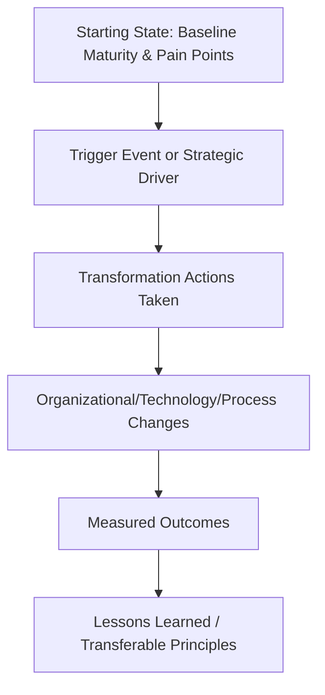

## SRM Transformation Case Studies

### Definition and Purpose

SRM transformation case studies are structured analyses of how organizations have redesigned their supplier relationship management function — spanning process, technology, organizational structure, and sourcing strategy — to move from transactional procurement toward strategic, value-generating supplier partnerships. This item synthesizes the composite patterns, methodologies, and lessons observed across publicly documented and commonly referenced SRM transformation narratives, rather than reproducing any single proprietary case verbatim.

### Why Transformation Case Studies Matter in This Curriculum

**Key Points**

- Case studies translate abstract SRM frameworks (segmentation models, maturity curves, governance structures) into observable sequences of decisions and outcomes
- They provide a vocabulary for communicating SRM value internally — "we followed a similar trajectory to companies that moved from tactical to strategic segmentation" is a persuasive, benchmarkable narrative
- Composite/synthesized patterns are used here because publicly disclosed, fully-detailed proprietary SRM transformations are relatively rare and often disclosed only partially (e.g., in analyst reports, conference presentations, or anonymized consulting case studies)
- [Unverified] Any specific company outcome figures referenced in this domain (e.g., percentage savings achieved, timeline to maturity) should be treated as illustrative of common patterns unless verified against a specific, current, cited source, since publicly available figures are often approximate, self-reported, or drawn from marketing material with limited independent verification

### The Common SRM Transformation Arc

Across widely referenced transformation narratives (from analyst firms such as Gartner and The Hackett Group, and consulting case publications from Deloitte, McKinsey, and KPMG), a recurring maturity arc emerges:

#### Stage 1: Transactional/Reactive

Procurement operates as an order-processing function with minimal supplier segmentation, fragmented supplier data, and purely price-driven negotiation. SRM as a discipline is effectively absent.

#### Stage 2: Consolidated/Process-Driven

The organization consolidates its supplier base, implements standardized processes (RFx, contract management), and begins basic performance tracking, but relationships remain largely arms-length.

#### Stage 3: Segmented/Strategic

Suppliers are formally segmented (e.g., via a Kraljic matrix approach), with differentiated engagement models for strategic versus transactional suppliers. Scorecards and QBRs are introduced for top-tier suppliers.

#### Stage 4: Collaborative/Value Co-Creation

Strategic suppliers are engaged in joint innovation, risk-sharing, and cost-reduction initiatives beyond the immediate contract scope. Dual sourcing decisions become proactive risk-management tools rather than reactive responses to disruption.

#### Stage 5: Integrated Ecosystem Partner

The most mature organizations treat top-tier suppliers as extensions of internal capability, with shared technology platforms, joint planning cycles, and co-investment in capacity or innovation.

### Common Transformation Triggers

Case studies across industries tend to cluster around a small number of recurring triggers that initiate SRM transformation:

| Trigger Category | Description | Common Industry Examples |
| --- | --- | --- |
| Supply disruption event | A major single-source failure exposes structural risk | Automotive/electronics chip shortage responses |
| M&A integration | Merging supply bases requires rationalization and new governance | Cross-industry, common in consumer goods and industrial sectors |
| Cost pressure cycle | Margin compression drives renewed focus on supplier-driven savings | Retail, manufacturing during economic downturns |
| Regulatory/compliance shift | New requirements (ESG, conflict minerals, cybersecurity) force supplier data maturity | Electronics, automotive, pharma |
| Digital transformation initiative | Broader ERP/procurement technology modernization creates the platform for SRM maturity gains | Cross-industry |

### A Structured Framework for Analyzing Transformation Case Studies

When evaluating or presenting a transformation case study, a consistent analytical structure improves comparability and learning transfer:

1. **Starting state**: Document baseline SRM maturity, key pain points, and quantified starting metrics (single-source ratio, savings rate, supplier satisfaction, etc.)
2. **Trigger**: Identify the specific event or strategic decision that catalyzed transformation
3. **Actions taken**: Detail specific interventions — segmentation redesign, technology platform adoption, governance restructuring, dual sourcing program launch
4. **Changes implemented**: Distinguish process changes, organizational/headcount changes, and technology changes, as these often require different investment cases
5. **Measured outcomes**: Quantify results against the baseline, ideally with a defined measurement period and methodology
6. **Transferable lessons**: Extract principles that generalize beyond the specific company/industry context, distinguishing them from context-specific factors that may not transfer

### Illustrative Composite Case Pattern: Manufacturing Sector

**Example**

A mid-size industrial equipment manufacturer (composite pattern drawn from commonly cited transformation narratives in this sector) begins with 40% of critical component spend concentrated in single-source relationships and no formal supplier segmentation. A significant supply disruption from a key casting supplier halts production for several weeks, triggering executive-sponsored SRM transformation.

**Actions taken over an 18-month period:**

- Implementation of a Kraljic-based segmentation exercise across the full supplier base
- Launch of a formal dual sourcing qualification program targeting the top 20 highest-risk single-source components
- Deployment of an SRM technology platform to centralize supplier performance scorecards
- Introduction of quarterly business reviews (QBRs) with the top 15 strategic suppliers
- Development of a risk-adjusted business case (using the expected-value framework covered under Building the Business Case for SRM Investment) to secure ongoing budget for the dual sourcing program

**Reported directional outcomes** (illustrative pattern, not a specific verified company figure):

- Meaningful reduction in single-source dependency ratio for the highest-risk component categories
- Improved on-time delivery performance following supplier scorecard-driven accountability
- A documented, board-reportable risk exposure reduction used in subsequent benchmarking communications (see Benchmarking Against Industry Standards)

[Speculation] The specific percentage improvements attributed to composite case patterns like this vary widely across real-world implementations depending on execution quality, supplier market conditions, and category-specific constraints; presenting a single "typical" outcome percentage would overstate the consistency of results actually observed across the industry.

### Recurring Success Factors Across Transformation Case Studies

- **Executive sponsorship**: Transformations with visible, sustained C-suite sponsorship are consistently cited as more likely to achieve lasting process change than procurement-led initiatives without broader organizational backing
- **Phased rather than "big bang" rollout**: Segmentation, technology, and governance changes implemented in sequence (rather than simultaneously) tend to reduce change-management risk
- **Data quality as a prerequisite**: Multiple case narratives emphasize that supplier master data cleanup was a necessary precursor to effective segmentation and scorecarding, often underestimated in initial project timelines
- **Metrics tied to business outcomes, not procurement activity**: Transformations that link SRM metrics to enterprise-level outcomes (revenue protection, risk exposure reduction) generate stronger ongoing executive support than those reporting only procurement-internal metrics

### Recurring Failure Patterns

- **Technology-first transformations without process/organizational change**: Deploying an SRM platform without redesigning segmentation, governance, or supplier engagement models frequently fails to produce proportionate value
- **Scorecard fatigue**: Overly broad scorecard rollout across the entire supplier base (rather than focused on strategic/critical suppliers) dilutes attention and supplier engagement
- **Loss of momentum after the triggering crisis fades**: Transformations initiated reactively following a disruption sometimes lose executive attention and budget once the immediate crisis is resolved, stalling progress before reaching the collaborative/strategic maturity stages
- **Underinvestment in supplier-side relationship management**: Treating transformation as a purely internal process change, without corresponding investment in how the organization is perceived and engaged with by its suppliers (see supplier-facing NPS and collaboration models)

### Using Case Studies to Strengthen Internal Business Cases

Transformation case studies serve a direct practical function beyond education: they provide externally-validated precedent that strengthens internal business cases and benchmarking narratives.

**Next Steps**

- Identify 2–3 transformation narratives from organizations of comparable size, industry, and starting maturity for use as reference points in internal business case documents
- Extract specific, attributable methodology elements (e.g., segmentation framework used, technology platform category, governance cadence) rather than relying on outcome percentages alone, which are harder to independently verify
- Cross-reference case study patterns against current benchmarking data (see Benchmarking Against Industry Standards) to validate whether cited outcomes remain representative of current industry performance
- Where possible, validate any cited case study figures against primary sources (company investor disclosures, named analyst reports) rather than secondary summaries, before using them in external-facing or board-level communication

**Related Topics**

- Benchmarking Against Industry Standards
- Building the Business Case for SRM Investment
- Supplier Segmentation Using the Kraljic Matrix
- SRM Technology Platform Selection and Implementation
- Change Management for SRM Technology Implementation
- Quarterly Business Reviews (QBRs) with Strategic Suppliers
- Presenting SRM Performance to the Board and C-Suite
- Supplier Scorecards and KPI Dashboards