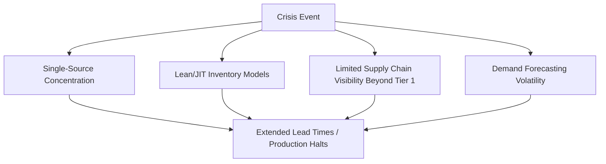

## Crisis Response: Pandemic and Chip Shortage Lessons

### Definition and Scope

This topic examines the supply chain crisis response patterns, structural vulnerabilities, and organizational lessons that emerged from two major, closely-spaced global disruptions: the COVID-19 pandemic supply chain crisis (2020–2022) and the global semiconductor shortage (2020–2023). Together these events serve as the most heavily analyzed real-world stress test of modern dual sourcing and SRM practices, and are widely referenced in industry post-mortems from analyst firms, industry associations, and academic supply chain research.

### Why These Two Events Are Studied Together

**Key Points**

- The pandemic and chip shortage were causally linked but analytically distinct: pandemic-driven demand shifts (e.g., surging consumer electronics and automotive demand rebound) directly triggered semiconductor capacity constraints, while pandemic-driven factory shutdowns independently disrupted broader manufacturing supply chains
- Both events exposed the same underlying structural vulnerability across industries: excessive reliance on single-source suppliers and lean/JIT inventory models optimized for cost efficiency rather than resilience
- The scale and simultaneity of disruption (affecting nearly all industries and regions concurrently) distinguished these events from more typical, localized single-source disruptions, providing an unusually broad dataset for cross-industry lessons
- [Unverified] Specific quantitative figures describing the scale of these disruptions (e.g., total industry revenue impact, specific shortage duration by component category) vary across sources and reporting methodologies; general directional lessons are well-supported, but precise figures should be sourced from current, specific reports rather than treated as fixed reference numbers

### Timeline of Key Disruption Phases

#### Phase 1: Initial Shutdown Shock (Early 2020)

Factory closures, particularly in initially affected regions, caused an immediate supply-side shock. Many organizations initially reduced orders in anticipation of demand collapse.

#### Phase 2: Demand Whiplash (Mid-to-Late 2020)

Consumer demand for electronics, home goods, and eventually automobiles rebounded faster and more sharply than most demand forecasting models anticipated, while suppliers who had reduced capacity in Phase 1 could not rapidly re-scale.

#### Phase 3: Semiconductor Capacity Reallocation

Automotive OEMs, having cancelled chip orders early in the pandemic anticipating reduced vehicle demand, found foundry capacity reallocated to consumer electronics customers who had not cancelled orders — a critical structural lesson about the consequences of demand-signal volatility in capacity-constrained industries.

#### Phase 4: Peak Shortage and Logistics Compounding

Semiconductor shortages compounded with broader global logistics disruption (port congestion, container shortages, freight cost spikes), creating a multi-layered supply crisis affecting lead times across nearly all manufactured goods categories.

#### Phase 5: Structural Response

Organizations and governments began longer-term structural responses: reshoring/friend-shoring initiatives, strategic domestic semiconductor manufacturing investment (e.g., legislative incentive programs in multiple regions), and widespread corporate adoption of formal dual/multi-sourcing programs.

### Core Structural Vulnerabilities Exposed

#### Single-Source Concentration

Organizations with concentrated single-source dependencies for critical components experienced disproportionately longer disruption durations than those with pre-existing dual/multi-source arrangements, reinforcing dual sourcing's role as a structural risk mitigation strategy rather than a discretionary cost optimization.

#### Lean/JIT Inventory Exposure

Decades of lean manufacturing and JIT inventory optimization, designed to minimize carrying cost, left minimal buffer to absorb even short-duration supply interruptions, amplifying the operational impact of disruptions that might have been readily absorbed under higher-buffer inventory models.

#### Limited Multi-Tier Visibility

Many organizations discovered they had good visibility into Tier 1 supplier risk but limited or no visibility into Tier 2/3 dependencies — meaning single-source concentration existed deeper in the supply chain even where Tier 1 relationships appeared diversified.

#### Demand Forecasting and Ordering Behavior Amplification

The automotive industry's chip order cancellation and subsequent scramble to reclaim capacity illustrated a classic bullwhip effect: demand signal volatility amplified as it propagated upstream through the supply chain, compounding the capacity allocation problem beyond the underlying real demand shift.

### Organizational Response Patterns Observed

| Response Category | Description | Representative Actions |
| --- | --- | --- |
| Emergency sourcing | Rapid, often costly, activation of alternate suppliers without full standard qualification | Expedited PPAP/qualification processes, spot-market purchasing at premium pricing |
| Inventory strategy shift | Moving from pure JIT toward "just-in-case" buffer models for critical items | Increased safety stock targets, strategic stockpiling of critical components |
| Structural dual sourcing investment | Formal, sustained qualification of second sources post-crisis | Dedicated budget and headcount for supplier diversification programs |
| Multi-tier visibility investment | Extending supply chain risk mapping beyond Tier 1 | Supply chain mapping technology, Tier 2/3 supplier disclosure requirements |
| Reshoring/regionalization | Shifting sourcing geography to reduce cross-border/long-distance dependency | Nearshoring initiatives, regional dual-source qualification |
| Direct capacity investment | Securing long-term capacity commitments or co-investing in supplier capacity | Long-term supply agreements, capacity reservation contracts, in some cases direct capital investment in supplier facilities |

### Lessons Specific to Semiconductor/Electronics Sourcing

Building on the technical dual sourcing considerations covered under Dual Sourcing in Electronics and Semiconductors, the chip shortage surfaced several category-specific lessons:

- **Capacity reservation matters more than price in constrained markets**: Organizations willing to commit to long-term capacity agreements (sometimes at premium pricing) secured supply ahead of those optimizing purely for unit cost
- **Order cancellation carries lasting relationship consequences**: Automotive OEMs that cancelled chip orders early in the pandemic experienced longer subsequent delays reclaiming foundry allocation, illustrating that supplier relationship equity has tangible value during capacity-constrained periods
- **Legacy/mature node capacity was as constrained as leading-edge capacity**: Many automotive and industrial chips rely on older process nodes that received less new capacity investment than leading-edge nodes, creating persistent shortage risk even after leading-edge capacity expanded
- **Design-level flexibility reduces future exposure**: Organizations that had architected products for component substitutability (rather than tightly coupling designs to single specific part numbers) were able to pivot to alternate components more quickly

### Lessons Specific to Broader Manufacturing/Automotive Sourcing

Building on considerations covered under Dual Sourcing in Automotive and Manufacturing:

- **Tooling portability proved valuable in practice**, with OEM-owned tooling enabling faster activation of alternate production sites compared to supplier-owned tooling arrangements
- **Multi-tier mapping exercises initiated during the crisis often revealed previously unknown single-source dependencies**, prompting many organizations to institutionalize ongoing Tier 2/3 visibility programs rather than treating it as a one-time crisis response exercise
- **Regional disruption risk (not just supplier-specific risk) drove renewed interest in geographic dual sourcing**, distinct from purely commercial supplier diversification

### Framework for Post-Crisis Organizational Learning

**Example**

A consumer electronics manufacturer that experienced significant production delays during the chip shortage conducted a structured post-crisis review using a framework broadly consistent with patterns observed across the industry:

1. **Root cause mapping**: Identified that 60% of the components causing production delays were single-sourced, despite an internal policy nominally requiring dual sourcing for "critical" components — revealing a gap between policy and enforcement rather than a policy design flaw
2. **Multi-tier visibility gap analysis**: Discovered several Tier 2 dependencies (specifically at the die/wafer level beneath apparently diversified Tier 1 module suppliers) that had not been previously mapped
3. **Inventory policy revision**: Shifted safety stock targets for a defined list of critical components from a pure JIT model to a buffer-based model, accepting higher carrying cost in exchange for reduced disruption exposure
4. **Institutionalized dual sourcing enforcement**: Implemented a formal governance gate requiring documented dual-source status (or an approved risk exception) before new product designs could be released to production
5. **Post-crisis benchmarking**: Used industry benchmarking data (see Benchmarking Against Industry Standards) to validate that the revised single-source dependency ratio was competitive with industry best-in-class peers

[Inference] The gap between stated dual sourcing policy and actual enforcement — as in the "critical component" example above — is a commonly cited root cause in post-crisis reviews across multiple industries, suggesting that governance and enforcement mechanisms are at least as important as the underlying sourcing strategy itself, though the specific prevalence of this gap across the broader industry has not been independently quantified here.

### Common Pitfalls in Crisis Response

- **Reactive, uncoordinated emergency sourcing** that bypasses normal qualification rigor, creating quality and compliance risk even as it addresses immediate supply continuity
- **Reverting to pre-crisis practices once the immediate disruption resolves**, losing the structural resilience investments made under crisis pressure (a pattern also noted under SRM Transformation Case Studies as a recurring failure mode)
- **Treating the crisis as unique/unrepeatable** rather than as a revealing stress test of structural vulnerabilities likely to recur in different form
- **Overcorrecting toward excessive inventory buffering** without corresponding investment in demand forecasting improvement, trading one form of inefficiency for another
- **Underinvesting in the organizational/governance mechanisms** (enforcement, exception tracking) needed to sustain dual sourcing policy compliance once crisis-driven urgency fades

### Conclusion

The pandemic and semiconductor shortage collectively functioned as an unusually broad, simultaneous stress test of global supply chain resilience assumptions, exposing single-source concentration, lean inventory exposure, and limited multi-tier visibility as recurring structural vulnerabilities across industries. The most durable organizational lessons center not merely on the specific mitigations adopted during the crisis, but on the governance and enforcement mechanisms needed to sustain those mitigations once the acute crisis pressure — and the executive attention it commands — inevitably recedes.

**Related Topics**

- Dual Sourcing in Electronics and Semiconductors
- Dual Sourcing in Automotive and Manufacturing
- SRM Transformation Case Studies
- Calculating and Reporting Supply Chain Risk Exposure
- Multi-Tier Supply Chain Visibility (Tier 2/3 Mapping)
- Strategic Inventory and Safety Stock Optimization
- Building the Business Case for SRM Investment
- Benchmarking Against Industry Standards