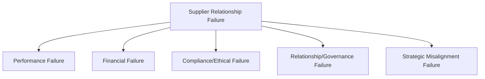
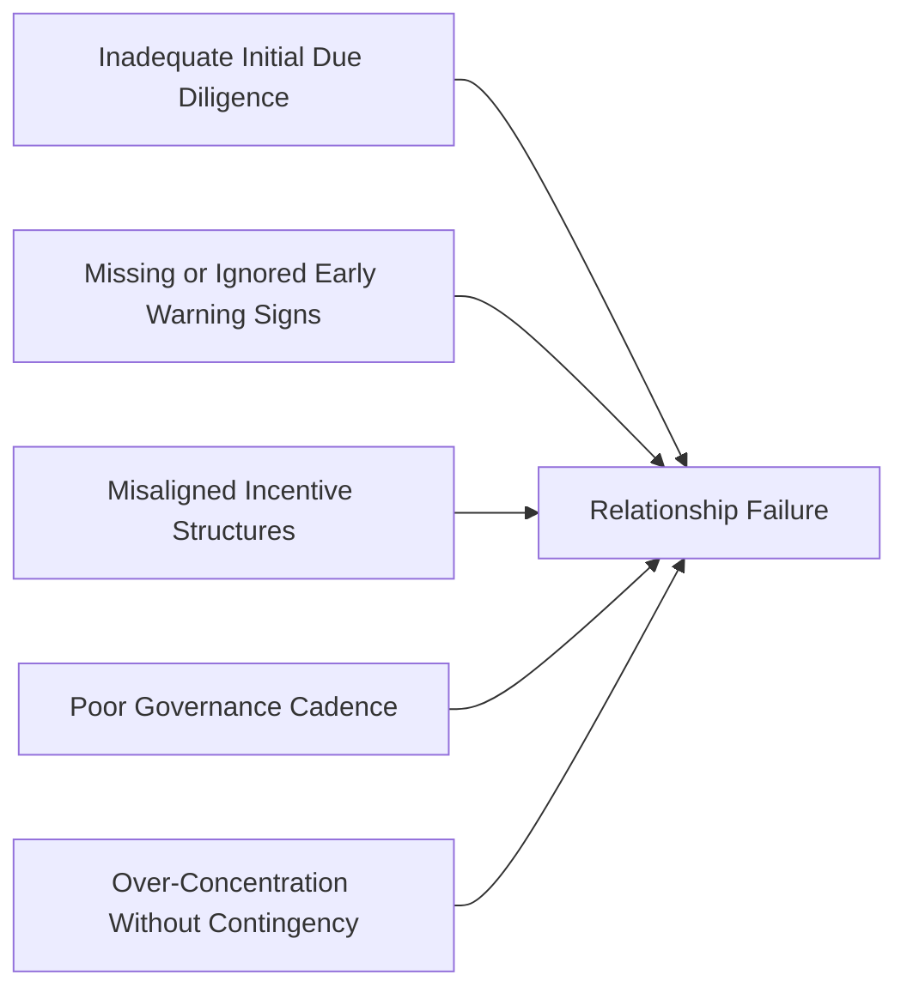
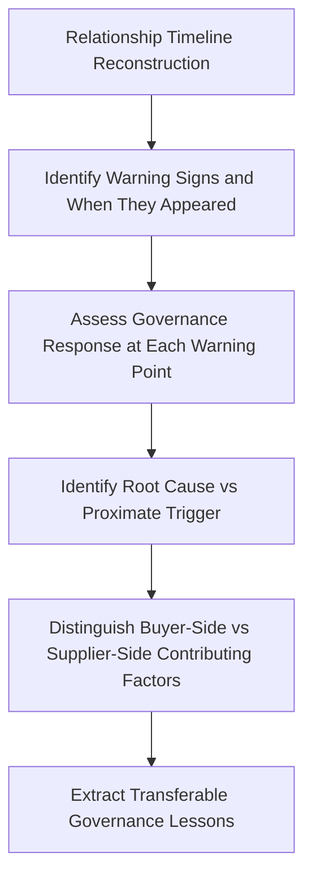

## Lessons From Supplier Relationship Failures

### Definition and Purpose

This topic examines the recurring patterns behind supplier relationship failures — situations where a supplier relationship deteriorated to the point of contract termination, litigation, supply disruption, or significant quality/compliance breakdown — and extracts transferable lessons for SRM and dual sourcing practice. Unlike the crisis case studies covering exogenous shocks (pandemic, chip shortage), this topic focuses on relationship failures that originate primarily from within the buyer-supplier relationship itself: governance breakdowns, misaligned incentives, poor communication, and inadequate risk monitoring.

### Why Studying Failure Is Distinct From Studying Success

**Key Points**

- Success case studies (see SRM Transformation Case Studies) tend to emphasize what organizations did well; failure analysis reveals what warning signs were present but not acted upon, which is often more directly actionable for risk management
- Failures are less frequently published in detail due to reputational and legal sensitivity, so lessons are often synthesized from anonymized consulting post-mortems, litigation records, regulatory findings, and academic supply chain failure research rather than a single well-documented source
- [Unverified] As with other composite-pattern content, specific company names and quantified outcomes are generally omitted or generalized here unless drawn from a clearly citable public source, since detailed failure accounts are often only partially disclosed publicly

### Categories of Supplier Relationship Failure

#### 1. Performance Failure

Chronic quality defects, missed delivery commitments, or capacity shortfalls that persist despite corrective action requests, often escalating from isolated incidents to systemic pattern.

#### 2. Financial Failure

Supplier insolvency, bankruptcy, or severe financial distress that disrupts supply regardless of relationship quality — frequently preceded by detectable financial warning signs that were not adequately monitored.

#### 3. Compliance/Ethical Failure

Labor practice violations, environmental non-compliance, conflict minerals sourcing issues, bribery/corruption, or falsified quality/certification documentation — failures that carry direct legal, regulatory, and reputational consequences for the buying organization, not just the supplier.

#### 4. Relationship/Governance Failure

Breakdown in communication, unclear escalation paths, contract ambiguity, or trust erosion that prevents effective issue resolution even when the underlying technical/commercial problem might otherwise have been manageable.

#### 5. Strategic Misalignment Failure

The buyer and supplier's strategic objectives diverge over time (e.g., the supplier deprioritizes the buyer's account in favor of larger customers, or the buyer's volume/technology needs outgrow the supplier's capability), leading to gradual relationship decay even without a discrete triggering incident.

### Common Root Cause Patterns Across Failure Types

#### Inadequate Initial Due Diligence

Failures frequently trace back to qualification-stage gaps: financial health not adequately assessed, capacity claims not independently verified, or compliance certifications accepted without audit. Weaknesses embedded at onboarding tend to surface later under stress rather than immediately.

#### Missing or Ignored Early Warning Signs

Post-mortem analyses commonly identify that warning indicators (declining on-time delivery trend, increasing quality escalations, key personnel turnover at the supplier, financial distress signals) were present well before the ultimate failure event but were not systematically tracked or escalated.

#### Misaligned Incentive Structures

Contract and commercial terms that reward the wrong behavior — for example, pure lowest-unit-cost award criteria that incentivize a supplier to cut corners on quality or capacity investment — are a recurring structural root cause distinct from any individual supplier's intent.

#### Poor Governance Cadence

Absence of regular structured review (QBRs, scorecarding) means that gradually deteriorating performance is not surfaced to decision-makers until it has become a crisis rather than a manageable trend.

#### Over-Concentration Without Contingency

Single-source dependency without an active or even paper-qualified backup transforms what might otherwise be a manageable supplier issue into a supply-continuity crisis, directly connecting failure analysis back to dual sourcing strategy.

### A Framework for Analyzing a Relationship Failure

A rigorous failure analysis distinguishes the **proximate trigger** (the immediate event that precipitated visible failure, e.g., a missed shipment or a failed audit) from the **root cause** (the underlying structural condition that made the relationship vulnerable to that trigger). This distinction matters because addressing only the proximate trigger without the root cause typically leaves the organization exposed to a similar failure with a different supplier.

### Illustrative Composite Pattern: Quality/Compliance Failure

**Example**

A consumer goods manufacturer discovers, through a customer complaint investigation, that a key ingredient supplier had been substituting a lower-cost alternative material without disclosure for several months — a material substitution that technically met the letter of the specification but violated the spirit of the supply agreement and created downstream quality inconsistency.

**Timeline reconstruction reveals:**

- The supplier's on-time delivery performance had improved notably in the months preceding discovery — a pattern later understood to be linked to reduced material cost enabling faster, less constrained production
- No independent material verification/testing program was in place; the buyer relied entirely on supplier-provided certificates of analysis
- The buyer's category manager had flagged a minor pricing anomaly (unusually stable input costs despite known market volatility in the underlying raw material) but this was not escalated or investigated further

**Root cause identified**: absence of independent incoming material verification for a "trusted," long-tenured supplier relationship, combined with an over-reliance on relationship tenure as a substitute for ongoing verification rigor.

**Transferable lesson**: Relationship tenure and historical trust, while valuable, should not fully substitute for periodic independent verification, particularly for compliance-sensitive or safety-critical materials — a pattern connecting to broader supplier risk monitoring practice. [Inference] This pattern — reduced verification rigor over time as trust in a long-tenured supplier increases — is a commonly cited theme in compliance failure post-mortems across industries, though the specific prevalence of this dynamic has not been independently quantified in this synthesis and should not be treated as a universal predictor of failure risk.

### Illustrative Composite Pattern: Financial Distress Failure

**Example**

A Tier 1 automotive supplier providing a specialized subassembly experiences declining financial health over an 18-month period, culminating in a sudden production stoppage when the supplier files for bankruptcy protection.

**Timeline reconstruction reveals:**

- Publicly available credit rating downgrades occurred approximately a year before the stoppage but were not systematically monitored by the buying organization's procurement team
- The supplier had requested several payment term extensions in the preceding months, a pattern that, in retrospect, was a clear financial distress signal
- No dual-source qualification existed for the subassembly, despite its criticality, because the part had been assessed as "low switching risk" based on technical complexity rather than supply continuity risk

**Root cause identified**: absence of ongoing financial health monitoring integrated into supplier risk management, combined with a segmentation framework that assessed switching difficulty without adequately weighting financial stability risk.

**Transferable lesson**: Supplier segmentation and dual sourcing prioritization frameworks should incorporate financial health monitoring as a distinct risk dimension, not merely technical/commercial switching cost, connecting directly to the risk-adjusted dual sourcing business case methodology.

### Governance Mechanisms That Mitigate Failure Risk

| Mechanism | Function | Connects To |
| --- | --- | --- |
| Supplier financial health monitoring | Ongoing tracking of credit ratings, payment behavior, public financial disclosures | Supplier segmentation and risk scoring |
| Independent material/quality verification | Periodic testing independent of supplier-provided certification | Compliance and quality risk management |
| Structured escalation pathways | Clear, documented process for elevating performance concerns before they become crises | Governance cadence, QBR structure |
| Early warning indicator tracking | Systematic monitoring of leading indicators (delivery trend, quality escalation rate, key personnel turnover) | Supplier scorecards and KPI dashboards |
| Contract terms aligned to shared incentives | Commercial structures that reward the behavior the buyer actually wants (quality, capacity investment) rather than purely lowest cost | Contract design and negotiation strategy |
| Dual sourcing as structural mitigation | Reduces the consequence severity of any single relationship failure | Dual sourcing qualification programs |

### Common Pitfalls in Learning From Failure

- **Treating each failure as an isolated, unrepeatable event** rather than extracting the structural governance gap that allowed it to occur
- **Focusing post-mortem analysis on assigning blame** rather than identifying systemic process improvements
- **Addressing only the proximate trigger** (e.g., terminating the specific failed supplier) without addressing the root cause (e.g., the segmentation or verification gap that allowed the failure to go undetected)
- **Failing to cascade lessons across the organization**, so a failure pattern identified in one category or business unit is not applied to similar risk exposures elsewhere
- **Underinvesting in the "boring" governance mechanisms** (financial monitoring, independent verification, escalation pathways) in favor of more visible initiatives, despite these mechanisms being the most commonly cited gap in failure post-mortems

### Conclusion

Supplier relationship failures, while individually varied in their proximate cause, exhibit recurring structural root causes: inadequate initial due diligence, ignored early warning signals, misaligned incentives, weak governance cadence, and unmitigated concentration risk. Systematic failure analysis — distinguishing root cause from proximate trigger — converts individual incidents into transferable governance improvements, reinforcing that dual sourcing and SRM maturity investments are best understood as structural risk mitigations rather than responses to any single anticipated failure mode.

**Related Topics**

- SRM Transformation Case Studies
- Crisis Response: Pandemic and Chip Shortage Lessons
- Supplier Segmentation Using the Kraljic Matrix
- Calculating and Reporting Supply Chain Risk Exposure
- Supplier Scorecards and KPI Dashboards
- Building the Business Case for SRM Investment
- Contract Design and Incentive Alignment in Supplier Agreements
- Quarterly Business Reviews (QBRs) with Strategic Suppliers