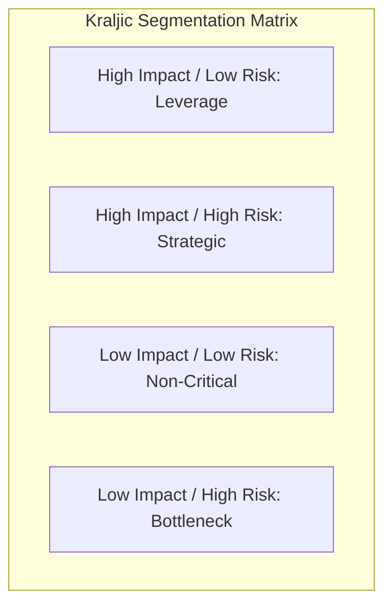
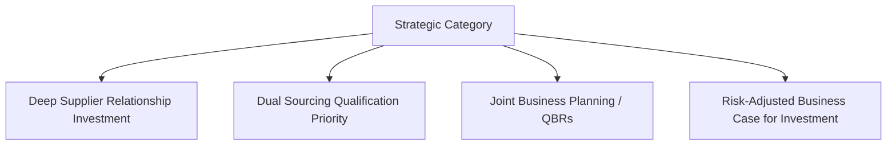
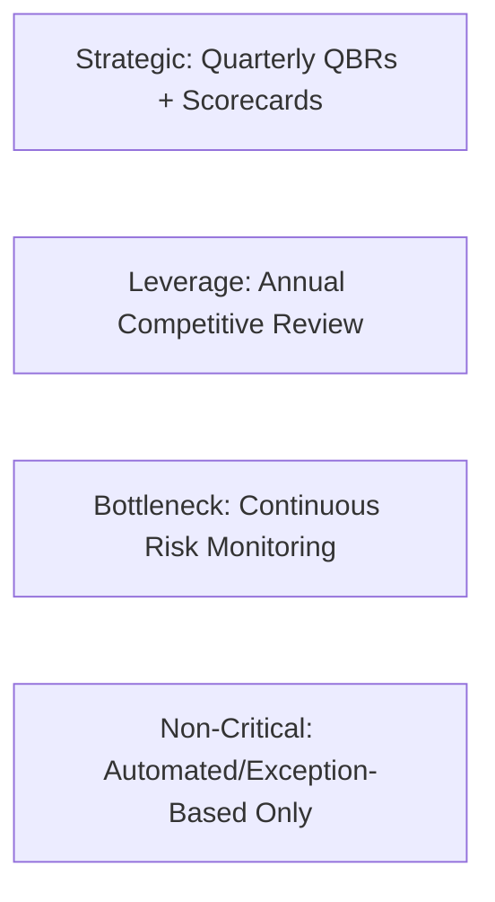

## Segmenting a Sample Category Portfolio

### Purpose and Scope

This capstone exercise applies category segmentation methodology to a representative multi-category spend portfolio, demonstrating the end-to-end process of classifying suppliers/categories, prioritizing dual sourcing investment, and deriving actionable strategic recommendations. It synthesizes segmentation theory (Kraljic-based frameworks) covered elsewhere in this curriculum into a worked, practitioner-style application.

### Segmentation Framework Recap

The Kraljic matrix classifies spend categories along two axes: **supply risk** (availability, number of suppliers, switching difficulty, geopolitical exposure) and **profit/business impact** (proportion of spend, effect on product quality/differentiation, revenue linkage).



| Quadrant | Supply Risk | Business Impact | Typical Strategy |
| --- | --- | --- | --- |
| Strategic | High | High | Deep partnership, dual sourcing, joint planning |
| Leverage | Low | High | Competitive bidding, consolidation, cost focus |
| Bottleneck | High | Low | Secure supply, qualify alternates, buffer stock |
| Non-Critical | Low | Low | Process efficiency, automation, catalog buying |

### Sample Category Portfolio

For this exercise, a representative mid-size industrial manufacturer's spend portfolio is used, spanning eight categories with varying risk and impact profiles.

| Category | Annual Spend | # Qualified Suppliers | Switching Difficulty | Revenue Linkage |
| --- | --- | --- | --- | --- |
| Custom ASICs | $8.2M | 1 (single-source) | Very high (12–18 mo. requalification) | Direct — core product function |
| Precision Castings | $6.5M | 2 | High (tooling-dependent) | Direct — structural component |
| Office Supplies | $0.3M | Many | Very low | None |
| Packaging Materials | $2.1M | 4 | Low | Indirect |
| Specialty Polymers | $4.8M | 2 (regional concentration) | Medium-high | Direct — material property critical |
| Standard Fasteners | $1.2M | 8+ | Very low | Low |
| Contract Logistics | $3.6M | 3 | Medium | Indirect but high service impact |
| Facility Maintenance Services | $0.9M | Many | Low | None |

### Step 1: Plot Categories on the Matrix

```mermaid
quadrantChart is not used here; using flowchart representation
flowchart LR
    subgraph HighRisk["High Supply Risk"]
        S1[Custom ASICs]
        S2[Precision Castings]
        S3[Specialty Polymers]
    end
    subgraph LowRisk["Low Supply Risk"]
        L1[Contract Logistics]
        L2[Packaging Materials]
        L3[Standard Fasteners]
        L4[Office Supplies]
        L5[Facility Maintenance]
    end
```

**Resulting segmentation:**

- **Strategic (high risk, high impact)**: Custom ASICs, Precision Castings, Specialty Polymers
- **Leverage (low risk, high impact)**: Contract Logistics (moderate risk but treated as leverage given multiple qualified providers and high service impact)
- **Bottleneck (high risk, low impact)**: None clearly identified in this portfolio — a common finding in practice, since true bottleneck items are often low-visibility, low-spend categories not always captured in top-line spend analysis
- **Non-Critical (low risk, low impact)**: Office Supplies, Standard Fasteners, Packaging Materials, Facility Maintenance Services

**Key Points**

- The absence of an identified Bottleneck category is itself a notable finding, not an oversight — it often indicates the analysis has not gone granular enough. A follow-up review at the SKU/part-number level (rather than category level) frequently surfaces bottleneck items hidden within otherwise low-risk categories, such as a single obscure fastener size sourced from only one supplier
- Standard Fasteners and Packaging Materials, despite modest individual switching risk, should still be periodically re-evaluated, since low-risk classifications can shift if supplier consolidation occurs in a given market

### Step 2: Apply Differentiated Strategies by Quadrant

#### Strategic Quadrant: Custom ASICs, Precision Castings, Specialty Polymers



- **Custom ASICs** (single-sourced, highest switching difficulty): Prioritized as the top dual sourcing investment target given the combination of single-source status and direct revenue linkage. Following the qualification approach detailed under Dual Sourcing in Electronics and Semiconductors, this category warrants the highest qualification budget allocation despite extended (12–18 month) timelines.
- **Precision Castings** (already dual-sourced with 2 suppliers): Focus shifts from initial qualification to relationship deepening — active volume allocation monitoring, joint cost-reduction initiatives, and tooling portability assessment (see Dual Sourcing in Automotive and Manufacturing).
- **Specialty Polymers** (2 suppliers but regionally concentrated): Flagged for geographic diversification review — the existing dual-source count meets a nominal target, but regional concentration represents an underlying risk not captured by supplier count alone.

#### Leverage Quadrant: Contract Logistics

- Strategy centers on competitive tension and cost optimization rather than dual sourcing investment, since multiple qualified providers already exist
- Periodic competitive re-bidding, consolidation opportunities, and service-level benchmarking are prioritized over deep relationship investment

#### Non-Critical Quadrant: Office Supplies, Standard Fasteners, Packaging Materials, Facility Maintenance

- Strategy centers on process efficiency: catalog/punch-out purchasing, purchase order automation, and minimizing transaction cost rather than active supplier relationship management
- Dual sourcing investment is generally not warranted given low business impact, except where a specific SKU-level bottleneck is identified during granular review

### Step 3: Prioritize Dual Sourcing Investment Using Risk-Adjusted Value

Applying the expected-value framework (see Building the Business Case for SRM Investment) to rank Strategic quadrant categories for dual sourcing investment prioritization:

$$EV_{risk} = P(disruption) \times C_{disruption} - C_{dual\_sourcing}$$

| Category | $P(disruption)$ | $C_{disruption}$ | $C_{dual\_sourcing}$ | $EV_{risk}$ |
| --- | --- | --- | --- | --- |
| Custom ASICs | 20% | $6,000,000 | $450,000 | $750,000 |
| Precision Castings | 10% | $2,500,000 | $180,000 | $70,000 |
| Specialty Polymers (geographic diversification) | 15% | $1,800,000 | $220,000 | $50,000 |

**Example**

Based on this ranked expected-value output, the capstone recommendation prioritizes investment in the order: Custom ASICs first (highest expected value and highest absolute revenue linkage), followed by Precision Castings relationship deepening, followed by Specialty Polymers geographic diversification. This ranking would be presented to executive stakeholders alongside the qualitative context that Custom ASICs also carries the longest qualification lead time (12–18 months), meaning it should be initiated first regardless of budget sequencing, since timeline — not just financial ranking — affects implementation order.

[Inference] Sequencing high-lead-time, high-expected-value categories first, even when budget constraints might otherwise suggest starting with a faster/cheaper category, is a commonly recommended practice in dual sourcing portfolio planning, since qualification lead time is often the binding constraint on risk reduction timing rather than budget itself.

### Step 4: Portfolio-Level Governance Design

Following segmentation, governance intensity should be differentiated by quadrant rather than applied uniformly:



| Quadrant | Recommended Governance Cadence | Rationale |
| --- | --- | --- |
| Strategic | Quarterly Business Reviews, formal scorecards | High business impact justifies intensive relationship management investment |
| Leverage | Annual/periodic competitive re-bidding | Competitive market dynamics, not relationship depth, drive value here |
| Bottleneck | Continuous risk/availability monitoring, lighter relationship investment | Focus on supply assurance rather than commercial optimization |
| Non-Critical | Exception-based only; automated processing | Governance investment here rarely justifies its cost given low impact |

### Common Pitfalls When Segmenting a Category Portfolio

- **Segmenting at too coarse a category level**, masking SKU/part-number-level bottleneck risk within an apparently low-risk category
- **Treating supplier count alone as a risk proxy** without considering geographic concentration, financial health, or capacity constraints among the counted suppliers (as with the Specialty Polymers example above)
- **Applying uniform governance intensity across all quadrants**, wasting relationship management resources on Non-Critical categories while under-resourcing Strategic ones
- **Failing to periodically re-segment**, since a category's risk/impact classification can shift due to market consolidation, technology change, or shifts in the organization's own product mix
- **Ranking dual sourcing investment by expected value alone without considering qualification lead time**, potentially delaying the initiation of long-lead-time categories that should be started first

### Conclusion

Segmenting a category portfolio translates abstract Kraljic methodology into a practical prioritization tool: differentiated governance and sourcing strategy by quadrant, dual sourcing investment ranked by risk-adjusted expected value, and awareness that granularity of analysis (category-level versus SKU-level) materially affects whether hidden bottleneck risks are surfaced. This worked example demonstrates the full pipeline from raw spend/risk data to an executive-ready, sequenced investment recommendation.

**Related Topics**

- Supplier Segmentation Using the Kraljic Matrix
- Building the Business Case for SRM Investment
- Dual Sourcing in Electronics and Semiconductors
- Dual Sourcing in Automotive and Manufacturing
- Calculating and Reporting Supply Chain Risk Exposure
- Quarterly Business Reviews (QBRs) with Strategic Suppliers
- Benchmarking Against Industry Standards
- Multi-Tier Supply Chain Visibility (Tier 2/3 Mapping)