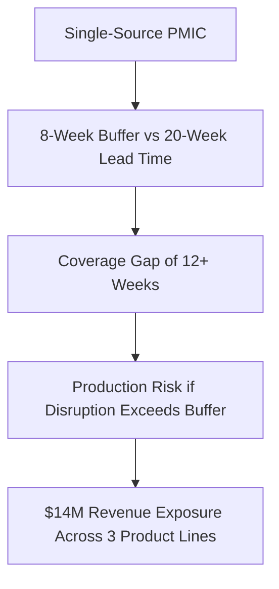
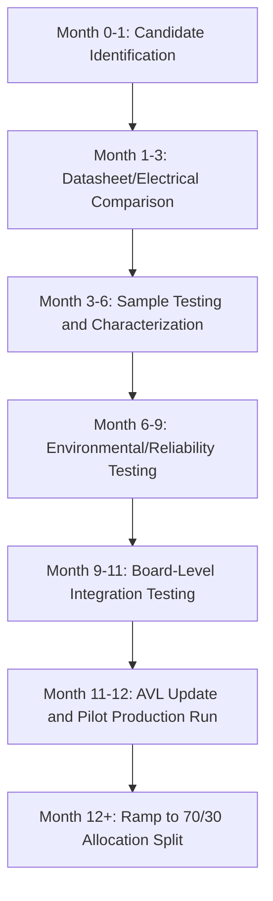

## Building a Dual Sourcing Business Case

### Purpose and Scope

This capstone exercise walks through the complete construction of a dual sourcing business case for a single, specific component — from problem framing through executive recommendation — applying the financial and strategic frameworks introduced under Building the Business Case for SRM Investment to a fully worked example. It demonstrates how to integrate quantitative risk modeling, sensitivity analysis, and non-financial justification into a single, decision-ready document.

### Scenario Setup

A mid-size industrial electronics manufacturer relies on a single-sourced power management integrated circuit (PMIC) used across three product lines, representing $14M in annual product revenue. The component is currently sourced exclusively from one semiconductor vendor, with a 20-week standard lead time.

**Baseline facts established during due diligence:**

- Annual spend on this component: $1.1M
- Current lead time: 20 weeks (standard), historically extending to 40+ weeks during industry-wide capacity constraints
- No qualified alternate source currently exists on the approved vendor list
- The vendor has experienced two prior allocation-driven delivery delays in the past three years, though neither resulted in a full production stoppage due to existing buffer inventory
- Buffer inventory currently covers approximately 8 weeks of consumption

### Step 1: Problem Statement

**Problem statement (as it would appear in the business case document):**

"A single-sourced PMIC, used across three product lines representing $14M in annual revenue, carries a lead time of 20 weeks against only 8 weeks of buffer inventory coverage. Two prior allocation-driven delays in the past three years demonstrate this is not a purely theoretical risk. A disruption exceeding buffer coverage would result in production stoppage across all three affected product lines."

**Key Points**

- The problem statement leads with the coverage gap (12+ weeks), not the abstract concept of "single-source risk," making the exposure concrete and measurable
- Citing the two prior delay incidents converts the risk from hypothetical to evidenced, strengthening the case's credibility
- Framing exposure in terms of revenue-linked product lines (rather than component spend alone) translates the ask into language executive stakeholders weigh most heavily

### Step 2: Quantify the Risk-Adjusted Value

Using the expected-value framework:

$$EV_{risk} = P(disruption) \times C_{disruption} - C_{dual\_sourcing}$$

**Estimating $P(disruption)$:** Based on two allocation-driven delay events in three years, a base-rate estimate of approximately 25–30% annual probability of a delay event exceeding current buffer coverage is used, cross-referenced against industry-wide semiconductor lead time volatility data (see Crisis Response: Pandemic and Chip Shortage Lessons for the broader context underpinning this estimate). [Unverified] This probability estimate is derived from a limited three-year observation window and should be treated as a working estimate rather than a statistically robust historical base rate; a more rigorous estimate would incorporate a longer observation period and vendor-specific capacity/allocation data where available.

**Estimating $C_{disruption}$:** Combines lost production value, expedited freight/premium sourcing costs during a scramble response, and estimated customer penalty/goodwill cost across the three affected product lines, estimated at $3.2M for a disruption event sufficient to halt production for the estimated gap period.

**Estimating $C_{dual\_sourcing}$:** Includes second-source qualification cost (engineering time, sample testing, environmental/reliability testing per the qualification process detailed under Dual Sourcing in Electronics and Semiconductors) plus ongoing incremental cost of maintaining an active dual-source allocation, estimated at $280,000 in year one (qualification) and $95,000 annually thereafter (ongoing dual-source premium).

**Year-one calculation:**

$$EV_{risk,\ year\ 1} = (0.275 \times \$3{,}200{,}000) - \$280{,}000 = \$880{,}000 - \$280{,}000 = \$600{,}000$$

**Steady-state annual calculation (year 2 onward):**

$$EV_{risk,\ steady\ state} = (0.275 \times \$3{,}200{,}000) - \$95{,}000 = \$880{,}000 - \$95{,}000 = \$785{,}000$$

### Step 3: Sensitivity Analysis

To address the inherent uncertainty in the probability estimate, three scenarios are presented rather than a single point estimate:

| Scenario | $P(disruption)$ | Year 1 $EV_{risk}$ | Steady-State $EV_{risk}$ |
| --- | --- | --- | --- |
| Conservative | 12% | $104,000 | $289,000 |
| Base case | 27.5% | $600,000 | $785,000 |
| Aggressive | 40% | $1,000,000 | $1,185,000 |

Even under the conservative scenario, the expected value remains positive, which strengthens the case by demonstrating the recommendation is not dependent on the most favorable assumption set.

### Step 4: Traditional ROI and Payback Framing

For stakeholders who prefer conventional ROI framing alongside the risk-adjusted view:

$$ROI = \frac{(Total\ Benefit - Total\ Cost)}{Total\ Cost} \times 100$$

Using a 3-year horizon and base-case assumptions:

- Total 3-year cost: $280,000 + (2 × $95,000) = $470,000
- Total 3-year expected benefit: 3 × $880,000 = $2,640,000
- 3-year ROI: $(\$2{,}640{,}000 - \$470{,}000) / \$470{,}000 \times 100 \approx 462\%$

[Unverified] This ROI figure represents expected (probability-weighted) value rather than guaranteed realized savings, and should be presented to stakeholders with that distinction explicit — a materially different framing from a hard-savings ROI calculation, since the benefit is contingent on disruption events that may or may not occur within the measurement period.

### Step 5: Non-Financial Justification

Supplementing the financial case with strategic arguments that do not reduce cleanly to the expected-value calculation:

- **Negotiating leverage**: Introducing a qualified second source is likely to improve commercial terms with the incumbent vendor even absent an actual switch of volume, since competitive tension alone often affects pricing and allocation priority during future constrained periods
- **Product roadmap flexibility**: A qualified second source may offer a path to alternate package options or feature variants relevant to future product line extensions, an option-value benefit not captured in the disruption-avoidance calculation alone
- **Alignment with existing risk policy**: If the organization has an internal target for dual-source coverage on critical components (see Segmenting a Sample Category Portfolio for how this component would be classified within a broader portfolio segmentation), this investment directly closes a compliance gap against that policy

### Step 6: Implementation Plan

The implementation plan mirrors the technical qualification process detailed under Dual Sourcing in Electronics and Semiconductors, with an estimated 12-month timeline to full dual-source production status, followed by an active allocation split (proposed at 70% incumbent / 30% new source) to avoid the paper-qualification drift risk noted elsewhere in this curriculum.

### Step 7: Governance and Success Metrics

Post-approval tracking metrics proposed in the business case:

- Dual-source qualification milestone completion against the 12-month plan
- Post-qualification allocation split compliance (target: maintain minimum 20% volume at secondary source to preserve active qualification status)
- Buffer inventory coverage improvement (target: reduce effective single-source exposure window from 12+ weeks to near zero once dual-source production is active)
- Incorporation of this component's dual-source status into the next scheduled category portfolio benchmarking review (see Benchmarking Against Industry Standards)

### Executive Summary (As It Would Appear in the Final Document)

**Example**

"This business case requests $280,000 in year-one investment to qualify a second source for a single-sourced PMIC currently exposing $14M in annual product revenue to a 12+ week supply coverage gap. Risk-adjusted analysis indicates a base-case expected annual value of $600,000 in year one and $785,000 annually thereafter, remaining positive even under a conservative disruption probability assumption. The component has already experienced two allocation-driven delays in the past three years. We recommend approval to begin the 12-month qualification process immediately, given semiconductor qualification lead times mean earlier initiation directly reduces the duration of current exposure."

### Common Pitfalls Addressed in This Worked Example

- **Avoided overstating certainty**: presenting a sensitivity range rather than a single confident point estimate for disruption probability
- **Avoided treating dual sourcing purely as a cost item**: leading with risk-adjusted value rather than only the qualification cost figure
- **Addressed the "cost of inaction"**: explicitly quantifying the exposure of continuing with the status quo rather than presenting the investment in isolation
- **Distinguished expected/probability-weighted value from guaranteed hard savings** in the ROI framing, preempting a likely stakeholder challenge during review

### Conclusion

This worked capstone example demonstrates the complete construction of a dual sourcing business case: a concrete, evidenced problem statement; a risk-adjusted expected-value calculation supported by sensitivity analysis; supplementary non-financial justification; a realistic, technically-grounded implementation timeline; and governance metrics that connect forward to ongoing benchmarking and portfolio segmentation practice. The structure and reasoning demonstrated here is directly transferable to other single-source component business cases across industries covered elsewhere in this curriculum.

**Related Topics**

- Building the Business Case for SRM Investment
- Dual Sourcing in Electronics and Semiconductors
- Segmenting a Sample Category Portfolio
- Calculating and Reporting Supply Chain Risk Exposure
- Benchmarking Against Industry Standards
- Crisis Response: Pandemic and Chip Shortage Lessons
- Presenting SRM Performance to the Board and C-Suite
- Supplier Scorecards and KPI Dashboards