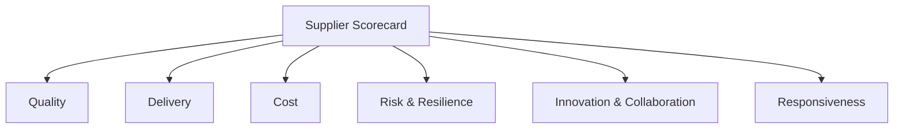
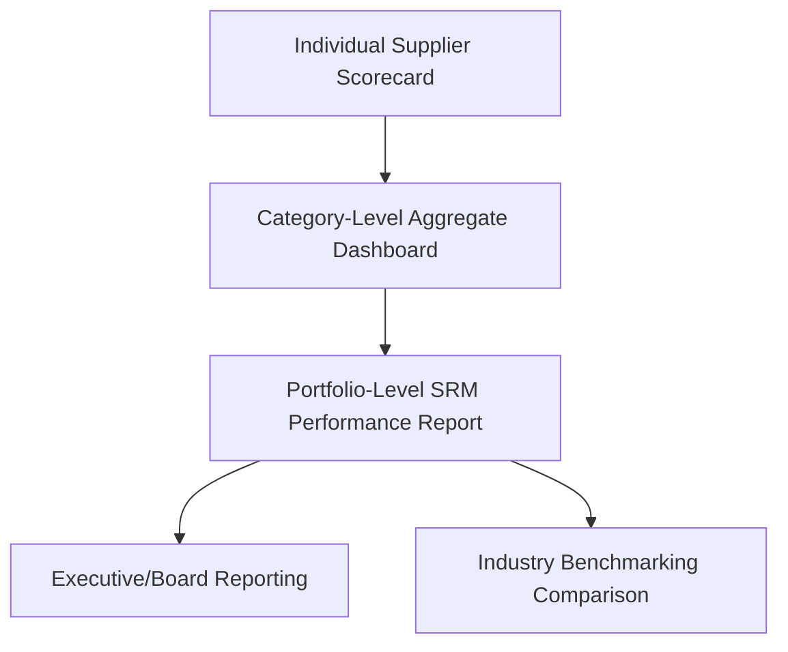

## Drafting a Supplier Scorecard and Governance Calendar

### Purpose and Scope

This capstone exercise walks through the design and construction of a complete supplier scorecard and its accompanying governance calendar for a strategic-quadrant supplier, applying segmentation and metric frameworks introduced earlier in this curriculum to a fully worked, practitioner-ready deliverable. It demonstrates how metric selection, weighting, scoring methodology, and review cadence combine into a functioning governance system rather than a static reporting template.

### Scenario Setup

Building on the Strategic quadrant classification established under Segmenting a Sample Category Portfolio, this exercise designs a scorecard for the Precision Castings supplier — a dual-sourced, high-impact category where the governance objective is relationship deepening and continued performance/risk monitoring, distinct from the qualification-stage focus applicable to a newly dual-sourced category like Custom ASICs.

### Step 1: Define Scorecard Objectives

**Key Points**

- A scorecard's design should follow directly from the supplier's segmentation classification — a Strategic-quadrant supplier warrants a comprehensive, multi-dimensional scorecard, while a Non-Critical supplier would not justify the same design effort (see governance cadence differentiation under Segmenting a Sample Category Portfolio)
- The scorecard must serve dual purposes: an internal performance management tool and an external relationship communication tool used directly in QBRs with the supplier
- Metric selection should avoid "vanity metrics" that are easy to track but do not drive decisions — every metric on the scorecard should have a defined action threshold

### Step 2: Select Scorecard Dimensions and Metrics

| Dimension | Metric | Definition | Data Source |
| --- | --- | --- | --- |
| Quality | Parts Per Million (PPM) defect rate | Defective units per million shipped | Incoming inspection records |
| Quality | First Pass Yield | % of lots passing inspection without rework | QA system |
| Delivery | On-Time, In-Full (OTIF) rate | % of orders delivered complete and on schedule | ERP/logistics data |
| Delivery | Lead time variance | Standard deviation of actual vs. quoted lead time | ERP order history |
| Cost | Year-over-year cost trend | % change in unit cost vs. prior period | Procurement/finance data |
| Cost | Cost reduction contribution | $ value of supplier-driven cost savings initiatives | Joint cost-reduction tracking |
| Risk & Resilience | Dual-source allocation compliance | Actual vs. target volume split (per the 70/30-style target) | Procurement/ERP allocation data |
| Risk & Resilience | Financial health indicator | Credit rating / payment behavior trend | Third-party financial monitoring service |
| Innovation & Collaboration | Joint improvement initiatives active | Count of active joint cost/quality/innovation projects | QBR tracking log |
| Responsiveness | Issue resolution cycle time | Average time from issue flagged to resolution confirmed | Corrective action tracking (CAPA log) |

[Unverified] The specific metric set and weighting appropriate for any given scorecard depends on category-specific priorities and should be validated against the organization's own segmentation and risk priorities rather than applied as a universal template.

### Step 3: Weighting and Scoring Methodology

A weighted scoring model converts multiple metrics into a single composite score for trend tracking and cross-supplier comparison, while preserving dimension-level detail for diagnostic purposes.

$$Composite\ Score = \sum_{i=1}^{n} (w_i \times s_i)$$

Where $w_i$ is the weight assigned to dimension $i$ and $s_i$ is the normalized score (typically 0–100) for that dimension.

**Proposed weighting for this Strategic-quadrant supplier:**

| Dimension | Weight | Rationale |
| --- | --- | --- |
| Quality | 25% | Direct product quality/safety linkage for a structural automotive component |
| Delivery | 25% | JIT production dependency amplifies delivery impact (see Dual Sourcing in Automotive and Manufacturing) |
| Cost | 15% | Important but secondary to quality/delivery given Strategic quadrant classification |
| Risk & Resilience | 20% | Elevated weighting reflects the dual-source allocation compliance priority established during business case approval |
| Innovation & Collaboration | 10% | Reflects relationship maturity aspiration without over-weighting a harder-to-quantify dimension |
| Responsiveness | 5% | Supporting indicator rather than primary performance driver |

**Example**

For a given quarter, the supplier records: Quality score 92, Delivery score 85, Cost score 78, Risk & Resilience score 95, Innovation score 60, Responsiveness score 88.

$$Composite = (0.25 \times 92) + (0.25 \times 85) + (0.15 \times 78) + (0.20 \times 95) + (0.10 \times 60) + (0.05 \times 88)$$

$$Composite = 23.0 + 21.25 + 11.7 + 19.0 + 6.0 + 4.4 = 85.35$$

A composite score of 85.35 would typically map to a "Meets Expectations, Trending Strong" rating tier, with the Innovation dimension (60) flagged as the specific area for QBR discussion despite the strong overall composite, illustrating why dimension-level visibility must be preserved alongside the composite figure rather than replaced by it.

### Step 4: Define Rating Tiers and Action Thresholds

| Composite Score Range | Rating Tier | Governance Action |
| --- | --- | --- |
| 90–100 | Preferred Partner | Eligible for expanded scope, long-term agreement consideration |
| 75–89 | Meets Expectations | Standard QBR cadence, monitor flagged dimensions |
| 60–74 | Improvement Required | Formal corrective action plan (CAPA) required, increased review frequency |
| Below 60 | At Risk | Executive escalation, contingency/dual-source activation review triggered |

Defining explicit action thresholds in advance — rather than deciding governance response ad hoc after scores are calculated — is what converts the scorecard from a passive reporting artifact into an active governance mechanism, directly addressing the "poor governance cadence" root cause pattern identified under Lessons From Supplier Relationship Failures.

### Step 5: Design the Governance Calendar

| Cadence | Activity | Participants | Purpose |
| --- | --- | --- | --- |
| Monthly | Scorecard data refresh and internal review | Category manager, quality/supply chain analysts | Early detection of trend deviations between formal QBRs |
| Quarterly | Formal Quarterly Business Review (QBR) | Category manager, supplier account team, relevant engineering/quality leads | Joint review of scorecard, open issues, and improvement initiatives |
| Semi-Annual | Strategic relationship review | Category manager, procurement leadership, supplier senior management | Broader relationship health, roadmap alignment, joint innovation pipeline review |
| Annual | Contract and relationship reassessment | Procurement leadership, legal, supplier executive sponsor | Contract terms review, segmentation reclassification check, multi-year planning |

**Key Points**

- Monthly internal review (without supplier participation) allows issues to be identified and internally prepared for before being raised externally, avoiding the appearance of reactive or unprepared QBR discussions
- Escalating cadence and seniority (monthly analyst-level → quarterly management-level → annual executive-level) mirrors the escalating stakes of each review type
- The annual reassessment should explicitly revisit the supplier's Kraljic quadrant classification, since segmentation is not static (see the re-segmentation pitfall noted under Segmenting a Sample Category Portfolio)

### Step 6: QBR Agenda Template

A standard QBR agenda derived from the scorecard structure ensures consistency across review cycles and supports trend comparison over time:

1. Scorecard review: composite score trend and dimension-level detail
2. Open corrective actions and issue resolution status
3. Dual-source allocation compliance review (for dual-sourced categories)
4. Cost trend and joint cost-reduction initiative status
5. Risk and resilience update (financial health, capacity, any emerging concerns)
6. Innovation/collaboration pipeline review
7. Action items and owners for the next period

### Step 7: Connecting the Scorecard to Broader SRM Reporting

The individual supplier scorecard feeds upward into portfolio-level and executive-level reporting:

Aggregated scorecard data across the Strategic quadrant supplier base provides the underlying evidence base for benchmarking exercises (see Benchmarking Against Industry Standards) and for ongoing business case reporting on realized versus projected value (connecting back to the risk-adjusted framework in Building a Dual Sourcing Business Case).

### Common Pitfalls in Scorecard and Governance Design

- **Designing an identical scorecard template for all suppliers regardless of segmentation**, producing either excessive administrative burden for low-priority suppliers or insufficient rigor for strategic ones
- **Omitting predefined action thresholds**, resulting in inconsistent governance response to similar score outcomes over time
- **Overloading the scorecard with metrics that lack a clear owner or action pathway**, leading to data collection effort that does not translate into decisions
- **Treating the scorecard as static** rather than revisiting weighting and metric selection periodically as category priorities shift
- **Holding QBRs without pre-review internal alignment**, resulting in the buying organization appearing disorganized or inconsistent in front of the supplier
- **Failing to connect scorecard trends to the original business case assumptions**, missing the opportunity to validate (or correct) the risk/value estimates used to justify the original dual sourcing investment

### Conclusion

A well-designed supplier scorecard and governance calendar operationalizes segmentation strategy into a recurring, action-oriented management system: metrics and weighting reflect the supplier's Kraljic classification, predefined thresholds convert scores into consistent governance response, and an escalating review cadence ensures issues are surfaced and addressed before they develop into the relationship failure patterns documented elsewhere in this curriculum. This worked example demonstrates a transferable template applicable to any Strategic-quadrant supplier relationship.

**Related Topics**

- Segmenting a Sample Category Portfolio
- Building a Dual Sourcing Business Case
- Lessons From Supplier Relationship Failures
- Benchmarking Against Industry Standards
- Quarterly Business Reviews (QBRs) with Strategic Suppliers
- Calculating and Reporting Supply Chain Risk Exposure
- Presenting SRM Performance to the Board and C-Suite
- Contract Design and Incentive Alignment in Supplier Agreements