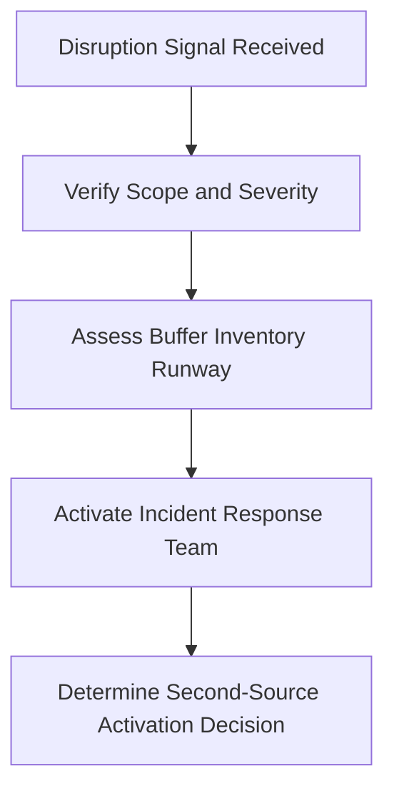
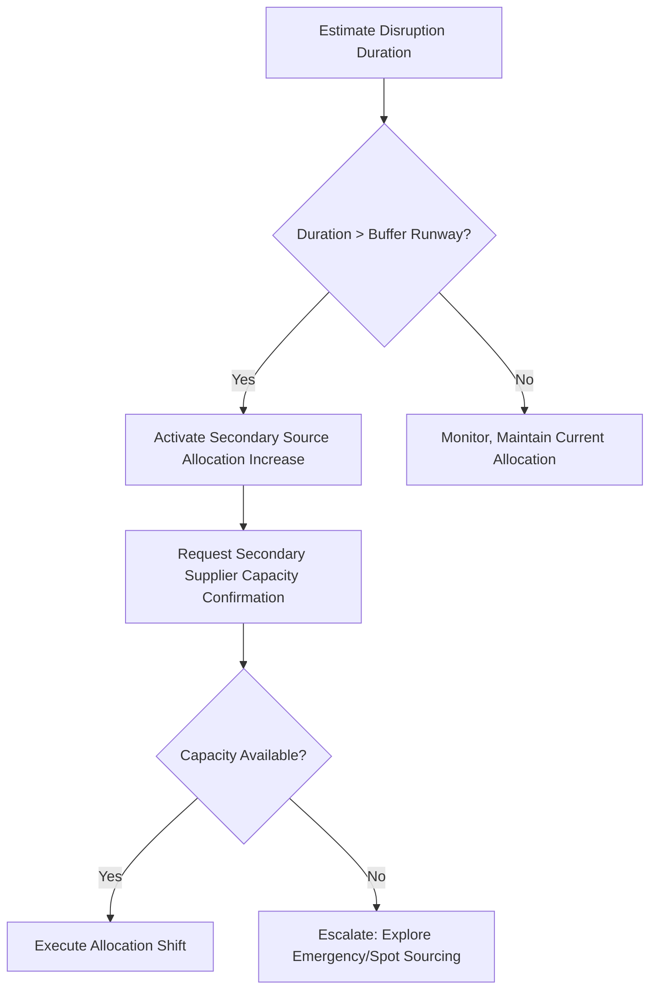
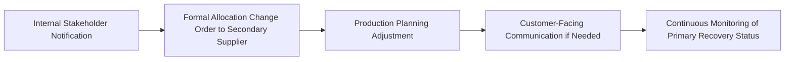
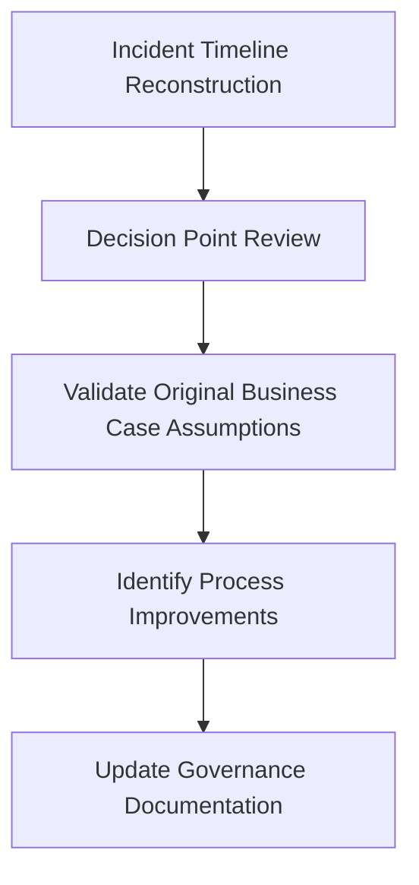

## Simulating a Disruption and Activating a Second Source

### Purpose and Scope

This capstone exercise walks through a simulated supply disruption event and the corresponding activation of a previously qualified second source, demonstrating the operational playbook that connects prior qualification investment (as built in Building a Dual Sourcing Business Case) to real-time crisis execution. It integrates lessons from Crisis Response: Pandemic and Chip Shortage Lessons and Lessons From Supplier Relationship Failures into a single worked incident response simulation.

### Scenario Setup

Continuing the PMIC scenario introduced in Building a Dual Sourcing Business Case, this simulation assumes the second-source qualification was completed on schedule, with the following state established at the time of the simulated disruption:

- Primary supplier: 70% allocation, 20-week standard lead time
- Secondary supplier (qualified 14 months prior): 30% allocation, 22-week standard lead time
- Current buffer inventory: 8 weeks of consumption coverage
- Simulated trigger event: the primary supplier's fabrication facility experiences an unplanned extended outage due to a regional power grid failure, with an initial estimated recovery timeline of "unknown, minimum 6 weeks"

### Step 1: Incident Detection and Initial Assessment

**Key Points**

- The first action upon disruption signal receipt is verification, not activation — false or overstated disruption signals are common in early crisis communication, and premature second-source activation carries its own switching and coordination costs
- Buffer inventory runway (8 weeks in this scenario) sets the decision clock: activation decisions must be made and executed well within this window, not at its expiration
- An incident response team with predefined roles (rather than ad hoc crisis assignment) is a governance element that should be established during the original qualification/business case phase, not improvised during the disruption itself

**Initial assessment findings:**

- Primary supplier confirms facility outage affecting the specific fabrication line producing this PMIC, with recovery timeline uncertain but "not expected before 6 weeks"
- At 70% primary allocation and an assumed near-total production halt at the primary supplier, the effective supply gap is estimated at approximately 70% of normal incoming volume for the duration of the outage
- Against 8 weeks of buffer inventory, a 6+ week primary outage at this severity creates a material risk of buffer depletion before primary supply resumes

### Step 2: Activation Decision Framework

Applying this framework to the scenario: the estimated disruption duration (6+ weeks, with acknowledged uncertainty) exceeds the buffer runway once the ~70% volume gap is factored in, triggering activation of increased secondary source allocation.

**Decision documented in the simulation:**

"Given a confirmed primary facility outage with a minimum estimated 6-week recovery and current buffer coverage of 8 weeks against a ~70% incoming volume reduction, effective coverage is reduced to approximately 2.7 weeks at current consumption. Secondary source activation is authorized immediately, with a target allocation shift to 80% secondary / 20% residual primary (pending primary recovery) for the duration of the disruption."

$$Effective\ Buffer\ Coverage = \frac{Buffer\ Inventory}{Consumption\ Rate \times (1 - Supply\ Reduction\ Fraction)}$$

$$Effective\ Coverage = \frac{8\ weeks}{1 \times (1 - 0)} \times (1 - 0.70) \approx 2.7\ weeks\ of\ full\text{-}rate\ coverage\ remaining\ at\ reduced\ input$$

[Unverified] This simplified effective-coverage calculation assumes constant consumption rate and a step-function supply reduction; real-world disruption modeling would typically incorporate more granular assumptions about partial primary supplier output during recovery ramp-up, which are omitted here for illustrative clarity.

### Step 3: Secondary Supplier Capacity Confirmation

Because the secondary source was qualified with an active 30% allocation (rather than left as a dormant paper qualification), this step benefits directly from the "avoid paper-qualification drift" principle emphasized under Dual Sourcing in Electronics and Semiconductors and Building a Dual Sourcing Business Case.

**Confirmation checklist executed in the simulation:**

- Secondary supplier confirms current production capacity and asks for updated demand forecast reflecting the proposed 80% allocation
- Secondary supplier's own lead time (22 weeks standard) is reviewed against current order pipeline — since the secondary relationship has been actively running production, no re-qualification or cold-start ramp-up delay is required, a direct payoff of maintaining active allocation rather than dormant backup status
- Secondary supplier confirms ability to increase output to the requested 80% allocation level within [Speculation] a shorter ramp period than a cold-start supplier would require, though the specific ramp timeline in this simulation would depend on the secondary supplier's own capacity headroom and is not assumed to be instantaneous

### Step 4: Execute Allocation Shift and Communicate

- **Internal notification**: Production planning, quality, and finance teams are notified of the allocation shift and any associated cost premium (secondary sourcing may carry a per-unit premium reflecting the dual-source agreement terms)
- **Formal allocation change order**: A documented purchase order/allocation change is issued to the secondary supplier reflecting the new 80% target
- **Production planning adjustment**: Manufacturing schedules are reviewed against the revised incoming supply timeline, incorporating the secondary supplier's 22-week lead time for any new orders beyond current pipeline
- **Customer communication**: If the anticipated disruption risks affecting customer-facing delivery commitments despite mitigation efforts, proactive communication is prepared — though in this scenario, the buffer and secondary activation combination is assessed as sufficient to avoid customer-facing impact if executed promptly
- **Continuous monitoring**: The incident response team maintains a recurring (e.g., weekly) check-in on primary supplier recovery status to inform the eventual allocation reversion timeline

### Step 5: Post-Disruption Reversion Planning

**Example**

Six weeks into the simulation, the primary supplier confirms facility restoration and a ramp back to normal production capacity over an additional 3-week period. The incident response team faces a reversion decision: whether to return immediately to the original 70/30 allocation split, or to evaluate whether the disruption experience warrants a revised steady-state allocation.

**Decision made in the simulation**: Rather than reverting immediately to the pre-disruption 70/30 split, the team recommends a revised steady-state allocation of 60/40 (primary/secondary), reflecting both the demonstrated reliability of the secondary supplier during the disruption and a policy preference for reduced primary concentration following a real-world stress test of the relationship. This recommendation is routed through the standard governance process (see Drafting a Supplier Scorecard and Governance Calendar) rather than implemented unilaterally, since it constitutes a change to established sourcing policy requiring appropriate sign-off.

### Step 6: Post-Incident Review

Following the incident, a structured post-incident review is conducted, applying the failure/incident analysis framework introduced under Lessons From Supplier Relationship Failures even though this incident originated from an exogenous event rather than a relationship failure:

- **Timeline reconstruction**: Documented from initial disruption signal through full resolution and reversion decision
- **Decision point review**: Assessed whether the activation decision was made promptly enough given the buffer runway, and whether the decision framework thresholds (buffer coverage vs. disruption duration) functioned as intended
- **Business case validation**: The original risk-adjusted business case projected a base-case annual disruption probability of 27.5% (see Building a Dual Sourcing Business Case); this incident is logged as a realized disruption event, updating the organization's empirical base rate for future business case estimates in this and similar categories
- **Process improvements identified**: In this simulation, the review identifies that the initial verification step (Step 1) took longer than optimal due to unclear internal escalation ownership, recommending a clarified incident response role assignment for future events
- **Governance documentation update**: The revised 60/40 allocation target and the incident outcome are incorporated into the next scheduled QBR agenda and scorecard risk dimension review

### Key Lessons Demonstrated by This Simulation

**Key Points**

- Active (rather than dormant) secondary source allocation directly enabled a fast activation response, avoiding the re-qualification delay that would apply to a cold-start backup supplier
- Predefined decision thresholds (buffer coverage vs. disruption duration) allow activation decisions to be made quickly under uncertainty, rather than requiring extended deliberation during the incident itself
- Real disruption events provide empirical data that should feed back into the original risk-adjusted business case assumptions, closing the loop between projected and realized value
- Reversion decisions following a disruption are themselves strategic decisions warranting governance review, not merely an automatic return to pre-disruption status quo
- Post-incident review connects operational crisis response back to the broader governance and business case documentation, ensuring the lessons are institutionalized rather than lost once the immediate crisis resolves

### Common Pitfalls in Disruption Response Execution

- **Delayed verification-to-activation cycle** due to unclear incident response ownership, consuming buffer runway before a decision is made
- **Treating secondary source activation as a purely operational/logistics decision** without the governance documentation needed to inform future business case and scorecard updates
- **Automatic reversion to pre-disruption allocation** without evaluating whether the incident provides evidence to justify a revised steady-state sourcing policy
- **Failing to update the original business case's probability assumptions** with the realized incident data, missing the opportunity to refine future risk-adjusted calculations
- **Under-resourcing the post-incident review** once the immediate operational crisis is resolved, losing the opportunity for institutional learning (a pattern also noted under Crisis Response: Pandemic and Chip Shortage Lessons)

### Conclusion

This simulation demonstrates that the value of a dual sourcing investment is fully realized only when the qualification and business case work (covered earlier in this capstone sequence) is paired with a clear, predefined activation decision framework and disciplined post-incident governance. The scenario illustrates the direct operational payoff of maintaining active rather than dormant secondary allocation, while also showing that disruption events should inform, not merely be survived by, the organization's ongoing sourcing strategy and business case assumptions.

**Related Topics**

- Building a Dual Sourcing Business Case
- Dual Sourcing in Electronics and Semiconductors
- Crisis Response: Pandemic and Chip Shortage Lessons
- Drafting a Supplier Scorecard and Governance Calendar
- Lessons From Supplier Relationship Failures
- Calculating and Reporting Supply Chain Risk Exposure
- Segmenting a Sample Category Portfolio
- Strategic Inventory and Safety Stock Optimization