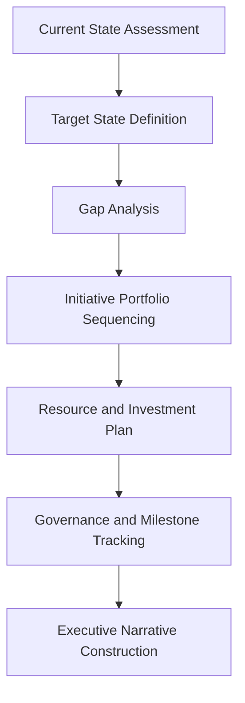

## Presenting an SRM Strategy Roadmap

### Purpose and Scope

This capstone exercise walks through constructing and presenting a multi-year SRM strategy roadmap that synthesizes the segmentation, business case, governance, and crisis-response capabilities developed across the preceding capstone exercises into a single, board-ready strategic narrative. It demonstrates how individual tactical workstreams (a scorecard here, a business case there) aggregate into a coherent organizational transformation story consistent with the patterns examined under SRM Transformation Case Studies.

### Why a Roadmap Differs From a Business Case

**Key Points**

- A business case (see Building a Dual Sourcing Business Case) justifies a single investment decision; a roadmap sequences and connects multiple initiatives over a multi-year horizon into a coherent strategic narrative
- A roadmap must address organizational maturity progression (per the transformation arc covered under SRM Transformation Case Studies), not just a list of discrete projects
- The roadmap audience is typically broader and more senior than a single business case audience, often including the CFO, COO, and board risk committee simultaneously, requiring careful balance between strategic narrative and defensible detail

### Roadmap Construction Framework

#### Step 1: Current State Assessment

Synthesizes outputs from earlier capstone work: category portfolio segmentation results (Segmenting a Sample Category Portfolio), current single-source exposure levels, existing scorecard/governance maturity, and benchmarked competitive position (Benchmarking Against Industry Standards).

#### Step 2: Target State Definition

Articulates where the organization aims to be at defined future checkpoints (typically 1-year, 2-year, and 3-year horizons), expressed in terms consistent with the maturity stages covered under SRM Transformation Case Studies — for example, moving from "Segmented/Strategic" to "Collaborative/Value Co-Creation" maturity for the top-tier supplier base.

#### Step 3: Gap Analysis

Identifies the specific capability, process, and technology gaps between current and target state — dual sourcing coverage gaps, scorecard/governance maturity gaps, and multi-tier visibility gaps (see Crisis Response: Pandemic and Chip Shortage Lessons for why this last gap category matters).

#### Step 4: Initiative Portfolio Sequencing

Sequences discrete initiatives (individual dual sourcing business cases, scorecard rollouts, technology platform implementation, multi-tier visibility programs) across the roadmap timeline, respecting technical and organizational dependencies.

#### Step 5: Resource and Investment Plan

Aggregates the financial ask across all sequenced initiatives into a consolidated multi-year investment plan, distinct from (but built from) the individual risk-adjusted business cases developed for specific components or categories.

#### Step 6: Governance and Milestone Tracking

Defines how roadmap progress will be tracked and reported over time, connecting to the scorecard and QBR governance cadence established under Drafting a Supplier Scorecard and Governance Calendar.

#### Step 7: Executive Narrative Construction

Synthesizes the preceding technical steps into a compelling, appropriately concise presentation narrative suited to the specific executive audience.

### Sample Multi-Year Roadmap Structure

**Example**

Building on the portfolio segmentation work in Segmenting a Sample Category Portfolio, a three-year roadmap for the industrial electronics manufacturer might be structured as follows:

```mermaid
flowchart LR
    subgraph Y1["Year 1: Foundation"]
        A1[Custom ASIC Dual Sourcing]
        A2[Scorecard Rollout: Top 15 Strategic Suppliers]
        A3[Multi-Tier Visibility Pilot]
    end
    subgraph Y2["Year 2: Expansion"]
        B1[Specialty Polymers Geographic Diversification]
        B2[SRM Technology Platform Deployment]
        B3[Financial Health Monitoring Integration]
    end
    subgraph Y3["Year 3: Maturity"]
        C1[Joint Innovation Program Launch]
        C2[Full Portfolio Re-Segmentation]
        C3[Benchmarking-Validated Maturity Assessment]
    end
    Y1 --> Y2 --> Y3
```

| Year | Theme | Key Initiatives | Primary Investment Driver |
| --- | --- | --- | --- |
| Year 1 | Foundation | Highest-priority dual sourcing qualification (Custom ASICs), scorecard rollout for Strategic suppliers, initial multi-tier visibility pilot | Risk reduction for highest-exposure single-source items |
| Year 2 | Expansion | Geographic diversification for concentrated dual-source categories, SRM technology platform to scale governance, financial health monitoring integration | Scaling governance maturity and closing remaining structural risk gaps |
| Year 3 | Maturity | Joint innovation programs with top-tier suppliers, full portfolio re-segmentation, benchmarking-validated maturity assessment | Transition from risk mitigation to value co-creation |

### Presenting the Roadmap: Structural Guidance by Audience

Consistent with the audience-differentiated communication principles introduced under Benchmarking Against Industry Standards, roadmap presentation should be tailored by audience even when drawing from the same underlying analysis.

#### For the Board / Risk Committee

- Lead with risk exposure reduction trajectory (e.g., single-source dependency ratio trending toward benchmarked best-in-class levels over the roadmap horizon)
- Limit to headline milestones per year; avoid initiative-level detail
- Explicitly connect the roadmap to any previously realized incidents (see Simulating a Disruption and Activating a Second Source) to reinforce the concrete, evidenced nature of the risk being addressed

#### For the CFO / Finance Leadership

- Lead with the consolidated multi-year investment ask and aggregated risk-adjusted expected value across the initiative portfolio
- Present sensitivity ranges at the portfolio level, not just for individual business cases
- Address the phasing of the investment ask explicitly, since multi-year commitments typically require different approval processes than single-year requests

#### For Operational/Procurement Leadership

- Provide full initiative-level detail, sequencing dependencies, and resource/headcount requirements
- Connect each initiative back to its originating segmentation or business case rationale for internal alignment purposes

### Sample Executive Summary Narrative

**Example**

"Over the next three years, this roadmap addresses [X]% of currently identified single-source exposure across our Strategic-quadrant category portfolio, beginning with the highest risk-adjusted-value initiatives identified through structured business case analysis. Year one investment of $[amount] is projected to deliver a risk-adjusted expected value of $[amount] annually once fully implemented, validated against a conservative sensitivity scenario. This roadmap also establishes the governance infrastructure — supplier scorecards, multi-tier visibility, and financial health monitoring — needed to sustain these gains and detect emerging risks before they escalate to the incident level, consistent with lessons drawn from both our own experience and broader industry patterns during recent supply chain disruptions."

[Speculation] The specific numeric figures in a real executive summary would be populated from the organization's actual consolidated business case outputs; the bracketed placeholders here illustrate structure rather than represent verified figures, since this composite roadmap synthesizes prior capstone exercises rather than a single real company's disclosed results.

### Handling Roadmap Uncertainty and Stakeholder Challenge

A multi-year roadmap inherently carries more uncertainty than a single business case, since later-year initiatives depend on assumptions (technology availability, market conditions, organizational capacity) that may shift before they are reached. Effective roadmap presentation addresses this directly rather than presenting false precision:

- **Distinguish committed near-term initiatives from directional later-year initiatives**, using different confidence framing for each (e.g., "Year 1 initiatives are fully scoped and business-cased; Year 3 initiatives represent directional priorities to be business-cased in detail as Year 2 concludes")
- **Build in a defined re-planning checkpoint** (e.g., annual roadmap refresh) rather than presenting the multi-year plan as fixed and unchangeable
- **Anticipate the most likely challenge questions** — typically around aggregate investment size, sequencing rationale, and how success will be measured — and prepare supporting detail (drawn from the underlying business cases and benchmarking data) without over-loading the primary presentation

### Common Pitfalls in Roadmap Construction and Presentation

- **Presenting a list of disconnected initiatives** rather than a coherent narrative connecting current state, target state, and the sequencing logic between them
- **Applying uniform confidence levels across near-term and long-term initiatives**, undermining credibility when later-year specifics inevitably need revision
- **Omitting the connection to prior realized incidents or benchmarking data**, missing the opportunity to ground the roadmap in evidenced rather than purely prospective risk
- **Failing to differentiate the presentation by audience**, delivering the same level of technical/operational detail to the board as to operational leadership
- **Treating the roadmap as a one-time presentation event** rather than establishing a recurring refresh cadence that keeps it credible and current as conditions change

### Conclusion

Presenting an SRM strategy roadmap is the capstone synthesis exercise of this curriculum: it requires integrating portfolio segmentation, risk-adjusted business case methodology, governance design, and crisis-response learning into a single, multi-year, audience-appropriate strategic narrative. The strongest roadmaps distinguish committed near-term commitments from directional longer-term priorities, ground their risk narrative in real benchmarked and incident-based evidence, and establish their own recurring refresh mechanism — treating the roadmap itself as a living governance artifact rather than a static, one-time deliverable.

**Related Topics**

- SRM Transformation Case Studies
- Segmenting a Sample Category Portfolio
- Building a Dual Sourcing Business Case
- Drafting a Supplier Scorecard and Governance Calendar
- Simulating a Disruption and Activating a Second Source
- Benchmarking Against Industry Standards
- Presenting SRM Performance to the Board and C-Suite
- Building the Business Case for SRM Investment