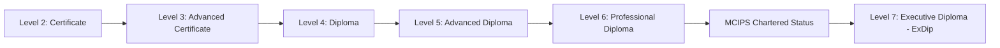
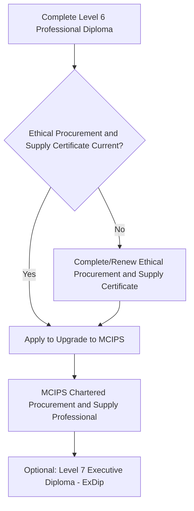

## CIPS Qualification Pathway

### Overview

The Chartered Institute of Procurement & Supply (CIPS) qualification pathway is the globally recognized professional development framework for procurement, supply chain, and — relevant to this curriculum — supplier relationship management practitioners. Its structure spans five progressive levels, culminating in MCIPS Chartered status, with an additional executive-level qualification available beyond MCIPS. CIPS qualifications throughout the world are recognised as the drivers of leading-edge thinking and professionalism in procurement and supply. [optimizely](https://udntho.files.cmp.optimizely.com/download/assets/CIPS+Qualifications+2024.pdf/0d5d9aea8e7b11f0926a3a35de19e8c7)

### Why This Pathway Is Relevant to SRM and Dual Sourcing Practice

**Key Points**

- SRM and dual sourcing content covered throughout this curriculum (segmentation, business case construction, governance design, risk-adjusted decision-making) directly maps to competencies assessed at CIPS Level 4 through Level 6
- CIPS is widely used by employers as both a credentialing benchmark and a structured career development framework for procurement professionals moving into strategic, supplier-facing roles
- CIPS is described by the organization as the only independently regulated professional body offering an honours-degree-level qualification in this field, with MCIPS chartered status recognized internationally as the standard for procurement professionals, though this is the organization's own positioning and should be understood as such [daystar](https://www.daystar.ac.ke/dlpdi/downloads/2023%20-%20CIPS%20-prospectus.pdf)

### The Five-Level Qualification Structure

#### Level 2: Certificate in Procurement and Supply Operations

Designed for those new to the profession, ideal for people just starting their career in procurement and supply or aspiring to move into the profession. No prior experience or formal entry requirements apply at this level. [cips](https://2tst-dxp.cips.org/supply-chain-qualifications)

#### Level 3: Advanced Certificate in Procurement and Supply Operations

Suited to those already in an operational role, this qualification helps improve skills to carry out procurement and supply tasks. Like Level 2, this level has no formal entry requirements and is commonly used as a progression step from Level 2 rather than a standalone endpoint. [cips](https://2tst-dxp.cips.org/supply-chain-qualifications)

#### Level 4: Diploma in Procurement and Supply

This is the highest qualification entry point for those seeking professional recognition, aimed at candidates with two or more years of relevant business experience, and represents the starting point of the direct pathway toward MCIPS Chartered status. [cips](https://2tst-dxp.cips.org/supply-chain-qualifications)[cips](https://2tst-dxp.cips.org/procurement-courses)

#### Level 5: Advanced Diploma in Procurement and Supply

This level develops higher-order strategic and operational capability, with modules directly relevant to SRM and dual sourcing practice, including:

- Achieving Competitive Advantage Through the Supply Chain (L5M7) [upsa](https://admissions.upsa.edu.gh/?p=17482)
- Project and Change Management (L5M8) [upsa](https://admissions.upsa.edu.gh/?p=17482)
- Operations Management (L5M9) [upsa](https://admissions.upsa.edu.gh/?p=17482)
- Logistics Management (L5M10) [upsa](https://admissions.upsa.edu.gh/?p=17482)
- Advanced Negotiation (L5M15) [upsa](https://admissions.upsa.edu.gh/?p=17482)

#### Level 6: Professional Diploma in Procurement and Supply

Aimed at senior procurement professionals and heads of department, and broadly equivalent to the final year of a degree, this is the terminal level required before applying for MCIPS Chartered status. This level requires passes in four core modules and three elective modules. [cips](https://2tst-dxp.cips.org/procurement-courses)[upsa](https://admissions.upsa.edu.gh/?p=17482)

**Core modules:**

- Strategic Ethical Leadership (L6M1) [upsa](https://admissions.upsa.edu.gh/?p=17482)
- Global Commercial Strategy (L6M2) [upsa](https://admissions.upsa.edu.gh/?p=17482)
- Global Strategic Supply Chain Management (L6M3) [upsa](https://admissions.upsa.edu.gh/?p=17482)
- Future Strategic Challenges for the Profession (L6M4) [upsa](https://admissions.upsa.edu.gh/?p=17482)

**Elective modules (three selected):**

- Strategic Programme Leadership (L6M5) [upsa](https://admissions.upsa.edu.gh/?p=17482)
- Commercial Data Management (L6M7) [upsa](https://admissions.upsa.edu.gh/?p=17482)
- Innovation in Procurement and Supply (L6M8) [upsa](https://admissions.upsa.edu.gh/?p=17482)
- Supply Network Design (L6M9) [upsa](https://admissions.upsa.edu.gh/?p=17482)
- Global Logistics Strategy (L6M10) [upsa](https://admissions.upsa.edu.gh/?p=17482)

[Unverified] CIPS periodically revises its syllabus and module structure; at the time of this writing, sources indicate the Level 6 core module content was under active update, so specific module titles, codes, and elective options should be verified directly against current CIPS documentation before being used for enrollment or study planning purposes.

### Entry Requirements Summary

| Level | Qualification | Typical Entry Requirement |
| --- | --- | --- |
| 2 | Certificate | None |
| 3 | Advanced Certificate | None |
| 4 | Diploma | 2+ years of business experience, or equivalent |
| 5 | Advanced Diploma | Completion of Level 4 (or equivalent prior qualification/experience) |
| 6 | Professional Diploma | Completion of Level 5 |

### Progression to MCIPS Chartered Status

Upon successful completion of Level 6, candidates must formally apply to be upgraded to MCIPS; with an up-to-date CIPS Ethical Procurement and Supply certificate, candidates become eligible to upgrade to MCIPS Chartered Procurement and Supply Professional status. [upsa](https://admissions.upsa.edu.gh/?p=17482)[upsa](https://admissions.upsa.edu.gh/admissions/professional/cips/)

### Beyond MCIPS: Level 7 Executive Diploma (ExDip)

The next step after MCIPS is the CIPS Level 7 Executive Diploma in Procurement and Supply. A chartered professional with the Executive Diploma is likely to be in a procurement leadership role, with board-level influence and responsibility for delivering innovative sourcing solutions across a diverse range of markets. ExDip is positioned by CIPS as a higher professional standard than MCIPS Chartered status, defined by the competencies of the Advanced Professional level of the CIPS Global Standard, with holders having demonstrated excellence through a programme of learning or experience equivalent to postgraduate degree level. [upsa](https://admissions.upsa.edu.gh/admissions/professional/cips/)[upsa](https://admissions.upsa.edu.gh/admissions/professional/cips/)

### Alternative Routes to MCIPS

Beyond the standard sequential academic pathway, CIPS documentation references alternative and flexible routes to Chartered status, including work-based assessment pathways and management entry routes designed for experienced practitioners. One such route, the CIPS work-based pathway, provides learners with a non-exam route to MCIPS. [Unverified] The specific availability, eligibility criteria, and structure of these alternative routes vary by region, employer partnership arrangements (such as sector-specific academies), and current CIPS policy, and should be confirmed directly with CIPS or an approved study center rather than assumed to be universally available. [england](https://www.events.england.nhs.uk/503037)

### Study Delivery Options

**Key Points**

- CIPS qualifications are typically available through multiple study modes: self-study, tutor-supported online learning, and in-person or blended classroom delivery through CIPS-approved study centers
- Self-paced study allows candidates to book exams when ready, without a fixed start or end date imposed on the first exam, offering flexibility for working professionals balancing study with a procurement role [optimizely](https://udntho.files.cmp.optimizely.com/download/assets/CIPS+Qualifications+2024.pdf/0d5d9aea8e7b11f0926a3a35de19e8c7)
- Self-directed study is generally best suited to candidates who are self-driven, grasp new concepts quickly, and can independently plan and sustain a study schedule, while those preferring structured pacing and peer interaction may benefit more from tutor-led or classroom-based delivery

### Connecting the Pathway to This Curriculum's SRM Content

The competency areas assessed across CIPS Levels 4–6 align closely with topics covered elsewhere in this curriculum:

| CIPS Level/Module Area | Related Curriculum Topic |
| --- | --- |
| Supplier relationships (Level 4) | Supplier Segmentation Using the Kraljic Matrix, Lessons From Supplier Relationship Failures |
| Achieving Competitive Advantage Through the Supply Chain (L5M7) | Benchmarking Against Industry Standards |
| Global Strategic Supply Chain Management (L6M3) | Dual Sourcing in Electronics and Semiconductors, Dual Sourcing in Automotive and Manufacturing |
| Supply Network Design (L6M9, elective) | Segmenting a Sample Category Portfolio |
| Strategic Ethical Leadership (L6M1) | Building the Business Case for SRM Investment |
| Future Strategic Challenges for the Profession (L6M4) | Crisis Response: Pandemic and Chip Shortage Lessons |

**Example**

A supply chain professional working through this curriculum's capstone exercises — segmentation, dual sourcing business case construction, scorecard design — is developing practical competency directly relevant to CIPS Level 5 and Level 6 module content, even without formal CIPS enrollment. For a practitioner considering formal certification alongside this applied curriculum, Level 4 entry (given typical 2+ years of relevant experience) followed by sequential progression through Levels 5 and 6 represents the standard pathway to MCIPS Chartered status.

### Common Pitfalls in Planning a CIPS Study Pathway

- **Assuming syllabus and module details remain static** — CIPS periodically revises core and elective module content, so study materials and module codes should be verified against current CIPS publications immediately before enrollment
- **Underestimating the Level 4 entry requirement** — candidates without the required experience or equivalent qualifications may need to complete Levels 2–3 first rather than entering directly at Level 4
- **Overlooking the Ethical Procurement and Supply certificate requirement** for the final MCIPS upgrade step, which is a distinct requirement from Level 6 module completion itself
- **Treating MCIPS as the terminal credential** without awareness of the Level 7 Executive Diploma pathway for those pursuing board-level procurement leadership recognition
- **Assuming alternative/work-based routes to MCIPS are universally available** without confirming eligibility, which often depends on employer partnership arrangements or regional program availability

### Conclusion

The CIPS qualification pathway provides a structured, internationally recognized five-level progression from foundational procurement operations knowledge through to strategic, board-level competency, culminating in MCIPS Chartered status and, optionally, the Level 7 Executive Diploma. Its Level 4–6 content — spanning supplier relationships, strategic supply chain management, and competitive advantage through the supply chain — maps closely to the SRM and dual sourcing competencies developed throughout this curriculum, making it a natural formal credentialing complement to the applied capstone work covered elsewhere in this material.

**Related Topics**

- Building the Business Case for SRM Investment
- Supplier Segmentation Using the Kraljic Matrix
- Benchmarking Against Industry Standards
- SRM Transformation Case Studies
- Other Professional Certifications in Procurement and Supply Chain (ISM, APICS/ASCM)
- Continuing Professional Development (CPD) Requirements for Procurement Professionals
- Ethics and Professional Standards in Procurement
- Career Pathways in Strategic Sourcing and SRM