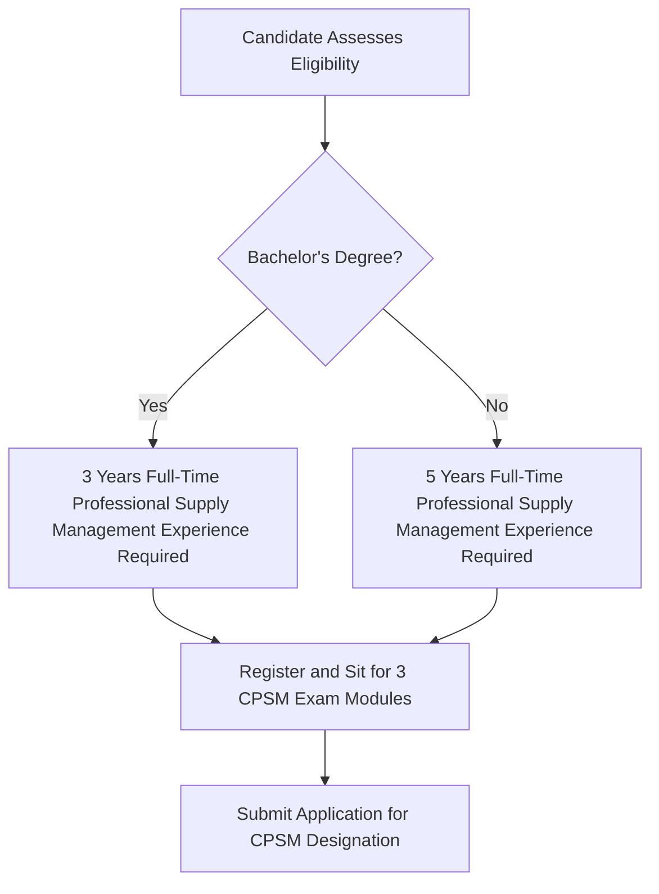
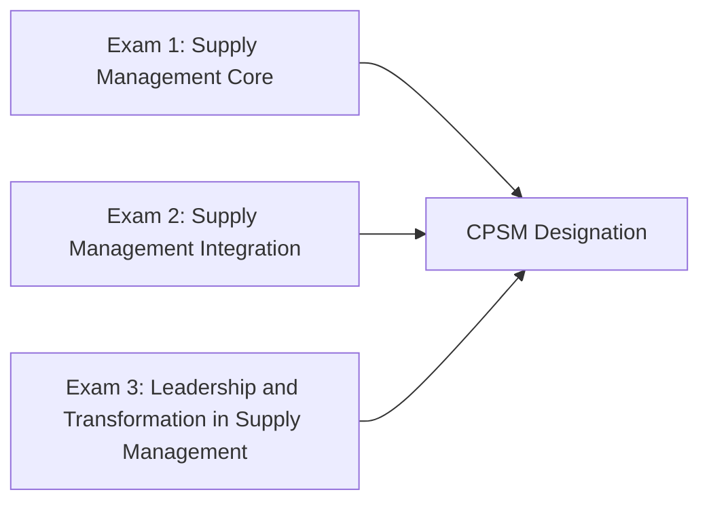
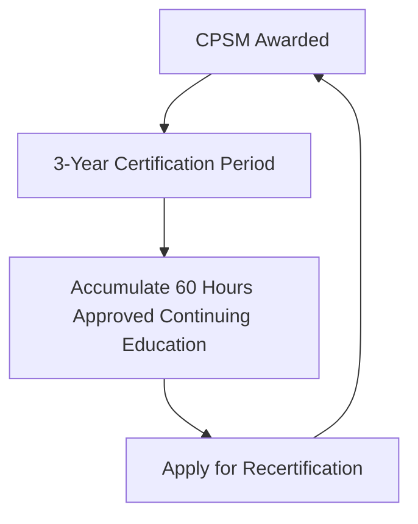

## ISM Certified Professional in Supply Management (CPSM)

### Overview

The Certified Professional in Supply Management (CPSM) is a globally recognized certification developed by the Institute for Supply Management (ISM), positioned by ISM as the most recognized supply chain certification and the gold standard of excellence for supply management professionals. Unlike the multi-level academic progression of the CIPS Qualification Pathway, CPSM is structured as a single-tier professional credential built around three required exam modules, making it a more direct, experience-gated certification route.

### Why CPSM Is Relevant to SRM and Dual Sourcing Practice

**Key Points**

- CPSM certification content explicitly includes Supplier Relationship Management as one of its named core competency areas, alongside Sourcing, Category Management, Risk and Compliance, and Supply Chain Strategy — directly overlapping with this curriculum's subject matter
- ISM is described as the largest and one of the most respected supply management associations in the world, giving the credential broad industry recognition, particularly in North America
- Unlike CIPS's multi-level progression (Levels 2 through 7), CPSM is structured as a single professional-level credential gated by a work-experience and education requirement rather than sequential prerequisite levels

### Eligibility Requirements

To obtain a CPSM designation, ISM requires candidates to have three years of full-time, professional supply management experience (non-clerical, non-support) with a regionally accredited bachelor's degree or international equivalent, or five years of supply management experience without a degree.

**Key Points**

- Experience must be non-clerical and non-support in nature, meaning purely administrative or transactional purchasing support roles may not qualify toward the requirement
- Candidates are generally able to begin studying, register for, and sit exam modules before formally meeting the full experience/education requirement, but the CPSM designation itself is only awarded once all requirements — experience, education, and passing all three exams — are met
- The bachelor's degree requirement can be satisfied by a regionally accredited institution or an international equivalent, broadening eligibility for candidates with non-US credentials

### The Three CPSM Exam Modules

Before qualifying for the CPSM designation, candidates must pass three exam modules, which can be taken in any order.

#### Exam 1: Supply Management Core

Covers foundational supply management competencies including sourcing, category management, negotiation, legal and contractual matters, supplier relationship management, cost and price management, and financial analysis.

#### Exam 2: Supply Management Integration

Covers broader organizational integration topics, including supply chain strategy and sales and operations planning, connecting procurement decision-making to enterprise-level planning processes.

#### Exam 3: Leadership and Transformation in Supply Management

Covers leadership, change management, and the strategic transformation competencies relevant to senior supply management roles — conceptually adjacent to the maturity progression covered under SRM Transformation Case Studies elsewhere in this curriculum.

### CPSM Competency Areas

CPSM certification emphasizes the following major competencies across its three exam modules:

| Competency Area | Relevance to This Curriculum |
| --- | --- |
| Supplier Relationship Management | Directly maps to this curriculum's core subject matter |
| Risk and Compliance | Connects to Calculating and Reporting Supply Chain Risk Exposure |
| Category Management | Connects to Segmenting a Sample Category Portfolio |
| Sourcing | Connects to Dual Sourcing methodology across industry chapters |
| Supply Chain Strategy | Connects to Presenting an SRM Strategy Roadmap |
| Negotiation | Connects to Building the Business Case for SRM Investment (negotiating leverage) |
| Cost and Price Management | Connects to financial justification frameworks used throughout the capstone exercises |
| Financial Analysis | Connects to risk-adjusted value and ROI calculations used in business case construction |
| Corporate Social Responsibility | Connects to compliance-driven resilience strategies covered under Supply Resilience in Pharma and Medical Devices |
| Systems Capability and Technology | Connects to SRM technology platform considerations referenced under SRM Transformation Case Studies |
| Project Management | Supports implementation planning for dual sourcing qualification timelines |
| Logistics and Material Management | Connects to buffer inventory and JIT/JIS considerations discussed under Dual Sourcing in Automotive and Manufacturing |
| Quality Management | Connects to PPAP and qualification rigor discussed under Dual Sourcing in Automotive and Manufacturing |

### Study Delivery Options

ISM offers several structured study pathways toward CPSM exam preparation:

- **Accelerated Program Bundle**: A structured program combining study guides, weekly instructor-led webinars, and online training modules with multimedia and practical application activities, positioned for candidates aiming to complete studies in approximately six months
- **Guided Learning Individual Courses**: Modular, self-paced study options for candidates who prefer to progress through material independently rather than following a fixed cohort schedule
- **Classroom-based/Corporate Training**: Onsite training delivered through ISM's Corporate Services team, combining classroom instruction with the CPSM Learning System materials, aimed at organizations certifying multiple team members together
- University/institutional partner programs: Some accredited institutions offer CPSM-aligned preparatory coursework (often issuing their own completion certificate) as a supplement to, not a replacement for, the official ISM-administered exams

[Unverified] Specific program pricing, exact delivery formats, and program scheduling change periodically and by region; candidates should confirm current offerings and cohort dates directly through ISM's official certification pages before enrolling.

### Recertification Requirements

To maintain the integrity of the credential, ISM requires CPSM holders to continue learning and developing their skills throughout their career. The CPSM certification is valid for three years, after which the holder must apply for recertification to maintain the designation.

To be eligible for recertification, CPSM holders must earn 60 hours of approved continuing education through any combination of:

- Taking semester-long college courses
- Attending seminars, conferences, and educational programs; teaching courses; and publishing journal articles
- Participating in work-related training (either taken or taught) involving business-related topics
- Contributing to the profession, including holding certain offices within ISM or an ISM affiliate

**Key Points**

- The 60-hour continuing education requirement offers meaningful flexibility, allowing credential holders to satisfy it through formal coursework, conference attendance, internal corporate training, teaching, publishing, or professional service — rather than requiring a single prescribed activity type
- This structure means ongoing engagement with SRM-related professional development (such as applied case study work, industry benchmarking research, or internal training delivery) may count toward recertification, though specific activities should be verified for eligibility against current ISM recertification policy

### Upcoming Changes to Note

[Unverified] At the time of this writing, ISM has indicated that an updated version of the CPSM exams and study materials is planned for release, with the currently active exam version described as remaining fully aligned to current supply chain practices in the interim. Candidates planning their study timeline should verify the current exam version and any transition arrangements directly through ISM's official certification page before beginning preparation, since exam content, module structure, or transition policies may change around the update.

### CPSM Compared to CIPS Certification

| Dimension | ISM CPSM | CIPS Pathway |
| --- | --- | --- |
| Structure | Single-tier, three-exam credential | Multi-level progression (Levels 2–7) |
| Entry point | Experience/education-gated (3–5 years + degree) | Multiple entry points based on experience level |
| Primary geographic recognition | Strong in North America; globally recognized | Strong globally, particularly UK/Commonwealth markets |
| Recertification model | 3-year cycle, 60 hours continuing education | CPD-based ongoing membership requirements |
| Terminal/advanced credential | CPSM is the primary credential (no formal multi-tier "chartered" escalation beyond it in the same structure) | MCIPS Chartered status, with Level 7 ExDip beyond that |

[Unverified] This comparison reflects general positioning based on publicly available program descriptions; specific regional employer preferences, recognition, and relative credential value vary by industry, geography, and individual employer policy, and should not be treated as a universal ranking of one credential's value over the other.

### Common Pitfalls in Planning a CPSM Certification Path

- **Underestimating the experience/education gating requirement** — candidates without the full three years (with degree) or five years (without degree) of qualifying experience cannot receive the designation even after passing all three exams, though many begin exam preparation before formally meeting this threshold
- **Assuming clerical or purely administrative purchasing experience satisfies the "professional supply management experience" requirement** without confirming this against ISM's specific non-clerical, non-support criteria
- **Neglecting to plan for the 60-hour continuing education requirement** before the three-year recertification deadline approaches, risking lapse of the credential
- **Failing to verify current exam version and content** given ISM's periodic exam and study material updates, potentially studying outdated material
- **Treating a university-affiliated preparatory course completion certificate as equivalent to the CPSM designation itself** — such programs typically prepare candidates for, but do not replace, the official ISM-administered exams and application process

### Conclusion

The ISM CPSM certification offers a single-tier, competency-based professional credential with explicit, direct coverage of Supplier Relationship Management alongside sourcing, risk, and strategic supply chain competencies central to this curriculum. Its three-exam structure, work-experience gating, and 60-hour triennial recertification requirement distinguish it structurally from the multi-level CIPS pathway, while its competency content — spanning category management, risk and compliance, and supplier relationship management — offers direct, practical alignment with the SRM and dual sourcing frameworks developed throughout this curriculum's chapters and capstone exercises.

**Related Topics**

- CIPS Qualification Pathway
- Continuing Professional Development (CPD) Requirements for Procurement Professionals
- Other Professional Certifications in Procurement and Supply Chain (APICS/ASCM, CILT)
- Building the Business Case for SRM Investment
- Calculating and Reporting Supply Chain Risk Exposure
- Career Pathways in Strategic Sourcing and SRM
- Ethics and Professional Standards in Procurement
- Segmenting a Sample Category Portfolio