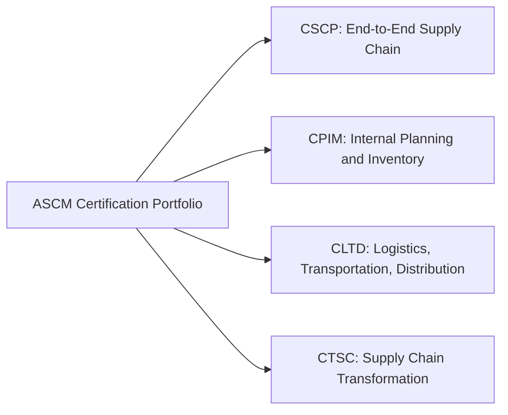
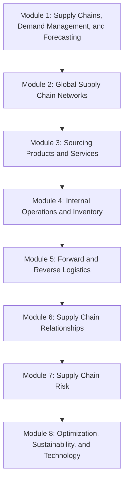
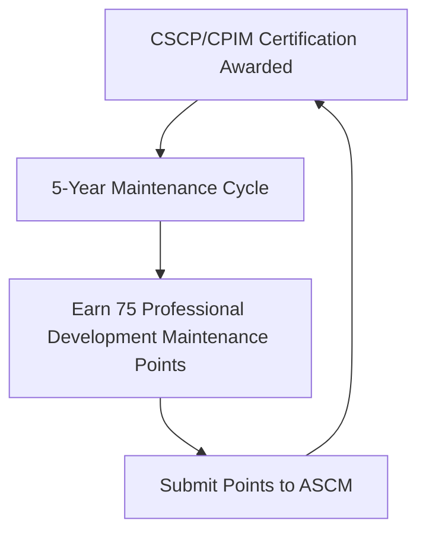

## ASCM Certified Supply Chain Professional (CSCP) and CPIM

### Overview

The Association for Supply Chain Management (ASCM) — the organization formed from the legacy APICS body — offers two of the most widely recognized supply chain certifications globally: the Certified Supply Chain Professional (CSCP) and the Certified in Planning and Inventory Management (CPIM). Both credentials remain commonly referred to under their legacy "APICS" branding in much of the industry and in course materials. Together with the CIPS Qualification Pathway and ISM CPSM certification covered elsewhere in this chapter, these certifications form the primary global credentialing landscape relevant to SRM and supply chain practitioners.

### CSCP vs. CPIM: Core Distinction

**Key Points**

- CSCP is oriented toward end-to-end supply chain design, integration, and external relationship management — spanning demand, sourcing, logistics, and partner relationships across the full supply chain
- CPIM is oriented toward internal operations planning — demand and supply planning, inventory management, scheduling, and distribution execution within an organization
- Practitioners with SRM and dual sourcing responsibilities most directly align with CSCP's content, given its explicit coverage of sourcing, supply chain relationships, and supply chain risk, though CPIM's supply-planning content is complementary for practitioners also involved in internal inventory and scheduling decisions

### CSCP Exam Content Structure

The CSCP exam content is organized into eight modules covering the end-to-end supply chain, based on the CSCP body of knowledge:

| Module | Focus | Relevance to This Curriculum |
| --- | --- | --- |
| 1. Supply Chains, Demand Management, and Forecasting | Demand planning fundamentals and forecasting methodology | Connects to demand-signal volatility discussed under Crisis Response: Pandemic and Chip Shortage Lessons |
| 2. Global Supply Chain Networks | Network design, global sourcing footprint considerations | Connects to geographic dual sourcing strategy across industry chapters |
| 3. Sourcing Products and Services | Sourcing strategy, supplier selection, procurement processes | Directly connects to dual sourcing qualification methodology throughout this curriculum |
| 4. Internal Operations and Inventory | Internal inventory and operations management | Connects to buffer inventory/safety stock strategy under Dual Sourcing in Automotive and Manufacturing |
| 5. Forward and Reverse Logistics | Logistics network management, reverse flows | Supporting context for supply continuity planning |
| 6. Supply Chain Relationships | Managing relationships with supply chain partners | Most directly aligned with this curriculum's core SRM subject matter |
| 7. Supply Chain Risk | Risk identification, assessment, and mitigation strategy | Directly connects to Calculating and Reporting Supply Chain Risk Exposure and the risk-adjusted business case framework |
| 8. Optimization, Sustainability, and Technology | Performance optimization, ESG, and enabling technology | Connects to SRM technology platform considerations under SRM Transformation Case Studies |

### CPIM Exam Content Structure

CPIM content has recently transitioned to an updated version. [Unverified] As of this writing, ASCM's own exam details page indicates two active module structures depending on when the learning system/exam was purchased, with the newer structure applying to purchases from February 3, 2026 onward — candidates should confirm which version applies to their specific purchase and exam registration before studying, since content and module numbering differ between versions.

**Module structure for exams/bundles purchased beginning February 3, 2026:**

```mermaid
flowchart TD
    C1[Module 1: Align the Supply Chain to Support the Business Strategy]
    C2[Module 2: Conduct Sales and Operations Planning to Support Strategy]
    C3[Module 3: Plan and Manage Demand]
    C4[Module 4: Plan and Manage Internal Supply Sources]
    C5[Module 5: Plan and Manage External Supply Sources]
    C6[Module 6: Plan and Manage Inventory]
    C7[Module 7: Plan, Manage, and Execute Detailed Schedules]
    C8[Module 8: Plan and Manage Distribution]
    C9[Module 9: Manage Quality, Continuous Improvement, and Technology]
```

Notably, this updated structure splits supply planning into separate "Internal Supply Sources" and "External Supply Sources" modules (Modules 4 and 5) — a structural change from the prior version's single combined "Plan and Manage Supply" module — with the External Supply Sources module carrying particular relevance to sourcing and supplier-facing planning decisions covered throughout this curriculum.

**Key Points**

- CPIM's content is more internally operational than CSCP's, focused on aligning supply chain execution to business strategy, S&OP, demand/supply planning, inventory, scheduling, and distribution
- The explicit separation of "External Supply Sources" planning in the updated module structure reflects growing industry emphasis on supplier-side planning integration, directly relevant to dual sourcing capacity and allocation planning discussed under Simulating a Disruption and Activating a Second Source

### Exam Format and Scoring (Applies to Both CSCP and CPIM)

Certification exams consist of 150 questions (130 operational and 20 pretest), with 3.5 hours allotted to complete the exam. Pretest questions do not contribute to the total score but are necessary for statistical purposes and are randomly distributed throughout the exam; candidates should answer all exam questions since they cannot distinguish scored from pretest items during the exam.

Each exam score range is 200 to 350, with scores of 300 points and above considered passing and any score of 299 points or below failing. Exams are graded using a scaled score methodology, which ASCM states is designed to maintain equivalent passing standards despite varying difficulty across different exam versions.

$$Passing\ Threshold: Score \geq 300 \text{ (on a 200–350 scaled range)}$$

### Study Delivery and Preparation

ASCM certification programs use the ASCM/APICS Learning System as the core preparation material, available through multiple delivery formats:

- **Self-study**: Independent study using the Learning System materials, print-based and online tools, and self-assessment components
- **Instructor-led**: Structured cohort-based classes, typically delivered through local ASCM chapters (in-person or via live virtual sessions), following a defined weekly schedule over a period of months
- **Instructor-supported**: A hybrid model combining self-paced study with instructor availability for guidance
- **Combination approaches**: Many chapter-delivered programs bundle the Learning System, exam voucher, and sometimes a second-attempt retake allowance into a single package price

ASCM recommends approximately 100 hours of study time to prepare for each certification exam, using the online learning system's flashcards and quizzes, and recommends connecting with peers through the Supply Chain Knowledge Center or local chapter study groups.

[Unverified] Specific program pricing and schedules vary significantly by local ASCM chapter, delivery format, and membership status; the figures found in chapter-specific program materials during this research (ranging roughly from the low thousands to over four thousand US dollars depending on bundle and membership tier) should be treated as illustrative of typical program cost ranges rather than fixed, current pricing, and should be confirmed directly with ASCM or the relevant local chapter.

### Recertification / Maintenance Requirements

To keep an ASCM certification valid, holders must earn and submit 75 professional development maintenance points every five years (100 points for APICS Fellows). This differs structurally from ISM's CPSM recertification (60 hours of continuing education every three years, as covered under ISM Certified Professional in Supply Management), reflecting a longer cycle with a points-based rather than hours-based accounting system.

### Additional ASCM Credentials Worth Noting

Beyond CSCP and CPIM, ASCM offers adjacent certifications relevant to broader supply chain career development, though outside this curriculum's direct SRM focus:

| Credential | Focus |
| --- | --- |
| CLTD (Certified in Logistics, Transportation, and Distribution) | Logistics network design, warehouse/distribution management, transportation, global logistics |
| CTSC (Certified in Transformation for Supply Chain) | Supply chain transformation strategy, planning, and execution — conceptually adjacent to SRM Transformation Case Studies covered elsewhere in this curriculum |

### CSCP/CPIM Compared to Other Certifications in This Chapter

| Dimension | ASCM CSCP | ASCM CPIM | ISM CPSM | CIPS Pathway |
| --- | --- | --- | --- | --- |
| Primary orientation | End-to-end supply chain, external relationships | Internal planning and inventory | Supply management, procurement, SRM | Multi-level procurement/supply progression |
| Module count | 8 modules, single exam | 8–9 modules (version-dependent), single exam | 3 separate exams | Multiple levels, each with several modules |
| Maintenance cycle | 75 points / 5 years | 75 points / 5 years | 60 hours / 3 years | CPD-based ongoing |
| SRM-specific content | Explicit "Supply Chain Relationships" module | Limited (more internally operational) | Explicit "Supplier Relationship Management" competency area | Distributed across Level 4–6 modules |

[Unverified] This comparison is based on publicly available program descriptions gathered at the time of this writing; specific regional employer recognition and preference among these credentials vary by industry and geography and should not be treated as a ranking of relative value.

### Common Pitfalls in Planning a CSCP or CPIM Study Path

- **Studying outdated module content** given ASCM's periodic content revisions (as seen in the CPIM module restructuring effective February 2026) — candidates should confirm which content version applies to their specific exam registration
- **Choosing CPIM when CSCP better matches SRM-focused career goals**, or vice versa, without first reviewing each credential's module content against actual job responsibilities
- **Underestimating the recommended 100-hour study commitment per exam**, particularly for CPIM given its multiple exam-content modules covered within a single exam
- **Losing track of the 5-year, 75-point maintenance cycle**, risking credential lapse without a systematic professional development tracking habit
- **Assuming pretest questions can be identified and skipped during the exam** — since pretest and scored questions are randomly distributed and indistinguishable, all 150 questions should be answered with equal care

### Conclusion

ASCM's CSCP and CPIM certifications offer two structurally distinct but complementary paths into supply chain professional credentialing: CSCP's end-to-end orientation — with explicit Supply Chain Relationships and Supply Chain Risk modules — aligns closely with this curriculum's SRM and dual sourcing focus, while CPIM's internally operational planning content complements that perspective for practitioners also responsible for internal inventory and scheduling decisions. Both share a common exam format (150 questions, scaled scoring, 300-point passing threshold) and a five-year, 75-point maintenance cycle, distinguishing them structurally from ISM's CPSM and CIPS's multi-level pathway covered elsewhere in this chapter.

**Related Topics**

- ISM Certified Professional in Supply Management (CPSM)
- CIPS Qualification Pathway
- Calculating and Reporting Supply Chain Risk Exposure
- SRM Transformation Case Studies
- Continuing Professional Development (CPD) Requirements for Procurement Professionals
- Career Pathways in Strategic Sourcing and SRM
- Dual Sourcing in Automotive and Manufacturing
- Building the Business Case for SRM Investment