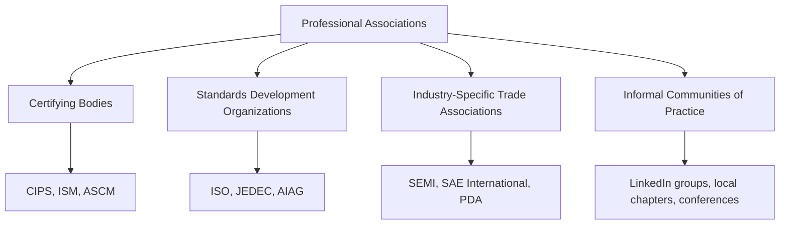
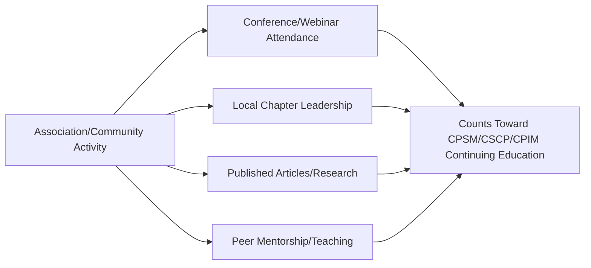

## Industry Associations and Communities of Practice

### Definition and Purpose

Industry associations and communities of practice are formal and informal professional networks that provide ongoing learning, benchmarking access, peer connection, and standards development distinct from the formal certification pathways covered elsewhere in this chapter (CIPS Qualification Pathway, ISM CPSM, ASCM CSCP/CPIM). While certifications validate a defined body of knowledge at a point in time, associations and communities of practice provide continuous professional development, current industry intelligence, and practitioner networks that remain relevant throughout a career.

### Why This Complements Formal Certification

**Key Points**

- Certifications certify knowledge as of the exam date; associations and communities provide the ongoing mechanism for staying current as practices, technology, and risk conditions evolve — directly relevant given how quickly topics like dual sourcing strategy shifted following the disruptions covered under Crisis Response: Pandemic and Chip Shortage Lessons
- Many certifications (CIPS CPD requirements, ISM's 60-hour continuing education, ASCM's 75-point maintenance cycle) explicitly recognize association-based activity — conference attendance, chapter participation, published contributions — as qualifying continuing education
- Communities of practice provide access to peer benchmarking data and informal practitioner knowledge that supplements the formal benchmarking sources discussed under Benchmarking Against Industry Standards

### Categories of Relevant Organizations

#### 1. Certifying Bodies (Also Functioning as Associations)

CIPS, ISM, and ASCM — covered in detail elsewhere in this chapter for their certification programs — also function as ongoing membership associations, offering local chapter events, webinars, research publications, and networking beyond the certification exam itself. Membership is often distinct from, and can be maintained independently of, active certification status.

#### 2. Standards Development Organizations

Bodies that develop the technical and quality standards referenced throughout this curriculum's industry chapters:

- **JEDEC**: Semiconductor device standards, relevant to the electronics dual sourcing qualification process (see Dual Sourcing in Electronics and Semiconductors)
- **AIAG (Automotive Industry Action Group)**: Publishes the PPAP and FMEA manuals referenced under Dual Sourcing in Automotive and Manufacturing
- **ISO**: Multiple relevant standards bodies, including ISO 44001 (Collaborative Business Relationship Management, referenced under Benchmarking Against Industry Standards) and industry-specific standards like ISO 13485 (medical devices) and IATF 16949 (automotive quality)

#### 3. Industry-Specific Trade Associations

- **SEMI**: Global semiconductor and electronics manufacturing industry association, providing market data and standards relevant to the supply chain concentration risk discussed under Dual Sourcing in Electronics and Semiconductors
- **SAE International**: Aerospace and automotive engineering standards body, relevant to functional safety and qualification standards referenced under Dual Sourcing in Automotive and Manufacturing
- **PDA (Parenteral Drug Association)** and similar pharmaceutical/biotech industry bodies: Relevant to the regulatory and GMP considerations discussed under Supply Resilience in Pharma and Medical Devices

#### 4. Informal Communities of Practice

- Local and regional chapters of formal associations (as seen in ASCM's chapter-delivered CPIM/CSCP programs referenced under ASCM Certified Supply Chain Professional)
- Professional networking platforms (LinkedIn groups, industry-specific forums) where practitioners exchange informal benchmarking data and practical experience
- Conference and summit circuits (procurement/SCM-focused events hosted by analyst firms, industry associations, or independent organizers) that combine formal presentations with informal peer networking

### Value Proposition by Organization Type

| Organization Type | Primary Value | Limitation |
| --- | --- | --- |
| Certifying body membership | Structured learning, credential maintenance, broad professional recognition | Content often generalized across industries rather than category-specific |
| Standards development organization | Authoritative technical specifications and qualification criteria | Typically narrow technical scope; not a general SRM learning resource |
| Industry-specific trade association | Deep, current, sector-specific intelligence and peer benchmarking | Limited relevance outside the specific industry vertical |
| Informal community of practice | Real-time practitioner insight, rapid peer problem-solving | Variable quality/reliability; not a substitute for formal, vetted standards |

### How Associations Support the Business Case and Benchmarking Process

**Example**

A category manager preparing a dual sourcing business case for a semiconductor component (following the methodology in Building a Dual Sourcing Business Case) supplements formal analyst benchmarking data with insight gathered through SEMI industry reports and informal peer discussion at an ASCM local chapter event, where a peer from a comparable-sized manufacturer shares their organization's approximate dual-source qualification timeline for a similar component category. This informal peer data point is used to sanity-check, not replace, the formal probability and cost estimates in the risk-adjusted business case — illustrating the complementary rather than substitutive role communities of practice play relative to formal benchmarking sources. [Unverified] Informal peer-shared figures of this kind should always be treated as directional context rather than verified benchmark data, given the absence of standardized methodology or independent verification behind informal practitioner conversations.

### Connecting Association Involvement to Continuing Professional Development

As referenced under ISM Certified Professional in Supply Management, ISM's recertification explicitly recognizes attending seminars, conferences, and educational programs, as well as teaching courses and publishing journal articles, as qualifying continuing education activity. Similarly, ASCM's points-based maintenance system and CIPS's CPD framework generally recognize structured association engagement as legitimate professional development, meaning active participation in these organizations serves a dual purpose: professional growth and formal credential maintenance.

### Selecting Relevant Organizations by Career Focus

**Key Points**

- Practitioners working primarily in electronics/semiconductor categories benefit most from combining a general certification body (CIPS/ISM/ASCM) with SEMI and JEDEC engagement
- Practitioners in automotive/manufacturing categories benefit from AIAG engagement alongside general certification body membership, given AIAG's direct authorship of the PPAP and FMEA methodologies central to that industry's qualification process
- Practitioners in pharma/medical device categories should prioritize engagement with relevant regulatory-adjacent bodies (such as PDA or equivalent regional bodies) given the regulatory change-control considerations unique to that industry
- General SRM practitioners without a single dominant category focus are typically best served by prioritizing broad certifying-body membership (for structured content and broad networking) supplemented by informal cross-industry community engagement

### Common Pitfalls in Association and Community Engagement

- **Treating informal community/peer-shared data as equivalent to verified benchmarking data**, risking decisions built on unverified anecdote rather than the more rigorous benchmarking methodology described under Benchmarking Against Industry Standards
- **Over-investing in broad, generalist association membership while neglecting industry-specific technical bodies**, missing category-specific standards and qualification criteria directly relevant to dual sourcing decisions
- **Passive membership without active participation**, missing both the networking value and the continuing-education credit that active engagement (conference attendance, chapter involvement, contribution) typically provides
- **Failing to track association-based activity for CPD/recertification purposes**, resulting in scrambling to accumulate qualifying continuing education hours or points near a recertification deadline
- **Assuming a single organization can meet all professional development needs**, when in practice a combination of general certifying-body membership and industry-specific technical association engagement typically provides more complete coverage

### Conclusion

Industry associations and communities of practice function as the ongoing complement to the point-in-time certifications covered elsewhere in this chapter, providing continuous learning, standards access, and peer networking that keeps SRM and dual sourcing practice current as industry conditions evolve. Effective professional development typically combines broad certifying-body membership (CIPS, ISM, or ASCM) with targeted engagement in industry-specific technical bodies relevant to a practitioner's category focus, while treating informal peer and community-shared insight as a directional supplement to, rather than a replacement for, rigorously sourced benchmarking data.

**Related Topics**

- CIPS Qualification Pathway
- ISM Certified Professional in Supply Management (CPSM)
- ASCM Certified Supply Chain Professional (CSCP) and CPIM
- Benchmarking Against Industry Standards
- Continuing Professional Development (CPD) Requirements for Procurement Professionals
- Dual Sourcing in Electronics and Semiconductors
- Dual Sourcing in Automotive and Manufacturing
- Career Pathways in Strategic Sourcing and SRM