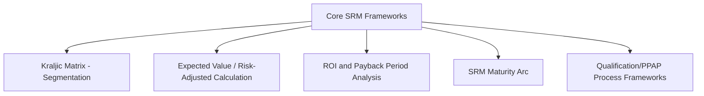
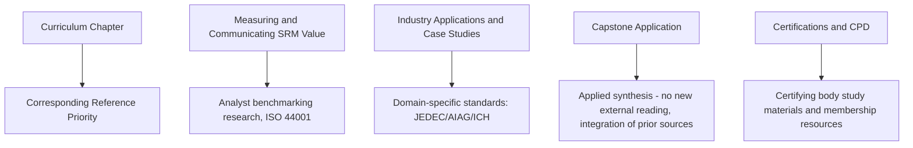

## Recommended Frameworks and Reference Reading

### Purpose and Scope

This item consolidates the analytical frameworks, standards, and reference source categories used throughout this curriculum into a single organized reference guide, mapping each framework or reading category to the specific curriculum topics where it was applied. It is intended as a study companion and ongoing professional reference rather than a new subject in itself, supplementing the certification pathways and association resources covered elsewhere in this chapter.

### Core Analytical Frameworks Used Throughout This Curriculum

| Framework | Purpose | Applied In |
| --- | --- | --- |
| Kraljic Matrix (supply risk × business impact) | Category and supplier segmentation | Segmenting a Sample Category Portfolio, Benchmarking Against Industry Standards |
| Expected-value risk calculation | Quantifying dual sourcing investment value under uncertainty | Building the Business Case for SRM Investment, Building a Dual Sourcing Business Case |
| ROI / Payback period analysis | Traditional financial justification alongside risk-adjusted framing | Building a Dual Sourcing Business Case |
| SRM maturity arc (Transactional → Ecosystem Partner) | Diagnosing organizational SRM sophistication and planning transformation | SRM Transformation Case Studies, Presenting an SRM Strategy Roadmap |
| PPAP / Qualification process frameworks | Technical and quality qualification of second sources | Dual Sourcing in Electronics and Semiconductors, Dual Sourcing in Automotive and Manufacturing |
| Root cause vs. proximate trigger analysis | Structured failure and incident post-mortem | Lessons From Supplier Relationship Failures, Simulating a Disruption and Activating a Second Source |

### Reference Standard Categories by Domain

**Key Points**

- Standards referenced throughout this curriculum should always be consulted in their current published edition, since revision cycles (particularly for quality and safety standards) can materially change specific requirements
- No single standard covers the full SRM/dual sourcing domain; practitioners typically need to draw from multiple standards bodies depending on category and industry focus, consistent with the organizational landscape covered under Industry Associations and Communities of Practice

```mermaid
flowchart LR
    A[Standards by Domain] --> B[Quality & Relationship Management]
    A --> C[Electronics/Semiconductor]
    A --> D[Automotive]
    A --> E[Pharma/Medical Device]
    B --> B1[ISO 44001]
    C --> C1[JEDEC, AEC-Q100/Q200]
    D --> D1[AIAG PPAP/FMEA, IATF 16949, ISO 26262]
    E --> E1[ICH Q7/Q12, FDA QSR, ISO 13485]
```

#### Quality and Collaborative Relationship Standards

- **ISO 44001**: Collaborative Business Relationship Management — referenced as a structural maturity reference point under Benchmarking Against Industry Standards

#### Electronics and Semiconductor Standards

- **JEDEC standards**: Semiconductor device package and electrical interoperability standards, referenced under Dual Sourcing in Electronics and Semiconductors
- **AEC-Q100/AEC-Q200**: Automotive-grade IC/passive component stress qualification standards, relevant where electronics and automotive qualification intersect
- **MIL-STD-883**: Military/aerospace microelectronics test methods

#### Automotive Standards

- **AIAG PPAP Manual and FMEA Handbook**: Defines the qualification evidence and failure-mode analysis methodology central to Dual Sourcing in Automotive and Manufacturing
- **IATF 16949**: Automotive quality management system certification standard
- **ISO 26262**: Functional safety for road vehicle electrical/electronic systems
- **ISO/SAE 21434**: Cybersecurity engineering for road vehicles

#### Pharmaceutical and Medical Device Standards

- **ICH Q7**: Good Manufacturing Practice for Active Pharmaceutical Ingredients
- **ICH Q12**: Lifecycle management and established conditions framework
- **FDA QSR / ISO 13485**: Medical device quality system regulation

### Recommended Reading Categories

Rather than prescribing a fixed reading list — which would risk becoming outdated or reflecting a narrow selection — this curriculum recommends building an ongoing reading practice across these categories:

#### 1. Analyst and Advisory Research

Gartner, Forrester, and The Hackett Group publish procurement and SRM maturity research, benchmarking data, and technology market analysis referenced under Benchmarking Against Industry Standards. [Unverified] Specific report titles and current findings should be sourced directly from these firms' current publications, since analyst research is continuously updated and specific past reports referenced in general industry discussion may no longer reflect current market conditions.

#### 2. Consulting Firm Procurement Research

Deloitte's Global CPO Survey, McKinsey procurement and supply chain research, and KPMG supply chain resilience publications provide recurring, periodically updated industry survey data referenced under SRM Transformation Case Studies and Crisis Response: Pandemic and Chip Shortage Lessons.

#### 3. Professional Body Publications

CIPS, ISM, and ASCM (covered in detail earlier in this chapter) each publish ongoing research, whitepapers, and practice guides beyond their certification study materials, generally accessible to members and often to non-members as well.

#### 4. Academic and Peer-Reviewed Supply Chain Research

Academic journals covering supply chain risk management, operations research, and procurement strategy provide more rigorously validated (though often less immediately practitioner-accessible) research than trade publications, useful for grounding frameworks like the expected-value risk calculation in more formal decision-theory literature.

#### 5. Standards Body Publications

The standards referenced in the table above (JEDEC, AIAG, ICH, ISO, etc.) are themselves primary reference reading for practitioners working in their respective category domains, distinct from general SRM literature.

### Building a Personal Reference Library

**Example**

A category manager whose portfolio spans both automotive castings and electronic components (similar to the composite portfolio in Segmenting a Sample Category Portfolio) would reasonably maintain an ongoing reference library combining: general SRM/procurement strategy material (from a certifying body membership per Industry Associations and Communities of Practice), current AIAG PPAP/FMEA manual editions for the automotive category, current JEDEC and AEC-Q100 documentation for the electronics category, and a subscription or access arrangement to at least one analyst benchmarking research source to support the annual benchmarking cycle described under Benchmarking Against Industry Standards.

### Mapping This Curriculum's Structure to Reference Reading Priorities

### Common Pitfalls in Reference Reading Practice

- **Relying on a single source type** (e.g., only vendor/analyst marketing material, or only one certifying body's materials) rather than triangulating across academic, standards-body, and practitioner sources
- **Using outdated standard editions**, particularly risky for safety- and quality-critical standards (ISO 26262, AIAG PPAP) where revisions can materially affect qualification requirements
- **Treating consulting firm survey findings as universally generalizable** without accounting for the specific respondent population, industry mix, and methodology behind any given survey
- **Neglecting academic/peer-reviewed sources** in favor of more accessible trade publications, missing more rigorously validated underlying research for frameworks like risk-adjusted expected value calculation
- **Building a reference library once and never updating it**, particularly problematic given the pace of change illustrated under Crisis Response: Pandemic and Chip Shortage Lessons

### Conclusion

This curriculum's frameworks and standards draw from a deliberately broad reference base — segmentation and risk-quantification frameworks, industry-specific technical and quality standards, and multiple categories of ongoing research and practitioner literature — because no single source adequately covers the full breadth of SRM and dual sourcing practice across industries. Maintaining an active, periodically refreshed reference practice across these categories, aligned to a practitioner's specific category and industry focus, is the most direct way to keep the frameworks and standards applied throughout this curriculum current and correctly applied in practice.

**Related Topics**

- Benchmarking Against Industry Standards
- Industry Associations and Communities of Practice
- CIPS Qualification Pathway
- ISM Certified Professional in Supply Management (CPSM)
- ASCM Certified Supply Chain Professional (CSCP) and CPIM
- Dual Sourcing in Electronics and Semiconductors
- Dual Sourcing in Automotive and Manufacturing
- Supply Resilience in Pharma and Medical Devices