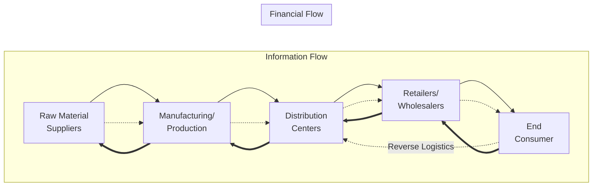

## Definition and Scope of Supply Chain Management

### Definition

Supply Chain Management (SCM) is the coordinated design, planning, execution, control, and monitoring of supply chain activities with the objective of creating net value, building a competitive infrastructure, leveraging worldwide logistics, synchronizing supply with demand, and measuring performance globally. It encompasses the integrated management of the flow of goods, services, information, and finances as they move from raw material sourcing through production, distribution, and ultimately to the end consumer — and, increasingly, back again through reverse logistics.

The Council of Supply Chain Management Professionals (CSCMP) frames SCM as encompassing the planning and management of all activities involved in sourcing, procurement, conversion, and logistics management, plus coordination and collaboration with channel partners, which can be suppliers, intermediaries, third-party service providers, and customers.

Two complementary lenses are useful for understanding SCM:

- **Process view**: SCM is a set of interlinked processes — plan, source, make, deliver, return (the basis of the SCOR model) — that convert inputs into outputs of value.
- **Network view**: SCM is the management of a network of organizations (tiers of suppliers, manufacturers, distributors, retailers) connected by upstream and downstream flows of product, information, and funds.

### Core Flows in a Supply Chain

Every supply chain, regardless of industry, is built around three interdependent flows:

- **Physical/product flow**: Movement of raw materials, work-in-progress, and finished goods from origin to consumption, including reverse flows (returns, recycling, repairs).
- **Information flow**: Demand forecasts, order status, inventory levels, shipment tracking, and performance data moving bidirectionally across the chain.
- **Financial flow**: Payment terms, credit, consignment arrangements, and ownership transfer tied to transactions between chain members.

$$\text{Supply Chain Performance} = f(\text{Product Flow}, \text{Information Flow}, \text{Financial Flow})$$

Misalignment between these flows — for example, information lagging behind physical movement — is a primary driver of inefficiencies such as the bullwhip effect.

### Scope of Supply Chain Management

SCM's scope spans strategic, tactical, and operational decision horizons:

**Strategic (long-term, network design)**

- Network configuration: number, location, and capacity of facilities (plants, warehouses, distribution centers)
- Make-vs-buy and outsourcing decisions
- Supplier selection and strategic partnerships
- Product/process design for supply chain efficiency (Design for Supply Chain)

**Tactical (mid-term, resource allocation)**

- Production and inventory policies
- Transportation strategy and carrier contracts
- Demand planning and sales & operations planning (S&OP)
- Supplier contracts and sourcing agreements

**Operational (short-term, execution)**

- Order fulfillment and scheduling
- Daily inventory replenishment
- Routing and dispatching of shipments
- Exception handling and expediting

### Functional Domains Covered

- **Procurement/Sourcing**: Supplier identification, qualification, negotiation, and contract management
- **Operations/Manufacturing**: Production planning, capacity management, quality control
- **Logistics**: Transportation, warehousing, materials handling, packaging
- **Inventory Management**: Safety stock, reorder points, economic order quantity (EOQ)
- **Demand Planning**: Forecasting, demand sensing, collaborative planning
- **Distribution**: Channel management, order fulfillment, last-mile delivery
- **Reverse Logistics**: Returns processing, remanufacturing, disposal
- **Supply Chain Information Systems**: ERP, WMS, TMS, EDI, APIs connecting trading partners

### Evolution of the Discipline

| Era | Focus | Characteristic |
| --- | --- | --- |
| Pre-1980s | Logistics/Physical Distribution | Functional silos, transportation and warehousing managed separately |
| 1980s–1990s | Integration | Internal cross-functional integration (procurement, ops, distribution) |
| 1990s–2000s | Extended Enterprise | Integration across firm boundaries with suppliers and customers |
| 2000s–2010s | Global SCM | Offshoring, global sourcing, complex multi-tier networks |
| 2010s–Present | Digital/Resilient SCM | Real-time visibility, analytics, risk resilience, sustainability (circular supply chains) |

### Key Objectives

- Minimizing total supply chain cost (procurement, production, inventory carrying, transportation, and transaction costs) while meeting service-level targets
- Maximizing customer service levels: order fill rate, on-time-in-full (OTIF) delivery, order cycle time
- Reducing lead time variability and improving responsiveness
- Optimizing asset utilization (inventory turns, capacity utilization)
- Building resilience against disruptions (the "efficiency vs. resilience" trade-off)

### Illustration: Basic End-to-End Supply Chain Scope

### **Example**

A smartphone manufacturer's supply chain scope includes: sourcing rare-earth minerals and semiconductor components from tier-2/tier-3 suppliers; contract manufacturing at tier-1 assembly partners; inbound logistics of components to assembly plants; outbound logistics of finished devices to regional distribution centers; last-mile delivery to retail stores or direct-to-consumer channels; and reverse logistics for warranty returns and e-waste recycling. Information systems (ERP, supplier portals) and financial flows (letters of credit, vendor payment terms) run in parallel across every stage.

### **Key Points**

- SCM is broader than logistics — logistics is a subset of SCM focused on physical movement and storage, whereas SCM also covers sourcing, production, and cross-organizational coordination.
- SCM spans multiple independent organizations, not just internal departments, requiring inter-firm coordination and trust.
- Scope extends across strategic network design down to daily operational execution.
- The three core flows (product, information, financial) must remain synchronized for the chain to function efficiently. [Inference: the degree of synchronization required varies by industry and is not universally quantifiable]

### **Related Topics**

- Supply Chain vs. Logistics Management: Distinctions and Overlaps
- The SCOR Model (Plan-Source-Make-Deliver-Return)
- Upstream vs. Downstream Supply Chain Activities
- Bullwhip Effect and Information Distortion
- Supply Chain Network Design
- Global vs. Domestic Supply Chains