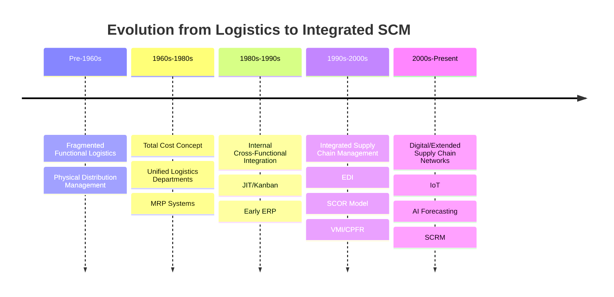

## Evolution from Logistics to Integrated Supply Chain Management

### Overview

The evolution from logistics to integrated supply chain management (SCM) represents a shift from siloed, functionally-isolated operations toward a unified, cross-organizational system of value delivery. This progression is typically modeled across four to five distinct eras, each characterized by a change in scope (from single-function to multi-tier), technology enablement, and the locus of optimization (from local/departmental to global/network-wide).

### Stage 1: Fragmented/Functional Logistics (Pre-1950s–1960s)

**Key Points**

- Logistics activities (transportation, warehousing, inventory) were managed as independent, disconnected functions, each with its own budget, KPIs, and management hierarchy
- Origin heavily rooted in military logistics doctrine (WWII supply corps), later adapted to civilian industry
- Physical Distribution Management (PDM) emerged as an early term, referring narrowly to the outbound movement of finished goods
- No formal linkage between procurement, production planning, and distribution; each department optimized its own cost function independently, often at the expense of total system cost

**Characteristics**

- Inventory held in large, decentralized buffers to compensate for lack of coordination (the "just-in-case" model)
- Paper-based order processing and manual forecasting
- Transportation selection based on lowest unit freight cost rather than total landed cost
- Organizational structure: logistics functions reported to different VPs (e.g., warehousing under Operations, transportation under Sales)

### Stage 2: Integrated Logistics Management (1960s–1980s)

**Key Points**

- Introduction of the **Total Cost Concept**: recognizing that minimizing cost in one function (e.g., transportation) could increase cost elsewhere (e.g., inventory carrying cost), and that trade-offs must be evaluated holistically
- Formation of unified logistics departments consolidating transportation, warehousing, inventory control, and order processing under a single management function
- Emergence of Materials Requirements Planning (MRP) systems in manufacturing (early 1970s), enabling synchronized production scheduling with component inventory

**Total Cost Trade-off Model**

$$TC = C_t + C_w + C_i + C_o + C_s$$

Where $C_t$ = transportation cost, $C_w$ = warehousing cost, $C_i$ = inventory carrying cost, $C_o$ = order processing cost, $C_s$ = stockout/service-level cost. The core insight of this era: minimizing $TC$ as a whole often requires increasing an individual cost component (e.g., $C_t$ via faster/costlier freight) to reduce a larger downstream cost (e.g., $C_i$ or $C_s$).

- The **Council of Logistics Management (CLM)**, founded 1963, formalized logistics as a discipline distinct from marketing and operations
- Physical Distribution matured into "Business Logistics," covering both inbound materials management and outbound distribution

### Stage 3: Internal Integration / Cross-Functional Logistics (1980s–1990s)

**Key Points**

- Logistics integrated with procurement, manufacturing, and customer service under a single internal umbrella — often termed "Integrated Logistics Management"
- Deregulation of transportation industries (U.S. Motor Carrier Act 1980, Staggers Rail Act 1980) enabled dynamic carrier selection and negotiated contracts, increasing the strategic value of logistics planning
- Just-In-Time (JIT) and Kanban systems (popularized via Toyota Production System) forced tighter coordination between suppliers and manufacturers, exposing the limits of purely internal optimization
- Introduction of Enterprise Resource Planning (ERP) systems (early SAP R/2, R/3 in the late 1980s) began unifying financial, manufacturing, and logistics data on shared platforms
- Quick Response (QR) in retail/apparel and Efficient Consumer Response (ECR) in grocery emerged as early cross-company collaboration models, directly foreshadowing SCM

**Organizational Shift**

- Logistics functions consolidated under a single Chief Logistics Officer or VP of Logistics
- Cost-center thinking begins shifting toward process-based thinking (order-to-delivery cycle time becomes a tracked metric, not just departmental cost)

### Stage 4: Integrated Supply Chain Management (1990s–2000s)

**Key Points**

- The term "Supply Chain Management" is generally attributed to consultants Keith Oliver and R. (Ray) William Booz Allen Hamilton in 1982, though the concept did not achieve mainstream academic and industry adoption until the 1990s
- SCM extends integration beyond the firm's boundaries to include suppliers' suppliers and customers' customers — the full upstream-to-downstream network
- Shift in unit of competition: strategic rivalry moves from "company vs. company" to "supply chain vs. supply chain"
- The **Bullwhip Effect** was formally analyzed (Lee, Padmanabhan, Whang, 1997), demonstrating how demand variability amplifies upstream due to lack of information sharing — providing the theoretical justification for cross-firm integration

**The Bullwhip Effect (demand amplification)**

<svg xmlns="http://www.w3.org/2000/svg" viewBox="0 0 700 320">
<text x="350" y="24" font-size="16" font-weight="bold" text-anchor="middle" fill="#1a1a1a">Bullwhip Effect: Order Variance Amplification Upstream (svg_diagram)</text>
<line x1="60" y1="280" x2="660" y2="280" stroke="#333" stroke-width="1.5" />
<line x1="60" y1="280" x2="60" y2="50" stroke="#333" stroke-width="1.5" />
<text x="360" y="305" font-size="12" text-anchor="middle" fill="#333">Time</text>
<text x="30" y="160" font-size="12" text-anchor="middle" fill="#333" transform="rotate(-90 30 160)">Order Qty</text>
<polyline points="80,220 110,215 140,222 170,218 200,220 230,216 260,219" fill="none" stroke="#2166ac" stroke-width="2" />
<text x="270" y="215" font-size="11" fill="#2166ac">Retailer (POS demand)</text>
<polyline points="80,230 110,200 140,235 170,190 200,230 230,185 260,225" fill="none" stroke="#41ab5d" stroke-width="2" />
<text x="270" y="185" font-size="11" fill="#41ab5d">Wholesaler</text>
<polyline points="80,250 110,170 140,255 170,140 200,250 230,130 260,245" fill="none" stroke="#f46d43" stroke-width="2" />
<text x="270" y="140" font-size="11" fill="#f46d43">Distributor</text>
<polyline points="80,270 110,110 140,275 170,80 200,270 230,65 260,270" fill="none" stroke="#d73027" stroke-width="2" />
<text x="270" y="80" font-size="11" fill="#d73027">Manufacturer</text>

<text x="360" y="35" font-size="11" text-anchor="middle" fill="#555">Small variance at POS → amplified variance at each upstream tier</text>

</svg>

- **Enabling technologies**: Electronic Data Interchange (EDI) matured for B2B transactions; the internet and early e-commerce (mid-to-late 1990s) enabled real-time data visibility; Advanced Planning and Scheduling (APS) systems and ERP suites (SAP, Oracle, PeopleSoft) extended into Supply Chain Planning (SCP) modules
- **Vendor Managed Inventory (VMI)** and **Collaborative Planning, Forecasting, and Replenishment (CPFR)** formalized as practices where suppliers take on inventory replenishment responsibility using shared point-of-sale data, directly counteracting the bullwhip effect
- Academic formalization: the Supply Chain Council released the **SCOR (Supply Chain Operations Reference)** model in 1996, providing a standardized framework of five core processes — Plan, Source, Make, Deliver, Return — enabling cross-industry benchmarking

### Stage 5: Extended/Digital Supply Chain Networks (2000s–Present)

**Key Points**

- Integration extends from linear "chain" thinking to **Supply Chain Networks** and **Supply Chain Ecosystems**, acknowledging that most firms participate in multiple, overlapping, non-linear supply chains
- **Global Supply Chain Management**: offshoring, multi-tier supplier networks spanning continents, and complex logistics involving multimodal freight, customs, and trade compliance
- Rise of **Supply Chain Risk Management (SCRM)** as a formal discipline following major disruption events (9/11 in 2001, the 2011 Tōhoku earthquake/tsunami disrupting automotive and electronics supply chains, and the COVID-19 pandemic in 2020) which exposed the fragility of lean, globally-dispersed, single-sourced networks
- Technology layer expands to include: Warehouse Management Systems (WMS), Transportation Management Systems (TMS), Internet of Things (IoT) sensor tracking, blockchain for provenance/traceability, and AI/ML-driven demand forecasting
- **Digital Supply Chain / Supply Chain 4.0**: real-time, end-to-end visibility platforms (control towers) providing a unified data layer across all tiers, often positioned as the successor stage to traditional SCM
- Strategic re-balancing post-2020 from pure cost-minimization ("lean," single-source, just-in-time) toward resilience-weighted design ("agile," dual/multi-sourcing, regionalization/nearshoring, safety stock buffers) — a trade-off formalized in supply chain literature as the **efficiency-resilience frontier**

### Comparative Summary Table

| Era | Approx. Period | Scope of Optimization | Key Enabler | Dominant Metric |
| --- | --- | --- | --- | --- |
| Fragmented Logistics | Pre-1960s | Single function | Manual/paper processes | Departmental unit cost |
| Integrated Logistics | 1960s–1980s | Total logistics cost | MRP, unified logistics dept. | Total cost trade-off |
| Internal Integration | 1980s–1990s | Cross-functional (firm-wide) | ERP, JIT/Kanban | Order-to-delivery cycle time |
| Integrated SCM | 1990s–2000s | Inter-firm (chain-wide) | EDI, Internet, SCOR, VMI/CPFR | Bullwhip reduction, fill rate |
| Digital/Network SCM | 2000s–present | Network/ecosystem-wide | IoT, AI/ML, control towers, blockchain | End-to-end visibility, resilience |

### Mermaid: Evolutionary Timeline

### Worked Example: Total Cost Trade-off in Practice

A manufacturer ships components via ocean freight (low $C_t$, long lead time) versus air freight (high $C_t$, short lead time).

- Ocean freight: $C_t = \$2{,}000$/container, 30-day transit → requires 45 days of safety stock, so $C_i = \$18{,}000$ → $TC = \$20{,}000$
- Air freight: $C_t = \$14{,}000$/container, 3-day transit → requires 8 days of safety stock, so $C_i = \$3{,}200$ → $TC = \$17{,}200$

Despite air freight's transportation cost being 7x higher, total system cost is lower once inventory carrying cost is included — illustrating why Stage 2's total cost concept was a prerequisite for later cross-firm SCM thinking: local optimization ($C_t$ alone) produces a worse system-level outcome.

### Common Misconceptions

- **"Logistics and SCM are synonyms."** [Inference] Industry usage varies, but the standard distinction (per CSCMP) is that logistics is the subset of SCM concerned with the flow and storage of goods, while SCM additionally encompasses procurement, production planning, demand planning, and inter-firm relationship coordination.
- **"SCOR and SCM are the same thing."** SCOR is a reference model (a description and benchmarking framework) for supply chain processes, not the discipline of SCM itself.
- **"The bullwhip effect is caused only by poor forecasting."** It is primarily an information-asymmetry and batching/lead-time phenomenon; even with perfect local forecasting, order batching, price fluctuations, and rationing/gaming behavior independently generate amplification.

**Related Topics**

- SCOR Model: Plan-Source-Make-Deliver-Return framework in depth
- Bullwhip Effect: causes, quantification, and mitigation (information sharing, VMI, CPFR)
- Total Cost of Ownership (TCO) and Total Landed Cost analysis
- Vendor Managed Inventory (VMI) and CPFR implementation mechanics
- Supply Chain Risk Management and the resilience-efficiency frontier
- Digital Supply Chain / Control Tower architectures
- Tiered Supplier Network Structures (Tier 1/2/3 mapping)