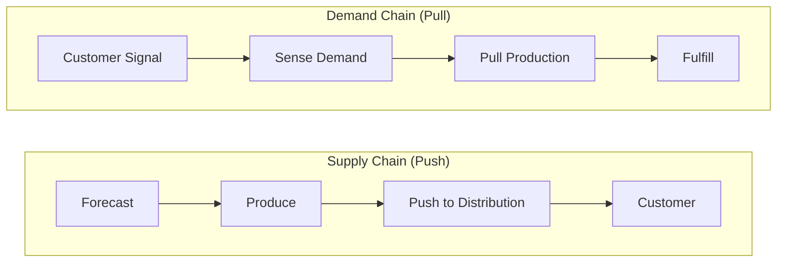

## Supply Chain versus Value Chain versus Demand Chain

### Overview

These three terms are frequently used interchangeably in practice but originate from distinct theoretical traditions, carry different unit-of-analysis assumptions, and orient analysis toward different strategic questions. Supply chain thinking is operational and flow-oriented; value chain thinking is strategic and margin-oriented; demand chain thinking is customer-oriented and pull-based. Understanding the distinctions clarifies which framework to apply for a given analytical problem.

### Supply Chain: Definition and Origin

**Key Points**

- A **supply chain** is the network of organizations, people, activities, information, and resources involved in moving a product or service from raw material to end customer
- Operational/logistical framing: emphasis on physical and information flows — sourcing, production, inventory, transportation, and distribution
- Unit of analysis: the flow of material and information across multiple firms (upstream suppliers → focal firm → downstream distributors/retailers)
- Standard reference framework: the **SCOR model** (Plan, Source, Make, Deliver, Return) operationalizes supply chain processes for measurement and benchmarking
- Core question answered: *"How do goods and information physically move from origin to consumption, and how efficiently?"*

**Typical Structure**

### Value Chain: Definition and Origin

**Key Points**

- Introduced by Michael Porter in *Competitive Advantage* (1985); a **value chain** is the set of activities a firm performs to design, produce, market, deliver, and support its product, decomposed to identify where value is added and where competitive advantage or cost differentiation arises
- Strategic/economic framing: emphasis on margin capture and value-adding activities within (and across) a firm, not primarily on physical movement
- Unit of analysis: discrete activities categorized as **Primary Activities** (Inbound Logistics, Operations, Outbound Logistics, Marketing & Sales, Service) and **Support Activities** (Firm Infrastructure, HR Management, Technology Development, Procurement)
- Core question answered: *"At which activities is value created, and how much margin does each contribute relative to its cost?"*
- Note that "Inbound Logistics" and "Outbound Logistics" are themselves two of Porter's five primary activities — meaning the supply chain is technically a subset/instantiation of the value chain's logistics-related primary activities, not a parallel or competing concept

**Porter's Value Chain Structure**

<svg xmlns="http://www.w3.org/2000/svg" viewBox="0 0 700 300">
<text x="350" y="22" font-size="16" font-weight="bold" text-anchor="middle" fill="#1a1a1a">Porter's Generic Value Chain (svg_diagram)</text>
<rect x="40" y="40" width="620" height="50" fill="#dbe9f6" stroke="#2166ac" stroke-width="1" />
<text x="350" y="70" font-size="12" text-anchor="middle" fill="#1a1a1a">Firm Infrastructure</text>
<rect x="40" y="90" width="620" height="40" fill="#e3f0da" stroke="#41ab5d" stroke-width="1" />
<text x="350" y="115" font-size="12" text-anchor="middle" fill="#1a1a1a">Human Resource Management</text>
<rect x="40" y="130" width="620" height="40" fill="#e3f0da" stroke="#41ab5d" stroke-width="1" />
<text x="350" y="155" font-size="12" text-anchor="middle" fill="#1a1a1a">Technology Development</text>
<rect x="40" y="170" width="620" height="40" fill="#e3f0da" stroke="#41ab5d" stroke-width="1" />
<text x="350" y="195" font-size="12" text-anchor="middle" fill="#1a1a1a">Procurement</text>
<rect x="40" y="210" width="124" height="60" fill="#fde3cf" stroke="#f46d43" stroke-width="1" />
<text x="102" y="245" font-size="11" text-anchor="middle" fill="#1a1a1a">Inbound Logistics</text>
<rect x="164" y="210" width="124" height="60" fill="#fde3cf" stroke="#f46d43" stroke-width="1" />
<text x="226" y="245" font-size="11" text-anchor="middle" fill="#1a1a1a">Operations</text>
<rect x="288" y="210" width="124" height="60" fill="#fde3cf" stroke="#f46d43" stroke-width="1" />
<text x="350" y="245" font-size="11" text-anchor="middle" fill="#1a1a1a">Outbound Logistics</text>
<rect x="412" y="210" width="124" height="60" fill="#fde3cf" stroke="#f46d43" stroke-width="1" />
<text x="474" y="245" font-size="11" text-anchor="middle" fill="#1a1a1a">Marketing &amp; Sales</text>
<rect x="536" y="210" width="124" height="60" fill="#fde3cf" stroke="#f46d43" stroke-width="1" />
<text x="598" y="245" font-size="11" text-anchor="middle" fill="#1a1a1a">Service</text>
<polygon points="660,210 690,240 660,270" fill="#f9c74f" stroke="#333" stroke-width="1" />
<text x="668" y="245" font-size="14" font-weight="bold" fill="#1a1a1a">M</text>
<text x="668" y="260" font-size="10" fill="#1a1a1a">Margin</text>

<text x="350" y="290" font-size="11" text-anchor="middle" fill="#555">Support Activities (top) enable Primary Activities (bottom) → Margin</text>

</svg>

### Demand Chain: Definition and Origin

**Key Points**

- A **demand chain** reframes the same physical network from the customer backward: it begins with understanding and shaping customer demand (segmentation, demand sensing, personalization) and works upstream to determine what should be produced/sourced, rather than starting from supply capacity and pushing product downstream
- Coined and popularized in contrast to supply chain thinking by researchers including Martin Christopher and, separately, the demand-chain-management literature of the late 1990s/2000s (e.g., Walters and Rainbird), and echoed in Hewlett-Packard's internal "demand chain" language during 1990s SCM discussions
- Core distinction from supply chain: supply chain is fundamentally a **push-oriented flow model** (produce based on forecast, push to market); demand chain is a **pull-oriented flow model** (produce based on realized or sensed demand signal, pulled from the point of consumption backward)
- Core question answered: *"What does the customer actually want, and how do we configure upstream activities to satisfy that demand efficiently?"*
- In practice, demand chain management (DCM) overlaps heavily with **demand-driven supply chain** practices: Available-to-Promise (ATP), Sales & Operations Planning (S&OP) integrated with real-time POS data, and postponement strategies (delaying final configuration until actual demand is known)

**Push vs. Pull Orientation Compared**

### Comparative Analysis

| Dimension | Supply Chain | Value Chain | Demand Chain |
| --- | --- | --- | --- |
| Origin | Logistics/operations management practice | Porter, *Competitive Advantage* (1985) | Marketing/demand-management literature (1990s–2000s) |
| Primary orientation | Flow of goods & information | Value creation & margin capture | Customer demand signal propagation |
| Direction of analysis | Upstream → downstream (push) | Sequential activities within firm | Downstream → upstream (pull) |
| Unit of analysis | Firms/nodes in a network | Discrete value-adding activities | Demand signals and customer segments |
| Central metric | Cost, lead time, service level, fill rate | Margin, competitive advantage, differentiation | Forecast accuracy, demand sensing latency, ATP |
| Scope | Inter-organizational (multi-firm) | Primarily intra-firm (extendable to value system) | Inter-organizational, customer-anchored |
| Governing question | "How do we move goods efficiently?" | "Where do we create value profitably?" | "What does the customer want, and how do we respond?" |

### Porter's Extension: The Value System

**Key Points**

- Porter explicitly acknowledged that a firm's value chain does not exist in isolation — it sits within a **value system** comprising supplier value chains, channel value chains, and buyer value chains
- This value system concept is the direct conceptual bridge between value chain analysis (intra-firm) and supply chain analysis (inter-firm): the value system is essentially Porter's value chain framework applied at the network level, closely paralleling what SCM literature independently calls the supply chain
- [Inference] Much of the terminological confusion in industry between "supply chain" and "value chain" stems from this overlap — practitioners often use "value chain" loosely to mean the same inter-firm network that supply chain literature describes, even though Porter's original formulation was primarily an intra-firm diagnostic tool

### Worked Example: Same Company, Three Lenses

Consider a laptop manufacturer such as Dell in its build-to-order era:

- **Supply chain lens**: Component suppliers (chips, screens, batteries) ship to Dell's assembly plants; finished units move through minimal-inventory distribution directly to customers. Focus: lead time reduction, inventory turns, supplier lead time variability.
- **Value chain lens**: Dell's direct-sales model (bypassing retail Outbound Logistics/Marketing costs) is examined as a source of cost advantage versus competitors who route through retail channels. Focus: where does Dell's activity configuration create a cost or differentiation advantage versus HP or Lenovo?
- **Demand chain lens**: A customer configures a custom laptop on Dell's website; this order (a specific demand signal) pulls the exact required components into assembly ("build-to-order," a demand-driven/postponement strategy) rather than Dell forecasting and pre-building standard configurations. Focus: how quickly and accurately does the realized customer order propagate upstream to trigger the correct sourcing and assembly actions?

### Common Misconceptions

- **"Value chain and supply chain are competing frameworks."** [Inference] They are more accurately complementary lenses on overlapping subject matter: value chain analysis asks *where* value/margin is created; supply chain analysis asks *how* physical/information flow is executed. A mature analysis often uses both — e.g., using SCOR to map operational flow and Porter's framework to identify which nodes in that flow are strategically differentiating versus merely table-stakes.
- **"Demand chain management is just demand forecasting."** DCM is broader — it includes demand *shaping* (pricing, promotions influencing demand) and demand *sensing* (near-real-time signal capture via POS/IoT), not solely predictive forecasting.
- **"A supply chain only refers to physical goods."** Modern supply chain scope explicitly includes information flows and financial flows (e.g., invoicing, trade finance) alongside physical material flows — this is a standard element of contemporary SCM definitions (e.g., CSCMP), not a special case.

**Related Topics**

- SCOR Model deep dive: Plan-Source-Make-Deliver-Return
- Porter's Five Forces and its relationship to value chain analysis
- Push vs. pull systems and the push-pull boundary (order penetration point)
- Postponement strategy and mass customization
- Demand sensing and Sales & Operations Planning (S&OP)
- Value system / extended value chain across suppliers, channels, and buyers