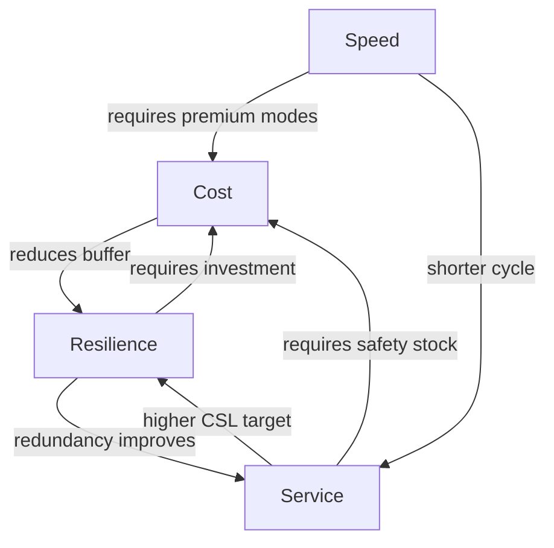

## Core Objectives: Cost, Service, Speed, and Resilience

### Overview

Supply chain design is fundamentally a multi-objective optimization problem across four interdependent dimensions: cost, service, speed, and resilience. These objectives are not independently maximizable — improving one typically imposes trade-offs on at least one other, and the central discipline of supply chain strategy is selecting an explicit, deliberate position along these trade-off frontiers rather than allowing it to emerge by default. Post-2020 supply chain literature (accelerated by pandemic-era disruptions) has elevated resilience from an implicit risk-management afterthought to a co-equal, explicitly engineered objective alongside the traditional cost-service-speed triad.

### Objective 1: Cost

**Key Points**

- Cost minimization is the historically dominant objective, rooted in the Total Cost Concept (see logistics evolution history): the sum of transportation, warehousing, inventory carrying, order processing, and stockout costs
- Key cost categories: **fixed costs** (facilities, equipment, long-term contracts) versus **variable costs** (per-unit transport, per-order processing, per-unit-time inventory holding)
- **Total Landed Cost (TLC)** extends unit purchase price to include freight, duties, insurance, currency risk, and inventory carrying cost — critical for comparing global sourcing options where low unit price can mask high total cost
- Standard inventory carrying cost components: capital cost (opportunity cost of tied-up capital), storage cost, obsolescence/shrinkage risk, insurance, and taxes — commonly expressed as an annual percentage of inventory value (typically 15–30% depending on industry)

**Cost Trade-off Formalization**

$$TLC = P_u \times Q + C_f + C_i + C_d + C_{fx}$$

Where $P_u$ = unit purchase price, $Q$ = quantity, $C_f$ = freight cost, $C_i$ = inventory carrying cost, $C_d$ = duties/tariffs, $C_{fx}$ = currency/FX risk exposure cost

### Objective 2: Service (Level)

**Key Points**

- Service level is typically operationalized as **fill rate** (percentage of demand satisfied immediately from stock) or **cycle service level (CSL)** (probability of not stocking out during a replenishment cycle)
- Standard formula linking service level to safety stock under normally-distributed demand:

$$SS = z \times \sigma_L$$

Where $SS$ = safety stock, $z$ = the z-score corresponding to the target cycle service level (e.g., $z = 1.65$ for 95% CSL), and $\sigma_L$ = standard deviation of demand during lead time

- Service level and inventory cost exhibit a well-documented **diminishing-returns relationship**: due to the properties of the normal distribution, moving service level from 95% to 99% requires disproportionately more safety stock than moving from 90% to 95% — a standard result in inventory theory, not merely an empirical tendency
- Other service metrics: **perfect order rate** (orders delivered complete, on-time, damage-free, correctly documented — a composite metric multiplying several individual sub-rates), **order cycle time consistency** (variance in delivery time, which customers often value as much as average speed)
- [Inference] In B2B and industrial contexts, service level is frequently weighted more heavily than raw cost, since a stockout can halt a customer's downstream production line — the cost of a stockout to the *customer* may vastly exceed its cost to the supplying firm, justifying asymmetric investment in service

### Objective 3: Speed

**Key Points**

- Speed encompasses both **lead time** (time from order placement to fulfillment) and **cycle time** (time for a complete process loop, e.g., procure-to-pay or order-to-cash)
- Distinguish **time-to-market** (speed of new product introduction) from **time-to-customer** (speed of order fulfillment) — both are "speed" objectives but engage different supply chain levers
- Key enabling strategy: **postponement** — delaying product differentiation/final assembly until closer to the point of actual demand, reducing the *responsive* lead time customers experience while still allowing upstream processes to run on longer, more cost-efficient cycles
- **Order Penetration Point (OPP)** / decoupling point: the point in the value chain where a customer order triggers customization, separating forecast-driven (push) upstream activity from order-driven (pull) downstream activity — moving the OPP further upstream generally increases responsiveness but exposes more of the process to forecast-driven push risk
- Speed-cost trade-off is explicit in mode selection: air freight versus ocean freight, expedited versus standard carrier tiers — each incremental speed gain typically carries a super-linear cost premium

### Objective 4: Resilience

**Key Points**

- Resilience is the supply chain's capacity to **anticipate**, **absorb**, **respond to**, and **recover from** disruptions while maintaining core function — formalized heavily in academic and practitioner literature following 9/11 (2001), the 2011 Tōhoku earthquake/tsunami (which halted global automotive and semiconductor supply for months), and the COVID-19 pandemic (2020–2022)
- Distinguished from **robustness** (resisting disruption without performance loss) and from **agility** (rapid reconfiguration in response to demand-side volatility) — resilience is often treated as the broader capability encompassing both
- Key resilience levers:
  - **Redundancy**: safety stock buffers, dual/multi-sourcing, backup capacity — directly costs money in the absence of disruption (an "insurance premium")
  - **Flexibility**: modular product design, flexible manufacturing capable of multiple product lines, supplier base with interchangeable qualification
  - **Visibility**: real-time, multi-tier (not just Tier-1) monitoring — a major post-2011 finding was that most firms lacked visibility past Tier 1, and disruptions frequently originated at Tier 2/3 suppliers invisible to the focal firm
  - **Diversification/regionalization**: nearshoring, "China+1" sourcing strategies, geographic dispersion of production to avoid single-region concentration risk
- [Speculation] The degree to which firms should permanently shift toward redundancy-heavy resilience strategies versus reverting to pre-pandemic lean/JIT norms remains actively contested in both academic and practitioner literature as of the mid-2020s, with outcomes likely varying substantially by industry criticality and disruption exposure

### The Four-Way Trade-off Model

<svg xmlns="http://www.w3.org/2000/svg" viewBox="0 0 640 480">
<text x="320" y="24" font-size="16" font-weight="bold" text-anchor="middle" fill="#1a1a1a">Cost–Service–Speed–Resilience Trade-off Space (svg_diagram)</text>
<line x1="320" y1="60" x2="320" y2="420" stroke="#888" stroke-width="1" />
<line x1="120" y1="240" x2="520" y2="240" stroke="#888" stroke-width="1" />

<text x="320" y="50" font-size="13" text-anchor="middle" fill="`#2166ac`" font-weight="bold">Speed (high)</text>

<text x="320" y="440" font-size="13" text-anchor="middle" fill="`#2166ac`" font-weight="bold">Cost (low)</text>

<text x="90" y="244" font-size="13" text-anchor="middle" fill="`#41ab5d`" font-weight="bold">Resilience (high)</text>

<text x="550" y="244" font-size="13" text-anchor="middle" fill="`#f46d43`" font-weight="bold">Service (high)</text>

<polygon points="320,90 460,240 320,390 180,240" fill="#dbe9f6" stroke="#2166ac" stroke-width="1.5" opacity="0.5" />
<text x="320" y="150" font-size="11" text-anchor="middle" fill="#1a1a1a">Lean / JIT</text>
<text x="320" y="165" font-size="10" text-anchor="middle" fill="#555">(fast, cheap, fragile)</text>
<polygon points="320,110 200,240 320,370 440,240" fill="#fde3cf" stroke="#f46d43" stroke-width="1.5" opacity="0.5" />
<text x="320" y="280" font-size="11" text-anchor="middle" fill="#1a1a1a">Resilient / Buffered</text>
<text x="320" y="295" font-size="10" text-anchor="middle" fill="#555">(robust, costly, slower to change)</text>
<circle cx="320" cy="240" r="4" fill="#333" />
</svg>

### Illustrative Trade-off Matrix

| Strategy Lever | Cost Impact | Service Impact | Speed Impact | Resilience Impact |
| --- | --- | --- | --- | --- |
| Increase safety stock | ↑ (carrying cost) | ↑ | ↔ | ↑ |
| Single-source lowest-cost supplier | ↓ | ↔/↓ (quality risk) | ↔ | ↓↓ |
| Dual/multi-sourcing | ↑ (premium, complexity) | ↔/↑ | ↔ | ↑↑ |
| Air freight over ocean | ↑↑ | ↑ | ↑↑ | ↑ (shorter exposure window) |
| Postponement / late differentiation | ↔/↓ (pooled variability) | ↑ | ↑ | ↑ |
| Regionalize/nearshore production | ↑ (typically) | ↑ (shorter lead time) | ↑ | ↑↑ |
| Reduce SKU complexity | ↓ | ↔/↓ (less customization) | ↑ | ↑ |

Legend: ↑ improves/increases, ↓ worsens/decreases, ↔ largely neutral. [Inference] Directional signs represent typical/expected effects documented in supply chain strategy literature; actual magnitude is context- and industry-dependent.

### Mermaid: Objective Interdependency Map

### Worked Example: Safety Stock Sizing Under Competing Objectives

A distributor has weekly demand with $\sigma_L = 120$ units during a 2-week lead time. Compare safety stock (cost driver) required at two service levels:

- 90% CSL ($z = 1.28$): $SS = 1.28 \times 120 = 153.6 \approx 154$ units
- 99% CSL ($z = 2.33$): $SS = 2.33 \times 120 = 279.6 \approx 280$ units

Moving from 90% to 99% service level (a 9-point improvement) requires an 82% increase in safety stock — a concrete illustration of the diminishing-returns cost-service trade-off referenced above. A resilience-oriented redesign (e.g., dual sourcing to reduce $\sigma_L$ itself, rather than just buffering against it) can lower required $SS$ at a given service level, illustrating how a resilience lever can outperform a pure inventory-buffering lever on both cost and service simultaneously.

### Common Misconceptions

- **"Resilience is just extra safety stock."** [Inference] While safety stock is one resilience lever, contemporary resilience frameworks (e.g., MIT Center for Transportation and Logistics research post-2011) emphasize that visibility and flexibility levers can improve resilience with lower permanent cost burden than pure inventory redundancy, since they enable *response* to disruption rather than only *absorption* of it.
- **"Faster is always better for the customer."** Speed only creates value up to the point where it matches the customer's actual need; sub-industrial/commodity segments frequently exhibit low marginal willingness-to-pay beyond a "good enough" delivery window, making the cost of further speed improvements unjustified.
- **"These four objectives can be simultaneously maximized with the right technology."** Barring genuine step-change innovation, all four objectives compete for the same underlying resources (capital, capacity, inventory); technology can shift the trade-off frontier outward (Pareto improvement) but does not eliminate the trade-off structure itself.

**Related Topics**

- Safety stock calculation methods and service level modeling
- Order Penetration Point and postponement strategy design
- Supply Chain Risk Management (SCRM) frameworks
- Total Landed Cost analysis for global sourcing decisions
- Lean vs. agile vs. resilient supply chain paradigms
- Multi-tier supplier visibility and mapping