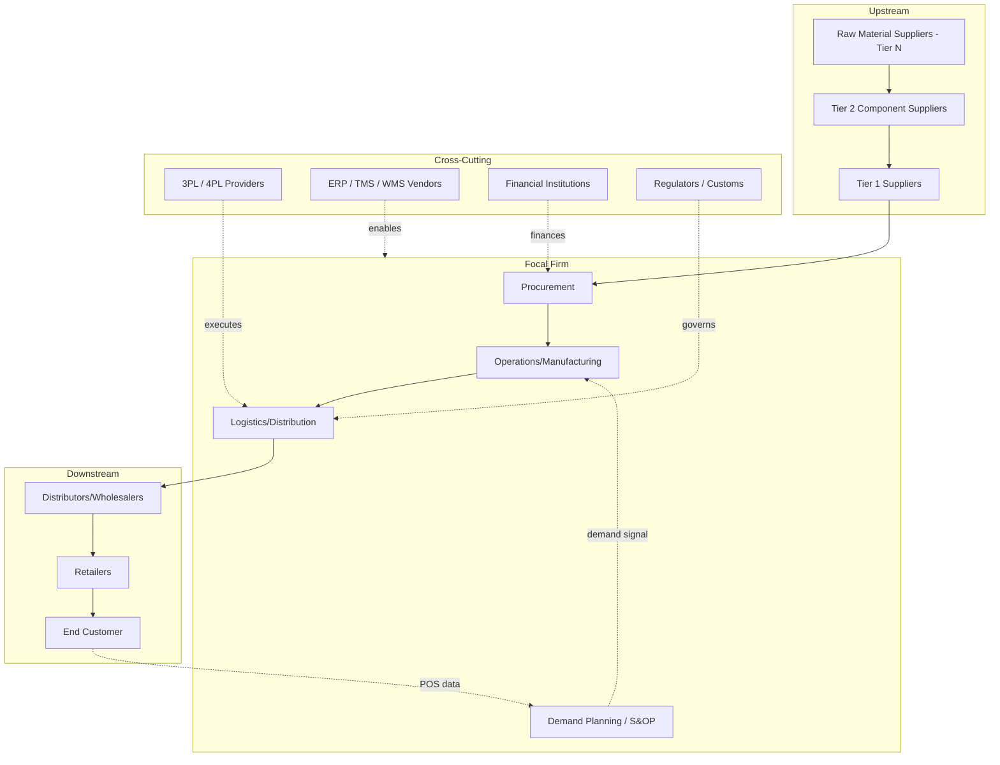

## Key Stakeholders and Roles Across the Chain

### Overview

A supply chain is a multi-actor system in which each stakeholder holds distinct objectives, information sets, and incentive structures. Effective supply chain design requires understanding not just the physical flow of goods but the organizational boundaries, contractual relationships, and information asymmetries between these actors, since misaligned incentives between stakeholders (rather than physical/technical constraints) are frequently the root cause of systemic inefficiencies such as the bullwhip effect.

### Upstream Stakeholders

**Raw Material / Commodity Suppliers**

- Extract or produce base inputs (minerals, agricultural commodities, base chemicals)
- Typically operate with high fixed-asset intensity and long capacity-adjustment lead times, making them relatively unresponsive to short-term demand fluctuations
- Often positioned as **Tier-N** suppliers (N ≥ 2), several tiers removed from the focal firm, and frequently invisible in the focal firm's direct risk-monitoring systems — a well-documented gap exposed during the 2011 Tōhoku disruption, where critical semiconductor and resin suppliers at Tier 2/3 were unknown to many automotive OEMs

**Component/Sub-Assembly Manufacturers (Tier 1/Tier 2 Suppliers)**

- **Tier 1** suppliers contract directly with the focal (OEM/brand) firm and typically deliver higher-value, more differentiated sub-assemblies
- **Tier 2** suppliers supply Tier 1 firms rather than the focal firm directly
- Key role: bear significant engineering and quality-conformance responsibility; in modern OEM relationships (especially automotive and electronics), Tier 1 suppliers frequently co-design components rather than merely manufacturing to a fixed specification

**Contract Manufacturers (CMs) / Original Design Manufacturers (ODMs)**

- Provide manufacturing capacity as a service to brand owners who retain design/IP or, in ODM arrangements, provide both design and manufacturing
- Common in electronics (e.g., Foxconn-type CM relationships) and apparel
- Key stakeholder tension: CMs typically serve multiple competing brand clients from shared capacity, creating potential capacity-allocation conflicts during demand surges

### Focal Firm Functions

**Procurement / Sourcing**

- Owns supplier selection, contract negotiation, and supplier relationship management
- Core tension: cost minimization (favoring competitive bidding, single-sourcing at scale) versus resilience (favoring supplier diversification, dual-sourcing) — see Core Objectives topic
- Increasingly holds responsibility for **supplier risk assessment**, extending beyond Tier 1 into sub-tier mapping

**Operations / Manufacturing**

- Owns production planning, capacity utilization, and quality control
- Interfaces with S&OP (Sales & Operations Planning) to reconcile demand forecasts against production capacity

**Logistics / Distribution**

- Owns inbound and outbound physical movement: transportation mode selection, warehouse network design, last-mile delivery
- Increasingly merged with broader "Supply Chain" org functions rather than treated as a standalone department (see evolution-from-logistics topic)

**Demand Planning / S&OP**

- Owns forecast generation and cross-functional reconciliation of demand forecast, supply capacity, and financial plan
- Acts as the primary internal mechanism for balancing push (forecast-driven) and pull (order-driven) signals across the organization

**Supply Chain Finance / Controlling**

- Owns cost accounting for logistics/inventory, working capital metrics (cash conversion cycle, days inventory outstanding), and increasingly, supply chain finance instruments (dynamic discounting, reverse factoring) that optimize payment terms across the supplier base

### Downstream/Channel Stakeholders

**Distributors / Wholesalers**

- Aggregate products from multiple manufacturers and break bulk for downstream resale, providing geographic and assortment consolidation
- Value proposition formalized in channel theory as reducing the total number of transactions in a market (the "transaction minimization" principle) versus every manufacturer dealing directly with every retailer

**Retailers**

- Own the final point-of-sale interface and generate the primary demand signal (POS data) that, in mature demand-driven systems, propagates upstream via EDI/CPFR arrangements
- Increasingly operate omnichannel fulfillment (in-store, ship-from-store, e-commerce direct), which has materially complicated inventory allocation and fulfillment-node decisions over the last decade

**Third-Party Logistics Providers (3PLs) and Fourth-Party Logistics (4PLs)**

- 3PLs execute outsourced logistics functions (warehousing, transportation, freight forwarding) on behalf of a shipper
- 4PLs act as an integrating layer managing multiple 3PLs and the broader logistics network on behalf of the client, typically without owning physical assets themselves
- Growth of 3PL/4PL outsourcing reflects a broader strategic trend of firms focusing capital on core competencies and treating logistics execution as a purchasable capability

**End Customer / Consumer**

- The ultimate originator of demand signal in a pull-oriented (demand chain) framing
- In B2B contexts, the "end customer" may itself be another firm's manufacturing operation, meaning stockouts propagate as production disruptions rather than simple lost retail sales

### Cross-Cutting / Enabling Stakeholders

**Technology and Platform Providers**

- ERP vendors (SAP, Oracle), Transportation Management System (TMS) and Warehouse Management System (WMS) vendors, and increasingly control-tower/visibility platform providers
- Function as infrastructure enabling information flow between otherwise-independent stakeholders

**Regulators and Customs Authorities**

- Govern cross-border trade compliance, tariffs, product safety standards, and (increasingly) sustainability/ESG disclosure requirements
- Material influence on network design decisions (e.g., free trade zone utilization, tariff engineering)

**Financial Institutions**

- Provide trade finance (letters of credit), supply chain finance programs, and insurance (cargo, credit/counterparty risk)
- Increasingly embedded directly into supply chain platforms via fintech partnerships enabling dynamic, invoice-linked financing

### Stakeholder Network Diagram

### Stakeholder Objectives and Incentive Matrix

| Stakeholder | Primary Objective | Typical Metric | Common Incentive Misalignment |
| --- | --- | --- | --- |
| Raw material supplier | Capacity utilization, price stability | Utilization rate, contract volume | Prefers large, stable orders vs. focal firm's demand variability |
| Tier 1 supplier | Long-term contract volume, margin | On-time delivery, quality PPM | May prioritize larger clients during capacity constraints |
| Procurement (focal firm) | Cost minimization, supply continuity | Purchase price variance, supplier OTIF | May single-source for price, increasing resilience risk |
| Operations | Throughput, utilization, quality | OEE, cycle time, yield | May over-produce to maximize utilization, inflating inventory |
| Distributor/Wholesaler | Turnover velocity, margin per SKU | Inventory turns, gross margin ROI | May restrict SKU breadth, limiting focal firm's market reach |
| Retailer | Sell-through, shelf productivity | Sales per sq ft, sell-through rate | Order batching (economic order quantities) amplifies bullwhip |
| 3PL/4PL | Asset utilization, contract renewal | Cost per unit handled, SLA compliance | May optimize own network efficiency over client-specific service |
| End customer | Product availability, price, experience | N/A (source of demand) | Demand signal often distorted by promotions/forward-buying before reaching upstream stakeholders |

### Worked Example: Incentive Misalignment and the Bullwhip Effect

A retailer orders in batches of 500 units (to amortize fixed ordering cost) even though actual daily sell-through is smooth. The distributor observes a lumpy, exaggerated order pattern and, lacking visibility into actual POS data, forecasts based on order history rather than true demand — over-ordering from the Tier 1 manufacturer as a buffer against perceived volatility. The manufacturer, in turn, sees even more amplified variability and builds excess capacity/inventory.

This scenario — a direct instantiation of the Bullwhip Effect (Lee, Padmanabhan, Whang, 1997) — is not caused by any single stakeholder acting irrationally; each party is optimizing locally and rationally given their own incentive structure and information set. The structural fix (CPFR, VMI, shared POS data) works precisely because it re-aligns information visibility across stakeholder boundaries rather than mandating better forecasting at any single node.

### Common Misconceptions

- **"The focal firm controls the supply chain."** [Inference] In most modern supply chain governance models, the focal firm coordinates and influences but rarely controls upstream/downstream stakeholders outright, since most tiers are legally independent firms optimizing their own objective functions — governance is achieved through contracts, incentive alignment, and information-sharing mechanisms rather than direct authority.
- **"3PLs and 4PLs are the same thing."** 3PLs execute physical/operational logistics tasks; 4PLs provide an integration/management layer, typically asset-light, coordinating multiple 3PLs and the broader logistics strategy on the client's behalf.
- **"Tier 1 suppliers are always more critical to resilience than Tier 2/3 suppliers."** Criticality depends on component uniqueness and substitutability, not tier position alone — a sole-source Tier 3 raw material supplier can pose greater disruption risk than a multi-sourced Tier 1 assembler, as demonstrated during the 2011 automotive semiconductor disruptions.

**Related Topics**

- Tiered Supplier Structures: Tier 1/2/3 mapping and multi-tier visibility
- Bullwhip Effect: causes, quantification, and mitigation strategies
- CPFR and Vendor Managed Inventory (VMI) implementation
- 3PL/4PL selection and logistics outsourcing strategy
- Supply Chain Governance models and contract design
- Supply Chain Finance: reverse factoring and dynamic discounting