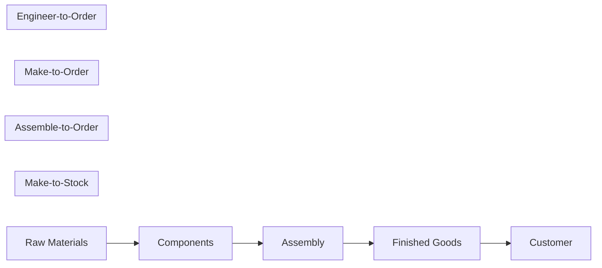

## Push, Pull, and Push-Pull Hybrid Systems

### Overview

Push, pull, and push-pull hybrid systems describe the fundamental control logic governing when and why production or replenishment activity is triggered in a supply chain. This classification is one of the most consequential design decisions in supply chain strategy, since it determines whether upstream activity is driven by forecasts (speculative) or by realized demand (reactive), which in turn shapes inventory positioning, responsiveness, and bullwhip exposure.

### Push Systems

**Key Points**

- A **push system** initiates production or replenishment based on a **forecast** of future demand, independent of actual realized orders
- Material and product flow "downstream" ahead of confirmed demand: goods are built and positioned in anticipation of sale
- Classical implementation: Material Requirements Planning (MRP), where a Master Production Schedule (MPS) derived from a demand forecast drives component procurement and production release
- **Advantages**: economies of scale in production (long, uninterrupted production runs), lower per-unit manufacturing cost, ability to level-load capacity independent of short-term demand fluctuations
- **Disadvantages**: high exposure to forecast error, elevated finished-goods inventory risk, vulnerability to obsolescence, and — critically — the primary structural cause of the **Bullwhip Effect**, since each upstream tier forecasts from the tier below's *order pattern* rather than true end-customer demand

**Push System Flow**

### Pull Systems

**Key Points**

- A **pull system** initiates production or replenishment only in direct response to an **actual, realized demand signal** — a customer order, a point-of-sale scan, or a downstream kanban/replenishment trigger
- Canonical implementation: the **Kanban system**, developed within the Toyota Production System (TPS), where a visual/physical signal card authorizes production or movement of exactly the quantity consumed downstream, no more
- **Advantages**: minimal finished-goods inventory, near-elimination of forecast error exposure at the trigger point, reduced obsolescence risk, tight alignment between what is produced and what is actually needed
- **Disadvantages**: production/replenishment lead time is fully exposed to the customer (cannot ship faster than the pull-triggered process can execute), can constrain economies of scale, requires high supply-side flexibility and short changeover/setup times to be viable
- Pull systems generally require the **Order Penetration Point (OPP)** — the point at which the customer order enters the process — to sit relatively far upstream, since everything downstream of the OPP is, by definition, executed only after order confirmation

**Kanban Pull Mechanics**

<svg xmlns="http://www.w3.org/2000/svg" viewBox="0 0 680 280">
<text x="340" y="22" font-size="16" font-weight="bold" text-anchor="middle" fill="#1a1a1a">Kanban Pull Signal Flow (svg_diagram)</text>
<rect x="40" y="90" width="120" height="60" fill="#dbe9f6" stroke="#2166ac" stroke-width="1.5" />
<text x="100" y="125" font-size="12" text-anchor="middle" fill="#1a1a1a">Upstream Process</text>
<rect x="280" y="90" width="120" height="60" fill="#e3f0da" stroke="#41ab5d" stroke-width="1.5" />
<text x="340" y="125" font-size="12" text-anchor="middle" fill="#1a1a1a">Buffer / Kanban Square</text>
<rect x="520" y="90" width="120" height="60" fill="#fde3cf" stroke="#f46d43" stroke-width="1.5" />
<text x="580" y="125" font-size="12" text-anchor="middle" fill="#1a1a1a">Downstream Process</text>
<line x1="160" y1="120" x2="280" y2="120" stroke="#333" stroke-width="2" marker-end="url(#arrow1)" />
<line x1="400" y1="120" x2="520" y2="120" stroke="#333" stroke-width="2" marker-end="url(#arrow1)" />
<path d="M 500 150 Q 340 210 180 150" fill="none" stroke="#d73027" stroke-width="2" stroke-dasharray="6,4" marker-end="url(#arrow2)" />
<text x="340" y="230" font-size="11" fill="#d73027" text-anchor="middle">Kanban Card: "consumed 1 unit, produce 1 unit"</text>
</svg>

### Push-Pull Hybrid Systems

**Key Points**

- Most real-world supply chains are neither pure push nor pure pull; they implement a **push-pull hybrid**, with an explicit **decoupling point** (synonymous with Order Penetration Point) separating a forecast-driven upstream segment from an order-driven downstream segment
- Formalized extensively in the operations literature (notably by Hau Lee) as the core architecture underlying **postponement strategy**: generic/undifferentiated production and inventory positioning occur upstream of the decoupling point (push, benefiting from aggregated/pooled forecast accuracy and scale economies); final configuration, assembly, or fulfillment occurs downstream, triggered only by confirmed orders (pull, minimizing finished-goods risk)
- The position of the decoupling point is a strategic design variable, not a fixed architectural constant — moving it upstream increases responsiveness/customization at the cost of exposing more of the process to push-side forecast risk; moving it downstream increases scale efficiency at the cost of responsiveness

**Common Hybrid Archetypes**

- **Make-to-Stock (MTS)**: decoupling point at the finished-goods warehouse/retail shelf; essentially near-pure push from the customer's perspective, though upstream component sourcing may itself be pull-triggered by MRP consumption signals
- **Assemble-to-Order (ATO)**: components and sub-assemblies produced to forecast (push); final assembly triggered by customer order (pull) — canonical example: Dell's historical build-to-order PC model
- **Make-to-Order (MTO)**: raw materials/components may be stocked to forecast (push), but all production of the finished item is order-triggered (pull)
- **Engineer-to-Order (ETO)**: decoupling point sits at the earliest possible stage (design/engineering itself is order-triggered); minimal-to-no speculative inventory anywhere in the chain — common in capital equipment, large industrial projects, and custom construction

**Decoupling Point Position Across Archetypes**

**Decoupling Point Reference Table**

| Strategy | Decoupling Point Location | Push Segment | Pull Segment |
| --- | --- | --- | --- |
| Make-to-Stock (MTS) | Finished goods inventory | Raw material → Finished Goods | Retail shelf → Customer (essentially none) |
| Assemble-to-Order (ATO) | Pre-final-assembly | Raw material → Components | Final Assembly → Customer |
| Make-to-Order (MTO) | Pre-production | Raw material → Components (sometimes) | Production → Customer |
| Engineer-to-Order (ETO) | Pre-design | None or minimal raw material stock | Design → Customer |

### Comparative Analysis

| Dimension | Push System | Pull System | Push-Pull Hybrid |
| --- | --- | --- | --- |
| Trigger | Forecast | Realized demand/order | Forecast (upstream) + order (downstream) |
| Inventory positioning | Finished goods, distributed | Minimal, held as raw/WIP | Generic WIP at decoupling point |
| Bullwhip exposure | High | Low (at trigger point) | Moderate — contained upstream of decoupling point |
| Lead time exposed to customer | Low (stock available) | High (full production lead time) | Moderate (downstream segment lead time only) |
| Economies of scale | High | Constrained | Partial — upstream retains scale benefits |
| Canonical example | Grocery retail replenishment | Toyota Production System (Kanban) | Dell build-to-order PCs |

### Worked Example: Postponement Reducing Total Safety Stock

A manufacturer sells the same laptop chassis in 5 regional color/configuration variants. Under a pure push (MTS) model, safety stock must be held separately for each variant, since demand for each is forecast independently and variant-level forecast error is higher than aggregate demand forecast error.

Under a postponement-based ATO hybrid, the chassis and internal components are produced generically (push, forecast against *aggregate* demand across all 5 variants — a materially more accurate forecast due to statistical demand pooling), and final color/configuration assembly happens only after order confirmation (pull). Because aggregate demand variability is lower than the sum of variant-level variability (a direct consequence of the square-root-of-time/pooling effect in inventory theory), total safety stock required across the hybrid system is lower than the sum of five independently-forecast variant-level safety stocks — while still delivering full product variety to the customer.

### Common Misconceptions

- **"Pull systems have no inventory."** Pull systems minimize *finished-goods* inventory exposed to forecast risk, but typically still hold raw material or generic WIP inventory upstream of the decoupling point — a pure zero-inventory system is rare outside of highly capital-project-based ETO contexts.
- **"Kanban and Just-In-Time (JIT) are the same thing."** Kanban is the specific signaling *mechanism* (the card/visual trigger system) used to implement pull-based replenishment; JIT is the broader manufacturing philosophy (minimal waste, minimal inventory, synchronized flow) that Kanban is one common tool for achieving.
- **"Push systems are simply outdated/inferior to pull systems."** [Inference] Push retains clear advantages in stable-demand, high-volume-scale contexts (e.g., commodity staples with low demand variance), where forecast accuracy is high and the cost of pooled economies of scale outweighs pull's inventory-minimization benefit — the choice is context-dependent, not a strict hierarchy of "modern pull" over "legacy push."

**Related Topics**

- Order Penetration Point and decoupling point strategic positioning
- Postponement strategy: form, time, and place postponement
- Bullwhip Effect: causes, quantification, and mitigation
- Toyota Production System and Lean Manufacturing principles
- Demand pooling and safety stock aggregation
- Make-to-Stock vs. Make-to-Order operational planning