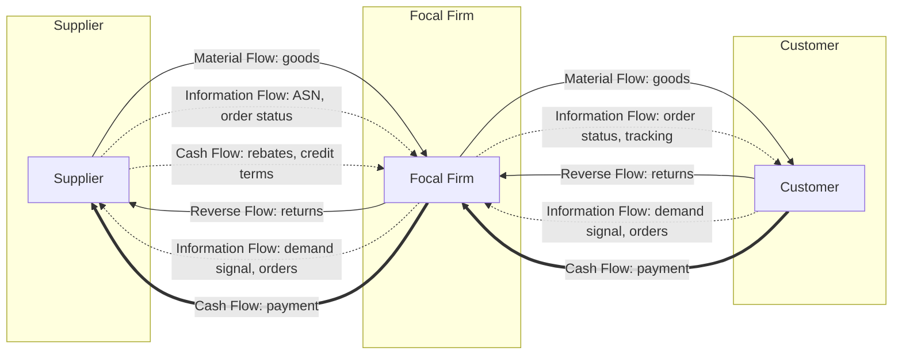

## The Four Flows: Business, Information, Cash, and Logistics

### Overview

Modern supply chain management is commonly modeled as the coordinated management of four distinct but interdependent flows across the network: the **business/material flow** (physical goods), the **information flow** (data and signals), the **financial/cash flow** (payments and value transfer), and — in many frameworks — a fourth explicit dimension separating **logistics execution** from the underlying business/material flow it enacts. This multi-flow lens is foundational because supply chain failures frequently originate not in the physical flow itself but in a breakdown or lag in one of the coordinating flows (e.g., delayed information causing a stockout despite adequate physical stock existing elsewhere in the network).

### Flow 1: Business / Material Flow

**Key Points**

- The **physical movement and transformation** of goods: raw materials → work-in-process → finished goods → point of consumption, plus the **reverse flow** of returns, repairs, and end-of-life recovery (reverse logistics)
- Encompasses both **forward flow** (production and distribution toward the customer) and **reverse flow** (returns management, warranty/repair loops, recycling/remanufacturing) — reverse logistics is frequently underweighted in traditional models despite representing a material cost and service dimension in e-commerce and regulated industries (e-waste, pharmaceuticals)
- Physically instantiated through the network of facilities: plants, distribution centers, cross-dock terminals, and retail/point-of-sale locations
- Bidirectional in mature circular-economy-oriented supply chains: material recovery, refurbishment, and resale loops are increasingly modeled as a first-class part of this flow rather than an exception process

### Flow 2: Information Flow

**Key Points**

- The **bidirectional transmission of data** required to plan, execute, and monitor the physical and financial flows: demand forecasts, purchase orders, order status/tracking, inventory visibility, shipment notifications (Advance Shipping Notices/ASNs), and quality/compliance documentation
- Historically the **most underdeveloped** of the flows relative to physical and financial flow maturity — a primary driver of the Bullwhip Effect is information flow degradation (each tier seeing only its immediate downstream partner's *orders*, not true end-customer *demand*)
- Standard enabling technologies: **Electronic Data Interchange (EDI)** for structured B2B transactions (purchase orders, invoices, ASNs), **API-based real-time integration** (increasingly displacing batch EDI in modern architectures), **EPCIS (Electronic Product Code Information Services)** for object-level traceability, and **control tower platforms** providing end-to-end, multi-tier visibility dashboards
- Information flow direction is critically **not symmetric** with material flow: while material flows predominantly downstream (supplier → customer) with a smaller reverse-logistics counter-flow, information flows substantially both directions — demand signals flow upstream (customer → supplier) while fulfillment/status signals flow downstream — and effective SCM depends on minimizing the *latency and distortion* of the upstream-flowing demand signal specifically

**Four Flows Interaction Diagram**

### Flow 3: Financial / Cash Flow

**Key Points**

- The **movement of monetary value** in exchange for goods and services: payments, invoicing, credit terms, rebates, and increasingly, embedded supply chain financing instruments
- Flows in the **opposite direction** to the primary material flow: cash moves upstream (customer → retailer → distributor → manufacturer → supplier) as the material flow moves downstream
- Key metrics: **Days Payable Outstanding (DPO)**, **Days Sales Outstanding (DSO)**, and **Days Inventory Outstanding (DIO)**, which combine into the **Cash Conversion Cycle (CCC)**:

$$CCC = DIO + DSO - DPO$$

A lower (or negative) CCC indicates a firm collects cash from customers before it must pay suppliers — a position of financial strength within the chain, often achieved by large focal firms extending their own payment terms (DPO) while enforcing faster customer collection

- **Supply Chain Finance (SCF)** instruments increasingly bridge cash flow gaps between tiers: **reverse factoring** (the focal firm's strong credit rating allows suppliers to receive early payment at a discount, funded by a financial institution against the buyer's payment guarantee) and **dynamic discounting** (buyer offers suppliers an early-payment discount funded from its own balance sheet) are now standard mechanisms, particularly valuable for smaller Tier 2/3 suppliers with weaker independent credit access
- Currency and trade-finance exposure (letters of credit, FX hedging) becomes a first-class cash flow concern in global, multi-currency supply chains

### Flow 4: Logistics Flow (as a Distinct Execution Layer)

**Key Points**

- In frameworks that separate this as a distinct fourth flow (rather than folding it entirely into "business/material flow"), **logistics** is treated specifically as the **execution and orchestration layer** — transportation mode/carrier selection, warehousing and cross-docking, load consolidation, and last-mile delivery — that *enacts* the material flow according to plans generated from the information flow
- This distinction matters analytically because logistics execution has its own dedicated systems (**Transportation Management Systems / TMS**, **Warehouse Management Systems / WMS**) and its own KPI set (on-time delivery, freight cost per unit, dock-to-stock time, order-to-ship cycle time) distinct from the broader "did the right total quantity of goods move" question addressed by the material flow view
- [Inference] Some frameworks (e.g., certain CSCMP-aligned models) treat logistics as fully subsumed within "material flow" rather than a separate fourth category; the four-flow framing used here is a common pedagogical variant that explicitly isolates execution/orchestration from the physical goods movement itself, and terminology varies by source

### Flow Interdependency and Failure Modes

**Key Points**

- The four flows are **tightly coupled**: a failure or lag in one flow directly degrades the others, even when the flow experiencing the *visible* symptom is not the flow where the failure originated
- Canonical failure pattern: an information flow lag (e.g., a retailer's POS data reaching the distributor with a multi-day delay) causes a *material flow* symptom (stockout at retail despite adequate system-wide inventory) — the physical goods flow is functioning correctly, but the coordinating information flow is not
- Similarly, a cash flow constraint (e.g., a Tier 2 supplier facing liquidity stress and extending its own production lead time to preserve working capital) can degrade the *material* flow's reliability even though the physical production process itself is unimpaired — illustrating why financial health of upstream tiers is a legitimate supply chain risk factor, not solely a finance-department concern

### Flow Comparison Table

| Flow | Primary Direction | Key Metrics | Primary Enabling Systems | Common Failure Symptom |
| --- | --- | --- | --- | --- |
| Business/Material | Downstream (forward); reverse for returns | Fill rate, inventory turns, order cycle time | ERP, MRP, WMS | Stockouts, excess inventory, long lead times |
| Information | Bidirectional (demand up, status down) | Forecast accuracy, data latency, visibility depth | EDI, APIs, EPCIS, control towers | Bullwhip effect, blind spots at Tier 2/3 |
| Cash/Financial | Upstream (payment for goods received) | Cash Conversion Cycle, DPO/DSO/DIO | ERP finance modules, SCF platforms | Supplier liquidity stress, working capital strain |
| Logistics (execution) | Downstream (forward); reverse for returns | On-time delivery, freight cost/unit, dock-to-stock time | TMS, WMS, carrier integration | Missed delivery windows, capacity shortfalls |

### Worked Example: Multi-Flow Diagnosis of a Stockout

A retailer experiences a stockout on a fast-moving SKU. Diagnosis across the four flows:

- **Material flow check**: System-wide inventory data shows 4,000 units in the regional distribution center — the physical goods flow is not the bottleneck
- **Information flow check**: The retailer's automated replenishment trigger fires based on a nightly batch EDI feed with a 36-hour processing lag; the sales spike (e.g., from a promotion) was not reflected in the replenishment signal until after the stockout occurred — root cause identified
- **Cash flow check**: No liquidity constraint at the distributor; payment terms are current
- **Logistics flow check**: Carrier capacity was available and delivery would have been on-time had the replenishment order been triggered promptly

The stockout is correctly diagnosed as an **information flow latency failure**, not a material, cash, or logistics execution failure — directly illustrating why the four-flow framework is diagnostically useful: it prevents misattributing an information-flow root cause to an apparent material-flow symptom (which might otherwise prompt an incorrect fix, such as increasing safety stock, rather than the correct fix of reducing information latency).

### Common Misconceptions

- **"Information flow is a support function to the 'real' flows of goods and cash."** [Inference] Contemporary SCM treats information flow as co-equal in strategic importance, since — as the worked example shows — information latency or distortion is frequently the actual root cause of failures that manifest as material or cash flow symptoms.
- **"Cash flow always moves in perfect lockstep, opposite to material flow."** While the general direction is opposite, the *timing* is frequently decoupled via credit terms, factoring, and financing instruments — a supplier may ship material weeks before receiving payment (or, via reverse factoring, may receive payment before the buyer itself pays), meaning cash flow timing is a designed/negotiated variable, not a fixed mirror of material flow timing.
- **"Adding a fourth 'logistics' flow is universally standard terminology."** [Unverified] Framework terminology varies by source; some treat three flows (material, information, financial) as the standard model with logistics execution folded into material flow, while others (particularly in pedagogical and consulting contexts) explicitly separate logistics as a fourth flow for analytical clarity — this is a matter of framework convention rather than a single settled standard.

**Related Topics**

- Bullwhip Effect and information flow distortion mechanisms
- Cash Conversion Cycle and working capital optimization
- Supply Chain Finance: reverse factoring and dynamic discounting
- EDI, APIs, and EPCIS for supply chain data integration
- Control Tower architectures for end-to-end visibility
- Reverse Logistics and circular supply chain design