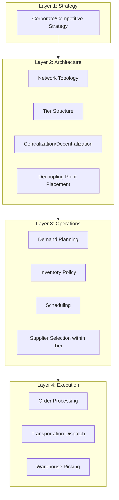

## Defining Supply Chain Architecture as a Discipline

### Overview

Supply chain architecture is the discipline concerned with the deliberate design of the **structural configuration** of a supply chain network — the number, location, tier structure, and connectivity of nodes (facilities, suppliers, partners) and the flow paths between them — as distinct from the *operational* disciplines (planning, execution, day-to-day management) that run within a given structure once it exists. It draws a direct analogy to systems/software architecture: just as a software architect defines the structural components and their interfaces before implementation details are filled in, a supply chain architect defines the network topology, tiering, and flow logic before operational planning (forecasting, scheduling, inventory policy) is layered on top.

### Architecture vs. Operations: The Core Distinction

**Key Points**

- **Architecture** answers structural questions: How many distribution centers should exist, and where? How many tiers should the supplier network have? Should manufacturing be centralized or regionally distributed? What is the decoupling point (push/pull boundary) in the network?
- **Operations** answers questions *within* a given structure: Given these three distribution centers, what should this week's replenishment quantity be? Given this supplier tier structure, which specific supplier should fulfill this order?
- Architectural decisions are characterized by **high switching cost and long time horizon** (a new distribution center or plant represents a multi-year capital commitment), whereas operational decisions are characterized by **low switching cost and short time horizon** (a weekly reorder quantity can be revised immediately)
- [Inference] This time-horizon/switching-cost distinction is the most reliable practical test for classifying a given decision as "architectural" versus "operational": if reversing the decision requires re-negotiating contracts, relocating capital assets, or multi-quarter lead time, it is architectural; if it can be revised within a single planning cycle, it is operational

### The Analogy to Software/Systems Architecture

**Key Points**

- Software architecture defines components, their responsibilities, and the interfaces/protocols connecting them, deliberately deferring implementation-level decisions to lower layers — supply chain architecture performs the equivalent function for physical and organizational networks: defining nodes (facilities, tiers, partners), their responsibilities (make, store, assemble, distribute), and the interfaces connecting them (transportation lanes, information protocols like EDI, contractual terms)
- Both disciplines share the core engineering principle of **separation of concerns**: a well-architected supply chain, like a well-architected software system, should allow operational-layer changes (a new forecasting algorithm, a new supplier within an existing tier) without requiring a structural redesign — conversely, a poorly architected supply chain exhibits **tight coupling**, where operational adjustments cascade into structural strain (analogous to a software monolith where a small feature change requires touching unrelated modules)
- Both disciplines formalize **trade-off frontiers** as a primary design tool: software architecture trades consistency against availability (CAP theorem); supply chain architecture trades cost against service, speed, and resilience (see Core Objectives topic) — in both cases, the architect's job is to make these trade-offs explicit and intentional rather than allowing them to emerge as unexamined defaults

### Core Architectural Decision Domains

**Key Points**

- **Network topology**: number and location of facilities (plants, DCs, cross-docks) — governed by facility location models balancing transportation cost, fixed facility cost, and service-level (delivery time) coverage
- **Tier structure**: how many supplier tiers exist, and how much of each tier's activity is visible to and coordinated by the focal firm (see Stakeholders topic) — a direct architectural analog to defining system layers and their coupling
- **Centralization vs. decentralization**: whether inventory, production, or decision-making authority is consolidated at fewer, larger nodes (favoring economies of scale and pooling benefits) or distributed across more, smaller nodes (favoring responsiveness and reduced transportation lead time) — this single trade-off recurs across nearly every architectural sub-decision (inventory positioning, manufacturing footprint, procurement organization)
- **Decoupling point placement**: where in the network the push (forecast-driven) segment transitions to the pull (order-driven) segment — a structural decision with operational consequences, sitting at the boundary between the two disciplines
- **Flow architecture**: whether the network is a simple linear chain, a converging/diverging tree, or a full network/mesh topology with multiple paths between nodes — increasingly the latter in modern global supply chains, which more closely resemble ecosystems than linear chains (see Supply Chain vs. Value Chain topic)

### Layered View of the Discipline

### Architecture as a Response to Strategy

**Key Points**

- Following the classic strategy-structure principle (paralleling Alfred Chandler's organizational thesis that "structure follows strategy"), supply chain architecture should be derived from competitive strategy, not designed independently of it
- A firm competing on **cost leadership** typically architects toward centralization, high-volume consolidated facilities, and longer, forecast-driven (push) upstream segments to capture scale economies
- A firm competing on **responsiveness/differentiation** typically architects toward decentralization, more numerous smaller facilities positioned closer to demand, and a decoupling point pushed further upstream to enable late customization
- [Inference] Architectural misalignment with strategy — e.g., a firm pursuing a premium, highly-responsive positioning while retaining a centralized, forecast-driven architecture inherited from an earlier cost-leadership era — is a commonly cited but empirically hard-to-isolate cause of competitive underperformance in supply chain strategy literature, since architecture changes lag strategy changes by the multi-year timeframes discussed above

### Architecture Decision Comparison Table

| Decision Domain | Key Trade-off | Cost-Leaning Choice | Responsiveness-Leaning Choice |
| --- | --- | --- | --- |
| Network topology | Facility count vs. transportation cost/coverage | Few, large, centralized facilities | Many, smaller, regionally distributed facilities |
| Tier structure | Coordination overhead vs. specialization | Deep, arm's-length multi-tier network | Shallow, tightly coordinated tier structure |
| Centralization | Scale economies vs. lead time | Centralized inventory/decision authority | Decentralized, localized authority |
| Decoupling point | Forecast accuracy/scale vs. customization | Downstream (near finished goods) | Upstream (near raw materials) |
| Flow topology | Simplicity/control vs. flexibility | Linear chain, single-path routing | Mesh network, multi-path routing |

### Worked Example: Architecture Constraining Operations

A firm architected its network with a single, centralized distribution center serving an entire continent (a cost-leaning architectural choice, favoring facility and inventory pooling economies). Years later, the firm's competitive strategy shifts toward same-day delivery in major metro areas — an operational-layer goal.

No amount of operational-layer improvement (better forecasting algorithms, more sophisticated inventory policy, faster order processing software) can achieve same-day delivery across a continent from a single centralized facility, because physical transportation time from that facility to distant metros structurally exceeds the same-day window. The constraint is architectural, not operational — achieving the new strategic goal requires an architectural redesign (adding regional/metro-level facilities), directly illustrating why the architecture-operations distinction matters practically: misdiagnosing an architectural constraint as an operational problem leads to investment in the wrong layer (e.g., purchasing more sophisticated planning software) without resolving the underlying limitation.

### Common Misconceptions

- **"Supply chain architecture is just facility location planning."** [Inference] Facility location is one architectural sub-decision among several (tier structure, decoupling point placement, centralization, flow topology); treating architecture as synonymous with facility location understates the discipline's scope, particularly its role in defining organizational and information-flow structure, not only physical footprint.
- **"A good architecture, once designed, doesn't need revisiting."** Given that architecture should follow strategy, and competitive strategy evolves, supply chain architecture requires periodic re-evaluation — the discipline includes recognizing when accumulated strategic drift has outpaced the existing architecture, not solely the initial design exercise.
- **"Architecture and operations can be optimized independently."** Because architecture constrains the feasible space of operational decisions (as in the worked example), architectural and operational design are interdependent; operations research literature increasingly treats them as a joint optimization problem (e.g., simultaneous facility location and inventory policy models) rather than a strict sequential handoff.

**Related Topics**

- Facility Location Models and network design optimization
- Centralization vs. Decentralization trade-offs in inventory and decision authority
- Tiered Supplier Structures and multi-tier network design
- Order Penetration Point / Decoupling Point strategic placement
- Strategy-Structure Alignment in supply chain design
- Network Topology: linear, converging, diverging, and mesh architectures