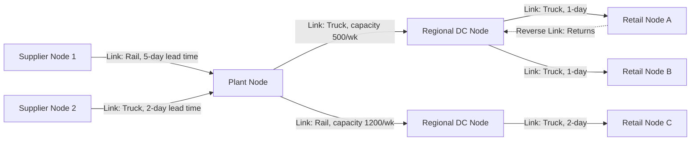

## Nodes, Links, and Flows in Network Design

### Overview

Supply chain network design formalizes a physical/organizational supply chain as a graph-theoretic structure composed of **nodes** (discrete locations where value-adding activity, storage, or decision-making occurs), **links** (the connections along which flow moves between nodes, each carrying cost, capacity, and lead-time attributes), and **flows** (the quantified movement of material, information, or cash along those links). This abstraction is the mathematical foundation underlying facility location models, network optimization, and most commercial supply chain design software (e.g., network optimization tools within Coupa, Blue Yonder, or LLamasoft/Coupa Supply Chain Design).

### Nodes: Definition and Taxonomy

**Key Points**

- A **node** is any discrete point in the network where goods are transformed, stored, consolidated, or where a decision/transaction occurs
- Standard node taxonomy:
  - **Supplier nodes**: raw material and component sources (Tier 1, 2, 3...)
  - **Plant/manufacturing nodes**: transformation points where inputs become outputs
  - **Distribution Center (DC) nodes**: storage and order-fulfillment points, may be further typed as **Regional DCs** (RDCs, broad geographic coverage) or **local/forward DCs** (closer to end demand, smaller footprint)
  - **Cross-dock nodes**: transient nodes with minimal or zero dwell-time storage, used purely for consolidation/deconsolidation of inbound-to-outbound flows
  - **Retail/point-of-sale nodes**: the final node before consumption, generating the primary demand signal
  - **Return/reverse logistics nodes**: processing centers for returns, repair, refurbishment, or disposal
- Each node carries defining **attributes** relevant to network design optimization: fixed cost (facility, equipment), variable/throughput cost, capacity limit, processing/dwell time, and geographic coordinates

### Links: Definition and Taxonomy

**Key Points**

- A **link** (or arc, in graph-theoretic terms) is the directed or undirected connection between two nodes along which flow travels, representing a specific transportation lane, information channel, or financial transaction pathway
- Standard link attributes: **capacity** (maximum flow volume per period), **lead time** (transit duration), **variable cost** (typically cost per unit or per unit-distance), **fixed cost** (if the link itself requires a standing commitment, e.g., a dedicated fleet contract or a long-term lane agreement), and **mode** (truck, rail, ocean, air, intermodal, pipeline, or — for information links — EDI, API, manual)
- Links can be **single-path** (each node pair connected by exactly one route) or **multi-path** (multiple parallel routes between a node pair, e.g., primary and backup carrier lanes) — multi-path link design is a direct resilience lever (see Core Objectives topic)
- **Lane** is the common industry term for a specific origin-destination transportation link, particularly in freight/logistics execution contexts (TMS systems operate at the lane level)

### Flows: Definition and Taxonomy

**Key Points**

- A **flow** is the quantified movement along a link over a defined period, and — per the Four Flows framework — may represent **material flow** (units of product), **information flow** (data volume/frequency), or **cash flow** (payment value and timing)
- In network optimization models, flow is the primary **decision variable**: given a fixed node/link structure (or a structure being simultaneously optimized), the model determines the optimal flow quantity along each link to satisfy demand at minimum total cost subject to capacity constraints
- **Flow conservation** is the fundamental constraint in network flow modeling: at any intermediate node, total inbound flow must equal total outbound flow (plus/minus any node-level accumulation or consumption), formalized as:

$$\sum_{i} x_{ij} - \sum_{k} x_{jk} = d_j$$

Where $x_{ij}$ is flow into node $j$ from node $i$, $x_{jk}$ is flow out of node $j$ to node $k$, and $d_j$ is net demand (positive) or supply (negative) at node $j$

### Graph Representation of a Supply Chain Network

### Node-Link-Flow Attribute Structure

<svg xmlns="http://www.w3.org/2000/svg" viewBox="0 0 680 320">
<text x="340" y="24" font-size="16" font-weight="bold" text-anchor="middle" fill="#1a1a1a">Node and Link Attribute Anatomy (svg_diagram)</text>
<circle cx="140" cy="160" r="50" fill="#dbe9f6" stroke="#2166ac" stroke-width="2" />
<text x="140" y="155" font-size="12" text-anchor="middle" fill="#1a1a1a">Node A</text>
<text x="140" y="172" font-size="10" text-anchor="middle" fill="#333">(DC)</text>
<circle cx="540" cy="160" r="50" fill="#fde3cf" stroke="#f46d43" stroke-width="2" />
<text x="540" y="155" font-size="12" text-anchor="middle" fill="#1a1a1a">Node B</text>
<text x="540" y="172" font-size="10" text-anchor="middle" fill="#333">(Retail)</text>
<line x1="190" y1="160" x2="490" y2="160" stroke="#333" stroke-width="2.5" marker-end="url(#arrowN)" />
<text x="340" y="130" font-size="11" text-anchor="middle" fill="#1a1a1a">Link: Truck lane</text>
<text x="340" y="145" font-size="10" text-anchor="middle" fill="#555">capacity=800/wk, lead=1 day</text>
<rect x="270" y="200" width="140" height="70" fill="#f5f5f5" stroke="#999" stroke-width="1" />
<text x="340" y="218" font-size="10" text-anchor="middle" fill="#1a1a1a">Flow (decision variable)</text>
<text x="340" y="234" font-size="10" text-anchor="middle" fill="#333">x = 620 units/wk</text>
<text x="340" y="250" font-size="10" text-anchor="middle" fill="#333">cost = \$2.10/unit</text>
<text x="340" y="266" font-size="10" text-anchor="middle" fill="#333">utilization = 77.5%</text>

<text x="140" y="230" font-size="9" text-anchor="middle" fill="#333">fixed cost, capacity,</text>

<text x="140" y="242" font-size="9" text-anchor="middle" fill="#333">dwell time</text>

</svg>

### Network Topology Patterns

**Key Points**

- **Linear/serial chain**: single path from raw material to customer (Supplier → Plant → DC → Retail); simplest structure, minimal routing flexibility, common in early-stage or simple product supply chains
- **Converging (assembly) tree**: multiple upstream nodes feed into fewer downstream nodes (many suppliers → one assembly plant); typical of manufacturing with many input components
- **Diverging (distribution) tree**: fewer upstream nodes feed into many downstream nodes (one plant → many DCs → many retail nodes); typical of finished-goods distribution
- **Mesh/network topology**: multiple nodes at each tier interconnected via multiple paths, allowing flow rerouting; most representative of modern global multi-echelon supply chains, and the topology most directly supporting resilience (redundant paths) at the cost of increased coordination complexity

| Topology | Structure | Primary Benefit | Primary Drawback |
| --- | --- | --- | --- |
| Linear/serial | Single path, one node per tier | Simplicity, ease of control | Zero redundancy, single point of failure |
| Converging tree | Many-to-one | Consolidation efficiency | Bottleneck risk at convergence node |
| Diverging tree | One-to-many | Broad market coverage | Limited flow flexibility if node fails |
| Mesh/network | Many-to-many, multi-path | Resilience, routing flexibility | Coordination and modeling complexity |

### Worked Example: Flow Conservation and Cost Minimization

A network has one plant node $P$ producing 1,000 units/week, feeding two DC nodes ($DC_1$, $DC_2$) with weekly demand of 600 and 400 units respectively. Two links exist: $P \to DC_1$ (cost $3/unit, capacity 700/wk) and $P \to DC_2$ (cost $5/unit, capacity 500/wk).

Flow conservation requires $x_{P,DC_1} + x_{P,DC_2} = 1{,}000$, with $x_{P,DC_1} = 600$ and $x_{P,DC_2} = 400$ satisfying both node-level demand and link capacity constraints ($600 \leq 700$; $400 \leq 500$). Total flow cost:

$$Total = (600 \times 3) + (400 \times 5) = 1{,}800 + 2{,}000 = \$3{,}800/\text{week}$$

If a new, cheaper link $P \to DC_2$ became available at $4/unit but with capacity capped at only 300 units, the model would need to re-solve the flow allocation to respect both the new cost structure and the binding capacity constraint — illustrating how network flow optimization is fundamentally a constrained cost-minimization problem over the node-link-flow structure, which is precisely the mathematical basis of commercial network design software.

### Common Misconceptions

- **"Adding more links always improves the network."** [Inference] Additional links increase resilience and routing flexibility but also increase coordination complexity and, if underutilized, can introduce fixed costs (dedicated lane contracts, information system integration) without proportional flow benefit — link addition is a trade-off decision, not an unconditional improvement, directly paralleling the redundancy-cost trade-off discussed under Core Objectives.
- **"Node capacity is a fixed, immovable constraint."** Node capacity is frequently a design variable itself (facility expansion, additional shift capacity, subcontracted overflow capacity) rather than a hard constraint — treating it as fixed in an optimization model versus a variable to be jointly optimized is a modeling choice with significant strategic implications.
- **"Flow conservation means flow is always balanced/equal across links."** Flow conservation requires inbound flow to equal outbound flow (adjusted for node-level demand/supply) at each node — it does not imply equal flow volume across all links leaving or entering a node, as the worked example demonstrates (600 vs. 400 units on two outbound links from the same node).

**Related Topics**

- Facility Location Models and network optimization formulations
- Centralization vs. Decentralization in network design
- Multi-echelon inventory optimization across node tiers
- Transportation mode selection and lane design
- Network resilience through multi-path/mesh topology design
- Mixed-integer programming formulations for supply chain network design