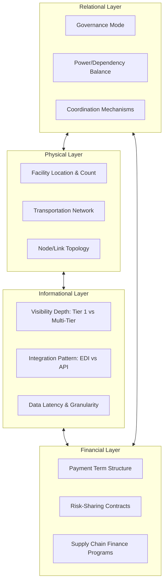

## Physical, Informational, Financial, and Relational Architecture Layers

### Overview

Supply chain architecture is often decomposed into four distinct but interdependent design layers: the **physical layer** (the tangible network of nodes and links), the **informational layer** (data systems and visibility structures), the **financial layer** (payment terms, financing instruments, and risk-sharing mechanisms), and the **relational layer** (governance, contracts, and trust/power dynamics between organizationally independent stakeholders). This layered decomposition extends the Nodes/Links/Flows and Four Flows frameworks by treating each flow type as requiring its own deliberate *architectural* design — not merely an operational plan — since the structural choices made in each layer (not just their day-to-day management) determine the chain's overall capability and constraints.

### Layer 1: Physical Architecture

**Key Points**

- Encompasses the tangible network design decisions already covered under Nodes, Links, and Flows: facility location, count, and type; transportation lane structure and mode selection; capacity allocation; and topology (linear, converging, diverging, mesh)
- Defining characteristic: **high switching cost and long time horizon** — physical architecture decisions typically require capital investment and multi-year commitments (see Defining Supply Chain Architecture as a Discipline topic)
- Physical architecture determines the **feasible envelope** for all other layers: no amount of informational or financial sophistication can overcome a physical constraint (e.g., no data system can make a single centralized distribution center deliver same-day service to a distant region)

### Layer 2: Informational Architecture

**Key Points**

- Encompasses the **structural design** of data systems and visibility — not the day-to-day operational use of data (forecasting, scheduling), but the architectural questions of *what data is captured, at what granularity, with what latency, and which stakeholders can access it*
- Core architectural decisions: **visibility depth** (does the focal firm's information architecture extend only to Tier 1, or is multi-tier visibility built in?), **integration pattern** (batch EDI versus real-time API-based integration), **data granularity** (SKU-level, order-level, or shipment-level tracking), and **latency tolerance** (near-real-time POS feeds versus nightly batch updates)
- The informational architecture directly determines the severity of the **Bullwhip Effect**: a shallow, high-latency informational architecture (each tier seeing only immediate-neighbor order data) structurally produces demand distortion regardless of how well any individual tier forecasts; a deep, low-latency architecture (shared POS data across all tiers, as in mature CPFR/VMI implementations) structurally suppresses it
- Standard enabling technologies: EDI (structured batch transactions), APIs (real-time integration), EPCIS (object-level traceability standard), and control-tower platforms providing a unified visibility layer across the physical network
- [Inference] Informational architecture is frequently the **lowest-switching-cost layer** to redesign relative to physical architecture, making it a common first-line lever when firms discover structural performance gaps — though genuine multi-tier visibility architecture still requires sustained cross-firm investment and trust-building, not merely a software purchase

### Layer 3: Financial Architecture

**Key Points**

- Encompasses the **structural design** of payment terms, risk-sharing mechanisms, and financing instruments across the network — distinct from day-to-day cash management, this layer concerns the *rules and instruments* governing how financial risk and working capital burden are distributed among stakeholders
- Core architectural decisions: **payment term structure** (standard net-30/60/90 terms versus negotiated extended terms), **risk-sharing contracts** (who bears the cost of excess inventory, obsolescence, or demand shortfall — e.g., consignment inventory arrangements, vendor-managed inventory with supplier-retained ownership until sale), and **supply chain finance program design** (reverse factoring, dynamic discounting — see Four Flows topic)
- A structurally important but often underemphasized dimension: financial architecture determines **which stakeholder bears working capital burden**, and this allocation is a genuine design choice, not an inevitability — a focal firm with strong credit access can architect reverse-factoring programs that shift financing cost from cash-constrained Tier 2/3 suppliers onto more efficient capital markets, improving network-wide resilience without the focal firm bearing the direct cost itself
- Financial architecture interacts directly with physical architecture: contractual terms such as **consignment inventory** (supplier retains ownership/financial risk of inventory physically located at the buyer's facility until consumption) blend a financial-layer decision (who owns/bears risk on the inventory) with a physical-layer fact (where the inventory physically sits)

### Layer 4: Relational Architecture

**Key Points**

- Encompasses the **structural design of governance**: the formal and informal mechanisms determining how organizationally independent stakeholders coordinate, resolve conflict, and share decision authority — contracts, service level agreements (SLAs), joint planning forums, and the relative power/dependency balance between parties
- Core architectural decisions: **governance mode** (arm's-length transactional contracting versus long-term strategic partnership versus vertical integration/ownership), **power distribution** (which stakeholder holds negotiating leverage, typically a function of relative size, switching cost, and substitutability), and **coordination mechanisms** (joint business planning, shared KPI scorecards, CPFR-style collaborative forecasting agreements)
- Relational architecture is frequently the layer with the **lowest formal visibility** in traditional supply chain design frameworks (which tend to emphasize physical and informational layers) despite substantial evidence in supply chain management literature that relational/governance failures — not physical or informational constraints — are a leading cause of underperforming supplier relationships and failed collaborative initiatives (e.g., CPFR programs that fail not due to technology limitations but due to unresolved trust or incentive-sharing disputes)
- Governance mode selection follows a make-or-buy-style logic paralleling transaction cost economics: highly specific, non-substitutable relationships (e.g., a sole-source component critical to product differentiation) tend toward tighter governance (long-term partnership or vertical integration), while commodity, substitutable relationships tend toward arm's-length transactional governance

### Four-Layer Architecture Diagram

### Layer Interaction Map

<svg xmlns="http://www.w3.org/2000/svg" viewBox="0 0 680 380">
<text x="340" y="24" font-size="16" font-weight="bold" text-anchor="middle" fill="#1a1a1a">Architecture Layer Interdependency (svg_diagram)</text>
<rect x="60" y="60" width="240" height="90" rx="8" fill="#dbe9f6" stroke="#2166ac" stroke-width="1.5" />
<text x="180" y="95" font-size="13" font-weight="bold" text-anchor="middle" fill="#1a1a1a">Physical</text>
<text x="180" y="115" font-size="10" text-anchor="middle" fill="#333">Nodes, links, topology</text>
<text x="180" y="130" font-size="10" text-anchor="middle" fill="#333">high switching cost</text>
<rect x="380" y="60" width="240" height="90" rx="8" fill="#e3f0da" stroke="#41ab5d" stroke-width="1.5" />
<text x="500" y="95" font-size="13" font-weight="bold" text-anchor="middle" fill="#1a1a1a">Informational</text>
<text x="500" y="115" font-size="10" text-anchor="middle" fill="#333">Visibility, integration</text>
<text x="500" y="130" font-size="10" text-anchor="middle" fill="#333">low-moderate switching cost</text>
<rect x="60" y="220" width="240" height="90" rx="8" fill="#fde3cf" stroke="#f46d43" stroke-width="1.5" />
<text x="180" y="255" font-size="13" font-weight="bold" text-anchor="middle" fill="#1a1a1a">Financial</text>
<text x="180" y="275" font-size="10" text-anchor="middle" fill="#333">Terms, risk-sharing</text>
<text x="180" y="290" font-size="10" text-anchor="middle" fill="#333">moderate switching cost</text>
<rect x="380" y="220" width="240" height="90" rx="8" fill="#f3e0f0" stroke="#8e44ad" stroke-width="1.5" />
<text x="500" y="255" font-size="13" font-weight="bold" text-anchor="middle" fill="#1a1a1a">Relational</text>
<text x="500" y="275" font-size="10" text-anchor="middle" fill="#333">Governance, trust, power</text>
<text x="500" y="290" font-size="10" text-anchor="middle" fill="#333">slow to build, fast to break</text>
<line x1="300" y1="105" x2="380" y2="105" stroke="#333" stroke-width="1.5" marker-end="url(#a1)" />
<line x1="180" y1="150" x2="180" y2="220" stroke="#333" stroke-width="1.5" marker-end="url(#a1)" />
<line x1="500" y1="150" x2="500" y2="220" stroke="#333" stroke-width="1.5" marker-end="url(#a1)" />
<line x1="300" y1="265" x2="380" y2="265" stroke="#333" stroke-width="1.5" marker-end="url(#a1)" />
</svg>

### Layer Comparison Table

| Layer | Core Question | Switching Cost | Primary Failure Mode | Primary Enabling Mechanism |
| --- | --- | --- | --- | --- |
| Physical | Where do nodes sit, how are they linked? | High (capital, multi-year) | Structural service/cost misalignment | Facility investment, lane contracts |
| Informational | What data flows, how deep, how fast? | Low–moderate (system integration) | Bullwhip effect, blind spots | EDI/API, EPCIS, control towers |
| Financial | Who bears cost/risk, on what terms? | Moderate (contract renegotiation) | Supplier liquidity stress | SCF programs, risk-sharing contracts |
| Relational | How is coordination governed? | High (trust is slow to rebuild) | Collaboration/trust breakdown | Governance structures, joint planning |

### Worked Example: A Single Initiative Spanning All Four Layers

A focal firm implements a **Vendor Managed Inventory (VMI)** program with a key Tier 1 supplier. Decomposed by layer:

- **Physical**: Inventory continues to be stored at the focal firm's existing distribution center (no physical/node change) — VMI does not require a physical architecture change
- **Informational**: Requires new architecture — real-time inventory-level visibility must be extended to the supplier (a visibility-depth and integration-pattern change), typically via EDI 852 (Product Activity Data) or an API feed
- **Financial**: Requires a new architecture — inventory ownership/risk (previously held by the focal firm upon receipt) shifts to the supplier until point of consumption (consignment-style terms), directly altering working-capital allocation between the two firms
- **Relational**: Requires new architecture — a governance agreement defining replenishment authority, service-level expectations, and dispute-resolution mechanisms must be negotiated, since the supplier now holds a degree of operational decision authority (replenishment timing/quantity) previously held by the focal firm

This decomposition illustrates why VMI programs frequently fail or underperform despite technically sound implementation: a firm may successfully redesign the informational layer (real-time visibility) while under-investing in the relational layer (trust, governance, dispute resolution) — the initiative fails not from a data/technology gap but from an unaddressed relational-architecture gap.

### Common Misconceptions

- **"Physical architecture is the 'real' architecture; the other three layers are just operational details."** [Inference] This view understates the structural, high-switching-cost nature of informational, financial, and relational design choices — a firm's information visibility depth or governance mode is as durable and consequential a design decision as its facility footprint, even though it lacks physical form.
- **"Improving the informational layer alone will fix bullwhip/coordination problems."** As the VMI worked example shows, informational architecture improvements frequently require corresponding financial and relational architecture changes to succeed; treating informational redesign as sufficient in isolation is a common (and well-documented in supply chain change-management literature) implementation failure pattern.
- **"Relational architecture is 'soft' and cannot be deliberately designed like the other layers."** [Inference] While relational/governance design is less quantifiable than physical or financial architecture, it is equally subject to deliberate structural choices (contract type, joint planning cadence, escalation mechanisms) — treating it as an emergent byproduct of interpersonal relationships rather than a designed layer is a common but avoidable framing gap.

**Related Topics**

- Vendor Managed Inventory (VMI) and CPFR governance design
- Transaction Cost Economics applied to supplier governance mode selection
- Supply Chain Finance: reverse factoring and consignment inventory structures
- Multi-tier visibility architecture and control tower design
- The Four Flows: Business, Information, Cash, and Logistics
- Bullwhip Effect mitigation through informational architecture redesign