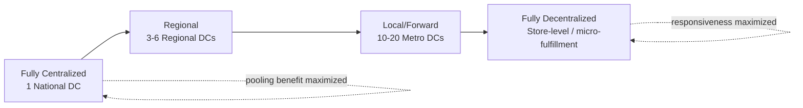

## Centralized versus Decentralized Network Architectures

### Overview

The centralization–decentralization decision is one of the most fundamental and recurring trade-offs in supply chain architecture, applying simultaneously to physical inventory positioning, facility footprint, and decision-making authority. A centralized architecture consolidates resources (inventory, facilities, authority) into fewer, larger nodes to capture pooling and scale economies; a decentralized architecture distributes resources across more, smaller nodes to minimize lead time and increase local responsiveness. Nearly every other architectural decision domain (facility location, tier structure, decoupling point placement) is, at some level, an instantiation of this same underlying trade-off.

### Centralized Architecture

**Key Points**

- Consolidates inventory, production, or decision-making authority into a small number of large nodes (e.g., a single national distribution center rather than many regional ones)
- Primary benefit: **inventory pooling** — aggregating demand across a wider geographic/customer base reduces relative demand variability, allowing lower total safety stock for a given service level than the sum of safety stock required by multiple independently-managed smaller nodes (a direct application of the statistical pooling principle referenced under Push-Pull Hybrid Systems)
- Secondary benefits: economies of scale in facility operations (fixed costs amortized over higher volume), simplified coordination (fewer nodes to manage), and easier achievement of consistent service policy across the network
- Primary drawback: **longer average lead time** to end customers, since physical distance from the single/few nodes to dispersed demand points is structurally greater than in a decentralized network
- Primary risk exposure: **reduced resilience** — a disruption at a centralized node has network-wide impact, since fewer alternate nodes exist to absorb the loss (directly connecting to the Core Objectives resilience discussion)

### Decentralized Architecture

**Key Points**

- Distributes inventory, production, or decision-making authority across many smaller, geographically dispersed nodes positioned closer to demand
- Primary benefit: **reduced lead time and increased responsiveness** — proximity to customers shortens the physical distance (and therefore time) required to fulfill demand, directly supporting speed and service objectives
- Secondary benefit: **improved resilience** through redundancy — a disruption at any single node affects only a fraction of total network capacity, and other nodes can often partially absorb the shortfall
- Primary drawback: **loss of pooling benefit** — demand variability at each smaller, geographically-narrower node is proportionally higher than aggregate demand variability, requiring more total safety stock across the network to achieve the same aggregate service level (the inverse of the centralized pooling benefit)
- Secondary drawback: higher total fixed costs (more facilities, more duplicated overhead) and increased coordination complexity (more nodes to synchronize, greater risk of inconsistent service policy execution across locations)

### The Square-Root Law: Quantifying the Pooling Effect

**Key Points**

- The classical inventory-theoretic result governing this trade-off is the **Square-Root Law of Inventory**, which states that total safety stock required across $n$ decentralized facilities relative to a single centralized facility scales approximately with $\sqrt{n}$, holding total system-wide demand and service level constant
- Formalized as:

$$SS_{decentralized} \approx SS_{centralized} \times \sqrt{n}$$

Where $SS_{centralized}$ is the safety stock required to serve total system demand from one facility, and $n$ is the number of decentralized facilities each independently serving a proportional share of that demand at the same service level

- [Inference] This relationship holds under the standard assumption of independent, normally (or similarly) distributed demand across facilities with limited or no correlation; if regional demands are highly correlated (e.g., driven by a shared macro trend or synchronized promotional calendar), the realized pooling benefit is smaller than the square-root law predicts, since pooling benefit derives specifically from variance-reducing diversification across independent demand streams

**Worked Example: Square-Root Law Application**

A firm currently holds 400 units of safety stock in a single centralized DC serving national demand at a 95% service level. It evaluates decentralizing into 4 regional DCs, each independently serving one-quarter of national demand at the same 95% service level.

$$SS_{decentralized} \approx 400 \times \sqrt{4} = 400 \times 2 = 800 \text{ units total}$$

Decentralizing from 1 to 4 facilities approximately **doubles** total system-wide safety stock requirement (400 → 800 units) to maintain the same service level — a direct, quantified illustration of the pooling cost of decentralization, which must be weighed against the lead-time and resilience benefits gained.

### Trade-off Comparison Table

| Dimension | Centralized | Decentralized |
| --- | --- | --- |
| Safety stock (aggregate) | Lower (pooling benefit) | Higher (√n scaling per Square-Root Law) |
| Average customer lead time | Longer | Shorter |
| Facility fixed cost | Lower (fewer, larger facilities) | Higher (more, smaller facilities) |
| Resilience to single-node disruption | Lower (concentrated risk) | Higher (distributed risk) |
| Coordination complexity | Lower | Higher |
| Transportation cost (inbound consolidation) | Often lower (consolidated inbound freight) | Often higher (fragmented inbound freight) |
| Transportation cost (outbound/last-mile) | Often higher (longer average distance) | Often lower (shorter average distance) |
| Responsiveness to local demand variation | Lower | Higher |

### Centralization Spectrum Diagram

### Hybrid and Multi-Echelon Approaches

**Key Points**

- Pure centralization or pure decentralization are endpoints of a spectrum rather than the only viable options; most mature networks implement **multi-echelon architectures** combining both — e.g., a small number of centralized/regional DCs holding pooled safety stock for slower-moving or less time-sensitive SKUs, paired with decentralized local/forward DCs holding fast-moving, time-sensitive SKUs closer to demand
- **SKU-level differentiation** is a common resolution strategy: applying centralization selectively to high-variability, low-velocity items (maximizing pooling benefit where variability is costliest to buffer) while applying decentralization to high-velocity, time-sensitive items (maximizing responsiveness where customers are most lead-time sensitive) — this tailored approach is generally preferable to a uniform network-wide centralization policy, [Inference] though the added complexity of managing differentiated inventory policies by SKU class is itself an operational cost that must be weighed against the benefit
- **Micro-fulfillment centers** and **dark stores** (increasingly common in e-commerce/grocery, e.g., in same-day and rapid-delivery models) represent an extreme decentralization endpoint, trading substantial pooling benefit and fixed-cost efficiency for minimal last-mile lead time
- Decision authority centralization/decentralization is a parallel but distinct dimension from physical/inventory centralization: a firm can hold physically decentralized inventory while retaining centralized *decision-making* authority (e.g., a central planning function that directs replenishment across all regional DCs) — the two dimensions do not have to move together

### Strategic Alignment Guidance

**Key Points**

- Per the strategy-structure principle (see Defining Supply Chain Architecture topic), the centralization choice should follow from competitive positioning: cost-leadership strategies generally favor centralization (maximizing pooling and scale economies); responsiveness/service-differentiation strategies generally favor decentralization (minimizing lead time)
- Product characteristics also drive the decision independent of overall firm strategy: high-value, low-demand-velocity, or highly demand-variable SKUs generally benefit more from centralization (pooling benefit is proportionally largest where variability and per-unit holding cost are highest); low-value, high-velocity, predictable-demand SKUs benefit less from pooling and can be decentralized with comparatively smaller safety-stock penalty

### Common Misconceptions

- **"Decentralization always improves customer service."** [Inference] While decentralization typically reduces lead time, if it is not paired with proportionally increased safety stock (per the Square-Root Law), decentralized nodes may actually experience *more* frequent stockouts than a well-buffered centralized node, since each smaller node has proportionally less capacity to absorb local demand spikes — decentralization improves *potential* speed but does not automatically improve realized service level without corresponding inventory investment.
- **"The Square-Root Law applies universally regardless of demand correlation."** As noted, the law assumes relatively independent demand across facilities; in categories with highly correlated regional demand (e.g., driven by national marketing campaigns or weather-linked demand spikes affecting all regions simultaneously), realized pooling benefit is smaller than the formula predicts.
- **"Centralization and decentralization are all-or-nothing network-wide choices."** As the SKU-level differentiation discussion shows, sophisticated network architectures frequently apply different centralization postures to different product categories or decision types simultaneously, rather than adopting a single uniform posture across the entire network.

**Related Topics**

- Square-Root Law of Inventory and demand pooling mathematics
- Multi-Echelon Inventory Optimization across network tiers
- Facility Location Models and network design optimization
- SKU segmentation and differentiated inventory policy design
- Micro-fulfillment and last-mile network architecture
- Strategy-Structure Alignment in supply chain design