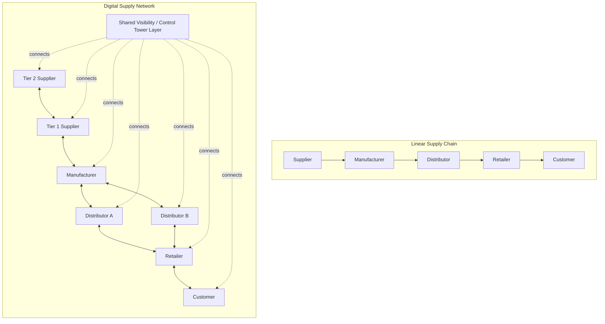

## Linear Supply Chains versus Networked Digital Supply Networks

### Overview

The distinction between linear supply chains and networked Digital Supply Networks (DSNs) represents a paradigm shift in how supply chain topology and coordination logic are conceived: from a sequential, one-directional pipeline model to a multi-node, multi-directional, data-synchronized network model. This shift, heavily promoted in Industry 4.0 and digital supply chain literature (particularly by analyst firms such as Deloitte and Gartner from the mid-2010s onward), reflects both a structural change in how firms physically organize their networks (see Nodes/Links/Flows and Centralized/Decentralized topics) and a technological change in how those networks are coordinated in real time.

### Linear Supply Chain Model

**Key Points**

- The traditional model: a **sequential, stage-gated pipeline** — Supplier → Manufacturer → Distributor → Retailer → Customer — in which information and material flow largely in fixed, predictable directions between adjacent stages only
- Each stage typically interacts directly only with its **immediate neighbors** (a manufacturer coordinates with its direct suppliers and direct distributors, but has limited or no visibility into its suppliers' suppliers, or its distributors' retail customers)
- Coordination is predominantly **batch and periodic**: EDI transactions, weekly/monthly forecasts, and periodic replenishment cycles rather than continuous, real-time signal propagation
- This structure is the direct architectural substrate that produces the **Bullwhip Effect**: because each stage only observes its immediate neighbor's order pattern rather than true end-demand, and information propagates through discrete, delayed handoffs, demand distortion compounds at each stage (see Evolution from Logistics to SCM and Push/Pull topics)
- [Inference] The linear model is not obsolete — it remains a reasonably accurate and often sufficient representation for simple, low-complexity supply chains (e.g., a single-product, few-tier, domestic supply chain), and the shift toward networked models is most consequential for firms with genuinely complex, multi-tier, globally dispersed sourcing

### Networked Digital Supply Network (DSN) Model

**Key Points**

- Reconceives the supply chain as a **multi-node, multi-directional network** in which many participants — not just immediate neighbors — can exchange information and, in some architectures, coordinate directly, enabled by digital platforms that provide shared, often real-time, visibility across multiple tiers simultaneously
- Core structural shift: information no longer propagates only through sequential handoffs between adjacent stages; a shared digital layer (a control tower, a cloud-based visibility platform, or a data-sharing consortium) can make Tier 2/3 supplier data, end-customer POS data, and logistics execution data simultaneously visible to multiple network participants at once
- Coordination becomes **continuous and event-driven** rather than batch/periodic: IoT sensor data, real-time shipment tracking, and API-based integration enable near-instantaneous signal propagation, directly attacking the information-latency root cause of the Bullwhip Effect (see Four Flows topic)
- The DSN concept extends the **graph/network topology** already introduced under Nodes, Links, and Flows: where the linear model is a special-case degenerate graph (a simple path), the DSN model is explicitly a general mesh/network graph with multiple paths and multi-hop visibility

### Structural Comparison: Linear vs. Networked

### Enabling Technologies for DSN Architectures

**Key Points**

- **Control towers**: centralized (or federated) visibility platforms aggregating data across multiple tiers and functions (transportation, inventory, order status) into a unified operational dashboard, enabling exception-based management rather than manual cross-checking across disconnected systems
- **IoT sensors**: real-time location, temperature, and condition monitoring embedded in shipments/assets, feeding continuous data into the network layer rather than relying on periodic manual status updates
- **Blockchain/distributed ledger technology**: applied selectively for multi-party provenance and traceability use cases (e.g., food safety traceback, pharmaceutical anti-counterfeiting, conflict-mineral sourcing verification) where multiple independent parties need a shared, tamper-resistant record without a single trusted central authority — [Unverified] adoption remains concentrated in specific high-compliance use cases rather than broad-based general logistics tracking, and claims of blockchain's transformative impact on mainstream supply chain operations should be treated with some caution given documented gaps between pilot programs and production-scale deployment
- **AI/ML-driven demand sensing and prediction**: processing real-time, multi-source signal (POS data, social sentiment, weather, macroeconomic indicators) to generate more responsive forecasts than traditional time-series-only statistical forecasting
- **API-based / event-driven integration architecture**: displacing traditional batch EDI in leading implementations, enabling the continuous, event-driven coordination pattern central to the DSN concept

### Comparative Analysis

| Dimension | Linear Supply Chain | Digital Supply Network |
| --- | --- | --- |
| Topology | Sequential path (simple graph) | Multi-node mesh (general graph) |
| Visibility scope | Immediate neighbor tiers only | Multi-tier, potentially end-to-end |
| Coordination cadence | Batch/periodic (EDI, weekly cycles) | Continuous/event-driven (real-time APIs, IoT) |
| Bullwhip exposure | High (structural, by design) | Reduced (shared demand signal visibility) |
| Resilience/disruption response | Slow (sequential information propagation) | Faster (parallel, multi-tier awareness) |
| Coordination mechanism | Sequential handoffs between adjacent stages | Shared platform/control tower layer |
| Primary enabling technology | EDI, MRP/ERP | IoT, control towers, APIs, AI/ML forecasting |
| Implementation complexity | Lower | Higher (integration, data governance, trust) |

### The Bullwhip Effect Under Each Model

**Key Points**

- Under a linear model, each stage's forecast input is the *order pattern* of its immediate downstream neighbor, which is itself already a distorted signal (amplified by that neighbor's own batching, promotions, and forecasting error) — this is the direct structural mechanism generating the multiplicative demand-distortion effect formalized by Lee, Padmanabhan, and Whang (1997)
- Under a DSN model with shared multi-tier visibility, a Tier 3 supplier can, in principle, observe actual end-customer POS demand directly (or a close proxy of it) rather than inferring demand from a distorted, multiply-transformed order signal passed through several intermediate stages — this directly targets the informational-architecture root cause discussed under both the Four Flows and Physical/Informational/Financial/Relational Layers topics
- [Inference] The degree to which DSN architectures empirically reduce bullwhip amplification in practice depends heavily on actual adoption depth (whether all relevant tiers genuinely participate in data sharing) rather than the mere existence of the technical capability — a control tower platform that only Tier 1 suppliers actually populate with real data provides limited bullwhip mitigation benefit despite nominally being a "digital supply network"

### Worked Example: Disruption Response Comparison

A key Tier 3 raw material supplier experiences a production outage.

- **Linear model response**: The disruption must propagate sequentially — Tier 3 informs Tier 2, Tier 2 (after assessing its own buffer/impact) informs Tier 1, Tier 1 informs the focal manufacturer, who then must assess downstream impact and inform distributors and retailers. Each handoff introduces delay and potential information distortion; the focal firm may not learn of the disruption's true severity for days or weeks, by which point downstream mitigation options (alternate sourcing, demand reallocation) are more constrained
- **DSN model response**: If the Tier 3 supplier's production status is directly visible on a shared multi-tier control tower platform, the focal manufacturer (and potentially downstream distributors) can observe the disruption in near-real-time, independent of the sequential Tier 3→2→1→focal notification chain, enabling substantially faster mitigation response (alternate sourcing activation, demand reallocation, customer communication)

This scenario directly illustrates why DSN architectures are framed in the literature primarily as a **resilience-enhancing** structural shift (see Core Objectives topic) — the value proposition centers as much on faster disruption detection and response as on steady-state efficiency gains.

### Common Misconceptions

- **"Digital Supply Network is just a rebranding of existing ERP/EDI systems."** [Inference] While DSNs build on established EDI/ERP foundations, the defining structural difference is the shift from bilateral, sequential data exchange (each pair of adjacent firms exchanging data independently) to a shared, multi-party visibility layer accessible across multiple tiers simultaneously — this is a genuine topological change, not merely a technology upgrade of the same linear model.
- **"Adopting DSN technology automatically creates a networked topology."** As the adoption-depth point above notes, purchasing or implementing control-tower or IoT technology does not by itself create genuine multi-tier network coordination if participating firms do not actually share meaningful data through it — the relational-architecture layer (trust, data-sharing agreements, governance) discussed in the Physical/Informational/Financial/Relational topic is a prerequisite for realizing DSN benefits, not an afterthought to the technology deployment.
- **"Networked DSNs eliminate the Bullwhip Effect entirely."** DSN architectures mitigate the informational root cause of bullwhip (order-signal distortion through sequential handoffs) but do not eliminate other contributing causes such as order batching for fixed-cost amortization or price-driven forward-buying behavior, both of which persist as demand-distorting practices independent of the underlying network topology.

**Related Topics**

- Bullwhip Effect: causes, quantification, and mitigation mechanisms
- Control Tower architectures and multi-tier visibility design
- Nodes, Links, and Flows in network topology design
- Supply Chain Risk Management and disruption response
- Physical, Informational, Financial, and Relational Architecture Layers
- Blockchain applications in multi-party supply chain traceability