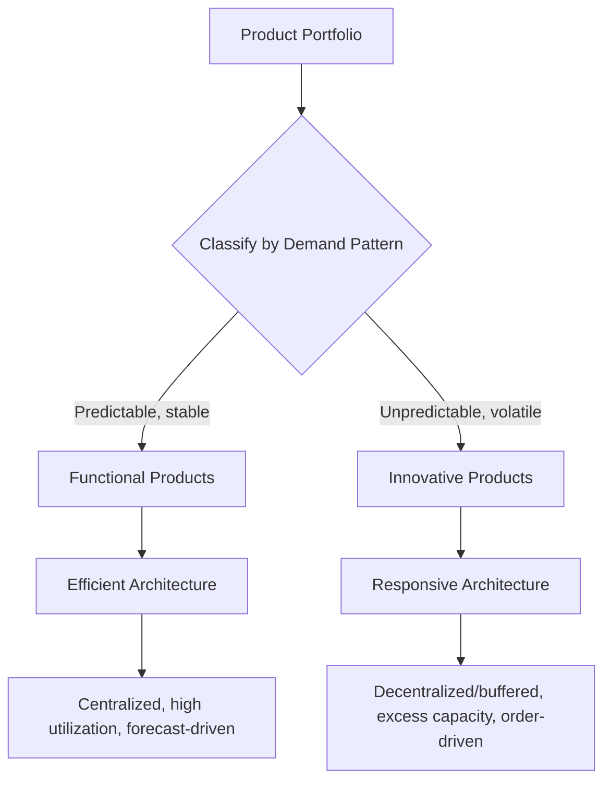

## Responsive Architecture versus Efficient Architecture

### Overview

The responsive-versus-efficient architecture framework, most prominently formalized by Marshall Fisher (1997) in "What Is the Right Supply Chain for Your Product?", provides a foundational strategic lens for matching supply chain architecture to product demand characteristics. The framework argues that supply chain design failures frequently stem not from poor execution within a given architecture, but from a fundamental **mismatch** between the architecture type deployed and the underlying demand pattern of the product it serves — an efficient architecture applied to an unpredictable-demand product, or a responsive architecture applied to a predictable-demand product, both produce systematically poor outcomes regardless of operational excellence.

### Fisher's Product Classification: Functional vs. Innovative

**Key Points**

- **Functional products**: stable, predictable demand, long product life cycles, low profit margins, low product variety, low forecast error, low stockout/obsolescence/markdown rates — typical examples: grocery staples, basic commodities, standard industrial supplies
- **Innovative products**: unpredictable demand, short product life cycles, high profit margins, high product variety, high forecast error, and — critically — high stockout, obsolescence, and markdown costs as a consequence of demand unpredictability — typical examples: fashion apparel, seasonal consumer electronics, promotional/limited-edition products
- The classification is a property of the **product's demand pattern**, not the industry or company; a single firm may carry both functional and innovative products within the same overall product portfolio (e.g., a retailer selling both staple groceries and seasonal fashion items) and, per the framework, should architect differently for each

### Efficient Supply Chain Architecture

**Key Points**

- Optimized primarily to **minimize physical and process costs**, appropriate for functional products where demand is predictable and margins are low, so cost efficiency is the dominant competitive lever
- Design characteristics: high asset/capacity utilization targets, minimized inventory (lean, JIT-oriented), centralized production/distribution to maximize scale economies (see Centralized vs. Decentralized topic), forecast-driven push architecture with decoupling point positioned far downstream (near finished goods)
- Supplier selection criteria emphasize **cost and quality**, with lead time and flexibility weighted comparatively lower, since demand predictability reduces the need for rapid supply-side reconfiguration
- Directly parallels the "cost-leaning" architectural choices identified in the Defining Supply Chain Architecture and Push-Pull Hybrid Systems topics

### Responsive Supply Chain Architecture

**Key Points**

- Optimized primarily to **respond quickly and flexibly to unpredictable demand**, appropriate for innovative products where the cost of misjudging demand (stockout on a hit product, markdown/obsolescence on a flop) far exceeds the cost of carrying excess capacity or inventory buffer
- Design characteristics: deliberately maintained **excess capacity buffer** (rather than maximized utilization), higher safety stock or buffer capacity positioned to absorb demand uncertainty, decentralized/regional production and distribution to minimize lead time, decoupling point positioned far upstream (enabling late differentiation/postponement — see Push-Pull Hybrid Systems topic)
- Supplier selection criteria emphasize **speed, flexibility, and quality**, with cost weighted comparatively lower — a responsive architecture explicitly accepts higher unit cost in exchange for the ability to react to realized demand signals rather than committing to forecast-driven volume far in advance
- Directly parallels the "responsiveness-leaning" architectural choices identified in the Centralized vs. Decentralized and Defining Supply Chain Architecture topics

### Fisher's Matching Matrix

**Key Points**

- Fisher's central prescriptive claim: firms should match architecture type to product type along the diagonal of a two-by-two matrix; the two **off-diagonal cells represent systematic mismatches** that the framework identifies as root causes of chronic supply chain underperformance
- **Functional product + Efficient architecture** (match): appropriate — cost minimization applied where demand predictability makes cost the dominant lever
- **Innovative product + Responsive architecture** (match): appropriate — flexibility/speed applied where demand unpredictability makes stockout/obsolescence cost the dominant lever
- **Functional product + Responsive architecture** (mismatch): the firm incurs unnecessary excess capacity, buffer inventory, and premium supplier costs to hedge against demand uncertainty that doesn't actually exist for this product — a costly overinvestment in flexibility
- **Innovative product + Efficient architecture** (mismatch): the firm's lean, low-buffer, forecast-driven architecture is structurally unable to absorb the high demand unpredictability, producing chronic stockouts on hit products and costly markdowns/obsolescence on misjudged products — [Inference] this mismatch quadrant is generally identified in the literature as the more damaging of the two mismatches, since it directly erodes the high margins that justify carrying innovative products in the first place

### Fisher's Matrix Diagram

<svg xmlns="http://www.w3.org/2000/svg" viewBox="0 0 640 460">
<text x="320" y="24" font-size="16" font-weight="bold" text-anchor="middle" fill="#1a1a1a">Fisher's Product-Architecture Matching Matrix (svg_diagram)</text>
<line x1="180" y1="60" x2="180" y2="420" stroke="#333" stroke-width="1.5" />
<line x1="180" y1="420" x2="600" y2="420" stroke="#333" stroke-width="1.5" />

<text x="390" y="445" font-size="13" text-anchor="middle" fill="`#1a1a1a`">Product Demand Predictability</text>

<text x="220" y="405" font-size="11" fill="#333">Predictable (Functional)</text>

<text x="480" y="405" font-size="11" fill="#333">Unpredictable (Innovative)</text>

<text x="90" y="240" font-size="13" text-anchor="middle" fill="`#1a1a1a`" transform="rotate(-90 90 240)">Architecture Type</text>

<text x="160" y="120" font-size="11" text-anchor="end" fill="#333">Efficient</text>

<text x="160" y="340" font-size="11" text-anchor="end" fill="#333">Responsive</text>

<rect x="180" y="70" width="210" height="170" fill="#e3f0da" stroke="#41ab5d" stroke-width="2" />
<text x="285" y="145" font-size="13" font-weight="bold" text-anchor="middle" fill="#1a1a1a">MATCH</text>
<text x="285" y="165" font-size="11" text-anchor="middle" fill="#1a1a1a">Functional +</text>
<text x="285" y="180" font-size="11" text-anchor="middle" fill="#1a1a1a">Efficient</text>
<text x="285" y="200" font-size="10" text-anchor="middle" fill="#333">(e.g., grocery staples)</text>
<rect x="390" y="70" width="210" height="170" fill="#fde3cf" stroke="#f46d43" stroke-width="2" />
<text x="495" y="145" font-size="13" font-weight="bold" text-anchor="middle" fill="#1a1a1a">MISMATCH</text>
<text x="495" y="165" font-size="11" text-anchor="middle" fill="#1a1a1a">Innovative +</text>
<text x="495" y="180" font-size="11" text-anchor="middle" fill="#1a1a1a">Efficient</text>
<text x="495" y="200" font-size="10" text-anchor="middle" fill="#333">(chronic stockouts/markdowns)</text>
<rect x="180" y="240" width="210" height="170" fill="#fde3cf" stroke="#f46d43" stroke-width="2" />
<text x="285" y="315" font-size="13" font-weight="bold" text-anchor="middle" fill="#1a1a1a">MISMATCH</text>
<text x="285" y="335" font-size="11" text-anchor="middle" fill="#1a1a1a">Functional +</text>
<text x="285" y="350" font-size="11" text-anchor="middle" fill="#1a1a1a">Responsive</text>
<text x="285" y="370" font-size="10" text-anchor="middle" fill="#333">(unnecessary excess cost)</text>
<rect x="390" y="240" width="210" height="170" fill="#e3f0da" stroke="#41ab5d" stroke-width="2" />
<text x="495" y="315" font-size="13" font-weight="bold" text-anchor="middle" fill="#1a1a1a">MATCH</text>
<text x="495" y="335" font-size="11" text-anchor="middle" fill="#1a1a1a">Innovative +</text>
<text x="495" y="350" font-size="11" text-anchor="middle" fill="#1a1a1a">Responsive</text>
<text x="495" y="370" font-size="10" text-anchor="middle" fill="#333">(e.g., fashion apparel)</text>
</svg>

### Comparative Attribute Table

| Attribute | Functional Product | Innovative Product |
| --- | --- | --- |
| Demand predictability | High | Low |
| Product life cycle | Long (years) | Short (months) |
| Profit margin | Low | High |
| Product variety | Low | High |
| Average forecast error | Low (~10%) | High (often 40–100%+) |
| Stockout/markdown rate | Low | High |
| Matching architecture | Efficient | Responsive |
| Decoupling point position | Downstream (near finished goods) | Upstream (near raw materials) |
| Capacity utilization target | Maximized | Deliberately buffered |
| Supplier selection priority | Cost, quality | Speed, flexibility, quality |

### Portfolio Segmentation Diagram

### Worked Example: Portfolio Segmentation at a Single Retailer

A grocery retailer carries both canned goods (functional: stable weekly demand, long shelf life, thin margin) and a seasonal holiday gift assortment (innovative: highly uncertain demand, single sales window, high margin).

- **Canned goods**: architected efficiently — centralized distribution, high-utilization forecast-driven replenishment, cost-optimized carrier selection, minimal buffer beyond standard safety stock calculated from historically stable demand variance
- **Holiday gift assortment**: architected responsively — smaller initial production/purchase commitment with a fast-reorder or flexible-capacity supplier arrangement to chase demand as early sales data reveals which items are trending, premium (faster, more expensive) transportation lanes reserved for replenishment, explicit acceptance of some markdown risk on overestimated SKUs in exchange for avoiding stockouts on underestimated hits

Applying a single uniform efficient architecture (e.g., forcing the gift assortment through the same centralized, forecast-locked replenishment cycle as canned goods) would reproduce the classic innovative-product-in-efficient-architecture mismatch: stockouts on breakout hit items (since replenishment cannot react quickly) and costly end-of-season markdowns on overestimated items (since the forecast-locked commitment cannot be revised downward once realized demand diverges from plan).

### Common Misconceptions

- **"A firm should pick one architecture type company-wide."** [Inference] Fisher's framework explicitly argues against this — the classification and matching decision operates at the **product** (or product-category) level, not the firm level, and firms with diverse portfolios (as in the worked example) should deliberately run multiple architecture postures simultaneously.
- **"Responsive architecture is simply the 'better' or more modern choice."** Responsive architecture carries a real and often substantial cost premium (excess capacity, higher-cost flexible suppliers, decentralized facility overhead); applying it to functional products destroys value rather than creating it — the framework is explicitly about *matching*, not about one architecture type being universally superior.
- **"Efficient and responsive are the same as centralized and decentralized."** [Inference] While there is substantial overlap and correlation (efficient architectures typically lean centralized, responsive architectures typically lean decentralized), the frameworks are not strictly identical — Fisher's framework is anchored specifically in product demand uncertainty as the classification driver, whereas centralization/decentralization is a general architectural trade-off dimension that can be driven by other factors (e.g., pure transportation cost geography) independent of demand predictability.

**Related Topics**

- Fisher's Product Classification: functional vs. innovative demand patterns
- Centralized versus Decentralized Network Architectures
- Push-Pull Hybrid Systems and decoupling point placement
- Demand forecasting error measurement and safety stock sizing
- Postponement strategy for high-variety, high-uncertainty products
- Core Objectives: Cost, Service, Speed, and Resilience trade-offs