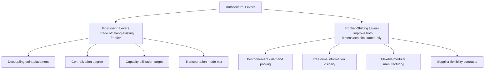

## Architecture Trade-offs Between Efficiency and Responsiveness

**Note:** This topic substantially overlaps with the previously generated "Responsive Architecture versus Efficient Architecture." To provide comprehensive, non-redundant coverage, this entry treats efficiency and responsiveness as opposite ends of a single continuous **strategic frontier** and focuses on the quantitative and structural mechanics of positioning along that frontier — extending rather than repeating Fisher's product-classification matching logic.

### Overview

Where Fisher's framework (previous topic) addresses *which* architecture type to select per product category, this topic addresses the underlying **trade-off frontier** itself: efficiency and responsiveness are not a binary choice but the two poles of a continuous spectrum, and most architectural decisions represent a *position* along that spectrum rather than a discrete selection. This framing — most closely associated with Hau Lee's extension of Fisher's work into the "Triple-A Supply Chain" (Agility, Adaptability, Alignment) and with broader operations strategy literature on efficient frontiers — treats the trade-off as a design curve to be navigated deliberately, with specific architectural levers that shift a firm's position along it.

### The Efficient Frontier Concept

**Key Points**

- Borrowed conceptually from portfolio theory (the efficient frontier in finance, where expected return trades off against risk), the supply chain efficiency-responsiveness frontier represents the set of **Pareto-optimal** architecture configurations: for a given level of responsiveness, there exists a minimum achievable cost, and any configuration above that frontier line represents an improvable (dominated) design
- A firm's position on the frontier is a deliberate strategic choice; movement **along** the existing frontier is a trade-off (more responsiveness necessarily costs more, given current capability), while movement of the **frontier itself outward** (achieving more responsiveness at the same cost, or the same responsiveness at lower cost) represents a genuine capability improvement, typically achieved through investment in enabling levers (technology, postponement design, supplier flexibility) rather than a simple trade-off

**Efficiency-Responsiveness Frontier Diagram**

<svg xmlns="http://www.w3.org/2000/svg" viewBox="0 0 640 420">
<text x="320" y="24" font-size="16" font-weight="bold" text-anchor="middle" fill="#1a1a1a">Efficiency-Responsiveness Trade-off Frontier (svg_diagram)</text>
<line x1="80" y1="360" x2="80" y2="60" stroke="#333" stroke-width="1.5" />
<line x1="80" y1="360" x2="580" y2="360" stroke="#333" stroke-width="1.5" />
<text x="330" y="390" font-size="12" text-anchor="middle" fill="#1a1a1a">Responsiveness →</text>
<text x="45" y="210" font-size="12" text-anchor="middle" fill="#1a1a1a" transform="rotate(-90 45 210)">Cost (lower = more efficient) →</text>
<path d="M 100 90 Q 180 100 260 140 Q 340 190 420 270 Q 480 320 550 350" fill="none" stroke="#2166ac" stroke-width="2.5" />
<text x="180" y="80" font-size="10" fill="#2166ac">Current Frontier</text>
<path d="M 100 130 Q 200 145 300 190 Q 400 250 500 330" fill="none" stroke="#41ab5d" stroke-width="2.5" stroke-dasharray="6,4" />
<text x="200" y="230" font-size="10" fill="#41ab5d">Improved Frontier (post-investment)</text>
<circle cx="180" cy="105" r="5" fill="#d73027" />
<text x="195" y="100" font-size="10" fill="#d73027">Efficient-leaning position</text>
<circle cx="470" cy="300" r="5" fill="#d73027" />
<text x="330" y="298" font-size="10" fill="#d73027">Responsive-leaning position</text>
<circle cx="180" cy="255" r="5" fill="#8e44ad" />
<text x="195" y="260" font-size="10" fill="#8e44ad">Dominated (below current frontier)</text>
</svg>

### Architectural Levers That Shift Position Along the Frontier

**Key Points**

- **Decoupling point positioning** (see Push-Pull Hybrid Systems topic): moving the order penetration point upstream increases responsiveness (more of the process becomes order-triggered) at the cost of reduced scale efficiency in the now-smaller push segment; moving it downstream does the reverse
- **Centralization degree** (see Centralized vs. Decentralized topic): centralizing improves efficiency (pooling, scale) at the cost of responsiveness (longer lead time); decentralizing does the reverse, subject to the Square-Root Law cost penalty
- **Capacity utilization target**: operating facilities near maximum utilization improves efficiency (fixed-cost amortization) but reduces responsiveness (no slack capacity to absorb demand spikes or reconfigure quickly); deliberately maintained excess capacity does the reverse
- **Transportation mode mix**: a higher proportion of low-cost, slow modes (ocean, rail) improves efficiency at the cost of responsiveness; a higher proportion of premium, fast modes (air, expedited) does the reverse
- **Supplier base structure**: a small number of high-volume, deeply negotiated suppliers improves efficiency (economies of scale, lower per-unit cost) but reduces responsiveness/flexibility (harder to reallocate volume quickly); a broader, more flexible supplier base does the reverse

### Levers That Shift the Frontier Itself (Capability Investment)

**Key Points**

- **Postponement/form postponement** (see Push-Pull Hybrid Systems topic): by pooling generic upstream production across multiple downstream variants, postponement can deliver *both* improved efficiency (via pooled forecast accuracy — see Square-Root Law discussion in Centralized vs. Decentralized topic) *and* improved responsiveness (via late, order-triggered final differentiation) simultaneously — a genuine frontier-shifting lever rather than a pure trade-off, since it captures benefits on both axes at once
- **Real-time information visibility** (see Linear vs. Networked Digital Supply Networks topic): reducing information latency allows a given level of responsiveness to be achieved with less buffer inventory (lower cost) than would be required under high-latency, delayed information — directly shifting the frontier outward rather than merely repositioning along it
- **Flexible/modular manufacturing capability**: investment in reconfigurable production lines, modular product architecture, and fast changeover/setup time reduction allows a facility to shift between products or volumes quickly without the traditional efficiency penalty of small-batch production — a capability investment that expands the achievable frontier rather than trading along the existing one
- **Supplier flexibility contracts**: option-based or capacity-reservation contracts (paying a supplier a premium to hold reserve capacity that can be activated on demand) allow a firm to access responsiveness without carrying the full fixed cost of owning that flexible capacity itself, effectively purchasing a frontier-shift from a specialized upstream partner

### Frontier-Shifting vs. Frontier-Positioning Levers

### Comparative Table: Positioning vs. Shifting Levers

| Lever Type | Example | Effect on Cost | Effect on Responsiveness | Nature of Trade-off |
| --- | --- | --- | --- | --- |
| Positioning | Centralize distribution | Decreases | Decreases | Pure trade-off |
| Positioning | Add premium freight capacity | Increases | Increases | Pure trade-off |
| Positioning | Increase capacity utilization target | Decreases | Decreases | Pure trade-off |
| Shifting | Implement postponement | Decreases (pooling) | Increases (late differentiation) | Simultaneous improvement |
| Shifting | Reduce information latency | Decreases (less buffer needed) | Increases (faster signal) | Simultaneous improvement |
| Shifting | Invest in flexible manufacturing | Neutral/decreases (long-run) | Increases | Simultaneous improvement (after payback) |

### The Triple-A Extension (Hau Lee)

**Key Points**

- Hau Lee's Triple-A framework (Harvard Business Review, 2004) extends the efficiency-responsiveness dichotomy by arguing that sustained supply chain advantage requires three complementary capabilities rather than a single efficiency-vs-responsiveness position: **Agility** (ability to respond quickly to short-term demand/supply changes — closely aligned with "responsiveness" as discussed here), **Adaptability** (ability to adjust the underlying architecture as market/industry structures shift over time — a longer-horizon capability), and **Alignment** (ensuring the interests of all supply chain partners are aligned, connecting directly to the Relational Architecture layer discussed in the Physical/Informational/Financial/Relational topic)
- [Inference] The Triple-A framework is best understood as arguing that efficiency-responsiveness positioning (the subject of this topic) is necessary but not sufficient — a firm can be well-positioned on the trade-off frontier for today's demand pattern (agile) while still failing strategically if it cannot adapt that position as the underlying market structure changes (adaptability), or if its partners' incentives are not aligned with its own chosen position (alignment)

### Worked Example: A Frontier-Shifting Investment Decision

A consumer electronics firm currently operates at an efficient-leaning position: centralized manufacturing, ocean freight, decoupling point near finished goods (essentially make-to-stock). It faces chronic stockouts on fast-selling SKU variants and costly markdowns on slow-selling variants — the classic innovative-product-in-efficient-architecture mismatch (see previous topic).

Two options are evaluated:

- **Pure repositioning (trade-off along current frontier)**: switch to air freight and hold higher safety stock per variant — improves responsiveness but at a substantial, ongoing cost premium, since this is a pure trade-off along the existing frontier
- **Frontier-shifting investment**: redesign the product for form postponement (generic base unit produced centrally via ocean freight, with region/configuration-specific final assembly performed at regional hubs triggered by actual orders) — this simultaneously *reduces* required safety stock (via demand pooling across the generic base unit) and *improves* responsiveness (via late, order-triggered final configuration), avoiding the ongoing cost premium of the pure-repositioning option

The frontier-shifting option requires upfront investment (product redesign, regional assembly capability) but produces a structurally better position than any point achievable via pure repositioning on the original architecture — illustrating why capability investment is generally preferred over pure trade-off repositioning when the underlying frontier genuinely admits improvement, though [Inference] the upfront investment cost and implementation time must still be weighed against the ongoing savings, and not every product or process configuration admits a genuine frontier-shifting redesign.

### Common Misconceptions

- **"Every efficiency-responsiveness decision is a zero-sum trade-off."** As demonstrated by postponement, information latency reduction, and flexible manufacturing investment, several architectural levers can improve both dimensions simultaneously — treating the relationship as uniformly zero-sum causes firms to overlook genuinely frontier-shifting opportunities in favor of settling for a trade-off along the existing (suboptimal) frontier.
- **"Moving toward responsiveness is always the safer strategic choice given demand uncertainty."** [Inference] Frontier-shifting investments carry their own risk and switching cost (see Defining Supply Chain Architecture topic on architectural switching costs); for genuinely stable, low-uncertainty product categories, investing in responsiveness capability that the demand pattern doesn't actually require represents the "Functional + Responsive" mismatch identified in Fisher's framework, not a universally safer choice.
- **"The Triple-A framework replaces the efficiency-responsiveness trade-off analysis."** [Inference] Triple-A is better understood as a complementary, higher-level strategic overlay (particularly its adaptability and alignment dimensions) rather than a replacement for the underlying frontier/trade-off mechanics — a firm still needs to understand and navigate the efficiency-responsiveness frontier at the operational-architecture level even while pursuing Triple-A capabilities at the strategic level.

**Related Topics**

- Responsive Architecture versus Efficient Architecture (Fisher's product-matching framework)
- Postponement strategy and demand pooling mechanics
- Hau Lee's Triple-A Supply Chain framework (Agility, Adaptability, Alignment)
- Push-Pull Hybrid Systems and decoupling point placement
- Real-time visibility and Digital Supply Network architecture
- Flexible manufacturing and supplier capacity-option contracts