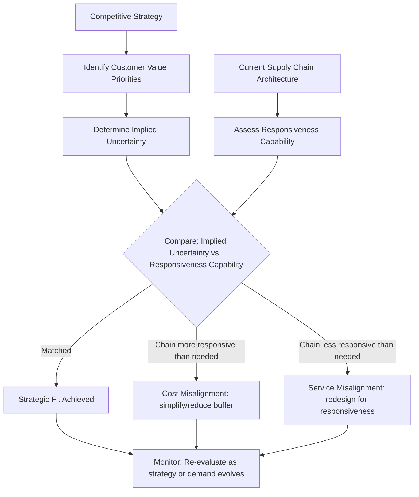

## Aligning Supply Chain Strategy with Competitive Strategy

### Overview

Strategic fit — the alignment between a firm's competitive strategy and its supply chain strategy — is the organizing principle that determines whether a supply chain architecture creates or destroys competitive value. This framework, most systematically formalized by Sunil Chopra and Peter Meindl in *Supply Chain Management: Strategy, Planning, and Operation*, extends and generalizes Fisher's efficiency-responsiveness matching logic (see prior topics) into a complete strategic planning methodology: competitive strategy defines what customers value, this implies a required responsiveness level, and supply chain strategy must be deliberately designed to deliver that responsiveness level, or the two strategies will actively undermine one another regardless of how well either is executed in isolation.

### The Concept of Strategic Fit

**Key Points**

- **Strategic fit** exists when a company's competitive strategy and supply chain strategy have **aligned goals** — the supply chain's capabilities (cost structure, responsiveness, flexibility) match what the competitive strategy requires the firm to deliver to customers
- Chopra and Meindl formalize this as a required sequence: (1) understand the customer and supply chain uncertainty the competitive strategy implies, (2) understand supply chain capabilities, (3) achieve strategic fit by ensuring the degree of supply chain responsiveness is consistent with the implied uncertainty
- Critically, strategic fit is not a static, one-time achievement — as competitive strategy evolves (new market segments, changing customer expectations, competitive repositioning), supply chain strategy must be re-evaluated and potentially redesigned to maintain fit, directly connecting to the "architecture must follow strategy, and both evolve" point raised in the Defining Supply Chain Architecture topic

### Step 1: Understanding Implied Uncertainty

**Key Points**

- **Implied uncertainty** is derived not from the product itself in isolation, but from what the competitive strategy *promises the customer* — the same physical product can carry different implied uncertainty depending on the service commitments the competitive strategy makes around it
- Key implied-uncertainty drivers: the range of quantity/service required, the desired response time customers will tolerate, the required product variety, the required service level, and the rate of innovation/new product introduction
- This extends Fisher's functional/innovative product classification (see Responsive vs. Efficient Architecture topic) by making explicit that implied uncertainty is a joint function of the underlying **demand uncertainty** and the **strategic service promises layered on top of the product** — a firm can increase implied uncertainty for an otherwise-functional product by promising short delivery windows, wide product customization, or aggressive service guarantees

**Demand Uncertainty vs. Implied Uncertainty**

$$\text{Implied Uncertainty} = f(\text{Demand Uncertainty}, \text{Service Commitments})$$

Two firms selling an identical, demand-stable product can face materially different implied uncertainty: a firm competing on next-day delivery and full customization faces high implied uncertainty despite stable underlying demand, while a firm selling the same product with standard delivery windows and no customization faces low implied uncertainty — the supply chain strategy required by each is therefore different even though the product's intrinsic demand uncertainty is identical

### Step 2: Understanding Supply Chain Capabilities

**Key Points**

- Supply chain **responsiveness** capability spans a spectrum, from highly efficient (low cost, low responsiveness) to highly responsive (higher cost, high flexibility), directly corresponding to the efficiency-responsiveness frontier discussed in the prior topic
- Responsiveness capability is determined by the same architectural levers already covered: decoupling point placement, centralization degree, capacity buffer, transportation mode mix, and supplier base flexibility (see Architecture Trade-offs Between Efficiency and Responsiveness topic)
- A firm must honestly assess its **current position** on this spectrum before attempting to achieve fit — a common strategic failure mode is competitive strategy being set (often by marketing/sales leadership) without corresponding assessment of whether the existing supply chain architecture can actually deliver the implied uncertainty that strategy requires

### Step 3: Achieving Strategic Fit — The Zone of Fit

**Key Points**

- Strategic fit is achieved when the supply chain's **responsiveness level** matches the **implied uncertainty** the competitive strategy generates — represented as a "zone of strategic fit" along the responsiveness spectrum, directly paralleling the diagonal-match logic of Fisher's matrix (see Responsive vs. Efficient Architecture topic) but generalized beyond a simple two-by-two classification into a continuous positioning problem
- Positions **outside the zone of fit** represent strategic misalignment: a highly responsive supply chain serving a low-implied-uncertainty competitive strategy incurs unnecessary cost (the "Functional + Responsive" mismatch generalized); a highly efficient supply chain serving a high-implied-uncertainty competitive strategy cannot deliver on the strategy's service promises (the "Innovative + Efficient" mismatch generalized)

### Zone of Strategic Fit Diagram

<svg xmlns="http://www.w3.org/2000/svg" viewBox="0 0 640 400">
<text x="320" y="24" font-size="16" font-weight="bold" text-anchor="middle" fill="#1a1a1a">Zone of Strategic Fit (svg_diagram)</text>
<line x1="80" y1="340" x2="80" y2="60" stroke="#333" stroke-width="1.5" />
<line x1="80" y1="340" x2="580" y2="340" stroke="#333" stroke-width="1.5" />
<text x="330" y="370" font-size="12" text-anchor="middle" fill="#1a1a1a">Implied Uncertainty (Low → High)</text>
<text x="45" y="200" font-size="12" text-anchor="middle" fill="#1a1a1a" transform="rotate(-90 45 200)">Supply Chain Responsiveness (Low → High)</text>
<polygon points="100,320 300,120 560,80 400,300" fill="#e3f0da" stroke="#41ab5d" stroke-width="2" opacity="0.6" />
<text x="330" y="200" font-size="13" font-weight="bold" text-anchor="middle" fill="#1a1a1a">Zone of Strategic Fit</text>
<circle cx="480" cy="100" r="5" fill="#d73027" />
<text x="490" y="95" font-size="10" fill="#d73027">Misfit: efficient chain, high uncertainty strategy</text>
<circle cx="150" cy="280" r="5" fill="#d73027" />
<text x="160" y="275" font-size="10" fill="#d73027">Misfit: responsive chain, low uncertainty strategy</text>
<circle cx="250" cy="180" r="5" fill="#2166ac" />
<text x="260" y="175" font-size="10" fill="#2166ac">Good fit example</text>
</svg>

### The Alignment Process Flow

### Comparative Table: Strategic Fit Diagnostic

| Diagnostic Question | Indicates | Required Action |
| --- | --- | --- |
| Is the firm chronically stocking out on key SKUs despite adequate forecasting effort? | Supply chain less responsive than implied uncertainty requires | Shift architecture toward responsiveness (decentralize, buffer capacity, faster transport) |
| Is the firm carrying persistent excess inventory/capacity relative to competitors at similar price points? | Supply chain more responsive than implied uncertainty requires | Shift architecture toward efficiency (centralize, reduce buffer, lower-cost transport) |
| Has competitive strategy recently shifted (new market segment, new service promise) without corresponding supply chain redesign? | Strategic fit likely eroding | Re-run the three-step alignment process; assess whether current architecture still fits |
| Are marketing/sales service commitments made without supply chain capability consultation? | Structural risk of future misfit | Establish cross-functional strategy-setting process integrating supply chain capability assessment |

### Worked Example: Strategic Drift and Realignment

A mid-market apparel retailer historically competed on low price with a standard, predictable seasonal assortment (low implied uncertainty) — its supply chain, architected efficiently (centralized sourcing from a small number of low-cost overseas manufacturers, long production lead times, forecast-locked seasonal buys), was in strategic fit.

Over several years, competitive pressure pushes the retailer toward a "fast fashion" positioning: frequent new micro-collections, rapid trend response, and short in-season replenishment cycles — a competitive strategy shift that substantially raises implied uncertainty (higher required variety, faster response time, less forecast reliability). The firm's supply chain architecture, unchanged from its original efficient design, cannot deliver the rapid replenishment or trend-responsive production the new strategy demands — the firm experiences chronic misses on trending items and markdown losses on overestimated legacy-cycle inventory.

Restoring strategic fit requires **architectural redesign**, not merely operational tightening: nearshoring or regionalizing a portion of production to shorten lead times, restructuring supplier contracts toward smaller, more frequent, flexible-quantity orders, and moving the decoupling point upstream to enable faster in-season reaction — directly applying the frontier-shifting and positioning levers discussed in the prior topic, now motivated specifically by the competitive-strategy-driven change in implied uncertainty rather than by product-level demand characteristics alone.

### Common Misconceptions

- **"Strategic fit is primarily about picking the right product-level architecture (Fisher's matrix) and stops there."** [Inference] Fisher's product-level matching (see Responsive vs. Efficient Architecture topic) is a necessary input but Chopra and Meindl's framework generalizes it: implied uncertainty is driven jointly by product characteristics *and* the service commitments the competitive strategy layers on top, meaning two firms with identical products can require different supply chain strategies if their competitive positioning differs.
- **"Once achieved, strategic fit is permanent."** As the worked example demonstrates, competitive strategy evolves in response to market and competitive pressure, and supply chain architecture — being slow and costly to change (see Defining Supply Chain Architecture topic on switching costs) — frequently lags, making periodic re-evaluation of fit a required ongoing discipline rather than a one-time design exercise.
- **"Achieving strategic fit is solely a supply chain function responsibility."** [Inference] Because implied uncertainty is generated by competitive strategy decisions (often made by marketing, sales, or general management), and supply chain capability constrains what competitive promises can actually be delivered, achieving and maintaining fit structurally requires cross-functional coordination — a supply chain function acting in isolation cannot unilaterally correct a misfit caused by strategic commitments made elsewhere in the organization.

**Related Topics**

- Responsive Architecture versus Efficient Architecture (Fisher's matching framework)
- Architecture Trade-offs Between Efficiency and Responsiveness
- Implied Demand Uncertainty measurement and drivers
- Cross-functional Sales & Operations Planning (S&OP) integration
- Competitive Strategy frameworks (cost leadership, differentiation) and their supply chain implications
- Strategic drift detection and periodic architecture re-evaluation