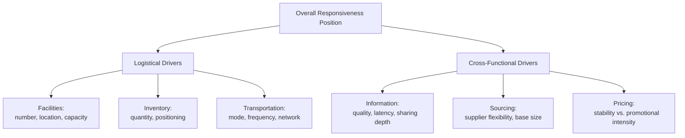

## Strategic Fit and the Responsiveness Spectrum

**Note:** This item substantially overlaps with the immediately preceding topic, "Aligning Supply Chain Strategy with Competitive Strategy," which already covers Chopra and Meindl's strategic fit framework, implied uncertainty, and the zone of fit in depth. To avoid redundancy while providing comprehensive coverage, this entry treats the **responsiveness spectrum itself** as the primary object of analysis — its formal structure, its component drivers, and how a firm diagnoses and calibrates its precise position along it — rather than re-deriving the fit-achievement process already covered.

### Overview

The responsiveness spectrum is the continuous scale, anchored by "highly efficient" at one end and "highly responsive" at the other, along which every supply chain occupies a specific position. Where the prior topic established *that* fit requires matching position on this spectrum to implied uncertainty, this topic examines the spectrum's internal structure: the discrete drivers that compose overall responsiveness, how each driver independently contributes to a firm's spectrum position, and how firms diagnose their actual (as opposed to intended) position.

### The Responsiveness Spectrum as a Composite Measure

**Key Points**

- Supply chain responsiveness is not a single, monolithic characteristic but a **composite** of several largely independent driver dimensions, each of which can be individually positioned along its own efficient-responsive sub-spectrum — a firm's overall responsiveness position is the aggregate effect of these driver-level choices, not a single dial
- The standard driver decomposition (following Chopra and Meindl's logistical and cross-functional driver framework) separates responsiveness drivers into **logistical drivers** — facilities, inventory, transportation — and **cross-functional drivers** — information, sourcing, pricing
- Because each driver can independently be positioned toward efficiency or responsiveness, two firms can arrive at a similar *overall* spectrum position via very different underlying driver configurations — e.g., one firm achieving responsiveness primarily through inventory buffer, another achieving comparable responsiveness primarily through transportation speed, with correspondingly different cost structures

### Logistical Drivers of Responsiveness

**Key Points**

- **Facilities**: number, location, and capacity of physical nodes — more numerous, smaller, more dispersed, and less-utilized facilities increase responsiveness (proximity, buffer capacity) at higher fixed cost; fewer, larger, highly-utilized facilities increase efficiency (see Centralized vs. Decentralized topic)
- **Inventory**: quantity and positioning of stock held across the network — higher inventory levels, positioned closer to demand, increase responsiveness (immediate availability) at higher carrying cost; lower, more centrally-pooled inventory increases efficiency (see Square-Root Law discussion in Centralized vs. Decentralized topic)
- **Transportation**: mode and network design for moving goods — faster, more frequent, smaller-shipment transportation increases responsiveness at higher per-unit cost; slower, consolidated, larger-shipment transportation increases efficiency (economies of scale in freight)

### Cross-Functional Drivers of Responsiveness

**Key Points**

- **Information**: the quality, granularity, and speed of demand and supply data shared across the network — better information (real-time, accurate, broadly shared) increases responsiveness *without necessarily requiring the cost trade-offs of other drivers*, since improved information can substitute for inventory or transportation buffer (directly connecting to the Digital Supply Network and Four Flows topics as a genuinely frontier-shifting driver rather than a pure trade-off)
- **Sourcing**: the number, flexibility, and geographic distribution of the supplier base — a flexible, responsive supplier base (multiple qualified sources, short lead-time contracts, capacity-option agreements) increases responsiveness at typically higher per-unit procurement cost; a consolidated, high-volume, long-lead-time supplier base increases efficiency
- **Pricing**: how pricing policy shapes demand patterns — stable, non-promotional pricing produces smoother, more predictable demand (supporting an efficient architecture); dynamic, promotion-heavy pricing produces lumpier, less predictable demand (requiring a more responsive architecture to absorb the self-induced variability) — this driver is distinctive in that it is demand-shaping rather than supply-side, directly linking pricing strategy decisions (often owned by marketing/revenue functions) to required supply chain responsiveness

### Driver Decomposition Diagram

### Driver Positioning Table

| Driver | Efficient-Leaning Position | Responsive-Leaning Position | Primary Cost Trade-off |
| --- | --- | --- | --- |
| Facilities | Few, large, centralized, high utilization | Many, small, decentralized, buffered capacity | Fixed cost vs. lead time |
| Inventory | Low, centrally pooled | Higher, forward-positioned | Carrying cost vs. availability |
| Transportation | Consolidated, slow modes (ocean, rail) | Frequent, fast modes (air, expedited) | Freight cost vs. speed |
| Information | Low-frequency, siloed (batch EDI) | Real-time, broadly shared (APIs, control towers) | Integration investment vs. buffer substitution |
| Sourcing | Consolidated, long-lead-time suppliers | Diversified, flexible-capacity suppliers | Unit cost vs. reconfiguration speed |
| Pricing | Stable, non-promotional | Dynamic, promotion-driven | Demand predictability vs. revenue optimization |

### Diagnosing Actual Spectrum Position

**Key Points**

- Because responsiveness is a composite of six largely independent drivers, a firm's *intended* strategic position (as set by competitive strategy, per the prior topic) can diverge from its *actual* realized position if individual drivers are not deliberately calibrated to support that intent — a common diagnostic gap in practice
- A firm may declare a "responsive" competitive strategy while its underlying **sourcing** driver remains efficiency-configured (consolidated, long-lead-time suppliers) — the aggregate responsiveness position will be constrained by this misaligned driver regardless of how responsive the other five drivers are configured, since drivers do not fully substitute for one another (a facility network can only respond as fast as the supply feeding it)
- [Inference] Diagnosing true spectrum position therefore requires driver-by-driver audit rather than an aggregate self-assessment — a firm may believe itself well-positioned toward responsiveness based on facility count and inventory levels while an under-examined pricing driver (aggressive promotional calendars generating artificial demand volatility) or sourcing driver (a single-source critical supplier with long lead times) silently constrains actual achievable responsiveness

### Worked Example: Driver-Level Misalignment Diagnosis

A firm competes on a "fast, flexible" positioning (high implied uncertainty per the prior topic's framework) and has invested substantially in facilities (regional distribution centers) and transportation (premium carrier contracts) to support this. Despite these investments, the firm continues to experience slow response to demand spikes.

Driver-by-driver audit reveals:

- **Facilities**: responsive-configured (regional DCs) ✓
- **Transportation**: responsive-configured (premium carriers) ✓
- **Inventory**: responsive-configured (forward-positioned safety stock) ✓
- **Information**: efficient-configured — the firm still relies on weekly batch EDI feeds from suppliers rather than real-time visibility, meaning demand spikes are not detected and communicated upstream for 5–7 days ✗
- **Sourcing**: efficient-configured — the firm's key component supplier operates on 8-week lead times with no flexible-capacity option ✗

The diagnosis reveals that three of five relevant logistical/informational drivers were correctly configured for responsiveness, but the remaining two (information and sourcing) — both cross-functional drivers, notably — were left in an efficiency configuration and are the actual binding constraints on the firm's realized responsiveness. This illustrates the practical value of driver-level decomposition over aggregate spectrum positioning: the firm's investment in facilities and transportation, while directionally correct, could not overcome the binding constraint imposed by unaddressed information latency and sourcing inflexibility — the overall responsiveness of a system is constrained by its least-responsive critical driver, not the average of all drivers.

### Common Misconceptions

- **"Responsiveness is achieved by investing heavily in any one driver, such as inventory or transportation."** As the worked example demonstrates, because drivers do not fully substitute for one another when one remains a binding constraint, over-investment in facilities/transportation/inventory cannot fully compensate for an unaddressed information or sourcing constraint — comprehensive driver-level calibration, not concentrated single-driver investment, is required for genuine spectrum repositioning.
- **"Cross-functional drivers (information, sourcing, pricing) are secondary to the logistical drivers."** [Inference] The worked example and the information-as-frontier-shifter point above suggest the opposite may often hold: information and sourcing drivers frequently represent the more cost-effective repositioning levers (per the frontier-shifting discussion in the prior chapter) precisely because they can substitute for costly physical buffer (inventory, transportation) rather than simply adding to it.
- **"The pricing driver is a marketing concern, not a supply chain architecture concern."** Because promotional and pricing volatility directly generates the demand variability that the physical/informational drivers must then absorb, pricing policy is a legitimate and often underexamined input to required supply chain responsiveness — excluding it from driver-level analysis, as many purely operations-focused assessments do, risks misdiagnosing self-induced (pricing-driven) volatility as an inherent property of underlying customer demand.

**Related Topics**

- Aligning Supply Chain Strategy with Competitive Strategy (implied uncertainty and zone of fit)
- Architecture Trade-offs Between Efficiency and Responsiveness (frontier-shifting vs. positioning levers)
- The Four Flows: Business, Information, Cash, and Logistics
- Bullwhip Effect and pricing-driven demand distortion (forward-buying)
- Supplier flexibility contracts and capacity-option agreements
- Multi-driver diagnostic auditing for supply chain strategy assessment