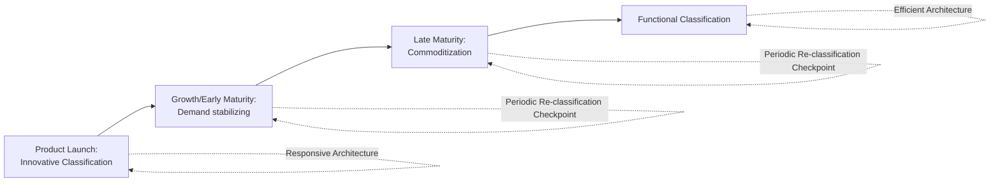

## Functional versus Innovative Product Strategies

**Note:** Fisher's functional/innovative product classification and its architecture-matching implications were already covered in depth under "Responsive Architecture versus Efficient Architecture." This entry does not re-derive that classification. Instead, it focuses on **strategy-level decisions specific to each product type** — how portfolio strategy, organizational design, metrics, and lifecycle management differ once a product has been classified — extending the earlier architectural treatment into broader strategic and organizational territory.

### Overview

Once a product has been classified as functional or innovative (per Fisher's framework), the classification cascades into strategic decisions well beyond supply chain architecture alone: portfolio management approach, organizational structure, performance metrics, new product introduction pacing, and lifecycle transition management all differ systematically between the two product strategies. Treating this classification as purely an architectural input (as the earlier topic necessarily emphasized) understates its broader strategic reach across the firm.

### Portfolio Strategy Implications

**Key Points**

- Firms rarely carry a pure functional or pure innovative portfolio; most operate a **mixed portfolio** requiring simultaneous, differentiated strategic treatment — a strategic challenge distinct from the architectural challenge of matching each product to its architecture (see prior topic's worked example)
- **Portfolio balance** is itself a strategic decision: a portfolio skewed heavily toward innovative products offers higher margin potential but concentrates the firm's exposure to demand-forecasting risk and requires broader organizational investment in responsive capability across more of the business; a portfolio skewed toward functional products offers earnings stability but caps margin upside and long-run differentiation potential
- **Cross-subsidization dynamics**: in mixed portfolios, functional products frequently generate the stable cash flow that funds the higher-risk investment (excess capacity, flexible sourcing, faster logistics) required to support innovative products — a strategic interdependency that pure product-level architectural analysis does not capture, since it treats each product's architecture independently rather than considering portfolio-level resource allocation

### Organizational Design Implications

**Key Points**

- Functional and innovative product lines frequently warrant **different organizational structures and decision rights**, even within a single firm — functional product lines typically benefit from centralized, standardized process ownership (maximizing the scale/consistency benefits the efficient architecture is designed to capture), while innovative product lines typically benefit from more autonomous, cross-functionally integrated teams empowered to make fast, localized decisions (matching the decentralized, order-driven architecture)
- [Inference] A common organizational failure mode is applying a single, uniform governance and decision-making structure across a mixed portfolio — e.g., requiring innovative-product teams to route decisions through the same centralized approval processes designed for functional-product efficiency, which structurally undermines the responsiveness the innovative product's architecture was designed to deliver
- Talent and incentive structures often differ: functional product management frequently rewards cost discipline and process adherence; innovative product management frequently rewards demand-sensing accuracy, speed of reaction, and tolerance for calculated risk-taking (since some markdown/stockout error rate is an accepted cost of the innovative strategy, not a performance failure)

### Metrics and KPI Divergence

**Key Points**

- Functional products are typically measured against **efficiency-oriented KPIs**: cost per unit, inventory turns, capacity utilization, forecast accuracy (meaningful here because demand is genuinely predictable), and gross margin return on inventory investment (GMROI)
- Innovative products are typically measured against **responsiveness-oriented KPIs**: sell-through rate within the selling window, markdown rate (an expected and monitored cost, not simply a failure metric), stockout rate on trending items, and time-to-market/time-to-react for mid-cycle replenishment or trend adjustment
- Applying functional-product metrics (e.g., strict forecast accuracy targets) to innovative products is a documented strategic misstep: since innovative products carry structurally high forecast error by definition (see Fisher's classification attributes in the prior topic), holding innovative-product teams to functional-product forecast-accuracy standards penalizes the very demand unpredictability that justifies the product's premium margin and existence in the portfolio

### Product Lifecycle and Classification Drift

**Key Points**

- Product classification is not always static over a product's lifecycle — a product can begin as **innovative** (novel, high demand uncertainty, premium margin) and, as it matures, market adoption stabilizes, and competitive imitation narrows margins, gradually transition toward **functional** characteristics (predictable demand, thin margin, commoditized)
- This lifecycle drift is a well-documented pattern in consumer electronics and technology-adjacent categories: a genuinely novel product category exhibits high uncertainty and margin at launch, but as the category matures into a standardized commodity, both uncertainty and margin compress, and the optimal architecture should transition from responsive toward efficient over the product's life
- [Inference] Firms that fail to periodically re-classify mature products risk carrying an unnecessarily costly responsive architecture (excess buffer capacity, premium logistics, flexible-but-expensive sourcing) for products that have, in practice, become functional — directly paralleling the "Functional + Responsive" mismatch cost identified in Fisher's original matrix, but arising here from *lifecycle drift* rather than initial misclassification

### Classification Lifecycle Diagram

### Strategic Decision Comparison Table

| Strategic Dimension | Functional Product Strategy | Innovative Product Strategy |
| --- | --- | --- |
| Portfolio role | Cash flow stability, funding base | Margin growth, differentiation |
| Organizational structure | Centralized, standardized process ownership | Autonomous, cross-functionally integrated teams |
| Decision rights | Centralized approval, consistency-focused | Localized/fast decision authority |
| Primary KPIs | Cost/unit, inventory turns, capacity utilization | Sell-through rate, markdown rate, stockout rate on hits |
| Forecast accuracy target | High, strictly enforced | Lower baseline expected; accuracy of *trend detection* matters more than point forecasts |
| New product introduction pace | Slow, incremental | Fast, frequent |
| Talent/incentive emphasis | Cost discipline, process adherence | Demand-sensing speed, calculated risk tolerance |
| Lifecycle trajectory | Typically stable classification | May drift toward functional as category matures |

### Worked Example: Portfolio-Level Strategic Interdependency

A consumer goods company manufactures both a long-established staple product line (functional: stable demand, thin margin, funds ~70% of company cash flow) and a newly launched innovative product line (high margin, high demand uncertainty, currently unprofitable due to launch-phase markdown/stockout costs).

A purely product-level architectural view (per Fisher's framework) would correctly recommend efficient architecture for the staple line and responsive architecture for the new line. A portfolio-strategy view adds a critical additional layer: the staple line's stable cash generation is the funding source enabling the firm to absorb the innovative line's currently-negative margin during its demand-uncertainty-driven launch phase. If organizational metrics evaluate the innovative line purely on standalone near-term profitability (a functional-product-appropriate metric applied inappropriately), leadership may prematurely curtail investment in the innovative line's responsive capability — even though the innovative line's strategic value (future margin potential, portfolio differentiation) depends precisely on sustaining that responsive investment through its uncertain launch phase, funded deliberately by the functional line's stability.

### Common Misconceptions

- **"Product classification, once made, should remain fixed for the product's life."** As the lifecycle drift discussion demonstrates, classification is a periodic re-assessment exercise, not a one-time decision — a product's demand uncertainty characteristics evolve as markets mature and competitive dynamics shift.
- **"A firm should aim to maximize the share of innovative products in its portfolio, since they carry higher margin."** [Inference] While innovative products offer higher margin potential, an all-innovative portfolio concentrates demand-forecasting risk and requires proportionally larger organization-wide investment in responsive capability without the stabilizing cash-flow and funding role that functional products typically provide — portfolio balance, not innovative-product maximization, is the generally recommended strategic objective.
- **"Metrics can be standardized across the portfolio for comparability."** As the metrics-divergence discussion shows, applying uniform metrics (particularly forecast accuracy) across both product types systematically penalizes innovative products for the demand unpredictability that is an intrinsic, expected characteristic of their category, rather than a controllable performance failure.

**Related Topics**

- Responsive Architecture versus Efficient Architecture (Fisher's original matching framework)
- Product Lifecycle Management and classification drift
- Portfolio strategy and cross-subsidization in mixed product lines
- KPI design for demand-uncertain versus demand-stable product categories
- Organizational design for dual-mode (efficient/responsive) operating models
- New Product Introduction (NPI) pacing and go-to-market strategy