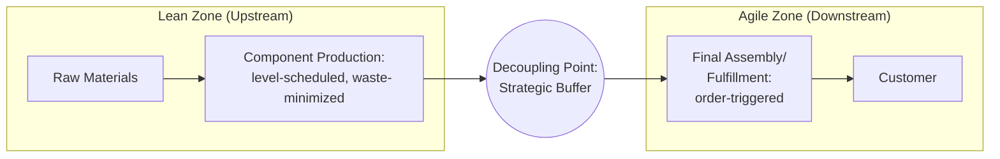

## Lean, Agile, and Leagile Supply Chain Strategies

### Overview

Lean, agile, and leagile represent a distinct but closely related strategic vocabulary to Fisher's efficient/responsive framework (see prior topics), originating primarily from manufacturing operations and logistics literature (Toyota Production System roots for lean; Martin Christopher and Denis Towill's work on agility and the "leagile" synthesis in the late 1990s/2000s). While substantially overlapping with efficient/responsive terminology, lean and agile carry distinct theoretical emphases — lean centers on **waste elimination**, agile centers on **market responsiveness under volatility** — and leagile formalizes a specific hybrid architecture combining both via a strategically positioned decoupling point, making it a more prescriptive and operationally concrete synthesis than the general efficiency-responsiveness frontier discussed earlier.

### Lean Supply Chain Strategy

**Key Points**

- Rooted in the **Toyota Production System (TPS)**, lean supply chain strategy centers on the systematic elimination of **waste (muda)** across seven canonical categories: overproduction, waiting, transportation, over-processing, excess inventory, unnecessary motion, and defects
- Core lean principles applied at the supply chain level: **level scheduling (heijunka)** — smoothing production volume and mix to avoid the demand-amplifying batching behavior that drives the Bullwhip Effect; **pull-based replenishment (kanban)** — producing only what is consumed downstream (see Push-Pull Hybrid Systems topic); **continuous flow** — minimizing batch sizes and queue/waiting time between process steps; and **standardized work** — reducing process variability as a precondition for reliable, low-waste flow
- Lean is fundamentally a **cost/efficiency-oriented strategy**, closely aligned with (though not strictly identical to) Fisher's "efficient architecture," and is most effective in relatively **stable, predictable demand environments** where waste elimination — rather than rapid reconfiguration — is the primary value-creation lever
- [Inference] A frequently noted limitation of pure lean strategy: aggressive waste elimination (particularly buffer inventory reduction) can, if applied without regard to demand volatility, directly *reduce* resilience and responsiveness — making lean strategy structurally vulnerable to the same efficient/innovative-product mismatch risk identified in Fisher's framework when applied to genuinely volatile-demand categories

### Agile Supply Chain Strategy

**Key Points**

- Formalized primarily through Martin Christopher's work (notably "The Agile Supply Chain: Competing in Volatile Markets," 2000), agile strategy centers on **rapid, flexible response to demand and supply volatility**, treating market sensitivity and organizational flexibility as the primary value-creation levers rather than cost minimization
- Core agile principles: **market sensitivity** — direct, low-latency capture of real demand signal (closely paralleling the informational-architecture emphasis in the Digital Supply Network topic); **virtual integration** — information-sharing across network partners to enable coordinated fast response without requiring full vertical ownership; **process integration** — collaborative, cross-firm working relationships (connecting to the relational-architecture layer discussed earlier); and **network-based structure** — relying on a confederation of flexible partners rather than a single vertically-integrated entity to achieve responsiveness
- Agile strategy closely parallels Fisher's "responsive architecture" but places distinctive emphasis on **organizational and inter-firm flexibility** (partner network reconfigurability) as a mechanism, in addition to the physical/architectural levers (buffer capacity, decentralization) already discussed

### Leagile: The Hybrid Synthesis

**Key Points**

- **Leagile** (a portmanteau of "lean" and "agile," formalized primarily by Naylor, Naim, and Berry, 1999, and further developed by Christopher and Towill) is not a compromise or blend applied uniformly across the whole supply chain, but a **structural hybrid**: lean principles applied upstream of a deliberately positioned decoupling point, agile principles applied downstream of it
- This directly extends the push-pull hybrid and postponement architecture already introduced (see Push-Pull Hybrid Systems topic): the upstream (push) segment is optimized for lean efficiency — waste elimination, level scheduling, economies of scale — precisely because it operates against aggregated, pooled demand forecasts with comparatively lower uncertainty; the downstream (pull) segment is optimized for agile responsiveness — rapid reconfiguration, market-sensitive final assembly/fulfillment — precisely because it operates against realized, volatile individual-order demand
- The critical strategic insight distinguishing leagile from a simple "pick lean or agile" choice: the **decoupling point acts as a strategic buffer** that absorbs the volatility differential between the two segments, allowing lean's efficiency benefits to be captured in the upstream segment without exposing it directly to the downstream segment's full demand volatility

### Leagile Architecture Diagram

### Comparative Analysis: Lean vs. Agile vs. Leagile

| Dimension | Lean | Agile | Leagile |
| --- | --- | --- | --- |
| Primary value lever | Waste elimination | Market responsiveness | Segmented: waste elimination upstream, responsiveness downstream |
| Appropriate demand environment | Stable, predictable | Volatile, uncertain | Mixed (aggregate demand pooled upstream, volatile at order level downstream) |
| Key mechanism | Level scheduling, kanban, continuous flow | Market sensitivity, virtual/network integration | Decoupling point as strategic buffer |
| Closest Fisher/Chopra-Meindl analog | Efficient architecture | Responsive architecture | Explicit hybrid via postponement |
| Primary risk if misapplied | Fragility under demand volatility | Unnecessary cost under stable demand | Decoupling point mispositioned (see below) |
| Typical origin discipline | Manufacturing/TPS | Marketing-logistics/market sensing | Operations strategy synthesis |

### The Decoupling Point as the Leagile Design Variable

**Key Points**

- Because leagile's effectiveness depends entirely on **correct decoupling point placement**, this single design variable functions as the primary lever determining how much of the network benefits from lean efficiency versus agile responsiveness — moving the decoupling point downstream expands the lean zone (more scale/waste-elimination benefit, less responsiveness), moving it upstream expands the agile zone (more responsiveness, less scale benefit) — directly reprising the decoupling-point mechanics from the Push-Pull Hybrid Systems and Architecture Trade-offs topics, now framed specifically through the lean/agile vocabulary
- [Inference] Correct decoupling point placement for a leagile strategy should generally be set at the point where aggregate (pooled, multi-variant) demand uncertainty becomes acceptably low for lean-style level scheduling, while still leaving sufficient downstream distance to absorb realized order-level volatility through agile response — an empirical, product- and market-specific calibration rather than a fixed rule
- A common implementation failure: positioning the decoupling point based on existing process/facility convenience (e.g., "this is where our current assembly line happens to be located") rather than actual demand-uncertainty analysis, which reproduces the same product-architecture mismatch risk discussed under Fisher's framework, now manifesting specifically as a poorly-calibrated leagile boundary rather than an outright wrong architecture choice

### Worked Example: Leagile Implementation in Personal Computer Manufacturing

A PC manufacturer's leagile architecture (closely paralleling the historical Dell build-to-order model referenced in earlier topics):

- **Lean zone (upstream)**: motherboard, chassis, and generic sub-component production runs on level-scheduled, high-volume, waste-minimized manufacturing lines, producing against a pooled, aggregate demand forecast across all configuration variants — demand uncertainty at this pooled level is low (per the demand-pooling/Square-Root Law logic from the Centralized vs. Decentralized topic), making lean's efficiency-maximizing techniques (kanban-triggered component replenishment, minimal WIP, standardized work) highly effective
- **Decoupling point**: positioned immediately before final configuration — the point at which a specific customer order (CPU, RAM, storage, region-specific power/localization options) is known
- **Agile zone (downstream)**: final assembly and configuration is triggered directly by the confirmed customer order, executed with the market-sensitivity and rapid-response emphasis characteristic of agile strategy — no forecast is required for this segment since it operates entirely against realized demand

This architecture captures lean's scale/waste-elimination benefit where demand uncertainty is genuinely low (the pooled component level) while reserving agile's responsiveness specifically for the segment where genuine per-order uncertainty exists (final configuration) — avoiding the cost of applying agile principles to the entire chain (unnecessary, since most of the value chain faces low aggregate uncertainty) while also avoiding the mismatch risk of applying lean principles to the final-configuration segment (which would reintroduce forecast-driven risk on a highly variable, high-SKU-count segment).

### Common Misconceptions

- **"Lean and agile are simply synonyms for efficient and responsive."** [Inference] While substantially overlapping in practical outcome, lean's origin and emphasis (waste elimination as the primary lever, rooted in manufacturing process discipline) and agile's origin and emphasis (market sensitivity and network flexibility as the primary lever, rooted in marketing-logistics integration) reflect genuinely distinct theoretical traditions — leagile's specific contribution (a structural hybrid via decoupling point) is a more prescriptive architectural synthesis than the general efficiency-responsiveness frontier vocabulary alone provides.
- **"Leagile means running 'somewhat lean' and 'somewhat agile' uniformly across the whole chain."** This is a direct misreading of the framework — leagile is explicitly a **segmented** architecture (full lean upstream, full agile downstream of a specific decoupling point), not a diluted, averaged blend of both applied everywhere.
- **"A pure lean strategy is inherently outdated or inferior to agile/leagile."** [Inference] For genuinely stable, low-uncertainty demand categories (functional products, per Fisher's classification), pure lean remains an appropriate and often superior strategy — leagile's added complexity (dual-mode operational management, decoupling point calibration and maintenance) is only justified when genuine demand-uncertainty segmentation exists within the value chain, paralleling the general principle that responsiveness investment is only warranted where implied uncertainty requires it (see Aligning Supply Chain Strategy with Competitive Strategy topic).

**Related Topics**

- Push-Pull Hybrid Systems and decoupling point strategic placement
- Toyota Production System and lean manufacturing principles
- Christopher's Agile Supply Chain framework and market sensitivity
- Postponement strategy and demand pooling mechanics
- Responsive Architecture versus Efficient Architecture (Fisher's framework)
- Kanban systems and level scheduling (heijunka) implementation