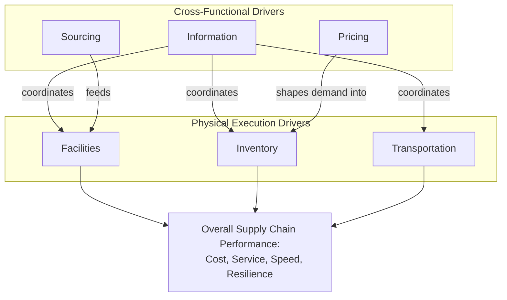

## Drivers of Supply Chain Performance

**Note:** The six Chopra-Meindl drivers (facilities, inventory, transportation, information, sourcing, pricing) were already introduced in "Strategic Fit and the Responsiveness Spectrum" as the componential structure of the responsiveness spectrum. This entry does not re-derive that decomposition. Instead, it treats each driver as a **standalone performance-management object** — its internal sub-decisions, its own efficiency-responsiveness trade-off structure, and its measurement framework — providing the operational depth the prior topic's spectrum-positioning treatment did not require.

### Overview

The six supply chain performance drivers — facilities, inventory, transportation, information, sourcing, and pricing — are the mechanisms through which supply chain strategy is actually executed and measured. Where the prior topic examined these drivers collectively as components of overall spectrum positioning, this topic examines each driver individually as a distinct performance-management discipline with its own sub-decisions, internal trade-offs, and standard metrics — the level of granularity at which supply chain managers typically operate day-to-day.

### Driver 1: Facilities — Sub-Decisions and Metrics

**Key Points**

- **Role**: the physical locations in the network where product is stored, assembled, or fabricated — the "where" of the supply chain
- **Sub-decisions**: role/function of each facility (production, storage, or hybrid), location (proximity to supply vs. demand, cost factors, infrastructure), capacity (planned utilization level, allowing for flexibility vs. maximizing throughput)
- **Standard metrics**: capacity utilization rate, average facility throughput time, facility fixed and variable cost per unit processed, and quality/yield rate at each facility
- Facility component of overall performance connects directly to the Centralized vs. Decentralized topic's network design decisions and to Nodes/Links/Flows' node taxonomy

### Driver 2: Inventory — Sub-Decisions and Metrics

**Key Points**

- **Role**: all raw materials, work-in-process, and finished goods held across the network — the primary buffer absorbing the mismatch between supply and demand timing
- **Sub-decisions**: cycle inventory (average inventory held to satisfy demand between replenishments, driven by order/batch sizing), safety inventory (buffer held against demand/supply uncertainty, per the safety stock formulas introduced under Core Objectives), and seasonal inventory (built up in anticipation of predictable seasonal demand peaks that exceed available production capacity)
- **Standard metrics**: inventory turns (cost of goods sold ÷ average inventory value), days of inventory/days inventory outstanding (DIO — see Four Flows topic's cash conversion cycle), fill rate, and average inventory holding cost as a percentage of inventory value
- Inventory-specific efficiency/responsiveness trade-off directly parallels the pooling logic from the Square-Root Law (see Centralized vs. Decentralized topic): more inventory, more forward-positioned, increases responsiveness at higher carrying cost

### Driver 3: Transportation — Sub-Decisions and Metrics

**Key Points**

- **Role**: moving inventory between points in the network — the "how" of physical flow execution
- **Sub-decisions**: mode selection (air, ocean, rail, truck, intermodal — each with a distinct cost/speed/capacity profile), network design (direct shipping versus routing through consolidation/cross-dock points), and in-house versus outsourced execution (private fleet versus contracted carriers versus 3PL — see Key Stakeholders topic)
- **Standard metrics**: cost per unit shipped (or per ton-mile), average transit time and transit time variability, on-time delivery rate, and load/capacity utilization rate (percentage of available truck/container capacity actually used)
- Mode selection cost/speed trade-off was quantified in the Total Cost worked example under Evolution from Logistics to SCM; transit time variability (not just average transit time) is an increasingly emphasized metric, since customers and downstream safety-stock calculations respond more to variability than to average speed alone

### Driver 4: Information — Sub-Decisions and Metrics

**Key Points**

- **Role**: the connective tissue enabling coordination across all other drivers — data regarding demand, inventory status, capacity, and shipment location
- **Sub-decisions**: push versus pull system design (see Push-Pull Hybrid Systems topic), coordination and information-sharing depth (bilateral versus multi-tier visibility — see Digital Supply Network topic), forecasting methodology, and enabling technology selection (EDI, API, IoT sensor integration, control tower platforms)
- **Standard metrics**: forecast accuracy (commonly measured via Mean Absolute Percentage Error, MAPE, or Mean Absolute Deviation, MAD), data latency (time between an event occurring and its visibility to relevant stakeholders), and information-sharing depth/coverage (percentage of network nodes with real-time versus batch visibility)
- Information's distinctive property among the six drivers: as established in the prior topic, improved information can **substitute for** rather than merely trade off against inventory and transportation buffer, making it a frequent focus of frontier-shifting investment (see Architecture Trade-offs topic)

### Driver 5: Sourcing — Sub-Decisions and Metrics

**Key Points**

- **Role**: the set of business processes required to purchase goods and services — supplier selection, contracting, and ongoing supplier relationship management
- **Sub-decisions**: in-house versus outsourced production (make-or-buy), supplier selection criteria weighting (cost, quality, lead time, flexibility — see Responsive vs. Efficient Architecture topic's supplier-criteria discussion), single-sourcing versus multi-sourcing (a direct resilience/cost trade-off, see Core Objectives topic), and procurement process design (spot-market purchasing versus long-term contracts)
- **Standard metrics**: supplier lead time and lead time variability, supplier on-time-in-full (OTIF) delivery rate, purchase price variance, and supplier quality/defect rate (parts per million, PPM)
- Sourcing decisions directly determine the tier structure and stakeholder relationships discussed in the Key Stakeholders and Roles topic

### Driver 6: Pricing — Sub-Decisions and Metrics

**Key Points**

- **Role**: how a firm's pricing policy shapes buyer demand behavior — distinctive among the six drivers as the primary **demand-shaping** rather than supply-execution lever
- **Sub-decisions**: everyday-low-pricing (EDLP) versus high-low/promotional pricing strategy, price differentiation across customer segments or channels, and volume discount/quantity-break structure design
- **Standard metrics**: price elasticity of demand, promotional lift (incremental volume attributable to a promotion), forward-buy volume (inventory customers purchase in advance of a price increase or during a promotion, distorting the true underlying demand signal), and margin realization rate
- Pricing's demand-distorting effect (particularly forward-buying behavior around promotions) is a well-documented direct contributor to the Bullwhip Effect, connecting this driver explicitly to the informational-distortion mechanisms discussed in the Evolution from Logistics and Push-Pull Hybrid Systems topics

### Driver Interaction and Performance Measurement Diagram

### Driver-Level Metrics Summary Table

| Driver | Key Sub-Decisions | Primary Metrics | Trade-off Governed |
| --- | --- | --- | --- |
| Facilities | Role, location, capacity | Utilization rate, throughput time, cost/unit | Fixed cost vs. lead time/responsiveness |
| Inventory | Cycle, safety, seasonal stock | Inventory turns, DIO, fill rate | Carrying cost vs. availability |
| Transportation | Mode, network design, in-house/outsource | Cost/unit, transit time (& variability), OTD rate | Freight cost vs. speed |
| Information | Push/pull design, sharing depth, technology | Forecast accuracy (MAPE/MAD), data latency | Integration cost vs. buffer substitution |
| Sourcing | Make-or-buy, supplier selection, single/multi-source | Lead time, OTIF rate, PPM defect rate | Unit cost vs. flexibility/resilience |
| Pricing | EDLP vs. promotional, segmentation | Price elasticity, promotional lift, forward-buy volume | Revenue optimization vs. demand predictability |

### Worked Example: Multi-Driver Root-Cause Analysis of a Performance Gap

A firm's overall fill rate has declined from 96% to 89% over two quarters despite no change in aggregate demand volume. Driver-level investigation:

- **Facilities**: utilization rate is stable at historical norms — not the cause
- **Inventory**: cycle and safety stock parameters are unchanged — not the immediate cause, though downstream symptom
- **Transportation**: average transit time is stable, but transit time *variability* has increased 40% due to a new carrier's inconsistent performance — a contributing factor, since higher lead-time variability directly increases required safety stock (per the $SS = z \times \sigma_L$ relationship from Core Objectives) at unchanged safety stock levels, effectively reducing realized service
- **Information**: no change identified
- **Sourcing**: a key supplier recently extended lead times from 3 to 5 weeks without formal notification, an undetected change since the firm's information driver lacked a monitoring mechanism for supplier lead-time drift — identified as the primary root cause
- **Pricing**: a recent promotional calendar increase has driven higher forward-buying behavior, amplifying order variability beyond underlying consumption and further straining the (unchanged) safety stock buffer — a secondary contributing factor

This decomposition illustrates the practical value of driver-level diagnostic structure: a single aggregate symptom (fill rate decline) had **two distinct root causes** (undetected sourcing lead-time drift, and pricing-driven demand distortion) plus one contributing factor (transportation variability), none of which would have been correctly isolated by examining inventory policy alone — the naive response of simply increasing safety stock would have addressed the symptom without correcting either underlying driver-level cause.

### Common Misconceptions

- **"Inventory is the primary lever for fixing most supply chain performance problems."** As the worked example demonstrates, inventory levels are frequently a **downstream symptom** of root causes originating in other drivers (sourcing lead-time drift, transportation variability, pricing-driven demand distortion) — adjusting inventory policy without addressing the originating driver treats the symptom rather than the cause, and the underlying problem typically recurs.
- **"Each driver should be optimized independently for best overall performance."** [Inference] Because the drivers are interdependent (information coordinates the physical drivers; pricing shapes the demand that inventory must absorb; sourcing determines the lead-time variability inventory must buffer against), driver-level metrics should generally be interpreted and acted upon jointly rather than as six independent optimization problems — a genuinely coordinated diagnostic process, as in the worked example, is necessary to correctly attribute root cause.
- **"Pricing is a marketing/sales metric, not a supply chain performance driver."** As established here and in the prior topic, pricing policy directly shapes the demand volatility that all other drivers must then absorb — excluding it from supply chain performance driver analysis, a common organizational blind spot, risks misattributing pricing-driven volatility to forecasting or inventory-policy failure.

**Related Topics**

- Strategic Fit and the Responsiveness Spectrum (driver decomposition and spectrum positioning)
- Core Objectives: Cost, Service, Speed, and Resilience
- Bullwhip Effect and pricing/promotion-driven demand distortion
- Multi-tier supplier lead-time monitoring and visibility
- Forecast accuracy measurement (MAPE, MAD, bias)
- Root-cause diagnostic frameworks for supply chain performance gaps