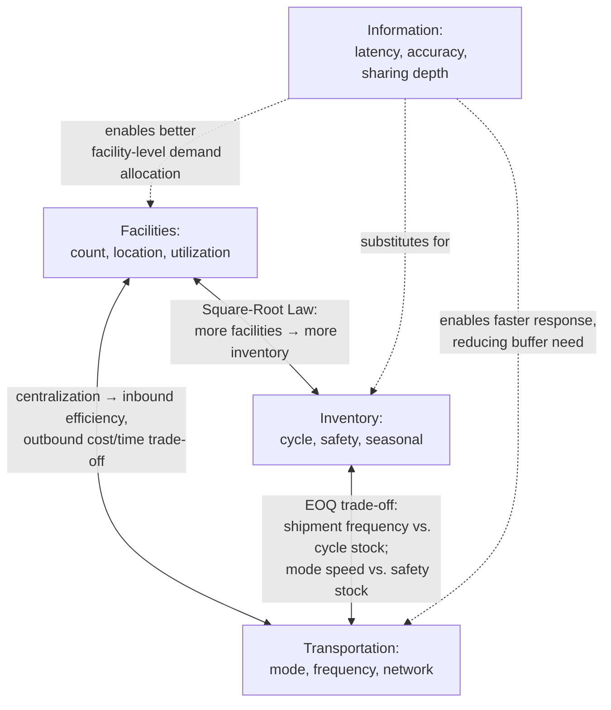

## Trade-off Analysis Across Facilities, Inventory, Transportation, and Information

**Note:** The individual driver definitions, sub-decisions, and standalone metrics for facilities, inventory, transportation, and information were established in "Drivers of Supply Chain Performance." This entry does not restate those definitions. Instead, it focuses specifically on the **pairwise and joint trade-off mechanics between these four drivers** — the quantitative and structural interactions that make joint (rather than driver-by-driver sequential) optimization necessary, extending the prior topic's diagnostic treatment into a proactive design methodology.

### Overview

Facilities, inventory, transportation, and information do not trade off independently against a single "responsiveness" axis — they trade off directly **against one another** in specific, quantifiable ways. A change in facility network design mechanically changes required inventory levels and achievable transportation cost structure; a change in information latency mechanically changes the inventory required to achieve a given service level. This topic examines these pairwise interactions explicitly, since sequential, driver-by-driver optimization (optimizing facilities, then inventory, then transportation, each holding the others fixed) systematically produces inferior outcomes relative to joint optimization, a well-established result in supply chain network design literature.

### Facilities–Inventory Trade-off

**Key Points**

- Facility count and location directly determine achievable inventory pooling, per the Square-Root Law (see Centralized vs. Decentralized topic): more facilities (decentralization) mechanically increases required aggregate safety stock to maintain a given service level, holding demand pattern constant
- Facility **capacity utilization target** trades directly against inventory buffer: facilities operated near maximum utilization have limited slack to absorb demand surges, requiring higher finished-goods or WIP inventory buffer elsewhere in the network to compensate; facilities operated with deliberate excess capacity can absorb surges directly, reducing the inventory buffer otherwise required
- This trade-off is not fully substitutable in one direction: additional facilities can *reduce* transportation-driven lead time (a benefit) while *increasing* required inventory (a cost) — the two effects move in different directions simultaneously, meaning the net effect on overall cost is a genuine joint calculation, not a simple sum

### Facilities–Transportation Trade-off

**Key Points**

- Facility count and location directly determine transportation distance and, consequently, both inbound consolidation opportunity and outbound/last-mile delivery time — fewer, larger, more centralized facilities generally enable more efficient **inbound** freight consolidation (larger, less frequent shipments from suppliers) but longer, more costly **outbound** transportation to dispersed demand points; more numerous, smaller, decentralized facilities reverse this pattern
- This is a genuine **structural trade-off, not a pure cost minimization** in either direction: a firm cannot generally achieve both minimal inbound freight cost (favoring centralization) and minimal outbound freight cost/time (favoring decentralization) simultaneously through facility network design alone — the optimal facility count is the point where marginal inbound consolidation savings from adding one more facility no longer outweigh the marginal outbound transportation savings from that facility's improved proximity to demand
- Cross-docking (see Nodes, Links, Flows topic) represents a partial resolution: cross-dock facilities capture some inbound consolidation benefit (aggregating multiple suppliers' inbound freight) while enabling rapid outbound redistribution without full inventory dwell time, decoupling some of the facilities-transportation trade-off from the facilities-inventory trade-off

### Inventory–Transportation Trade-off

**Key Points**

- This is the most classically documented pairwise trade-off in logistics literature (see the Total Cost Concept worked example under Evolution from Logistics to Integrated SCM): faster, more expensive transportation modes (air, expedited) reduce required safety stock (since shorter, more reliable lead time directly reduces $\sigma_L$ in the $SS = z \times \sigma_L$ relationship established under Core Objectives), while slower, cheaper transportation modes (ocean, rail) require higher safety stock to buffer the longer, often more variable lead time
- Shipment **frequency** compounds this trade-off: more frequent, smaller shipments reduce cycle inventory (see Drivers of Supply Chain Performance topic's cycle inventory sub-decision) at the cost of higher per-unit transportation cost (losing full-truckload/container economies of scale); less frequent, larger shipments reduce transportation cost per unit at the cost of higher average cycle inventory
- The classical Economic Order Quantity (EOQ) framework formalizes exactly this trade-off for a single-node case, balancing fixed ordering/transportation cost against inventory holding cost:

$$EOQ = \sqrt{\frac{2DS}{H}}$$

Where $D$ = annual demand, $S$ = fixed cost per order/shipment, $H$ = annual holding cost per unit — increasing $S$ (e.g., a higher-cost, less-frequent transportation arrangement) increases the optimal order quantity and therefore average cycle inventory, while decreasing $S$ (cheaper, more frequent shipment) decreases optimal cycle inventory

### Information–Inventory Trade-off

**Key Points**

- As established under Strategic Fit and the Responsiveness Spectrum, information is distinctive among the four drivers here in that it can **substitute for** inventory rather than only trading off against it: reduced information latency and improved forecast accuracy directly reduce the $\sigma_L$ term (demand-during-lead-time variability) in the safety stock formula, reducing required safety stock **without** requiring the facility, inventory-carrying, or transportation cost increases the other trade-offs demand
- This substitution relationship is precisely why real-time information-sharing arrangements (VMI, CPFR — see Four Flows and Physical/Informational/Financial/Relational Layers topics) are frequently the most cost-effective lever for improving the facilities-inventory-transportation trade-off frontier jointly, rather than a fourth independent trade-off axis
- [Inference] The magnitude of this substitution effect is bounded by the underlying demand's inherent unpredictability — information can eliminate *avoidable* forecast error (stale data, siloed visibility) but cannot eliminate the genuine, irreducible stochastic component of demand; a product with intrinsically high demand variance will still require meaningful safety stock even under perfect, zero-latency information

### Joint Trade-off Interaction Diagram

### Pairwise Trade-off Summary Table

| Driver Pair | Direction of Trade-off | Governing Relationship | Partial Resolution Mechanism |
| --- | --- | --- | --- |
| Facilities ↔ Inventory | More facilities → more required safety stock | Square-Root Law ($SS \propto \sqrt{n}$) | SKU-level differentiated centralization |
| Facilities ↔ Transportation | Centralization → cheaper inbound, costlier/slower outbound | Consolidation economies vs. last-mile distance | Cross-docking |
| Inventory ↔ Transportation | Faster/frequent shipment → lower inventory, higher freight cost | EOQ; $SS = z\sigma_L$ (mode affects $\sigma_L$) | Multi-modal/mixed shipment strategies |
| Information ↔ Inventory | Better information → lower required inventory, at integration cost | $\sigma_L$ reduction via demand-sensing accuracy | VMI, CPFR, real-time POS sharing |
| Information ↔ Transportation | Real-time visibility → faster exception response, less premium-freight reliance | Reduces need for reactive expedited shipping | Control tower/track-and-trace platforms |
| Information ↔ Facilities | Better demand visibility → improved facility-level allocation accuracy | Reduces facility-level over/under-stocking | Multi-echelon inventory optimization systems |

### Why Sequential (Non-Joint) Optimization Fails

**Key Points**

- A common but suboptimal practice: optimizing facility network design first (e.g., minimizing total facility + inbound/outbound transportation cost using standard network flow models), then separately optimizing inventory policy *given* that fixed facility network, then separately optimizing transportation execution *given* both fixed prior decisions
- This sequential approach systematically **understates** the true cost of facility decisions, because the facility-stage optimization typically does not (or cannot easily) account for the downstream inventory cost implications (Square-Root Law effects) that a given facility count will impose — a facility network that appears cost-optimal when only facility and transportation costs are considered may be substantially suboptimal once the associated inventory carrying cost is correctly attributed
- [Inference] Modern network design practice, particularly in commercial network optimization software, increasingly attempts **joint** facility-inventory-transportation optimization (simultaneously solving for facility location, safety stock policy, and shipment strategy) precisely to avoid this sequential-optimization understatement, though full joint optimization across all four drivers including information architecture remains computationally and organizationally more complex, and in practice information-architecture decisions are frequently treated as a separate, prior enabling layer rather than a fully joint decision variable

### Worked Example: Sequential vs. Joint Optimization Outcome

A firm evaluates reducing its distribution network from 6 regional DCs to 3 regional DCs.

- **Facility/transportation-only view**: 3 DCs reduce total facility fixed cost by $1.2M/year and reduce total inbound freight cost (larger consolidated shipments) by $300K/year, while increasing outbound/last-mile freight cost by $400K/year (greater average distance to customers) — net apparent benefit: $1.1M/year
- **Adding the inventory dimension (Square-Root Law)**: reducing from 6 to 3 facilities changes required safety stock by a factor of $\sqrt{3/6} \approx 0.71$ relative to the prior *decentralized* baseline — but since consolidation is *reducing* facility count, the correct comparison shows required inventory decreasing (pooling benefit gained), which in this direction is a **cost reduction**, not a cost identified by the facility/transportation view: additional inventory carrying-cost savings of $450K/year
- **Correct joint total**: $1.2M (facility) + $300K (inbound) − $400K (outbound) + $450K (inventory pooling) = **$1.55M/year net benefit**, materially higher than the $1.1M/year apparent benefit from the facility/transportation-only view

In this direction (consolidating facilities), the sequential view actually *understated* the benefit by omitting the pooling-driven inventory savings — illustrating that joint optimization errors can bias the sequential estimate in either direction (understating benefit here; the earlier discussion also noted the more commonly cited overstatement risk when decentralizing) depending on which direction the facility change moves, reinforcing why the inventory dimension must be included in the same analysis rather than assessed afterward.

### Common Misconceptions

- **"Each driver's optimal configuration can be determined independently and then combined."** As the worked example and the sequential-optimization discussion demonstrate, this approach produces materially incorrect cost estimates in either direction (understating or overstating true benefit) because the drivers' cost effects are not additively separable — Square-Root Law and EOQ-type interactions mean the drivers must be evaluated jointly.
- **"Information architecture is 'free' relative to the other three drivers, so it should always be maximized first."** [Inference] While information improvements frequently substitute for costly physical buffer (as established here and in the prior topic), genuine multi-tier, real-time information architecture carries its own substantial integration, governance, and relational-trust investment cost (see Physical/Informational/Financial/Relational Layers topic) — it is a lower-cost lever *relative to* physical buffer in many cases, not a costless one.
- **"The facilities-transportation trade-off always favors centralization for cost reasons."** As the diagram and pairwise table show, centralization improves inbound consolidation but *worsens* outbound cost and time — the net direction depends on the specific ratio of inbound-to-outbound volume and the relative cost structure of each, not a universal directional rule.

**Related Topics**

- Drivers of Supply Chain Performance (individual driver definitions and metrics)
- Square-Root Law of Inventory and demand pooling mathematics
- Economic Order Quantity (EOQ) and cycle inventory optimization
- Joint network design optimization methods (facility-inventory-transportation)
- Multi-echelon inventory optimization
- Vendor Managed Inventory (VMI) and information-inventory substitution