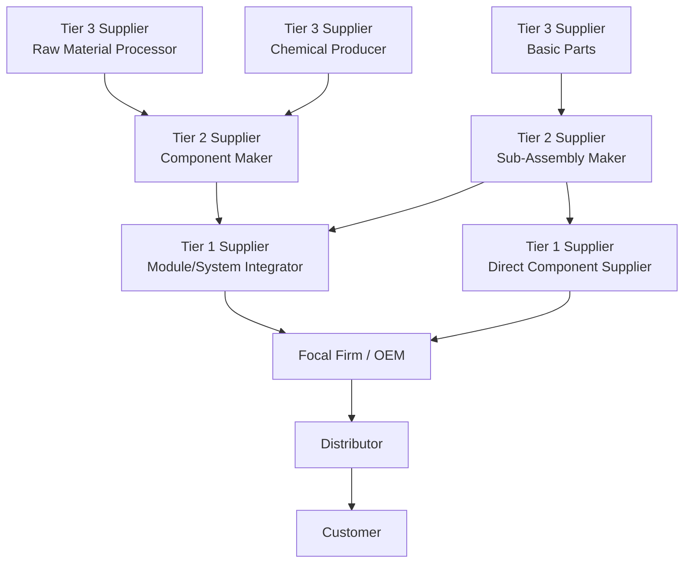

## Defining Tier 1, Tier 2, Tier 3, and Sub-Tier Suppliers

### Definition

Supplier tiering is the classification of suppliers within a supply chain network according to their **structural distance** from the focal (buying) firm — measured by number of transactional hops, not by importance, size, or quality. Tier assignment is relative to the focal company: a supplier's tier designation can differ depending on which company in the network is treated as the reference point.

### Tier Classifications

**Tier 1 Suppliers**

- Organizations that sell **directly** to the focal firm (Original Equipment Manufacturer, OEM, or brand owner)
- Typically supply major subassemblies, modules, or systems rather than raw materials
- Usually possess significant engineering capability and are often co-development partners
- Directly visible and contractually managed by the focal firm

**Tier 2 Suppliers**

- Organizations that supply **Tier 1 suppliers**, not the focal firm directly
- Typically provide components or sub-assemblies that feed into Tier 1's modules
- Visibility to the focal firm is indirect — usually mediated through Tier 1 reporting or audits
- May supply multiple Tier 1 suppliers across different focal firms (common supply base risk)

**Tier 3 Suppliers**

- Organizations that supply **Tier 2 suppliers**
- Often specialize in basic components, processed materials, or standardized parts
- Focal firm visibility is typically very limited unless specific supply chain mapping or risk programs are in place

**Sub-Tier Suppliers (Tier N)**

- A generic term for any supplier beyond Tier 3, extending toward raw material extraction
- Includes commodity processors, raw material producers, and in some frameworks, extraction/mining operations (sometimes labeled Tier 0 or "origin tier" in traceability contexts)
- Visibility here is the weakest link in most supply chains and is the focus of deep-tier supply chain risk and ESG compliance initiatives

### Illustration: Tiered Supplier Network

### Structural Comparison

| Attribute | Tier 1 | Tier 2 | Tier 3+ / Sub-Tier |
| --- | --- | --- | --- |
| Direct relationship with focal firm | Yes | No | No |
| Typical output | Modules/subsystems | Components | Raw/processed materials |
| Contractual visibility | Full | Partial (via Tier 1) | Minimal/opaque |
| Risk monitoring difficulty | Low | Moderate | High |
| Common data source for mapping | ERP, direct contracts | Tier 1 self-reporting, audits | Supply chain mapping tools, blockchain traceability, industry consortia data |

### Tier Assignment Is Relative, Not Absolute

A single company can simultaneously be a Tier 1 supplier to one focal firm and a Tier 2 supplier to another, depending on the contractual path. [Inference: this relativity is a structural property of network graphs and applies generally, though specific tier labels in practice are sometimes fixed by convention within an industry, such as automotive OEM programs]

$$\text{Tier}(S, F) = \text{shortest transactional path length between supplier } S \text{ and focal firm } F$$

### Why Tiering Matters

- **Risk management**: Disruptions at Tier 2/3 (e.g., a single-source chemical supplier) can halt Tier 1 and OEM production even when the OEM has no direct contract with the disrupted party — this is the basis of deep-tier supply chain risk analysis.
- **Traceability and compliance**: Regulations such as conflict minerals reporting (Dodd-Frank Section 1502), EU deforestation regulation, and ESG/sustainability disclosure requirements often mandate visibility into Tier 3+ suppliers.
- **Cost and quality cascading**: Quality defects or cost increases introduced at lower tiers propagate upward, often amplified by the bullwhip effect.
- **Supplier relationship strategy**: Resource allocation for supplier development, audits, and collaboration is typically prioritized by tier — Tier 1 relationships receive the most direct engagement.

### **Example**

In automotive manufacturing: a Tier 1 supplier might be a company producing complete braking systems sold directly to the OEM. That Tier 1 supplier sources brake calipers from a Tier 2 supplier, who in turn sources raw steel castings from a Tier 3 foundry, which sources iron ore from a Tier 4/sub-tier mining operation. A supply disruption at the mining operation (e.g., a labor strike) can eventually halt OEM vehicle assembly weeks later, despite no direct contractual relationship between the OEM and the mine.

### **Key Points**

- Tiering is defined by **transactional distance**, not by supplier size, revenue, or strategic importance.
- Visibility decreases sharply as tier number increases — this "visibility cliff" is a primary driver of supply chain risk.
- The same supplier can hold different tier positions relative to different focal firms.
- Deep-tier (Tier 3+) mapping increasingly relies on specialized supply chain mapping software, blockchain-based traceability, or industry data-sharing consortia rather than direct contract data. [Unverified: adoption rates of these technologies vary significantly by industry and are not standardized]

### **Related Topics**

- Supply Chain Mapping and Deep-Tier Visibility Techniques
- Bullwhip Effect Propagation Across Tiers
- Supplier Risk Management and Single-Source Dependency
- Conflict Minerals and Raw Material Traceability Regulations
- Tier 1 Supplier Relationship Management (SRM) Strategies
- Multi-Tier Supply Chain Resilience Frameworks