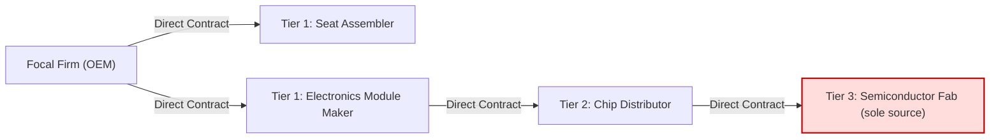

## Tier Position as Contractual Distance Rather Than Importance

### Core Concept

Tier position in a supply chain (Tier 1, Tier 2, Tier 3, ... Tier N) is fundamentally a description of **contractual and transactional distance** from the focal firm (the company orchestrating the chain, e.g., an OEM or brand owner), not a ranking of strategic importance, criticality, risk exposure, or value contribution.

A Tier 1 supplier is simply the entity with which the focal firm holds a **direct contractual relationship**. A Tier 2 supplier has a contract with a Tier 1 supplier, but no direct contract with the focal firm, and so on down the chain. This is a topological/relational classification, not an evaluative one.

$$\text{Tier}_n = \{ s \mid \text{shortest contractual path from focal firm to } s = n \}$$

### Why This Distinction Matters

**Key Points**

- A Tier 3 raw-material supplier (e.g., a rare-earth mine or a sole-source chemical synthesizer) can be more critical to production continuity than any Tier 1 assembler.
- Strategic importance should be assessed independently, using dimensions such as: substitutability, lead time, single-sourcing risk, geographic concentration, and financial health of the supplying entity.
- Conflating "Tier 1" with "most important" leads to misallocated risk-management resources, since traditional supply chain risk programs historically audited only Tier 1 due to contractual visibility, leaving Tier 2+ blind spots.
- This gap is well documented in supply chain risk literature following disruptions like the 2011 Thailand floods and 2011 Tōhoku earthquake, where Tier 2/3 semiconductor and component suppliers halted global automotive and electronics production despite being contractually invisible to OEMs.

### Formal Definition and Contrast Table

| Dimension | Tier Position | Strategic Importance |
| --- | --- | --- |
| Basis | Contractual/transactional hop-count from focal firm | Business impact if disrupted |
| Determined by | Who signs the purchase order/contract | Substitutability, spend, lead time, criticality |
| Visibility | High for Tier 1, decreasing with tier depth | Independent of visibility |
| Changes when | Contract restructured (e.g., disintermediation) | Market conditions, product design change |
| Example high case | Tier 1 systems integrator | Tier 3 sole-source rare mineral supplier |

### Illustrative Example

Consider an automotive OEM:

- **Tier 1**: A seat-assembly company (direct contract with OEM). Important operationally, but seat foam and frames are generally multi-sourced and substitutable within weeks.
- **Tier 2**: A semiconductor distributor supplying chips to the Tier 1 electronics module maker.
- **Tier 3**: A single fabrication plant in Taiwan producing a specific automotive-grade microcontroller used across dozens of Tier 1/Tier 2 components.

If that Tier 3 fab suffers an outage, the OEM may face a multi-month production halt, while losing a Tier 1 seat supplier might cause only a multi-week disruption due to easier resourcing. **The tier number is inversely unrelated to blast radius in this case.**

### Structural Diagram

The diagram shows T3A as the most operationally critical node despite being the contractually farthest from the OEM.

### Contractual Distance vs. Multi-Tier Visibility Programs

**Key Points**

- Modern supply chain risk management (SCRM) practice attempts to map **N-tier visibility** — extending mapping and risk assessment beyond Tier 1 — precisely because tier position does not predict criticality.
- Techniques used to build N-tier maps include: supplier-disclosed sub-tier mapping, blockchain-based provenance tracking, and third-party data aggregators (e.g., risk intelligence platforms that infer sub-tier relationships from trade/customs data, bill-of-lading records, and shipment manifests).
- [Inference] The accuracy of inferred N-tier maps from customs/trade data tends to degrade at deeper tiers due to data sparsity and commodity fungibility, though exact degradation rates are context- and industry-dependent.

### Common Misconceptions

- **Misconception**: "Tier 1 suppliers deserve the most rigorous risk audits." — In practice, criticality-based segmentation (sometimes called a "supplier criticality matrix" plotting spend/impact vs. supply risk) is the appropriate lens, cutting across tiers.
- **Misconception**: "Tier depth correlates with commoditization." — Not necessarily true; some Tier 1 relationships (e.g., systems integrators) are commoditized/substitutable, while some deep-tier suppliers (e.g., a proprietary chemical formulator) are irreplaceable.
- **Misconception**: "A shorter contractual path implies more negotiating leverage." — Leverage is a function of market concentration and switching costs, not tier position itself.

### Practical Implication for Sourcing Strategy

**Example**

A procurement team building a risk register should NOT default to weighting Tier 1 suppliers higher. Instead, a defensible framework separates two axes:

1. **Tier position** — used for contractual accountability, compliance flow-down (e.g., flowing code-of-conduct clauses down the chain), and traceability mapping.
2. **Criticality score** — a composite metric independent of tier, often calculated as:

$$C_i = w_1 \cdot \text{SpendShare}_i + w_2 \cdot \text{SubstitutabilityInverse}_i + w_3 \cdot \text{LeadTimeRisk}_i + w_4 \cdot \text{GeoConcentrationRisk}_i$$

where weights $w_1, ..., w_4$ are calibrated per industry and $i$ indexes any supplier regardless of tier.

### Related Topics

- N-Tier Supply Chain Mapping and Visibility Techniques
- Supplier Criticality and Segmentation Matrices
- Single-Sourcing Risk and Sole-Source Dependency Analysis
- Sub-Tier Risk Propagation and Cascading Disruption Models
- Contractual Flow-Down Clauses (compliance, ESG, code-of-conduct)
- Bullwhip Effect Across Tiered Structures
- Direct vs. Indirect Spend Categorization