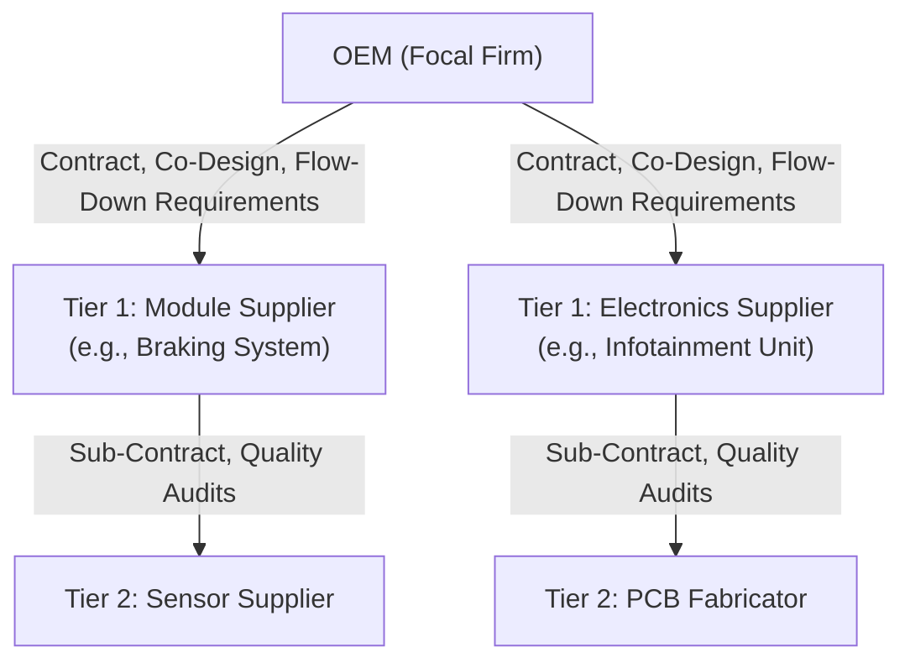

## OEM and First-Tier Supplier Relationships

### Core Concept

The OEM (Original Equipment Manufacturer) – Tier 1 supplier relationship is the **primary contractual and coordination interface** in a tiered supply chain. The OEM holds direct contracts only with Tier 1 suppliers, who in turn assume responsibility for managing their own upstream (Tier 2+) suppliers. This relationship is characterized by deep integration, co-development, and long-term interdependence, distinguishing it structurally from arm's-length transactional purchasing.

### Defining Characteristics

**Key Points**

- **Direct contractual link**: The OEM issues purchase orders, negotiates terms, and holds Tier 1 suppliers directly accountable for delivery, quality, and compliance.
- **System/module responsibility**: Tier 1 suppliers typically deliver complete subsystems or modules (e.g., a braking system, an infotainment unit, a seating assembly) rather than raw components, absorbing integration complexity on behalf of the OEM.
- **Sub-tier management delegation**: The OEM expects Tier 1 suppliers to manage, qualify, and audit their own Tier 2 suppliers, effectively extending the OEM's quality and compliance requirements down the chain via flow-down clauses.
- **Co-development involvement**: Tier 1 suppliers are frequently engaged during early product design phases (co-design or "black box" engineering), not merely at production ramp-up.
- **Capital and relationship intensity**: These relationships often involve dedicated tooling, long-term volume commitments, and sometimes equity or joint-venture structures.

### Relationship Models

| Model | Description | Example Context |
| --- | --- | --- |
| **Black-box design** | OEM provides performance specifications; Tier 1 designs and owns the detailed engineering | Automotive infotainment systems |
| **White-box / build-to-print** | OEM provides complete detailed drawings; Tier 1 only manufactures | Simple stamped metal brackets |
| **Grey-box / co-design** | Joint engineering effort between OEM and Tier 1 | Complex mechatronic subsystems (e.g., ADAS modules) |
| **Keiretsu-style relational** | Long-term, often cross-shareholding, high-trust relationships | Traditional Japanese automotive supply networks (e.g., Toyota-Denso lineage) |
| **Arm's-length transactional** | Competitive bidding, lower switching cost expectations, less co-investment | Commodity components with multiple qualified sources |

### Structural Diagram

### Governance Mechanisms

**Key Points**

- **Advanced Product Quality Planning (APQP)**: A structured framework (especially in automotive, per AIAG/VDA standards) used by OEMs to synchronize product development milestones with Tier 1 suppliers.
- **Production Part Approval Process (PPAP)**: A formal sign-off process where the Tier 1 supplier submits evidence (dimensional reports, material certs, process capability data) proving a part meets OEM specifications before mass production.
- **Supplier scorecards**: Recurring quantitative evaluation of Tier 1 performance across delivery, quality (e.g., parts-per-million defect rate), cost, and responsiveness.
- **Flow-down clauses**: Contractual language requiring the Tier 1 supplier to impose equivalent quality, ethical sourcing, and regulatory obligations on its own Tier 2 suppliers.
- [Inference] The specific frameworks named above (APQP/PPAP) are most standardized within the automotive and aerospace sectors; other industries use analogous but differently named quality-gate processes.

### Financial and Strategic Dynamics

**Example**

An OEM launching a new vehicle platform may:

1. Select a Tier 1 electronics supplier 2–3 years before start-of-production (SOP).
2. Share forward-looking demand forecasts to allow the Tier 1 to plan capacity and, in turn, place long-lead-time orders with its own Tier 2 semiconductor suppliers.
3. Negotiate cost-down commitments (annual price reduction targets) as part of the multi-year agreement, a common practice in automotive sourcing.
4. Conduct joint risk reviews covering the Tier 1's financial health, single-sourcing exposure, and geographic risk — since an OEM's own product launch risk is now coupled to that one Tier 1's operational stability.

This tight coupling means an OEM's risk exposure to a Tier 1 failure (bankruptcy, quality escape, capacity shortfall) is typically far higher than exposure to any single Tier 2 or Tier 3 failure, all else equal — though as covered in the discussion of tier position vs. importance, this is not a universal rule.

### Common Frictions

**Key Points**

- **Cost-down pressure vs. innovation investment**: OEMs push annual price reductions while expecting Tier 1s to continue R&D investment, creating margin squeeze.
- **IP ownership disputes**: In co-design/black-box models, ambiguity over who owns resulting intellectual property can create contractual friction.
- **Dual/multi-sourcing tension**: OEMs often prefer dual-sourcing critical modules to reduce dependency risk, while Tier 1 suppliers prefer sole-source awards to maximize volume and amortize tooling investment.
- **Information asymmetry on sub-tier risk**: OEMs frequently lack visibility into the Tier 1's own supplier base, limiting the OEM's ability to independently assess upstream risk (see N-tier visibility topic).

### Related Topics

- N-Tier Supply Chain Mapping and Visibility Techniques
- Tier Position as Contractual Distance Rather Than Importance
- Advanced Product Quality Planning (APQP) and PPAP Frameworks
- Supplier Relationship Management (SRM) Systems
- Single-Sourcing vs. Dual-Sourcing Strategy
- Keiretsu and Relational Contracting Models
- Supplier Scorecards and KPI Design
- Flow-Down Compliance and ESG Requirements in Supply Contracts