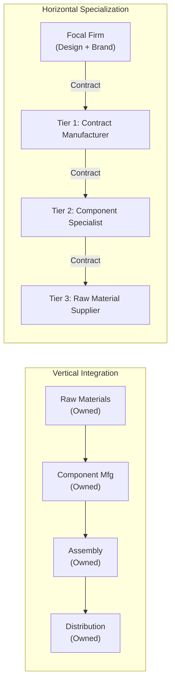

## Vertical Integration versus Horizontal Specialization

### Core Concept

Vertical integration and horizontal specialization represent two opposing organizational strategies for structuring production and supply chain control:

- **Vertical Integration**: A firm owns and directly controls multiple stages of its value chain (e.g., raw material extraction, component manufacturing, assembly, distribution), internalizing what would otherwise be inter-firm transactions.
- **Horizontal Specialization**: A firm focuses on a narrow set of activities where it holds comparative advantage, relying on a network of external specialized suppliers (a tiered supply chain) for everything else, coordinated through market or contractual mechanisms rather than ownership.

This is fundamentally a **make-vs-buy** (or "make-vs-ally") decision applied at the organizational-design level, not merely a sourcing tactic.

### Theoretical Foundation

**Key Points**

- **Transaction Cost Economics (TCE)**, developed principally by Ronald Coase and later Oliver Williamson, provides the classical framework: firms integrate vertically when the cost of coordinating a transaction through the market (search costs, contracting costs, monitoring, risk of opportunistic behavior) exceeds the cost of managing it internally.
- **Asset specificity** is the key driver: highly specialized assets (e.g., a die tool usable only by one buyer) create "hold-up risk," incentivizing vertical integration or long-term relational contracts to prevent opportunistic renegotiation.
- **Core competence theory** (Prahalad & Hamel) argues firms should vertically integrate only around capabilities that are rare, valuable, and difficult to imitate, and specialize/outsource everything else.

$$\text{Integrate if: } TC_{\text{market}} > TC_{\text{internal}} + \text{Governance Overhead}$$

### Comparative Framework

| Dimension | Vertical Integration | Horizontal Specialization |
| --- | --- | --- |
| Ownership | Single firm owns multiple value-chain stages | Distributed across independent firms |
| Coordination mechanism | Managerial hierarchy, internal planning | Contracts, market pricing, tiered relationships |
| Capital intensity | High (owns plants, equipment across stages) | Lower per firm; capital distributed across network |
| Flexibility to demand shifts | Lower (fixed internal capacity) | Higher (can reallocate across suppliers) |
| Innovation source | Internal R&D | Distributed innovation across specialist suppliers |
| Risk concentration | Internalized (firm bears all stage-level risk) | Distributed, but creates counterparty/coordination risk |
| Classic example | Historical Ford River Rouge model (steel-to-car) | Modern automotive/electronics tiered supply chains (e.g., Apple's contract manufacturing model) |

### Structural Comparison Diagram

### Degrees and Hybrid Forms

**Key Points**

- **Backward integration**: Acquiring/owning upstream stages (e.g., an automaker acquiring a battery cell manufacturer).
- **Forward integration**: Acquiring/owning downstream stages (e.g., a manufacturer acquiring its own retail distribution).
- **Quasi-integration / relational contracting**: A hybrid where firms remain legally separate but behave as if integrated through long-term exclusive contracts, equity stakes, or co-located facilities (common in Japanese keiretsu structures and some Western automotive Tier 1 relationships).
- **Taper integration**: A firm partially makes and partially buys the same input, retaining internal capability as a benchmark/hedge while also sourcing externally.
- [Inference] Taper integration is often adopted specifically as a risk-mitigation and negotiating-leverage tactic, though the degree to which firms disclose this rationale publicly varies.

### Example: Industry Contrast

**Example**

- **Highly vertically integrated case**: Historically, Ford's River Rouge Plant (1920s) processed iron ore into finished automobiles largely under one corporate roof — an extreme case of vertical integration to reduce dependency on external suppliers during an era of thin supplier markets.
- **Highly horizontally specialized case**: Apple's hardware business owns almost no manufacturing capacity itself; iPhones are assembled by Tier 1 contract manufacturers (e.g., Foxconn-type EMS providers), who in turn source components from a deep tiered network of specialist Tier 2/Tier 3 suppliers (display panel makers, chip foundries, camera module producers), while Apple retains tight internal control mainly over design, silicon architecture, and software.

This contrast illustrates the historical **industry-level shift** from vertically integrated conglomerates toward horizontally specialized, tiered global supply networks — driven by globalization, lower coordination/transaction costs (enabled by IT systems and standardized logistics), and increasing product/technology complexity that exceeds what any single firm can master internally.

### Trade-offs Summary

**Key Points**

- Vertical integration reduces **coordination risk and hold-up risk** but increases **capital intensity, fixed-cost burden, and reduces flexibility** to reallocate volume when demand shifts.
- Horizontal specialization increases **agility and access to best-in-class specialized capability** but increases **coordination complexity, counterparty risk, and reduces direct visibility/control**, particularly over Tier 2+ suppliers (see multi-tier visibility challenges).
- [Speculation] Some analysts argue that recent geopolitical disruptions (e.g., semiconductor shortages, export controls) are prompting a partial swing back toward selective vertical integration or "friend-shoring" in strategically critical categories, though the durability and scope of this shift remains debated.

### Related Topics

- Transaction Cost Economics and the Make-vs-Buy Decision
- Asset Specificity and Hold-Up Risk
- OEM and First-Tier Supplier Relationships
- Contract Manufacturing (EMS) Business Models
- Keiretsu and Relational Contracting Structures
- Reshoring, Friend-Shoring, and Supply Chain Reconfiguration
- Core Competence Theory in Strategic Sourcing