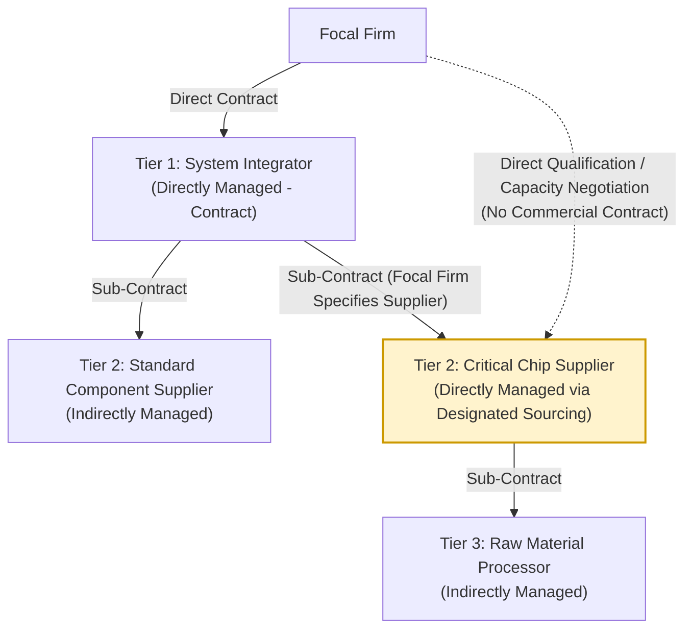

## Directly Managed versus Indirectly Managed Tiers

### Core Concept

This distinction separates supply chain tiers based on **who holds governance authority and contractual control** over a given supplier, rather than the supplier's position in the physical/logical tier hierarchy:

- **Directly Managed Tier**: A supplier with whom the focal firm holds a direct contract, negotiates terms, sets requirements, and exercises direct oversight (audits, scorecards, corrective action requests). This is typically, but not exclusively, the Tier 1 layer.
- **Indirectly Managed Tier**: A supplier with whom the focal firm has no direct contract; oversight is delegated to (and mediated through) an intermediate directly-managed supplier. This typically corresponds to Tier 2 and beyond, but the boundary can shift.

This distinction is important because tier *number* and management *directness* are correlated but not identical — a focal firm can choose to directly manage a Tier 2 or Tier 3 supplier despite the absence of a formal contractual relationship at that level, a practice sometimes called "designated sourcing" or "directed buy."

### Governance Spectrum

| Management Mode | Description | Typical Tier | Control Level |
| --- | --- | --- | --- |
| **Fully direct** | Focal firm contracts, audits, and pays the supplier directly | Tier 1 | High |
| **Directed/designated sourcing** | Focal firm specifies a particular sub-tier supplier (e.g., "you must buy this chip from Supplier X"), but the contract and payment flow through the Tier 1 | Tier 2 (usually) | Medium-High |
| **Delegated with reporting requirements** | Tier 1 manages the sub-tier supplier but must report audit results, capacity data, or risk metrics upstream | Tier 2/3 | Medium |
| **Fully indirect** | Focal firm has no visibility or influence; entirely the Tier 1's responsibility | Tier 2+ | Low |

### Why Firms Choose to Directly Manage Beyond Tier 1

**Key Points**

- **Sole-source or scarce-capacity components**: When a Tier 2 or Tier 3 supplier produces a component with few substitutes (e.g., a specific semiconductor node, a rare mineral processor), the focal firm may negotiate directly to secure allocation, even though the commercial contract still nominally runs through the Tier 1.
- **Quality-critical or safety-critical inputs**: Industries such as aerospace and automotive frequently require direct qualification and audit rights over specific sub-tier processes (e.g., forging, heat-treating, casting) regardless of contractual tier, due to safety and regulatory certification requirements.
- **Cost transparency**: Direct engagement with sub-tier suppliers can give the focal firm better visibility into true cost structure, reducing margin-stacking opacity introduced by intermediary Tier 1 markups.
- **Risk mitigation**: Following high-profile disruptions caused by invisible sub-tier dependencies (e.g., single-source Tier 3 chip fabs halting Tier 1 automotive production), focal firms increasingly build direct relationships or monitoring channels into deeper tiers as a resilience measure.

### Structural Diagram

The dashed line represents an informal-but-real governance relationship (direct qualification/allocation influence) without an actual commercial contract — this is the hallmark of "directed sourcing" at an otherwise indirectly-managed tier.

### Contractual and Legal Implications

**Key Points**

- Even under a designated-sourcing arrangement, the **legal contract and payment obligation typically remain with the Tier 1**, meaning the focal firm generally has no direct legal recourse against the Tier 2/3 supplier if something goes wrong — creating an accountability gap that must be managed contractually (e.g., via flow-down clauses in the Tier 1 agreement).
- Some industries use **tripartite agreements** or **letters of direction** to formalize a focal firm's influence over a specific sub-tier supplier without fully replacing the Tier 1's contractual role.
- [Inference] The prevalence of tripartite/consignment-style agreements appears to be increasing in industries with concentrated upstream markets (e.g., semiconductors, battery cells), though comprehensive cross-industry data on adoption rates is limited.

### Visibility and Data Flow

**Example**

A common architecture for managing indirectly-managed tiers involves:

1. **Tier mapping surveys**: The focal firm requires Tier 1 suppliers to self-report their own sub-tier supplier list (often via supplier portals or SCRM software platforms).
2. **Conditional disclosure clauses**: Contracts may require Tier 1 suppliers to disclose sub-tier sourcing changes above a materiality threshold (e.g., single-sourced components representing more than a set percentage of unit cost).
3. **Third-party risk intelligence overlays**: Since self-reported data is often incomplete or delayed, external data sources (customs records, bill-of-lading data, financial databases) are used to independently infer and validate sub-tier relationships.

### Trade-offs

| Approach | Advantage | Disadvantage |
| --- | --- | --- |
| Indirect management (delegate to Tier 1) | Lower administrative overhead; leverages Tier 1 domain expertise | Reduced visibility; slower risk detection; potential accountability gaps |
| Direct management of deeper tiers | Better risk control, cost transparency, and continuity assurance for critical inputs | Higher administrative burden; can strain Tier 1 relationship (perceived as disintermediation); legal complexity |

### Related Topics

- Tier Position as Contractual Distance Rather Than Importance
- N-Tier Supply Chain Mapping and Visibility Techniques
- OEM and First-Tier Supplier Relationships
- Designated/Directed Sourcing Agreements and Letters of Direction
- Supplier Risk Intelligence Platforms and Third-Party Data Sources
- Flow-Down Compliance and Contractual Accountability Gaps
- Sub-Tier Disruption Case Studies (e.g., semiconductor shortages)